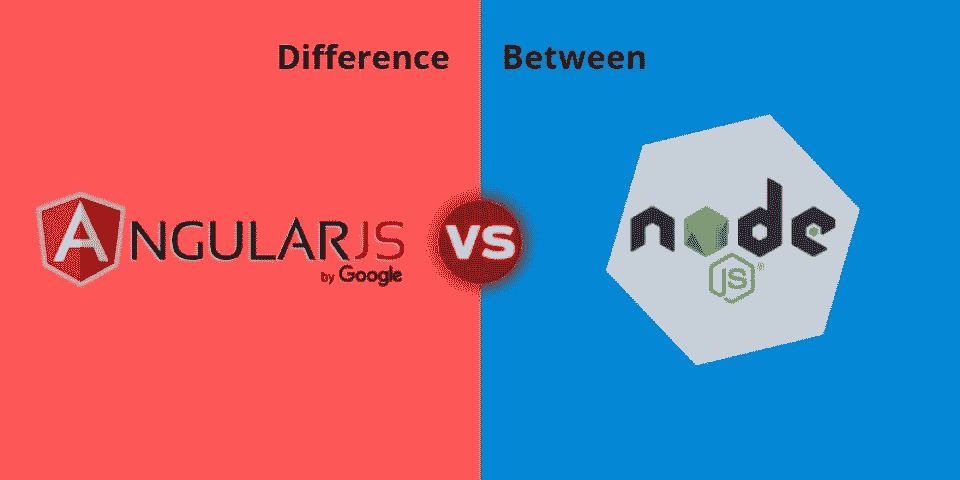

# NodeJs 与 AngularJs 的区别

> 原文：<https://blog.devgenius.io/difference-between-nodejs-vs-angularjs-c2ec1a029934?source=collection_archive---------5----------------------->

戈兰·艾沃斯在 [Unsplash](https://unsplash.com?utm_source=medium&utm_medium=referral) 上的照片

# **你说的节点 JS 是什么意思？**

Node.js 恰好是一个**跨平台运行时库**，也是一个在浏览器之外运行 JavaScript 程序的环境。它实际上是一个用于创建服务器端 JS 程序的开源工具。

我们使用 **JavaScript 在 Node.js 中编写程序。**人们可以在 Linux 和 Microsoft Windows 上的 Node.js 运行时内运行应用程序。这个框架为简化 web 开发过程提供了丰富的不同 JavaScript 模块库。

# **有棱角的 JS 是什么意思？**

AngularJS 恰好是一个用于开发动态 web 应用程序的结构化框架。它使开发者能够利用 HTML 作为模板语言，也允许 HTML 的语法简单明了地表达应用程序的组件。

AngularJS 是一个全面的 JavaScript 框架，其主要目标是简化。[**Angular JS development services**](https://www.rlogical.com/hire-dedicated-developers/hire-angular-js-developer/)**为创建动态的单页面 web 应用提供支持，并且支持(MVC)的编程结构。**

**在以下段落中，我们将全面详细地研究 Angular JS 和 Node JS 之间的差异:**

****

# ****NodeJS Vs AngularJS****

****核心架构****

**AngularJS 已经被谷歌视为一个 **web 应用开发框架**。与其他 JavaScript 框架相比，Angular 完全是用 JavaScript 编写的。它甚至遵循 JavaScript 语法规则。另一方面，NodeJS 是基于 Google 的 V8 JavaScript 引擎构建的跨平台运行时框架。它是用各种编程语言编写的，包括 JavaScript、C 以及 C++。**

****Web 框架****

**与 NodeJS 相比，AngularJS 恰好是一个 web 框架。开发人员可以使用 web 框架来自动化常见的开发工作，同时创建不同类型的应用程序— web 应用程序、网站、web 服务以及 web 应用程序框架。JavaScript 程序员不能以 web 框架的形式使用 NodeJS。然而，他们将能够从大量基于 NodeJS 的框架中进行选择，包括 Meteor.js、Socket.io、Express.js、Hapi.js 以及 Sails.js。**

****安装****

****Node JS 开发服务**将能够使用 JavaScript 编写 Node JS 应用程序。然而，在不同的平台上运行运行时环境中的应用程序是很重要的，包括 Linux、Windows 和 macOS。这样一来，NodeJS 就不得不由一家 [**Node JS 开发公司**](https://www.rlogical.com/hire-dedicated-developers/hire-node-js-developer/) 的开发人员在开发开发环境的同时安装在自己的电脑上。相反，开发人员不需要在他们的计算机上安装 AngularJS。类似于其他 JavaScript 文件，AngularJS 文件可以由它们嵌入到代码库中。**

****基本特征****

**NodeJS 和 AngularJS 都支持 MVC 架构模式。然而，这两种基于 JavaScript 的技术都有不同的特性。AngularJS 允许程序员以模板语言的形式使用 HTML。它还允许开发者通过扩展 HTML 中的语法来表达 web 应用程序的不同组件。此外，AngularJS 通过提供范围、数据绑定、深度链接、指令、模板、过滤器、路由以及依赖注入等功能，帮助简化动态和单页 web 应用的开发。**

**或者，作为一个服务器端框架，NodeJS 提供了开发人员构建服务器端和网络应用程序所需的一系列创新特性。NodeJS 提供的功能将帮助开发人员简化视频流网站、单页网站以及相关 I/O 密集型 web 应用的创建。此外，程序员可以使用 NodeJS 来使用异步 API，同时显著提高代码执行的速度。开发人员也可以使用 NodeJS 让 web 应用程序在没有任何缓冲的情况下提供大量信息。**

****处理数据****

**除了以特定的方式应用 MVC 架构模式，AngularJS 还支持双向数据的链接。数据的双向绑定有助于保持 web 应用程序模型之间的信息，并自动协调视图组件。然而，AngularJS 不具备任何在数据库上构建查询的能力。相反，程序员可以使用 NodeJS 在 JavaScript 中生成数据库查询。因此，通过解决语法差异，程序员可以更简单地为非关系数据库(如 CouchDB 和 MongoDB)构建数据库查询。**

****范式支持和编程语言****

**除了 JavaScript 之外，NodeJS 和 AngularJS 还支持几种编程语言。NodeJS 支持 CoffeeScript、Ruby 以及 TypeScript，而 AngularJS 支持 TypeScript、CoffeeScript 和 Dart。这两种基于 JavaScript 的技术都支持几种常用的编程范例。AngularJS 支持面向对象、过程化和事件驱动的编程范式。同时，NodeJS 支持功能性的、面向对象的、面向并发的、事件驱动的以及 sub/pub 编程范例。**

****用例****

**JavaScript 开发人员利用 AngularJS 创建客户端和单页面 web 应用。云平台提供的功能进一步简化了程序员创建沉浸式实时软件的过程。相反，开发人员利用 NodeJS 来创建快速、可伸缩的网络和服务器端应用程序。跨平台运行时框架提供的工具也使开发人员能够创建涉及实时交互绘图或编辑的应用程序。**

**AngularJS 整体上是一个客户端系统，而 NodeJS 是一个多平台运行时环境。JavaScript 开发人员可以集成 NodeJS 和 AngularJS 来简化同构应用程序的创建。他们还可以利用 AngularJS 和 NodeJS 作为与 ExpressJS 和 MongoDB 一起的 MEAN 应用程序堆栈的两个主要部分。**

****结论****

**AngularJS 和 NodeJS 都是开源项目，而它们的主要目标是通过使用 JavaScript 来简化 web 应用程序流程。同时，它们的工作模式和架构也大相径庭。两者都有一系列的特性，可以用来创建不同类型的应用程序。**

**Angular JS 适用于**的单页应用**，这些应用本质上是交互式和动态的，例如即时消息和聊天应用，而 Node JS 恰好是一种服务器端语言，为实际上是实时数据密集型的应用提供运行时环境。两者都在不同类型的应用中广泛使用；然而，尽管有如此多的差异，有一样东西却是共同的——那就是 JavaScript。**

**选择角度 JS 和节点 JS 时，必须考虑应用要求。Angular JS 恰好是一款基于客户端浏览器的 app，而 Node JS 则需要一个运行时环境。在他们各自的领域内，这两者似乎都是一个令人兴奋和有前途的选择。**

**如果您正在考虑任何 **web 和移动应用程序开发，**欢迎致电[**contact@rlogical.com**](mailto:contact@rlogical.com)联系我们。您也可以聘请我们经验丰富的专门 AngularJS 或 NodesJS 开发人员来开发您的 web 应用程序。**