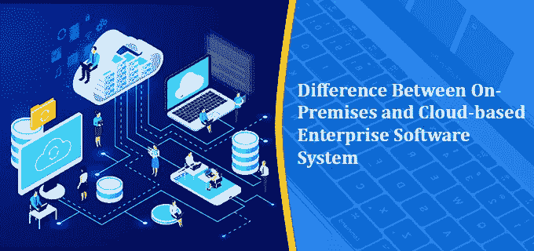

# 内部部署和基于云的企业软件系统之间的差异

> 原文：<https://blog.devgenius.io/difference-between-on-premises-and-cloud-based-enterprise-software-system-6658c91c5057?source=collection_archive---------6----------------------->

内部部署和基于云的企业软件系统之间的差异

> **目录**
> 
> [1。简介](#2ebc)
> 
> [2。ERP -企业软件的主要类型](#a598)
> 
> [3。差异—云 ERP 与内部 ERP](#f2e9)
> 
> [4。结论—云与内部 ERP](#aade)

# **1。简介**

在当今时代，将所有业务数据保存在一个地方变得至关重要，在本地解决方案和云解决方案之间做出决策是一个复杂的过程。有许多不同的因素在这个选择中起着重要的作用。但主要是，组织在选择 ERP 系统时需要考虑他们的业务需求和预算。为了更清楚地说明这一点，今天，在这篇博客中，我们将了解企业软件系统，并对内部部署系统和基于云的系统进行比较。

# 2.ERP——企业软件的主要类型

世界上大多数公司都维护着一个包含所有客户信息的数据库，他们管理库存，使用 Excel 保存账簿，并处理订单。因此，系统的不同部门之间没有数据流动。这使得整个数据管理方法依赖于人。当人类处理重要数据时，它有可能被延迟或导致频繁的错误，或者可能会有某种形式的经济损失。这会造成大量浪费、无法按时交货或仓库过剩。当业务增长且流程因业务扩张而变得复杂时，用手动系统协调工作会变得非常困难，并会导致更多错误。因此，现在公司都在采用 ERP 系统。ERP 系统就像是现代企业系统的大脑和心脏。它使软件开发公司能够创建一个统一的数据库，帮助减少错误的数量。除此之外，数据一旦输入，就会到达公司的所有部门。ERP 系统由多个模块组成，每个模块负责将您业务的每个领域数字化。它可以数字化-

*   会计
*   客户服务
*   存货管理
*   业务流程管理
*   人力资源
*   电子商务
*   订单管理
*   船舶

ERP 系统可以帮助任何公司的这些部门协同工作，并简化组织的整个工作流程。它可以创建自动化的业务流程，并使其对组织的每个成员透明，从而提高用户满意度。除此之外，该系统还可以集成不同类型的企业软件解决方案，如 CRM、供应链管理、商业智能、财务信息和销售点数据。大多数情况下，ERP 系统的所有功能都可以作为独立的应用程序使用，但如果你使用整个系统，那么它会更有优势。

# 3.差异—云 ERP 与内部 ERP

以下是云 ERP 与内部 ERP 的区别。

1.  部署

对于内部部署软件，组织负责维护和解决所有相关问题。此外，部署也是通过使用公司的基础架构在内部完成的。另一方面，在基于云的 ERP 中，服务提供商在他们的服务器上维护整个系统，企业可以通过遵循相关流程随时访问它。

2.定价

内部部署和云 ERP 的定价都会推迟，这是因为维护成本的原因。内部 ERP 的定价大部分是因为它是在预先永久许可的情况下进行的。公司自己负责管理它，因此，公司必须承担员工培训、支持、更新和其他开发任务的成本。另一方面，云软件通常附带一个包月或包年的套餐，包含所有内容。

3.应用程序的数据安全

安全性是任何组织在处理财务帐户和员工详细信息时最基本的要求之一。尽管内部部署平台在这种情况下似乎是安全的，因为它是内部部署的，但要维护公司数据的安全性，需要注意的事情很少。因此，基于云的解决方案是最佳选择。云 ERP 系统具有多种冗余和灾难协议来实现数据安全，可以帮助公司为其数据和应用程序提供全面的安全性。

4.服从

每个公司都必须遵守一些法规控制，为了满足这些政府和行业法规，公司有必要将其数据保存在一个地方。它可以使用内部软件轻松维护，但如果公司选择[云计算模式](https://aws.amazon.com/types-of-cloud-computing/)，则需要通知服务提供商按照监管要求保护所有数据的安全。这是必要的，因为根据政策保护员工、客户和合作伙伴的数据安全至关重要。

5.控制

在内部软件中，公司享有对其系统的完全控制权，并且可以轻松地维护 100%的隐私。由于这些原因，公司选择远离基于云的系统。另一方面，在云计算软件中，即使数据加密密钥与第三方服务提供商共享，数据的所有权也是共享的。

6.流动性

对于内部 ERP 软件，可以远程访问，但需要第三方支持。这可能会增加安全风险，并可能导致通信失败。而在云系统中，你只需要一个互联网连接，就可以使用移动设备访问所需的数据。因此，基于云的系统可以轻松实现移动性和灵活性。

# 4.结论—云与内部 ERP

正如在这篇博客中看到的，本地和基于云的 ERP 系统都有自己的优势。但是在选择新的 ERP 系统时，大多数不想自己处理所有事情的企业会选择基于云的部署模型。但是有些组织希望控制一切，并希望将他们的数据保存在公司内部。这类公司倾向于内部 ERP 系统。所以，这完全取决于组织的愿望、需求和预算。