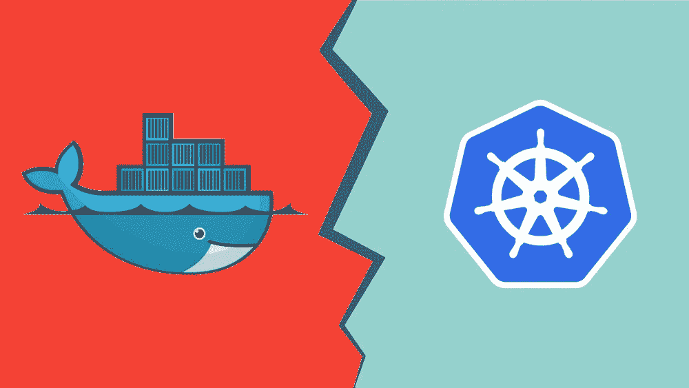

# Kubernetes 和 Docker 之间的差异在 5 分钟内得到解释

> 原文：<https://blog.devgenius.io/differences-between-docker-and-kubernetes-explained-under-5-minutes-dadd3ce41f48?source=collection_archive---------1----------------------->

Docker vs Kubernetes。作者图片

在 Kubernetes 宣布他们将在 2021 年底结束对 Docker 的支持后，Twitter 上的人们为此疯狂，并开始提问，“*他们如何才能移除 Docker 支持*？”，" *Docker == Container，现在我要用什么呢？*“，”*k8s 不就是针对 docker 的自动化吗？*“为了给你提个醒，我写了这篇文章来描述 Kubernetes 和 Docker 之间的核心区别。

# 我们先讨论一些相似点，好吗？

嗯，退一步说，我经常同意人们的观点，为什么他们会陷入困境，因为这两个平台有很多共同点。自然，当阅读关于 Docker 和 Kubernetes 的文章时，尤其是对于初学者来说，这是令人困惑的。但是，这些平台中只有一些想法是通用的。

1.  Docker 和 Kubernetes **都能很好地与微服务架构**协同工作，它们就是为此而设计的。
2.  这两个平台**都有专门的开源社区**，与其他社区不同的是，它们非常欢迎新来者。
3.  **你可以学习这两个平台中的任何一个，而无需了解另一个。**很明显，知道这两点会给你一个优势，但是如果你使用 Docker 在一台机器上运行一个应用程序，你不需要 Kubernetes，反之亦然。

# Docker & Kubernetes 的演变

在 Docker 发布之前，行业面临的困难是在一台机器上开发的应用程序只能在开发环境中运行，而不能在测试或生产环境中运行。这是因为开发和生产之间的计算环境不同。这是 dockerization 使我们的任务更容易的时候。码头化只不过是集装箱化。事实上，码头工人使集装箱化流行起来。有了 Docker，开发人员可以轻松地启动、停止和销毁容器，这使得它在开发人员中很受欢迎，最终，当最初的安全问题得到解决时，Docker 获得了巨大的发展动力。

“博格系统”因其处理数十万份工作的能力而得名

[*谷歌的* *博格系统*](https://research.google/pubs/pub43438/) 基本上是谷歌在 2003 年为了解决自己的集群管理挑战而创建的。但是到了 2014 年， *Google 开源了 Borg 系统，命名为 Kubernetes(或简称为 k8s)* ，很快像微软、RedHat、Docker 和 IBM 这样的大公司也加入了 Kubernetes 社区。有了许多大组织的支持，Kubernetes 成为了最终的容器编排工具。当生产环境中有成百上千个容器和服务时，Kubernetes 简化了容器管理问题。

# Docker 和 k8s 的简单区别

以下是 Docker 和 Kubernetes 之间的简要区别，以要点形式简明地进行了阐述。

1.  在习惯了 Docker 之后，您意识到应该有' *Docker run* '命令或类似的东西来跨异构主机运行许多容器。这就是 Kubernetes 来的地方，解决了 Docker 的很多问题。
2.  *Kubernetes 是 Docker 容器的 COE(容器编排环境)。*COE 的主要功能是确保应用程序启动并正常运行。 ***如果在任何情况下，一个容器出现故障，Kubernetes 将启动另一个容器*** 。它为跨多个主机运行如此多的容器提供了一个完整的系统。它还集成了负载平衡器，并使用 *etcd* (存储和复制所有 Kubernetes 集群状态的分布式键值存储)进行服务发现。
3.  不能使用 Docker CLI，因为 Kubernetes 有自己的 CLI 和 API (因为两者都用于创建和管理 Kubernetes 集群)。Kubernetes 以可用性和陡峭的学习曲线为代价，将集群提升到了一个全新的水平。Kubernetes 工具允许在集群上部署容器。
4.  为了运行、构建和分发 Docker 容器，使用了一个叫做 Docker 的开源工具。 它是一个轻量级的应用引擎，拥有类似 VM(虚拟机)的容器。基本上，容器是一个类似虚拟机的环境，与主机分离且部分独立。在单个服务器上，Docker 容器可以运行。它是唯一一个基于容器的环境，为混合环境中所有可能的应用程序提供一个地址。它有助于在容器中创建和部署软件。
5.  Docker 实际上包括几个东西，例如 Linux 容器格式、容器管理系统或者甚至是一个公司。与 Kubernetes 不同，Docker 有自己的 COE，称为 Docker Swarm，还有其他 COE，如 Rancher、Container X 等。Docker Swarm 是最常用的。Docker 的三个主要组件是 Docker 客户端、Docker 服务器和 Docker 容器。Docker 不仅自动化了软件部署过程。然而，***Kubernetes 的社区比 Docker Swarm 更强大，更受欢迎。所有主要的云提供商都创建了自己版本的 Kubernetes 服务。***

容器已经成为在产品中部署应用程序的*事实上的*标准。两个 Docker & Kubernetes 都将继续工作，尽管在 Kubernetes 突然宣布之后。因此，您仍然可以使用 Docker 构建容器映像，并且在您的 CI/CD 管道中，您可以继续使用它。事实上 *Docker 支持弃用*只影响 Kubernetes 集群上的容器运行时，您可以通过其他受支持的容器运行时来解决这个问题。

我希望你能理解这两个平台的不同之处。如果你喜欢读这篇文章，你可能也会发现下面的文章值得你花时间去读。

 [## docker——每个开发人员必须学习的最受欢迎的平台

### 实际上，根据 Stackoverflow 调查，它是第二大最受开发者喜爱的平台。

medium.com](https://medium.com/dev-genius/docker-the-most-loved-platform-every-developer-must-learn-6e5bb702c97b)  [## Kubernetes 建筑简介

### Kubernetes 已经成为最受欢迎的编排平台，因为它具有压倒性的特性，包括…

medium.com](https://medium.com/swlh/kubernetes-architecture-explained-in-brief-6a07f59193e)  [## 开发人员必须了解的关于微服务的一切

### 微服务是首选的应用平台，每个开发人员都必须了解它。

medium.com](https://medium.com/dev-genius/everything-a-developer-must-know-about-microservices-dae854782ab)