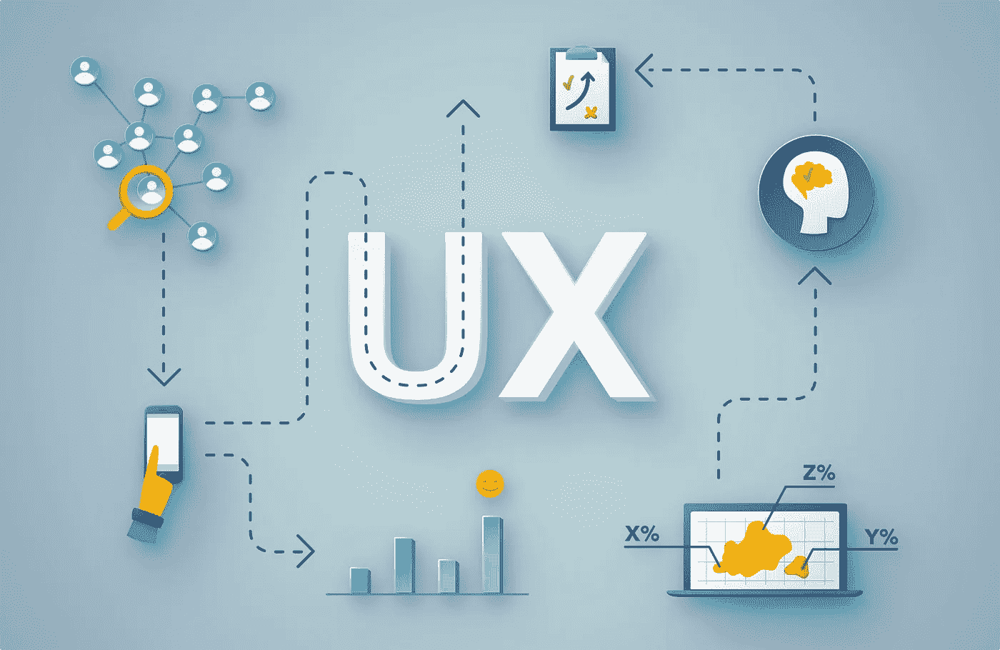
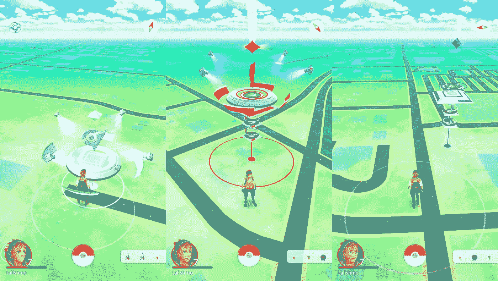

# 不同形式的用户体验

> 原文：<https://blog.devgenius.io/different-forms-of-user-experiences-8c10f34200c6?source=collection_archive---------8----------------------->

用户体验— UX

我以前写过不同类型的用户界面，以及将它们应用到项目中的好处。

ICYMI，你可以从 [**这里**](https://medium.com/@ckavishka32/different-forms-of-user-interfaces-and-features-d1c8152ab69) 读出来。

然而，如果一个吸引人的、丰富多彩的用户界面设计不能满足最终用户的需求，它本身并不能决定一个产品的成功。

因此，可以说用户体验(UX)在软件产品/设备的成功中起着重要的作用。

但是…怎么做？让我们看一看。

首先，你需要对什么是**用户体验**或者简称为 **UX** 有一个清晰的概念。

> ***“用户体验(UX)是指用户与产品或服务的任何互动。UX 设计考虑了塑造这种体验的每一个元素，它如何让用户感觉到，以及用户完成他们想要的任务有多容易。”***

简而言之，用户体验(UX)可以定义为用户通过界面与系统/设备交互时的体验和感受。

例如，满意的客户反映了积极的用户体验。但是，情况并不总是如此。有时用户会不高兴。或者…也许生气了...也许很沮丧...甚至不舒服。

同样，每个用户在与界面交互时都会经历各种各样的体验。此外，不同用户的体验也可能不同。

这种多样的用户体验可以在不同的环境下进行分类。其中一些类别是，

*   身体体验
*   精神体验
*   情感体验
*   社会经验
*   虚拟/模拟体验

让我们进一步看看上面提到的不同类型的用户体验。

**1。身体体验**

物理体验可以描述为用户在与系统交互时的物理感受。物理体验可以取决于用户与之交互的对象或用户所处的环境。

例如，传统键盘给用户触摸的感觉和按键被按下的感觉。然而，使用基于触摸的键盘无法获得同样的体验。因此，触摸键盘的可用性和准确性相对较低。

为了解决这个问题，苹果公司采取了主动，将振动反馈引入了基于触摸的键盘，并能够提高用户满意度。

**2。精神体验**

心理体验可以描述为用户如何观察和理解与系统的交互。与身体经验相比，精神经验可以被认为更复杂，因为它涉及到意识、思想、记忆、意志和想象等因素。因此，同一事件的两个参与者可以有不同的心理体验。

**3。情感体验**

情绪体验可以被认为是心理体验的一个亚类。情绪体验描述了用户在与系统交互时会产生的情绪。爱、愤怒、恐惧、同情、害羞、兴奋和悲伤是用户产生的一些常见情绪。情感体验可能是复杂的，并且取决于用户如何观察系统。

**4。社会经验**

社交体验可以被描述为一种情况，其中个体用户将体验作为社会现象的一部分进行分享。个人用户可以在他或她的社交圈内分享经历。这个过程被认为是现代信息系统的基础。

脸书、Instagram 和其他社交媒体平台就是这样的例子，一切都基于用户的社交体验。

**5。虚拟/模拟体验**

虚拟或模拟体验是发展最快的用户体验类型之一。在虚拟体验中，用户获得了真实的体验..但这不是真的。

与现实生活中的体验相比，虚拟体验被观察到是不同的。然而，体验仍然与用户或交互的人相关。模拟体验可以是沉浸式的，也可以是非沉浸式的。

Pokémon Go 是这种用户体验中非常受欢迎的例子之一。目前，包括脸书在内的 Meta 公司也将他们的重点转移到开发系统上，为用户提供虚拟体验。

让我们看看我们的未来。

神奇宝贝 Go 游戏——虚拟世界

观看以下视频了解更多关于这个话题的信息。

你对此有什么想法？如果你有任何问题或其他事实，请在下面评论。敬请关注下一篇文章。

*业务查询，可以在这里* ***找我* [***。***](https://linktr.ee/Chamod_Kavishka)**