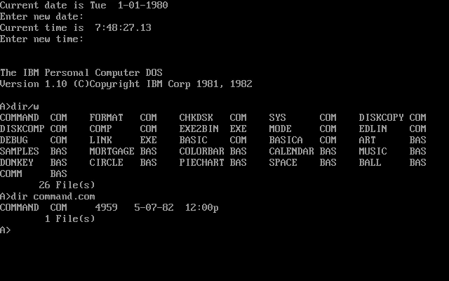
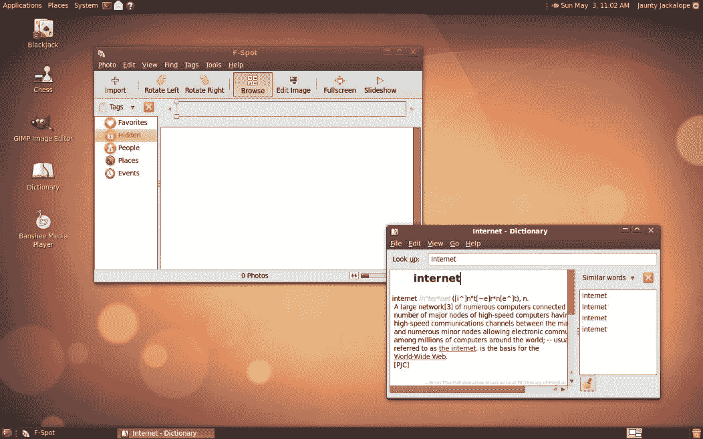
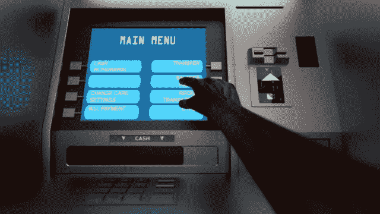
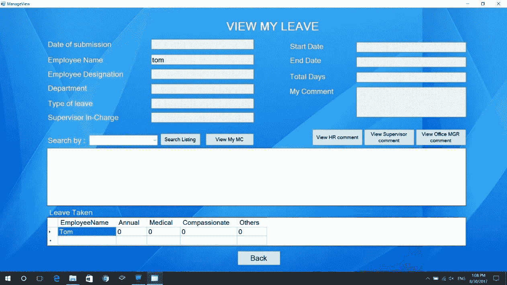

# 不同形式的用户界面和功能

> 原文：<https://blog.devgenius.io/different-forms-of-user-interfaces-and-features-d1c8152ab69?source=collection_archive---------3----------------------->

不同形式的用户界面和功能

用户界面对于满足用户的期望和保持用户与程序或设备之间的有效交互是很重要的。

在我之前的文章中，我写了谷歌、沃尔玛和苹果等主要品牌如何通过重新设计的用户界面获得更多成功。

ICYMI，你可以在这里看 [**。**](https://medium.com/@ckavishka32/success-stories-with-the-effective-use-of-ui-ux-designs-69e3544aa2d)

> ***“用户界面(UI)是设备中人机交互和交流的点。”***

当你听到 ***UI*** 这个词的时候，你首先想到的可能是一个移动应用的用户界面。或者……也许是网页设计。

但是…还有更多。

使用不同形式的用户界面，

*   *命令行界面*
*   *图形用户界面*
*   *菜单驱动界面*
*   *基于表单的界面*
*   *自然语言界面*

现在，让我们来看看每种 UI 类型及其优缺点。

## **1。命令行界面**

命令行界面(CLI)

命令行界面(CLI)是最古老的用户界面形式。

> “命令行界面是基于文本的用户界面，用于查看和管理计算机文件。”

这些类型的界面也被称为 ***控制台用户界面*** 或 ***角色用户界面*** 。

命令行界面有一个简单的概念。在命令行界面中，用户可以通过使用键盘键入相关命令来激活各种命令或功能。MS-DOS 系统和 Linux Bash 是命令行界面的两个例子。

**使用命令行界面的优势**

*   CLI 比其他用户界面更快。
*   使用较少的内存(RAM)。
*   需要更少的 CPU 处理时间。
*   较低的分辨率和简单的显示器就足够了。
*   基于操作系统的 CLI 尺寸较小。

**使用命令行界面的缺点**

*   用户必须记住大量的命令。
*   对初学者来说可能很难理解。
*   即使是一个简单的拼写错误也会导致教学失败。

## 2.图形用户界面

图形用户界面(GUI)

图形用户界面(GUI)也称为 ***WIMP 界面*** ，因为它使用窗口、图标、菜单和指针。这是目前最常用的接口之一。通过使用 GUI，在一个程序中放置更多的信息变得更加容易。

Windows、Linux、iOS 和 Android 是支持 GUI 的一些操作系统。此外，Word、Excel 等程序和 Chrome、Firefox 等网络浏览器也是使用中的图形用户界面的例子。

**使用图形用户界面的优势**

*   易于使用，非常用户友好。
*   初学者可以很容易地使用它。
*   在基于 GUI 的系统中易于探索和查找。
*   GUI 中没有复杂的命令。
*   用户不需要编程语言知识。
*   通常非常有吸引力和五彩缤纷。

**使用图形用户界面的缺点**

*   图形用户界面需要更多的存储和处理要求。
*   需要更多内存(RAM)才能正常运行。
*   性能可能会很慢。
*   有时，需要额外的硬件支持，而且成本很高。

## 3.菜单驱动界面

菜单驱动界面

菜单驱动界面允许用户通过一系列带有选项的菜单与计算机进行交互。该屏幕显示不同的菜单并引导用户直到预期的动作完成。在这些类型的界面中，用户可以使用箭头键或单击前进到下一个菜单。

菜单驱动界面的一个例子是 ATM。它提供了从选择语言开始的各种菜单，并用选项指导用户，直到实现所需的操作。此外，正在使用的大多数软件和网站也有菜单驱动的界面。

此外，菜单驱动界面也可以用基于语音的系统来构建。这主要用于使用*交互式语音应答* (IRV)系统的组织。IRV 系统通过语音和按键向用户提供菜单的导航选项。

**使用菜单驱动界面的优势**

*   用户不需要记住命令行界面中的任何东西。
*   易于使用，不需要任何先验知识。
*   需要有限的资源。
*   菜单界面可以是可视的，也可以是语音的。
*   可以更好地引导用户。
*   易于以多种语言呈现。因此，增强了可访问性。

**使用菜单驱动界面的缺点**

*   设计不良的菜单界面会让用户感到困惑，因此速度慢，效率低。
*   过多的背靠背菜单选项会降低用户友好度。
*   用户不能自定义界面。
*   没有可用的快捷方式。
*   菜单会占据屏幕的很大空间。

## 4.基于表单的界面

基于表单的界面

基于表单的界面具有类似表单的结构，用户可以键入和输入相关信息。这些接口用于数据收集。根据收集的数据，系统可以采取下一步措施。

出于数据收集的目的，基于表格的界面在万维网(WWW)上广泛可用。这些基于表单的界面可用于从用户处收集数据以添加到数据库中。

**使用基于表单的界面的优势**

*   可用于数据输入。
*   不需要过多的训练。
*   好用。
*   数据验证方法可以在基于表单的界面中使用。
*   不需要更大的处理能力或存储器。

**使用基于表单的界面的缺点**

*   该窗体将占据相当大的屏幕区域。
*   可用的选项有限。
*   不适合复杂的应用程序。

## 5.自然语言界面

自然语言界面

自然语言界面允许用户直接与计算机交互。与传统的专用系统不同，自然语言界面允许用户用纯人类语言与计算机交流，就像与另一个人交流一样。

这些自然语言界面目前正迅速流行起来。一些现代的自然语言界面是亚马逊 Alexa，苹果 Siri 和微软 Cortana。

在自然语言界面中，采石场可以作为键入的问题输入，也可以作为口头问题输入。当系统收到问题时，它会得到处理和回答。机器学习(ML)和自然语言处理(NLP)等各种人工智能(AI)技术也用于充分利用这些界面。

**使用自然语言界面的优势**

*   使用自然语言界面不需要学习或预先培训。
*   在执行任务时更加灵活。
*   身体残疾的人也可以很容易地使用。
*   可用于没有传统输入输出方法的系统。
*   建立跟进问题的能力，提高用户友好度。
*   比菜单驱动界面更快。

**使用自然语言界面的缺点**

*   通常，设备需要在线才能获得成功的交互。
*   用户可能会问超出系统能力的问题。因此，可靠性可能是自然语言接口中的一个问题。
*   可能会产生不可预测的结果。
*   自然语言接口需要大量的自然语言处理资源。
*   编程复杂。
*   在不熟悉的情况或变化的环境中可能会面临困难。

所有这些形式的用户界面都适用于基于需求的不同场景。然而，你为产品选择的用户界面形式会对最终用户的体验产生直接影响。

可以从下面的视频看关于这个话题的视频讲解。

*对此你有什么想法？如果你有任何问题或其他事实，请在下面评论。敬请关注下一篇文章。*

*业务查询，可以在这里* ***找我* [***。***](https://linktr.ee/Chamod_Kavishka)**