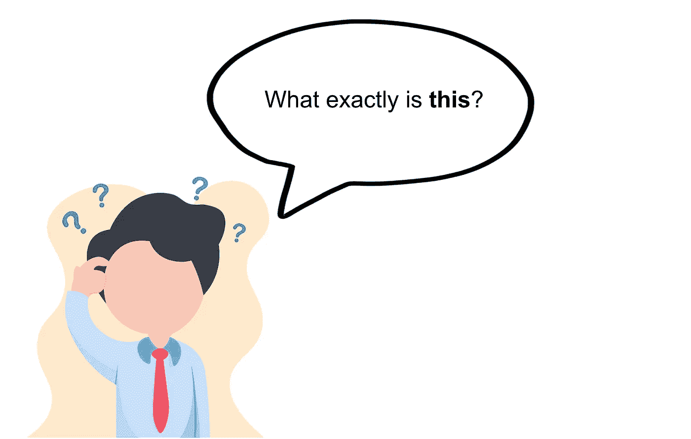
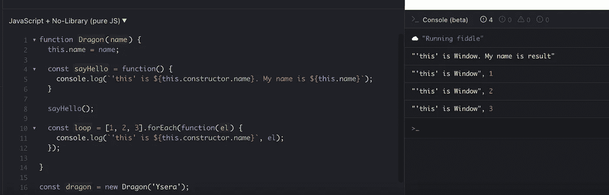
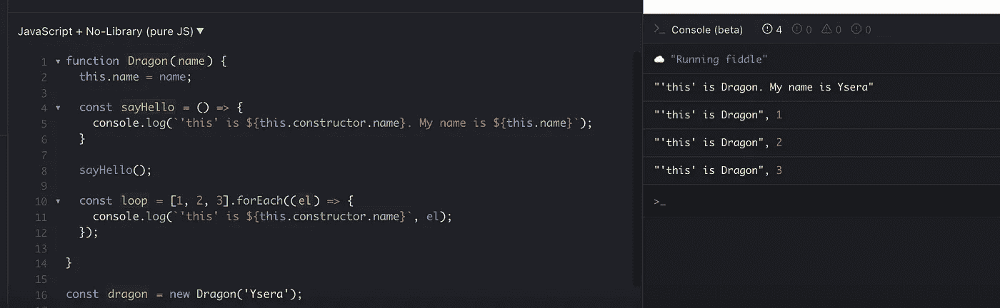
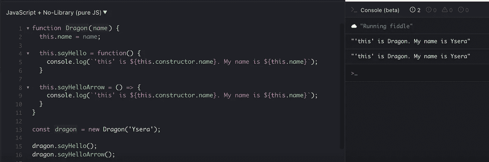
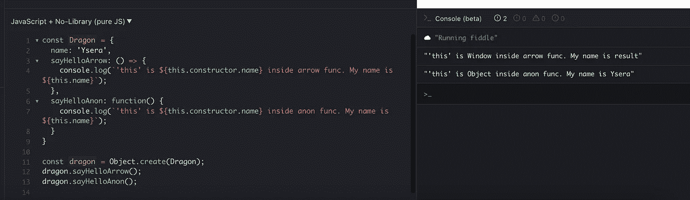
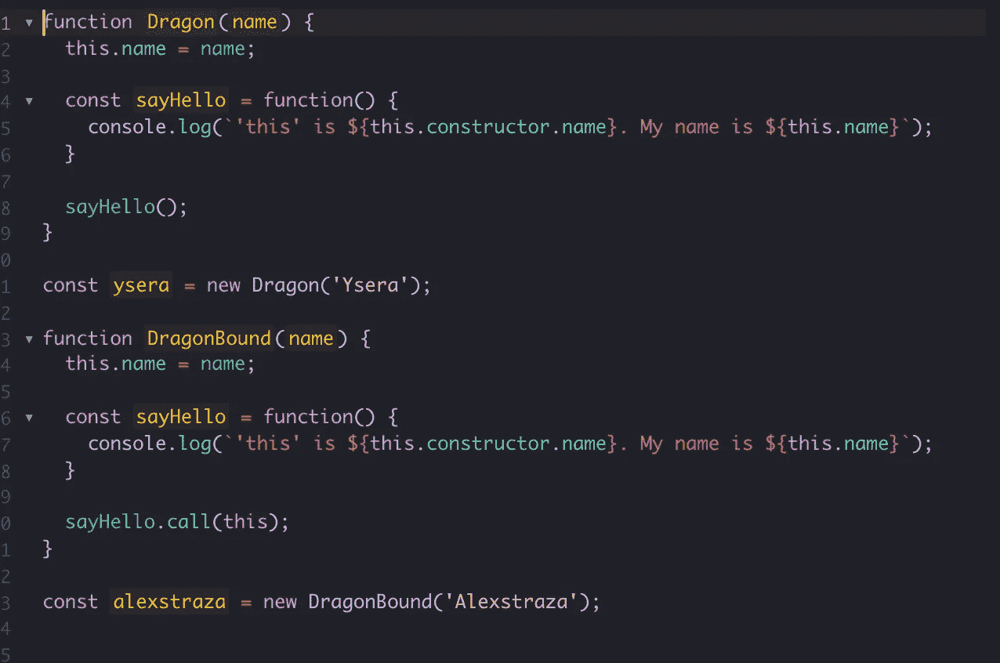
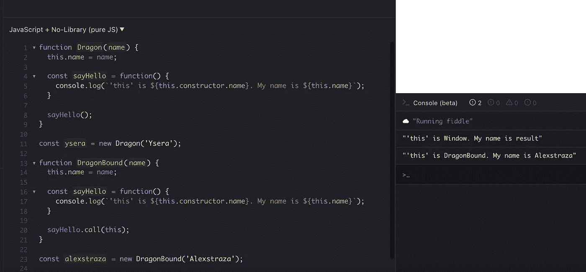
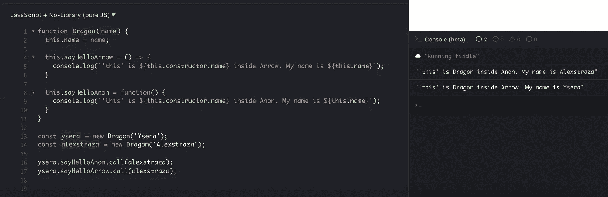

# 编写 Javascript 函数的不同方式以及它们如何影响“这”

> 原文：<https://blog.devgenius.io/different-ways-of-writing-javascript-functions-and-how-they-affect-this-a183aedfcddb?source=collection_archive---------11----------------------->

## Javascript 函数中“这”是什么的简单规则



作者图片

`this`错综复杂。`this`指的是函数内部的上下文，但是根据函数声明的方式不同，上下文也不同。

我们将会看到写一个 Javascript 函数的无数种方法，以及里面的`this`的值是什么。注意，如果您想要快速复制/粘贴代码并亲自尝试，您可以找到 Github gist 和我在文章中截屏的示例！

# 匿名函数

匿名函数是没有名字的函数。例如:

```
function() {
   console.log(this.constructor.name);
}
```

`this`匿名函数内部是全局对象(如浏览器中的窗口)。

这是一个内部有匿名函数的 Javascript 对象的例子。



当你运行左边的代码时，你期望`this`是全局窗口对象，如右边所示。

匿名函数通常用于生命或者回调。

# 箭头功能

另一方面，箭头函数在创建时接收其周围范围的`this`值。

在下面的例子中，创建时的封闭范围是龙对象。



上面的代码与匿名函数的例子相同，但是`sayHello`是一个箭头函数，而`forEach`中的回调也是一个箭头函数。在这种情况下，`this`就是龙的对象。

**箭头功能防止通过** `**.call**` **和** `**.apply**` **控制上下文。**

这意味着即使你试图将一个上下文绑定到一个函数，如果这个函数是一个箭头函数，它也不会工作。我将在本文的后面回到这个问题。

# 作为方法调用的函数

如果函数被作为方法调用(例如`myObj.myMethod()`)，即使它是一个匿名函数，`this`仍然是函数属性所在的对象。在下面的例子中，如果我们将`sayHello`指定为 dragon 的属性，`this`将成为 Dragon 对象。



`this`如果匿名函数是 dragon 对象的属性，则匿名函数内部是 Dragon 的实例。

# Javascript 对象

然而，在 Javascript 对象内部，`this`对于箭头函数和匿名函数是不同的。



如你所见，箭头函数中的`this`是`Window`，而匿名函数中的`this`仍然是我们的龙对象，Ysera。

这里的原因是，在全局级别声明的 Javascript 对象中，arrow 函数的封闭词法范围仍然是全局窗口对象。

# 申请，打电话和这个

应用和调用是在特定上下文中传递给函数的方法。“bound”函数中的`this`是作为第一个参数传入的对象。

例如，对于`DragonBound`类，我们不按原样调用匿名函数`sayHello()`，而是使用`.call` — `sayHello.call(this)`。这将 dragon 对象作为`this`的上下文传递给了`sayHello`函数。



我们希望控制台显示

```
“‘this’ is Window. My name is result”
“‘this’ is DragonBound. My name is Alexstraza”
```

事实上，这就是我们所得到的:



`.apply()`工作原理类似。它们的不同之处在于[如何将参数传递给函数](https://frontendinterviewhandbook.com/javascript-questions/#whats-the-difference-between-call-and-apply)。

**同样，** `**.call**` **和** `**.apply**` **对箭头功能不起作用，如下图:**



如果方法是用箭头函数声明的，那么将 alexstraza 绑定到 ysera 的方法将不起作用。

我计划在以后的文章中更详细地介绍如何实现`.call`、`.apply`和`.bind`。敬请期待！

下面是 Github 要点，以及本文中的示例:

[https://gist . github . com/lilychencodes/6e 9 AE 62004 B3 a 341 c 27d 5769 a 671 CAC 8](https://gist.github.com/lilychencodes/6e9ae62004b3a341c27d5769a671cac8)

感谢您的阅读。如果你有什么特别的话题想让我介绍，请在下面评论。