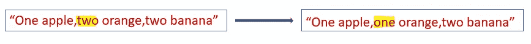

# 在 Python 字符串中替换子字符串的不同方法

> 原文：<https://blog.devgenius.io/different-ways-to-replace-occurences-of-a-substring-in-python-strings-2911b1f7bf86?source=collection_archive---------0----------------------->

## 在 python 中使用字符串方法和正则表达式


照片由来自 [Pexels](https://www.pexels.com/photo/heart-shaped-gummy-candy-assorted-in-rows-with-one-candy-aside-against-pink-background-4016522/?utm_content=attributionCopyText&utm_medium=referral&utm_source=pexels) 的 [Karolina Grabowska](https://www.pexels.com/@karolina-grabowska?utm_content=attributionCopyText&utm_medium=referral&utm_source=pexels) 拍摄

# 在 Python 中替换字符串中子字符串的出现

1.  str.replace()
2.  re.sub()
3.  re.subn()

通过使用上述方法，让我们看看如何替换字符串中的子字符串。

# 1.替换所有出现的子字符串

## **'使用 str.replace()'**

**语法:**

**示例 1:将子字符串“two”替换为“one”**


```
s1=**"one apple,two orange,two banana"** s2=s1.replace(**"two"**,**"one"**)
print (s2)
#Output:one apple,one orange,one banana
```

默认情况下，str.replace()将用“一”替换所有出现的“二”

# **2。仅替换第一次出现的子字符串**

## **使用‘str . replace’**

**示例 1:将第一次出现的子字符串“two”替换为“one”。**



如果我们只想用第一个出现的子串替换它，我们可以使用 count =1。同样，对于前两个事件，我们可以提到 count=2。

```
s1=**"one apple,two orange,two banana"** s2=s1.replace(**"two"**,**"one"**,1)
print (s2)
#Output:one apple,one orange,two banana
```

# 3.不区分大小写的替换。

## **使用‘re()’**

**语法:**

`re.sub(pattern, repl, string, count=0, flags=0)`

通过提及`flag=re.IGNORECASE`

**例 1:不得不用“一”代替“一”或“一个”。**


```
**import** re
s1=**"An apple,an avocado"** pattern = re.compile(**'an'**, re.IGNORECASE)
s2=pattern.sub(**"one"**,s1)
print (s2)
#Output:one apple,one avocado
```

*   `pattern = re.compile(‘an’, re.IGNORECASE)` →定义匹配“an”子串的模式。标志被设置为 **re。IGNORECASE** 表示不区分大小写。它将匹配“an”、“An”、“AN”子字符串。
*   `s2=pattern.sub(“one”,s1)`→将字符串“s1”的匹配模式替换为“一”

**示例 2:使用 re.subn()** 进行不区分大小写的替换

## 使用“re.subn()”

语法:`**re.subn(pattern, repl, string, count=0, flags=0)**`

与 re.sub()相同，但会返回一个元组 **(new_string，number_of_subs_made)**

如果我们想知道替换的次数，可以使用 re.subn()。

```
**import** re
s1=**"An apple,an avocado"** pattern = re.compile(**'an'**, re.IGNORECASE)
s2=pattern.subn(**"one"**,s1)
print (s2)
#Output:('one apple,one avocado', 2)
```

*   `(‘one apple,one avocado’, 2)` →返回修改后的字符串和替换次数。

# 4.避免替换部分单词。

**例 1:将“an”替换为“one”。但是它不应该代替单词的一部分。**


如果我们使用 str . replace(),“orange”中的“an”也会被替换。

```
s1=**"an apple,an orange"** s2=s1.replace(**"an"**,**"one"**)
print(s2)
#Output:one apple,one oronege
```

为了避免替换单词上的部分，可以使用 re()。

```
**import** re
s1=**"an apple,an orange"** pattern = re.compile(**r'\ban\b'**)
s2=pattern.sub(**"one"**,s1)
print (s1)
#Output:an apple,an orange
```

*   `pattern = re.compile(r’\ban\b’)` → **\b** 匹配空字符串。由于 **'\ban\b'** 匹配的是 **"an"** 前后的空字符串，这样可以避免部分单词的替换。所以**【橙】**里面的**【安】**没有被替换。

# 5.用一个单词替换多个单词。

**例 1:将“hr”、“hour”替换为“Hours”**

```
**import** re
s1=**"hr,hour"** pattern = re.compile(**'(hr|hour)'**)
s2=pattern.sub(**"Hours"**,s1)
print (s2)
#Output:Hours,Hours
```

*   `pattern = re.compile(‘(hr|hour)’)`
*   **()**→组
*   **|** →要么或
*   **'(小时|小时)'** →匹配“小时”或“小时”

# 6。用单个字符替换一组特定的字符。

**示例:用'-'替换@、#、$、%**


```
**import** re
s1=**"1@2#3$4%5"** s2=re.sub(**"[@#$%]"**,**"-"**,s1)
print (s2)
```

*   `re.sub(“[@#$%]”,”-”,s1)`
    **→用来表示一组字符**
*   ****"[@#$%]"** →模式匹配 **[]** 中提到的任何字符**
*   **re("[@ # $ %]"，"-"，s1) →匹配的字符，然后替换为'-'**

# **7.用单个字符替换一个或多个出现的字符。**

****

```
**import** re
s1=**"1.99,2.999,3.9999"
import** re
s2=re.sub(**"[9]+"**,**"0"**,s1)
print (s2)
*#Output:1.0,2.0,3.0*
```

*   **`s1=re.sub(“[9]+”,”0",s1)`**
*   ****"[9]+"** →它将匹配 9 的一个或多个出现。**
*   ****+** →匹配一个或多个出现的提到的字符。**
*   **`re.sub(“[9]+”,”0",s1)` →将字符串 s1 中出现的一个或多个`**9**`替换为`**0**`。**

****使用' re.subn()****

```
**import** re
s1=**"1.99,2.999,3.9999"
import** re
s2=re.subn(**"[9]+"**,**"0"**,s1)
print (s2)
*#Output:('1.0,2.0,3.0', 3)*
```

# **外卖:**

1.  **要替换固定字符串，可以使用 str.replace()。与**模块相比，它要快得多。****
2.  **如果需要替换特定的模式，则可以使用 re.sub()或 re，subn()。**
3.  **上述所有方法都将替换字符串中的字符，并返回一个新字符串。它不会修改原始字符串。**

# **我的其他博客与字符串方法有关**

**[](https://levelup.gitconnected.com/remove-whitespaces-from-strings-in-python-c5ee612ee9dc) [## 在 Python 中移除字符串中的空格

### 在 Python 中使用字符串方法和正则表达式

levelup.gitconnected.com](https://levelup.gitconnected.com/remove-whitespaces-from-strings-in-python-c5ee612ee9dc) [](https://betterprogramming.pub/5-ways-to-find-the-index-of-a-substring-in-python-13d5293fc76d) [## 在 Python 中查找子串索引的 5 种方法

### 在 Python 中使用字符串方法和正则表达式

better 编程. pub](https://betterprogramming.pub/5-ways-to-find-the-index-of-a-substring-in-python-13d5293fc76d) [](https://betterprogramming.pub/5-different-ways-to-remove-specific-characters-from-a-string-in-python-b0e081839ab9) [## 在 Python 中从字符串中删除特定字符的 5 种不同方法

### 使用字符串方法、过滤器和正则表达式

better 编程. pub](https://betterprogramming.pub/5-different-ways-to-remove-specific-characters-from-a-string-in-python-b0e081839ab9) [](https://betterprogramming.pub/split-vs-partition-in-python-strings-9505d070af55) [## Python 字符串中的 split()与 partition()

### 有什么区别？

better 编程. pub](https://betterprogramming.pub/split-vs-partition-in-python-strings-9505d070af55) 

请关注此空间，了解更多关于 Python 和数据科学的文章。如果你喜欢看我的更多教程，就关注我的 [***中***](https://medium.com/@IndhumathyChelliah)[***LinkedIn***](https://www.linkedin.com/in/indhumathy-chelliah/)*[***Twitter***](https://twitter.com/IndhuChelliah)***。****

**点击这里成为中等会员:*[*https://indhumathychelliah.medium.com/membership*](https://indhumathychelliah.medium.com/membership)***