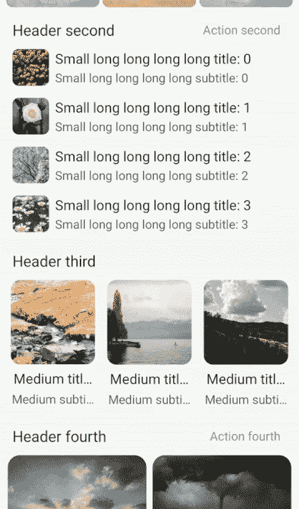

# 具有不同项目的多列列表中的差异

> 原文：<https://blog.devgenius.io/diffutil-in-multiple-columns-list-with-different-items-ae52a8134f0a?source=collection_archive---------9----------------------->

图片由 [Unsplash](https://unsplash.com?utm_source=medium&utm_medium=referral) 上的 [Ine Carriquiry](https://unsplash.com/@ineka?utm_source=medium&utm_medium=referral) 拍摄

你好！今天我将讨论如何在你的项目中实现 [DiffUtil](https://developer.android.com/reference/androidx/recyclerview/widget/DiffUtil) 以及多列列表的情况。这是最终结果👇

如果你想知道:"*嘿，我怎样才能创建这样的多列列表呢？*”，我有答案了…😅查看我的[**上一篇**](https://medium.com/r?url=https%3A%2F%2Fserjantarbuz.medium.com%2Frecyclerview-with-different-items-and-multiple-columns-grid-724618d5d4e4) 关于它。

## 关于 [**DiffUtil**](https://developer.android.com/reference/androidx/recyclerview/widget/DiffUtil) |为了什么？

这个有用的东西藏在 [RecyclerView](https://developer.android.com/jetpack/androidx/releases/recyclerview) 库里面。需要比较两个列表(以前的和新的)并调用[recycle view。适配器](https://developer.android.com/reference/androidx/recyclerview/widget/RecyclerView.Adapter)为每个差异通知函数。此外，它比以前使用的功能更有优势:

🔹更好的性能
🔹少码
🔹一起玩的漂亮动画

我想这也回答了这个问题:“*为什么我们要用*[*DiffUtil*](https://developer.android.com/reference/androidx/recyclerview/widget/DiffUtil)*？*😇

## 如何开始？

主要我们将使用[适配器](https://developer.android.com/reference/androidx/recyclerview/widget/RecyclerView.Adapter)类，对它们进行一些转换，并创建一些新的。首先，让我们为所有的[适配器](https://developer.android.com/reference/androidx/recyclerview/widget/RecyclerView.Adapter)创建一个新的父类，它将实现 [DiffUtil](https://medium.com/r?url=https%3A%2F%2Fdeveloper.android.com%2Freference%2Fandroidx%2Frecyclerview%2Fwidget%2FDiffUtil) 。

关于该类的一些重要注意事项:

*   变量[*diff result*](https://developer.android.com/reference/androidx/recyclerview/widget/DiffUtil.DiffResult)*是库工作的结果(计算两个列表的差)。*
*   *抽象变量 *diff* (带父 *ParentDiff < T >* )忙于比较条目以及如何在列表中识别它们。*
*   *您可能会注意到 *setList* 函数上方的注释。这意味着(对于类实现)需要在 *this.list 中复制 *list* (这是参数)的条目。*只设置新的 list -这还不够。它将防止 [DiffUtil](https://developer.android.com/reference/androidx/recyclerview/widget/DiffUtil) *list* (如果你存储的 *list* 发生了一些变化)内的变化，并使动画以正确的方式工作。*

*下面介绍父类的实现。因为与[上一篇](https://serjantarbuz.medium.com/recyclerview-with-different-items-and-multiple-columns-grid-724618d5d4e4)代码相似，所以不全。注意*设置列表*功能(再次😃)，并非所有项目都复制到这里(跳过*对象*有静态数据的项目)。*

*您可以在 GitHub 中找到完整的代码(文章末尾的项目链接)*

## ***文章更新(22.02.22)***

*最近我为自己发现了一个类 [ListAdapter](https://developer.android.com/reference/androidx/recyclerview/widget/ListAdapter) ，它与 *ParrentDiffAdapter* 非常相似。但是这样更好，因为在后台线程上计算列表之间的差异。在 [ListAdapter](https://developer.android.com/reference/androidx/recyclerview/widget/ListAdapter) 的文档页面中，你可以找到如何实现这个类。*

## *比较类别*

*现在，关于 *ParentDiff* 及其子 *TestDiff* 。都是[难度的实现。回调](https://developer.android.com/reference/kotlin/androidx/recyclerview/widget/DiffUtil.Callback)。基于这个回调实现，适配器将调用通知函数。文档是这样描述的:*

> *DiffUtil 在计算两个列表之间的差异时使用的回调类。*

*一般项目-如在 DiffAdapter 中*

*关于重要时刻的一些评论:*

*   **areItemsTheSame* —该功能用于识别不同列表中的相同对象(例如通过 *id* )。*
*   **areContentsTheSame* —这个函数看起来和听起来都像前一个函数，但是它们不同。这一个用于在识别相同项目后比较内容(在第一个功能工作后)。*
*   *使用[Kotlin](https://kotlinlang.org/)[数据类](https://kotlinlang.org/docs/data-classes.html) 进行条目内容的比较，非常方便。*

## *如何从 UI 类调用 magic？🌠*

*就这些了，伙计们！🐷很简单，不是吗？感谢阅读，我希望你喜欢它，这篇文章会有用的！🙌别忘了媒体👏👏👏如果你喜欢这个。*

*这个测试项目的完整代码你可以在这里找到，你也可以自己安装 app 并检查。祝你好运！*