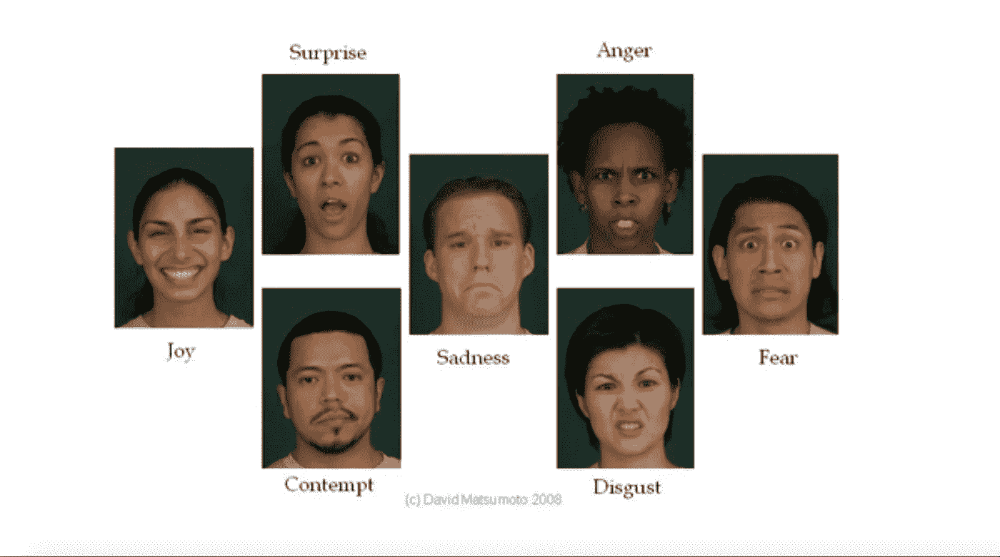
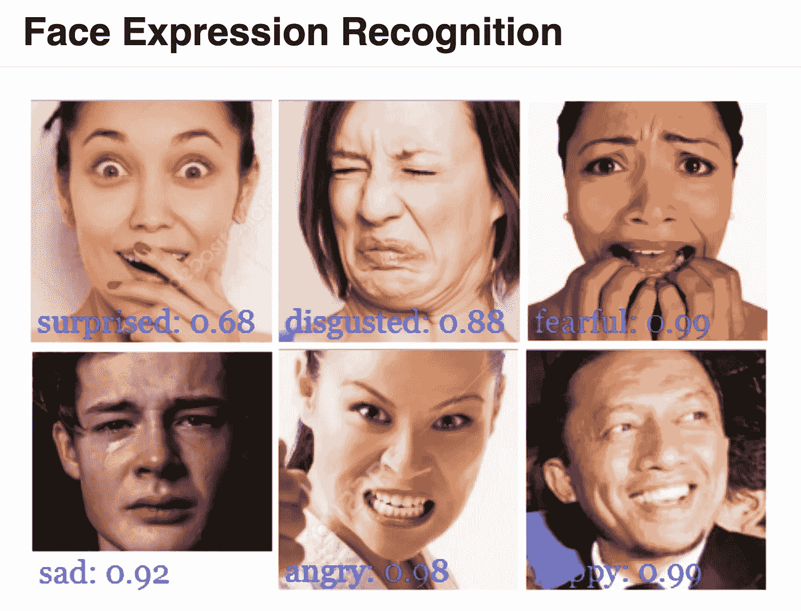
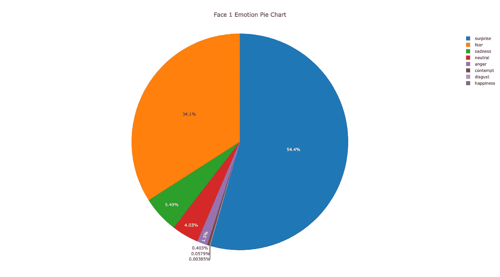
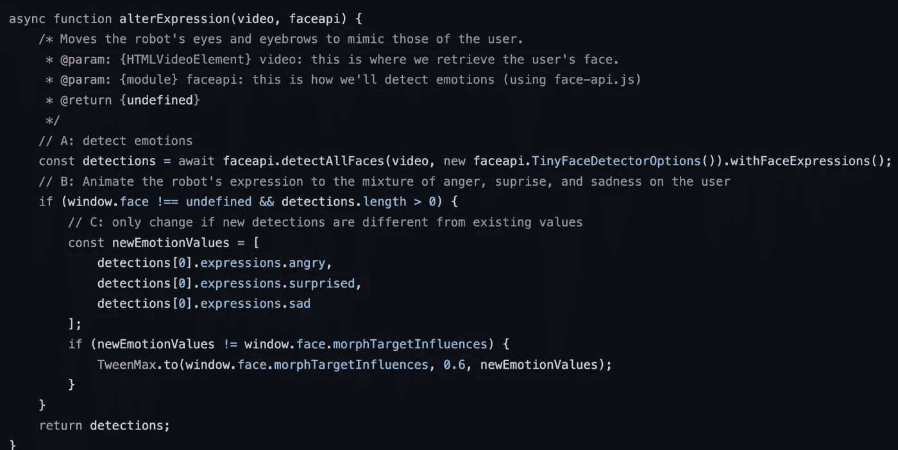
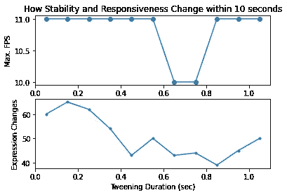
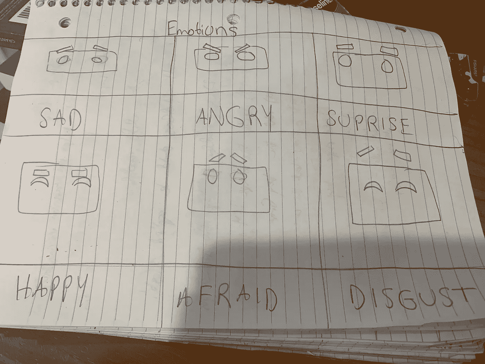

# 数字化身:远程工作的下一次飞跃？

> 原文：<https://blog.devgenius.io/digital-avatars-the-next-leap-in-remote-work-c72c0cd369a7?source=collection_archive---------3----------------------->


我的朋友们，这种疲劳是真实的——也就是“变焦疲劳”。迪伦·费雷拉在 [Unsplash](https://unsplash.com/s/photos/video-call?utm_source=unsplash&utm_medium=referral&utm_content=creditCopyText) 上的照片

# 远程工作失败的地方

我的朋友们，这种疲劳是真实的——也就是“变焦疲劳”。

不管你喜欢还是讨厌，远程工作可能会持续一段时间，因为它仍然是在全球许多地方开展业务的最安全、最实惠、也可以说是最环保的[方式。](https://youtu.be/XswV_yqPq28)

然而，如果你曾经在一天的视频会议后感到精疲力尽，你并不孤单。今年 2 月，斯坦福大学的杰里米·贝伦森博士正式发表了一项关于变焦疲劳原因的研究。简而言之，贝伦森博士认为这些原因是“过多的近距离凝视、认知负荷、盯着自己的视频看而增加的自我评价，以及对身体流动性的限制”。

随着疫情的继续，变焦是我们职业生涯中的生命线。但是有什么方法可以让知识工作者从变焦疲劳中拯救我们的头脑呢？

# 深度学习如何帮助:数字化身！

有没有可能有一天，远程团队会依靠数字化身，如[【Roberto】](https://zainraza.me/headsetsGoodbye/expressionTrackingDemos/robot/index.html)(上面看到的机器人)在团队成员之间进行交流？

## 但是什么是数字化身呢？

虚拟角色只不过是在计算机中创建的用户的一种表现形式。更正式地说，Ducheneaut 教授等人描述(在他们 2009 年的 ACM 论文中，“[“身体和心灵:三个虚拟世界中的化身个性化研究”](https://dl.acm.org/doi/10.1145/1518701.1518877))这些化身通常可以由用户控制和定制，以适应他们的个性化外观[ [2](https://dl.acm.org/doi/10.1145/1518701.1518877) ]。

## 这就是为什么它们很重要

正如上面的 GIF 图所示，用户可以定制[“罗伯托:移情机器人”](https://zainraza.me/headsetsGoodbye/expressionTrackingDemos/robot/index.html)的面部表情，只需改变他们自己的表情。不像今天流行的 XR 应用程序中的化身，Roberto 只需要一个网络摄像头就可以控制。这得益于利用了流行的面部识别库 [face-api.js](https://justadudewhohacks.github.io/face-api.js/docs/index.html) 。它最初是由 Vincent Mühler 在 2018 年创建的，代码是开源的。

那么，有没有可能有一天，远程团队将依靠像罗伯托这样的数字化身，以一种有趣的、认知不那么详尽的方式定制团队成员？

在博客的其余部分，我将报告我在构建[“罗伯托:移情机器人”](https://zainraza.me/headsetsGoodbye/expressionTrackingDemos/robot/index.html)项目时是如何努力实现以下目标的，以及由此产生的结果。

## **本项目目标:**

1.  **演示**如何通过网络浏览器中的 3D 模型**传达情感**。
2.  **测试 TinyYoloV2 模型能够**有效识别混合情绪的限度**。**
3.  **在 Three.js 场景中，通过平衡稳定性和响应性之间的权衡，产生平滑的 UI/UX** 。

# 目标 1:在网络上传达情感

## 动画机器人:**接近**

坦率地说，当我开始这个项目时，我是一个计算机图形学的新手，不知道从哪里开始。因此，我试着从一个简单的 UX 目标开始:制造一个机器人——一种人造生物——以人类自然的方式传达情感。



这 7 种面部表情的含义被认为是“通用的”——这意味着它们可以不受文化、种族、宗教、性别或任何其他人口统计标志的影响而被识别。这使得设计机器人的面部表情变得更容易，因为我们可以概括出它应该显示的特征，以便人类用户能够识别。资料来源:大卫松本，[休敏特尔](https://www.humintell.com/2021/01/the-universality-of-facial-expressions-of-emotion/)，2021 年。

好消息是，心理学家已经对我们人类如何表达情感做了大量的研究。旧金山州立大学的大卫·松本博士在他的网站上写道，有几种情绪仅仅通过面部表情就可以被普遍识别[[3](https://www.humintell.com/2021/01/the-universality-of-facial-expressions-of-emotion/)。这使得理解 3D 机器人角色需要包含表达式的哪些方面变得更加容易。例如，如果一个只有眼睛和眉毛的机器人角色需要显示愤怒，那么他们必须做出愤怒的人类眉毛中常见的典型“V”形。

下一步实际上是找到一个有表现力的机器人 3D 模型。幸运的是，有很多可供选择，这要感谢计算机图形学中现有的 R&D 的几十年。我最终选择了[这个](https://github.com/mrdoob/three.js/tree/master/examples/models/gltf/RobotExpressive)，这是一个开源模型，最初由[托马斯·劳埃](https://www.patreon.com/quaternius)创建，并在 [Three.js 网站](https://threejs.org/examples/#webgl_animation_skinning_morph)上作为“蒙皮和变形”的例子。除了是开源的，我选择这个模型是因为它是 glTF 格式的。正如 Lewy Blue 在[*DISCOVER three . js*](https://discoverthreejs.com/book/first-steps/load-models/)*(2021)电子书中所报告的那样，这是迄今为止用于在浏览器中加载 3D 模型的最流行的文件格式，因为文件大小往往更小，动画加载速度比其他文件类型快，如 OBJ 或 FBX [ [4](https://discoverthreejs.com/book/first-steps/load-models/) ]。*

*最初的机器人模型，通过鼠标控制，具有可点击的 GUI(来源: [Three.js](https://threejs.org/examples/#webgl_animation_skinning_morph) )。*

*这些简短的动画，又名 *shape keys，*已经和模型一起出现了(感谢开源贡献者[唐·麦克迪](https://www.donmccurdy.com)的工作)，我从 Three.js GitHub 库下载了这些动画。然而，它们也可以通过第三方[建模程序](https://en.wikipedia.org/wiki/3D_modeling)如 [Blender](https://www.blender.org/) 手动添加到 glTF 模型中。*

## ***结果***

*我还在为机器人的面部表情进行 UX 测试，反馈主要是定性的。当试图判断用户是否认为机器人的表情(对他们自己面部扭曲的反应)看起来“真实”时，我会问如下问题:*

> *“机器人让你想起了什么，如果有的话？”
> “看机器人的动画有什么感受？”*

*对此，通常用户的反应是，虽然他们认为机器人看起来很酷，但它并没有强烈地提醒他们任何其他事情。在观看机器人时，他们同样表示动画没有任何强烈的联系感。*

# *目标 2:实时显示复杂的感觉*

## *方法*

*既然我们有了一个表情丰富的机器人，下一步就是找到一种方法，只用我们的面部表情来控制机器人的脸。*

*这就是 [face-api.js](https://justadudewhohacks.github.io/face-api.js/docs/index.html) 模块派上用场的地方:它提供了一个简单易懂的 api 来利用 *TinyYolov2* 模型，这是一个强大而轻量级的神经网络，用于执行一些计算机视觉任务。在我们的案例中，我们需要执行“面部表情识别”，即通过网络摄像头检测情绪。下面显示了执行此任务时模型输出的示例，使用了在 [face-api.js 文档中找到的静态图像。](https://justadudewhohacks.github.io/face-api.js/docs/index.html)*

**

*正如你所看到的，这个来自 [face-api.js 文档](https://justadudewhohacks.github.io/face-api.js/docs/index.html)的例子展示了 TinyYolov2 模型如何识别普遍的情感；并且它还提供了一个介于 0–1 之间的值，表示模型对其预测的信心程度(来源: [face-api.js](https://justadudewhohacks.github.io/face-api.js/docs/index.html) )。*

*使用前面提到的 API，我们可以使用 *TinyYolov2* 模型来识别在网络摄像头上捕捉到的用户表情，并返回该预测的置信度(0 到 1 之间的值)。*

*这个知识仍然回避了这个问题:**我们如何在机器人身上表现出复杂的感情？***

*这只是为了了解 face-api.js 的 API 是如何工作的。为了详细说明，我们可以调用下面的函数:*

```
*.withFaceExpressions();*
```

*为了返回模型对*每一种可能的*情感的信心，它可以检测到，而不仅仅是在任何给定时刻最有可能的一种。巧合的是，我要提到的是，TinyYolov2 的创造者使用了七种普遍情绪作为模型分类的任何面部表情的潜在标签。*

*每种情绪被模型预测的概率(同样，总共有七种)，总共也必须加起来达到 100%。为了让您直观地看到这一点，它可能看起来像下面的饼图(请放大以查看百分比):*

**

*来源: [Chrispiro，图表工作室](https://chart-studio.plotly.com/~chrispiro/62.embed)*

*因此，我显示混合情绪的方法是*使用每个预测情绪的置信度，作为该情绪的动画播放程度。*例如，如果模型检测到用户在给定时刻正经历类似于上面饼图的情绪组合，那么机器人将显示一个表情，主要是**惊讶**，然后是**恐惧**，接着是**悲伤**，等等。*

*下面，我将包含实际实现上述方法的[代码片段](https://github.com/UPstartDeveloper/headsetsGoodbye/blob/main/expressionTrackingDemos/robot/resources/js/robot.js)。为了使机器人的表情能够实时变化，最后一步是调用下面的函数作为一个更大的渲染循环的一部分(你可以在 GitHub 链接[的底部找到这个函数](https://github.com/UPstartDeveloper/headsetsGoodbye/blob/main/expressionTrackingDemos/robot/resources/js/robot.js))。*

**

*通过*使用每个预测情感的置信度作为该情感动画的程度，动画化机器人面部的代码片段，允许基于网络摄像头显示复杂的情感。**

## *结果呢*

*尽管这种方法相当直观，但还不是很健壮。例如，我在一项对该应用的非科学调查中注意到，在多次测试中，该应用在昏暗的光线条件下反应变得更慢。*

# *目标 3:制作流畅的用户界面/UX*

## *平衡稳定性和响应性之间的权衡*

*到目前为止，我们解决的第三大问题是性能问题——最初机器人动画是如此滞后，以至于现实中的人会觉得这是一种令人愉快的体验是不现实的。*

*最终，我发现在机器人的面部动画上使用补间技术有助于我让应用程序对用户做出足够快的响应，以每秒*帧数* (FPS)来衡量，而不会太紧张。作为背景，“补间”仅仅是指通过填充中间步骤，使用 Javascript 平滑有助于屏幕显示的动画。你可以在华盛顿大学的 Terry Brooks 的讲座中了解更多关于补间[的正式定义。总的来说，补间让我可以尝试在一个缓慢稳定的应用程序和一个敏感但反应灵敏的应用程序之间找到平衡。](http://staff.washington.edu/tabrooks/343INFO/JSMotionTween/jsMotionTween.htm)*

## *进行测量*

*我的目标是看看我们是否可以最小化应用程序中的抖动(定义为 Roberto 的表情不可预测地变化的次数，而用户的表情不变)，同时优化最高的响应能力(以我的 FPS 为衡量标准)。*

*为了做到这一点，我决定通过 11 次测试来衡量这款应用的性能。在每个试验中，*独立变量*是补间动画的持续时间。我会将这个值调整 0.10 秒，从初始值 0.05 秒开始。*

*在每次试验中，我将计时器设置为 5 秒，在试验期间，我在代码中设置了一个全局 Javascript 变量`counter`，它将从 0 开始，并在每次动画被触发时递增。然后它会被记录到控制台。然后，随着时间的推移，我会看着镜头，用“惊讶”的表情托住自己的脸——扬起眉毛，睁大眼睛。*

*总而言之，我们的*因变量*如下:*

1.  *“表情变化”:这是动画在 5 秒内被触发的次数，当我在“惊讶”表情中保持面部稳定时。它被记录到控制台，我用谷歌浏览器的 Inspect 工具查看了它。同样，这是使用名为`counter`的全局 Javascript 变量测量的。*
2.  *最大值 FPS —使用`dat.gui.module.js`(又名“dat”)中的代码。GUI”)，我能够测量该应用程序在试用过程中达到的最高 FPS(总共需要大约 10 秒)。对于感兴趣的读者，“dat。GUI”是另一个开源 Javascript 模块，它包含在我从 Three.js 存储库中获取的样板代码中。更多信息可以在[这里](https://github.com/dataarts/dat.gui%5C)找到。*

*虽然我没有把这归结为一门科学，但试验结果如下所示:*

**

*来源: [Jupyter 笔记本](https://colab.research.google.com/drive/1XXORTuzKL0vxjRqma2088x4omkMxrBjx?usp=sharing)*

*如您所见，观察到的最佳补间持续时间约为 0.85 秒。该值与大约 40 处表达变化的最低值以及最高值相关。每秒 11 帧。为了更深入地了解我收集的数据，请查看我在 Google Colab 中的 [Jupyter 笔记本。](https://colab.research.google.com/drive/1XXORTuzKL0vxjRqma2088x4omkMxrBjx?usp=sharing)*

# *改进的后续步骤*

***目标 1:** 关于给机器人制作动画，有两个主要建议可以让它的面部表情看起来更真实:*

1.  ***增加更多类似人类的特征:**比如嘴巴，或者上下移动脖子的能力。这可以通过增加机器人创建的真实感来改善用户体验。*
2.  ***继续测试，使用更多种类的面部表情:**关于像 Blender 这样的建模程序的广泛可用性的好消息是，编辑或向机器人添加新种类的表情动画相当简单。因此，我们可能只需要继续寻找最能引起用户共鸣的设计。从通过面部表达的 7 种普遍情绪列表中，我为不同机器人表情的设计做了一些低逼真度的设计:*

**

*从通过面部表达的 7 种普遍情绪列表中，我为不同机器人表情的设计未来可能的样子做了一些低逼真度的设计。当然，这些需要使用建模程序如 Blender 来添加。*

***目标 2:** 关于使情感识别更加鲁棒，最有可能起作用的选项是重新训练 *TinyYolov2* 模型，或者使用另一个模型，以便它将在昏暗的灯光或从不同摄像机角度看到的人脸的情况下工作得更好。*

***目标 3:** 虽然我只测试了 11 次，现在考虑优化性能还为时过早，但这款应用的平均速度已经达到了 **11 FPS 左右(在 11 次测试中)。**这比 Three.js 网站上的[原始机器人示例少了近 5 倍，后者可通过鼠标控制。这表明未来需要做更多的工作来优化 GPU/CPU 负载，因为这种滞后会在应用程序的其他地方出现，如机器人行走、挥手打招呼等。同时试图检测情绪，并恶化用户体验。](https://threejs.org/examples/#webgl_animation_skinning_morph)*

*以下是一些需要改进的想法:*

1.  ***为 WebGPU 优化:**据我所知，face-api.js 库目前使用 WebGL 作为 TinyYolov2 模型的后端。然而，Tensorflow.js 2 的较新的 WebGPU 后端最近已经发布，并承诺提供更好的性能，因此修改库代码以支持较新的后端可能是值得的。*
2.  ***自适应补间**:另一个想法，但需要更多的研究，是研究开发一种算法来动态调整硬件加速器(即 GPU)上的负载。这可能会使不同机器之间的 UX 更加平滑，因为该应用程序可以优化补间动画所需的时间，而不管内存可用性、互联网连接等方面的约束条件如何变化。平衡响应性和稳定性。*

# *结论和未来应用*

*变焦疲劳不需要成为日常生活的事实。数字化身的使用可能会改变远程工作的动态，使其更加流畅，减少精神上的疲惫，就像面对面的会议一样具有协作性。*

*下面，我将分享一些关于这项技术的想法，希望其他人也能受到启发，更多地关注这一领域:*

1.  ***在课堂上:**有了数字化身，我们将有另一种方法来衡量员工对学习体验的反应，例如，训练你在工厂中导航的虚拟现实应用程序。这可以帮助向 VR 创作者提供反馈，读取用户观察到的面部表情，以查看课程是否可以理解。*
2.  ***在家中:**与 iOS 设备上的 Animoji 类似，数字化身可以为家庭成员提供另一种方式，通过网络浏览器相互发送计算机生成的消息。*
3.  ***在办公室:**长期以来，数字化身为远程团队成员提供了另一种沟通方式，以防他们不能出现在镜头前，但仍然希望在会议上直观地表达自己。*

# *参考*

*非语言超载:变焦疲劳原因的理论论证。*技术、思想和行为*，美国心理协会，2021 年 2 月 23 日。*

*[ [2](https://dl.acm.org/doi/10.1145/1518701.1518877) ]杜兴瑙特，尼古拉斯等人[“身体与心灵:三个虚拟世界中的化身个性化研究。”](https://dl.acm.org/doi/10.1145/1518701.1518877) *池* (2009)。*

*【 [3](https://www.humintell.com/2021/01/the-universality-of-facial-expressions-of-emotion/) 】松本，大卫。[《情感的面部表情的普遍性，2021 年更新》](http://www.humintell.com/2021/01/the-universality-of-facial-expressions-of-emotion/) *休敏特尔*，休敏特尔，2021 年 1 月 3 日[。](http://www.humintell.com/2021/01/the-universality-of-facial-expressions-of-emotion/.)*

*[4](https://discoverthreejs.com/book/first-steps/load-models/) 蓝，路易。[“加载 GlTF 格式的 3D 模型”](https://discoverthreejs.com/book/first-steps/load-models/) *发现三个. js* ，发现三个. js，2018 年 10 月 1 日。*

*布鲁克斯，特里。 [JavaScript 动画](http://staff.washington.edu/tabrooks/343INFO/JSMotionTween/jsMotionTween.htm)， *INFO 343 Web Technologies，*华盛顿大学，2011。*