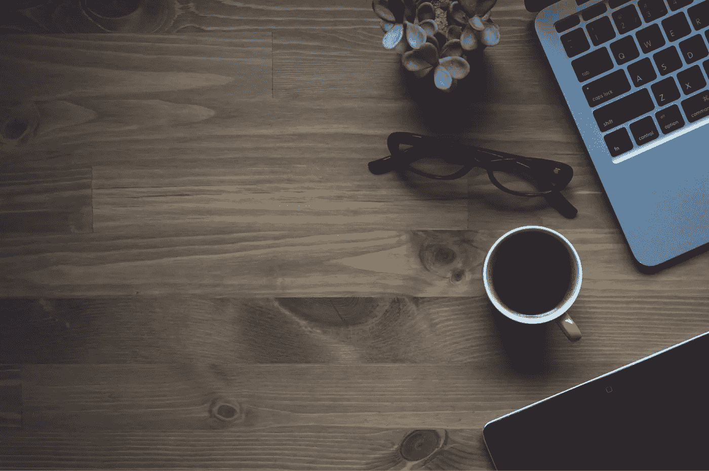
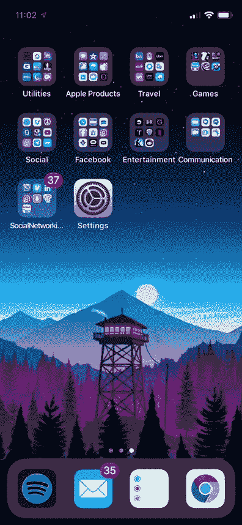
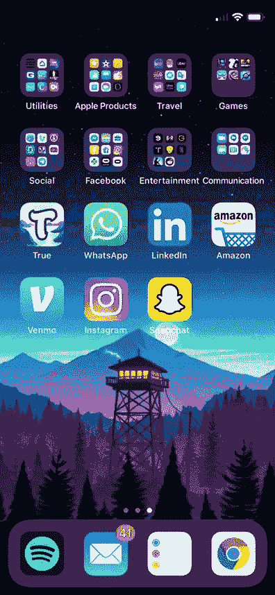
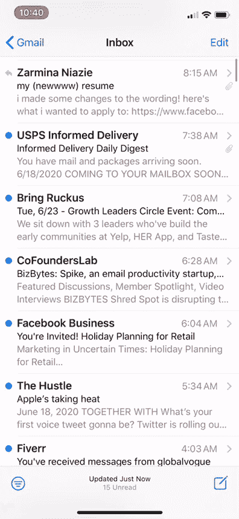

# 苹果生态系统的数字清理🍏

> 原文：<https://blog.devgenius.io/digital-decluttering-for-apple-ecosystem-6ad7604d5bfc?source=collection_archive---------12----------------------->

我在脸书公司有一份全职项目经理的工作，同时还兼职做产品经理，每周工作 10 个小时。

我使用 2018 年的 MacBook Pro 工作，最近从我的 iPhone 8 升级到了 iPhone 11。我还刚买了一台 iPad 来帮助我更有效地完成我的兼职项目。正如你所看到的，我对苹果诗已经根深蒂固了。就我个人而言，我更喜欢更便宜的平板电脑，但我认识到，如果我留在苹果生态系统中，我会更有效率(我还在亚马逊上发现了一个很好的入门级 iPad 交易——在撰写本文时，结账时优惠 70 美元)。

不幸的是，当从我的设备上撕下保护性塑料的光泽变得暗淡时，我意识到我实际上比以前效率更低了。所有的黑色镜子都跟着我，但我没有完成更多的工作。

我意识到我必须在我的数字空间里完全融入玛丽·近藤，我很乐意与你分享一些小技巧，来帮助你在你的数字世界里“点燃快乐”。

在开始之前，我想先说，这对我来说并不好玩。花了大半天的时间才把一切都整理好，我倾向于选择阻力最小的道路。但是让我告诉你，这是非常值得的！当我把所有东西都整理好的时候，我很少像现在这样有效率。

# **关闭 iPhone 上的徽章**

我是那种应用程序会为其创建徽章的人。我会进入任何显示徽章的应用程序，只是为了去掉那个烦人的红色数字标志(如果你愿意，请随意把我算作 DAU)。

夺回控制权至关重要。iOS 很容易关闭这些徽章，看不到这些连续不断的通知将帮助你专注于重要的事情，让你的生活更加愉快。额外的好处是，让电子邮件或 slack 等重要应用程序的徽章亮着，将有助于它们进入你的视野。按照以下步骤关闭徽章。

# **使用文件夹**

咄！这一点对任何在办公室工作过的人来说都是显而易见的，但也是大多数人难以坚持的一点。当我开始新工作时，我在桌面上创建了多个文件夹。我在手机上也有文件夹，在谷歌浏览器的书签栏上也有文件夹。但是就像其他事情一样，维护这些文件夹是一项完全不同的任务。

我会说有两种人。可以持续维护其文件夹的，以及需要定期进行深度清理的。我是后者。在意识到我的文件夹变得如此失控后，我花了几个小时清理东西。我还在我的日历上每 3 个月划出一个小时来确保我回去检查我的文件夹管理。

以下是一些帮助你保持更有条理的建议:

**在 Mac 和 Chrome 上:**

1.  使用树状文件夹系统或嵌套文件夹。这是文件夹管理最合理的方法。无限地将文件夹放在文件夹中的文件夹中可能会令人不安，但这是我们的大脑最容易理解复杂结构的方式——一系列相关的联系可以帮助你找到你发誓你曾经看过的一个文档。同样，勤奋是关键。
2.  与您的命名约定保持一致。不需要在文件名中添加任何信息，但是要确保如果你看到一个文件名，你将能够识别它的内容。

**在 iPhone 和 iPad 上:**

我们的应用程序往往没有文档多，所以 iOS 中不存在嵌套功能是有道理的。但这并不意味着你不应该使用文件夹来清理你的手机和 iPad 屏幕。以下是一些建议:

1.  在您的设备之间镜像文件夹名称和位置。我的 iPhone 和 iPad 有镜像坞站，这意味着我知道应用程序应该在哪里。
2.  为您下载的每个新应用程序找到一个位置。同样，勤奋是关键
3.  使用多重移动功能将应用程序快速组织到文件夹中。按住一个应用程序，直到它咯咯地笑，然后点击其他应用程序来组合它们的运动。见下文:

一个通用的提高工作效率的技巧是将所有令人分心的应用程序，如游戏和社交媒体，移到手机的第二个屏幕上。这样，当你不主动选择不被分散注意力时，你就没有在处理自我损耗——意志力消耗有限的能量，意志力就像肌肉，你可以耗尽它。如果你想了解更多关于这种现象的信息，我推荐以下几本书:

1.  罗伊·鲍梅斯特的《T2 的意志力》
2.  “[原子习惯](https://amzn.to/3i1eOfd)”作者詹姆斯·清

# **退订邮件**

如果你一直收到那些你忽略的公司的邮件，那么是时候退订他们的邮件列表了。如果你像我一样是一个零收件箱的人，每天选择一堆邮件并标记为已读是非常容易的(同样是阻力最小的路径)，但是你收到的每一个新的 ping 和通知只占用你一点点脑力，这一点点在一天、一周、一个月甚至一年的过程中累积起来(对不起，我控制不住自己:P)。

退订电子邮件可能需要一段时间。你可以点击 gmail 顶部的取消订阅来取消订阅很多邮件列表。对于其他人，你可能需要向下滚动到邮件底部，找到隐藏在内容中的按钮。这可能会令人沮丧，但不会整天收到你两年前访问过的公司的电子邮件，这是非常值得的。

# **截图——使用文件夹或使用木桩**

我不得不拍摄大量的工作截图，结果桌面上一片混乱，因为 Mac 默认所有的截图都在你的桌面上。

你可以按照 [**这个指南**](https://www.laptopmag.com/articles/change-macs-default-screenshot-directory) 来改变默认设置，让你所有的截图都到一个指定的持有者那里。

如果您觉得使用终端不舒服，可以使用 stacks 功能自动将它们组合在一起，这样您就不会在尝试遍历桌面时丢失光标。

# **使用谷歌驱动**

Google drive 是我的云存储选择，但你可以使用任何数量的选项，如 iCloud 或 Dropbox。这使得在旅途中查看和编辑文档变得更加容易。有很多次，我开始在笔记本电脑上处理一个文档，过了一会儿，我意识到我需要添加一些东西。我通常不会回到笔记本电脑上，回到工作模式，而是跳到我的手机或 iPad 上，随时添加我需要的任何内容，并在不同设备之间同步所有更改。

# **将你的列表应用程序停靠在 iPhone 和 iPad 上**

这是一个通用的生产力提示。将 Lists 应用程序或任何其他类似的应用程序停靠在你的手机和 iPad 上意味着你更有可能使用它。研究表明，把大任务分成小块有助于你完成更多。把像打扫房子这样的大任务分解成小任务，比如在你的清单应用程序中拿出垃圾，可以帮助你完成更多。一个额外的好处是，当你完成每一项任务时，它会给你提供一点点你需要继续下去的多巴胺。

我希望这些建议能在你的数字清理之旅中帮助你！