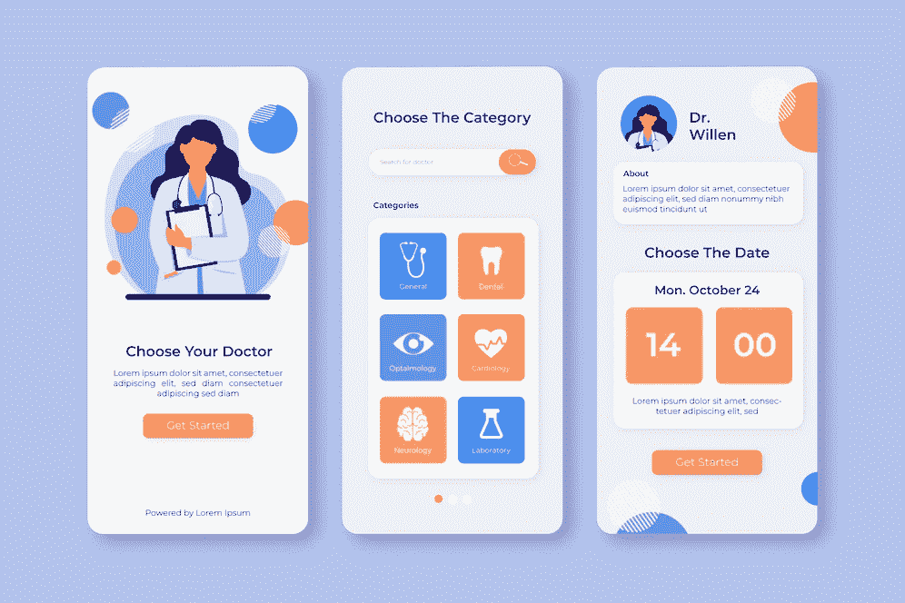
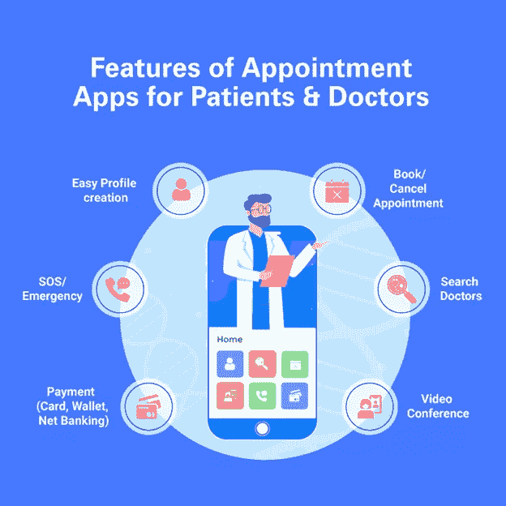
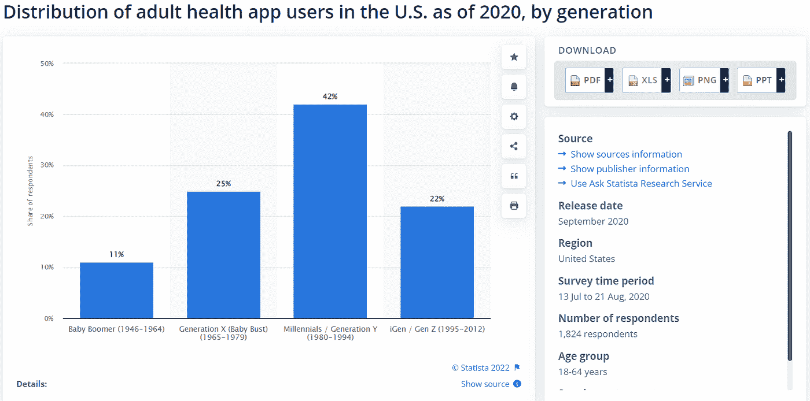
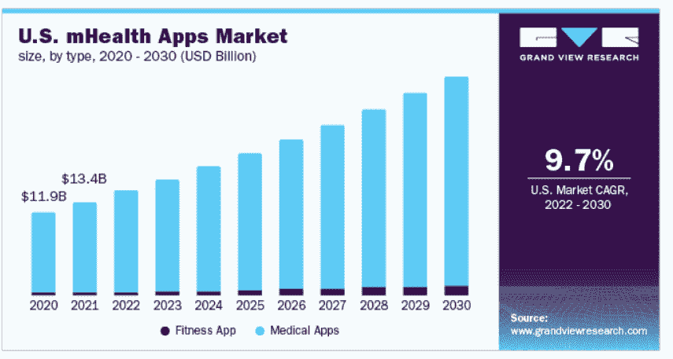

# 医疗保健的数字化转型:你需要知道的一切

> 原文：<https://blog.devgenius.io/digital-transformation-in-healthcare-everything-you-need-to-know-774d7e7f93d9?source=collection_archive---------22----------------------->

在过去的几年里，我们看待医疗保健的方式发生了巨大的变化。它正在不断地从一个主要关注物理治疗和症状管理的模式转变为一个包含预防性护理、早期检测和更全面的治疗方法的模式。

这种方法代表了医疗保健数字化转型的发展趋势，有可能在许多方面使患者和从业者受益。医疗保健机构现在可以利用新兴技术来提供护理，与患者互动，并改善他们的整体体验。

但是，你对医疗行业的数字化转型了解多少呢？请继续阅读，了解有关医疗保健数字化转型的一切，包括它的重要性以及它如何惠及您和您的实践。

# **什么是医疗保健行业的数字化转型？**

医疗保健的数字化转型是指帮助组织从传统的护理交付模式转向以患者为中心、基于价值的护理新模式的战略。它旨在提高质量，降低成本，并为提供者提供工具，为他们的患者提供更好的护理。

实现这些目标需要组织文化的转变，这对于一些组织来说可能是困难的。然而，通过适当的规划和支持，组织可以克服这些挑战。

医疗保健行业数字化转型的一些标准示例包括:

***数字化患者病历。***

***·使用远程医疗。***

***实施患者门户。***

***·使用在线预约工具进行预约。***

***·实施电子健康记录(EHRs)。***

***·利用移动设备帮助患者管理他们的护理，例如利用移动健康应用或可穿戴设备来监测生命体征。***

值得注意的是，每个组织都有自己独特的数字化转型定义。然而，这些是您将在大多数医疗保健组织中看到的一些常见主题。

# 它对病人有什么好处？

来源: [Statista —成人健康应用用户分布](https://www.statista.com/forecasts/1181592/share-of-us-health-app-users-by-generation)

随着数字化转型，患者正在体验更好的护理、更容易获得的医疗服务以及更好的财务管理。它提高了病人的满意度。以下是数字化转型为患者带来的医疗保健好处:

*   **个性化服务:**使用在线门户网站管理医疗服务的患者可以获得多种好处，包括访问他们的健康记录、预约安排和处方配药。他们还可以通过安全的信息服务与医生交流。
*   **轻松预约:**用户可以与当地诊所不在的医生进行虚拟预约。它为他们提供了更方便的医疗服务，无需长途跋涉或请假。
*   **在一个地方顺畅地交流所有数据:**患者可以使用安全的消息服务与医生交流任何健康相关的问题。他们还可以分享相关的病史、实验室结果、过敏和当前的药物治疗。这有助于医生提供更个性化的护理。
*   **快速配药:**患者可以在线配药，无需去药店。这有助于他们避免在药店排长队，这对老年人或残疾人来说非常不方便。
*   **更快的药物递送:**网上药店为大多数药物提供当天递送服务。这为患者获取药物提供了更方便的途径。这对那些住在农村地区或行动不便的人很有帮助。
*   **医疗保健财务的实时更新:**患者可以在线检查他们的健康保险状态，以确保他们获得所有必要服务的覆盖范围。他们还可以查看他们的索赔历史，以确保他们没有被多收任何治疗费用。这避免了财务问题，同时确保他们获得高质量的护理。

**相关文章:** [制造业数字化转型——行业新浪潮](https://www.pixelcrayons.com/blog/digital-transformation-in-manufacturing-benefits-and-trends/?utm_source=GP%2FMedium%2FDigital+Transformation+in+Healthcare&utm_medium=Digital+Trans+in+Manu%2FSR-AR&utm_campaign=SR-AR)

# 这对医生有什么好处？

来源:[大观研究](https://www.grandviewresearch.com/industry-analysis/mhealth-app-market)

医疗保健的数字化转型在多个方面让医生受益。它提高了效率，降低了成本，并提供了更好的病人护理。以下是医生在医疗保健领域利用数字化转型的四大优势:

*   **优化的工作流程:**医生可以花更少的时间在管理任务上，花更多的时间在病人身上。这有助于提高效率，降低成本，并提供更好的病人护理。患者受益于更短的预约等待时间和更方便的日程安排选项。
*   **快速访问患者的医疗保健数据:**电子病历还允许医生随时访问患者记录，即使他们不在现场。
*   **非常适合治疗不需要 F2F 会议的疾病:**数字健康工具非常适合治疗不需要面对面会议的疾病。例如，许多患有糖尿病等慢性疾病的患者可以通过使用在线工具来跟踪血糖水平、监控食物摄入量等来管理他们的疾病。
*   **节约:**数字健康工具也可以帮助降低成本&时间。例如，许多电子病历允许医生以电子方式开药，这降低了与开处方相关的成本。因此，医生可以花更少的时间来手动监控这些任务，让他们专注于更紧迫的事情。

# **医疗数字化转型的最新趋势**

围绕医疗保健数字化转型的趋势数不胜数。其中一些已经引起了全球轰动，比如可穿戴设备、电子健康记录等。然而，其他有趣的可能不太受欢迎，但会变得比我们想象的更普遍。

增强虚拟现实就是其中之一。当今最令人兴奋的技术进步之一是能够将信息叠加在真实世界的环境之上，例如医生的办公室。

主要的数字化转型医疗保健趋势包括:

*   在线预约:对于那些无法亲自去医生办公室的人，一些医生开始通过 Skype 或 FaceTime 提供虚拟预约，患者可以在家里或工作时通过视频聊天与医生交流。对于那些很难抽出时间去看医生的人，或者住得离医生办公室太远不方便频繁就诊的人来说，这是一个很好的选择。
*   **医疗保健可穿戴设备:**可穿戴技术是当今最显著的健康趋势之一。从智能手表到健身追踪器，可穿戴技术彻底改变了我们追踪健康的方式和医生监测病人的方式。
*   **EHRs:** 电子健康记录(EHR)是一种软件，允许医生以数字化方式管理其患者的健康记录。它们使医生更容易跟踪患者的病史，并允许医生、医院和其他医疗专业人员之间进行更有效的交流。
*   **患者门户:**许多医生和医院现在都提供患者门户，允许患者在线访问他们的医疗记录。它可以让他们查看测试结果、预约、重新配药等。，都是从家里或者工作。
*   **移动医疗:** Statista 预测，到 2025 年，移动医疗市场将超过 112 亿美元。它指的是越来越多的基于移动的医疗保健应用程序，这些应用程序使患者能够访问他们的医疗记录、检查结果、预约安排等。，从他们的智能手机或平板电脑。
*   **增强的&虚拟现实:**将信息叠加在真实世界环境之上的能力，比如你的医生办公室，是当今最令人兴奋的技术进步之一。医生已经在使用这些技术来帮助训练医学生。尽管如此，它们也可以用于其他应用，例如让患者看到损伤或疾病如何随着时间的推移而发展。
*   **基于区块链的记录:**2018 年，IBM 与几家医疗保健公司合作，创建了一个基于区块链的系统来存储医疗记录。这种类型的系统允许医生从任何位置访问患者表格，但也通过加密这些记录提供了额外的安全层。

**相关文章:** [银行业的数字化转型——你应该知道的一切！](https://www.pixelcrayons.com/blog/digital-transformation-in-banking/?utm_source=GP%2FMedium%2FDigital+Transformation+in+Healthcare&utm_medium=Digital+Trans+in+Banking%2FSR-AR&utm_campaign=SR-AR)

# **为什么企业应该投资医疗行业的数字化转型？**

据环球新闻网报道，从 2021 年到 2027 年，数字医疗保健市场的 CAGR 为 16.5。随着两位数的 CAGR 和数字工具的不断创新，这是企业投资医疗保健 it 解决方案的巨大机遇。

卫生部门正在利用顶级技术工具来改善其收入周期管理(RCM)、患者参与度、临床结果、管理效率和盈利能力。医疗保健提供商已经开始采用基于人工智能的解决方案，通过聊天机器人或基于历史数据分析的预测分析，帮助他们识别需要紧急护理或治疗的患者。

因此，数字医疗是一个极具吸引力的投资选择。[印度数字化转型咨询服务](https://www.pixelcrayons.com/digital-transformation?utm_source=GP%2FMedium%2FDigital+Transformation+in+Healthcare&utm_medium=Digital+Transformation+Services%2FSR-AR&utm_campaign=SR-AR)通过提高效率、减少浪费和提高医疗质量，帮助医院以更低的成本提供更好的医疗服务。