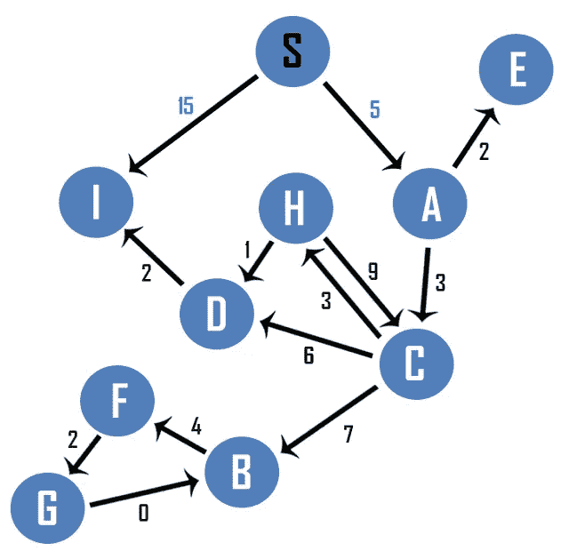

# Dijkstra 算法:单源最短路径直观解释

> 原文：<https://blog.devgenius.io/dijkstras-algorithm-single-source-shortest-path-visually-explained-a01bb413733a?source=collection_archive---------12----------------------->

ijkstra 的算法可以应用于有向或无向图，以找到从单个源到每个顶点的最短路径。它只能与非负的边权重一起使用。

生成一个表来跟踪到源顶点的距离。除了源本身，到每个顶点的距离被初始化为无穷大。另一个变量π用于跟踪到达指定顶点的前一个顶点。

Dijkstra 的算法从源 S 开始，按照字母顺序放松与其直接相连的边。要松弛的第一条边是从 S 到 A。A 的值从无穷大更新为 5，前一条边更新为 S。边 S-A 也被标记为完成。

接下来，放松边缘 S-I。到 I 的距离被更新为 15，并且前趋被标记为 S。边 S-I 被标记为已访问。来自 S 的所有出站边都已被访问，因此 S 被标记为已完成。

Dijkstra 算法从顶点 S 移动到顶点 A。选择顶点 A 是因为它是离源最近的、被访问过的顶点。重复相同的过程:从顶点 a 开始访问所有直接的出站顶点。这些顶点是 C 和 e。首先访问顶点 C，因为它是按字母顺序排列的。到 C 的距离被更新为 8，因为可以在 5 个单位内到达顶点 A，并且可以在另外 3 个单位内到达顶点 C。前任设置为 A，边 A-C 标记为已访问。

接下来访问顶点 E。到顶点 E 的距离被更新为 7 (S-A-5 + A-E-2 ),并且 E 的前身被更新为 A。由于来自 A 的所有出站边都已被访问，所以顶点 A 被标记为完成。

Dijkstra 的算法选择下一个最近的顶点。顶点 I 当前距离源 15 个单位，顶点 E 距离源 7 个单位，顶点 C 距离源 8 个单位。顶点 E 是最近的，所以接下来选择它。因为从顶点 E 没有出站边，所以它被标记为完成。

因为顶点 C 在 8 个单位之外，而顶点 I 在 15 个单位之外，所以接下来选择顶点 C。顶点 C 有 3 条出站边:C-B、C-D 和 C-H。顶点 B 最先被访问，因为它按字母顺序是列表中的下一个。到 B 的距离被更新为 15 (S-A-C-8 + C-B-7 ),并且前趋被设置为 C。边 C-B 被标记为已访问。

Dijkstra 的算法接下来访问顶点 D。到顶点 D 的距离被更新为 14 (S-A-C-8 + C-D-6 ),并且 D 的前身被设置为 C。边 C-D 被标记为已访问。

访问来自 C 的最后一条出站边，即边 C-H。到顶点 H 的距离被更新为 11 (S-A-C-8 + C-H-3 ),并且到 H 的前趋被更新为 C。由于已经从 C 访问了所有出站边，所以顶点 C 被标记为完成。

Dijkstra 的算法选择下一个顶点。顶点 I 距离源 15 个单位，顶点 B 距离源 15 个单位，顶点 D 距离源 14 个单位，顶点 H 距离源 11 个单位。因为顶点 H 是离源最近的顶点，所以接下来选择它。顶点 H 有两条出站边:H-C 和 H-D。首先访问顶点 C。顶点 C 已经可以在 8 个单位内到达，所以没有点可以在 20 个单位内到达。到顶点 C 的距离保持不变，边 H-C 被标记为已访问。

由于经由边 H-D 到顶点 D 的距离(12 个单位)比经由边 C-D 到顶点 D 的距离(14)短，所以到顶点 D 的距离被更新为 12；顶点 D 的前身被更新为 H。边 H-D 被标记为完成；因为已经访问了来自 H 的所有出站边，所以 H 被标记为完成。

Dijkstra 的算法通过检查所有可用的、未访问的顶点来选择下一个最近的边。15 个单位可以到达顶点 I，12 个单位可以到达 D，15 个单位可以到达 B。因为 D 是离源最近的顶点，所以选择 D。顶点 D 有一条向外的边 D-I，从 D 到顶点 I 的距离是 14。由于通过边 D-I 可以在 14 个单位内到达顶点 I，因此到顶点 I 的距离被更新为 14，并且前趋被设置为 D。边 D-I 被标记为已访问。顶点 D 的所有出站边都已被访问，并且顶点 D 被标记为完成。

Dijkstra 的算法检查所有可以访问的边。顶点 I 距离 14 个单位，顶点 B 距离 15 个单位。因为顶点 I 是离源最近的一个，所以接下来选择顶点 I。

顶点 I 没有出站边，因此顶点 I 被标记为完成。顶点 B 是源中唯一可用的、未被访问的边，因此接下来选择顶点 B。

顶点 B 有一条出站边:B-F，顶点 F 可以用 19 个单位
(S-A-C-B-15 + B-F-4)到达。到 F 的距离被更新为 19，并且前趋被设置为 B。边 B-F 被标记为已访问，并且因为没有来自顶点 B 的其他出站边，所以它被标记为完成。

顶点 F 是离源最近的顶点。顶点 F 有一条向外的边 F-G。顶点 G 可以用 21 个单位到达。到 G 的距离被更新为 21，并且 G 的前身被设置为 F。边 F-G 被标记为已访问，并且因为没有来自 F 的其他出站边，所以顶点 F 被标记为完成。

顶点 G 是最后一个未被访问的顶点。顶点 G 有一条向外的边，从 G 到 B。通过边 G-B 到顶点 G 的距离是 21 个单位。因为通过边 C-B 到 B 的距离比通过边 G-B 到 B 的距离更近，所以到 B 的距离保持为 15°。边 G-B 被标记为已访问，并且因为来自 G 的所有出站边都已被访问，所以顶点 G 被标记为完成。有向图中的所有顶点都被访问过了，那么 Dijkstra 的算法就完成了。下面的列表显示了从源到每个顶点的最短路径。

如果你喜欢你所读的，看看我的书，**算法的说明性介绍。**

**

*Dino Cajic 目前是 [LSBio(寿命生物科学公司)](https://www.lsbio.com/)、[绝对抗体](https://absoluteantibody.com/)、 [Kerafast](https://www.kerafast.com/) 、 [Everest BioTech](https://everestbiotech.com/) 、 [Nordic MUbio](https://www.nordicmubio.com/) 和 [Exalpha](https://www.exalpha.com/) 的 IT 负责人。他还是我的自动系统公司的首席执行官。他有十多年的软件工程经验。他拥有计算机科学学士学位，辅修生物学。他的背景包括创建企业级电子商务应用程序、执行基于研究的软件开发，以及通过写作促进知识的传播。*

*你可以在 [LinkedIn](https://www.linkedin.com/in/dinocajic/) 上联系他，在 [Instagram](https://instagram.com/think.dino) 上关注他，或者[订阅他的媒体出版物](https://dinocajic.medium.com/subscribe)。*

*阅读 Dino Cajic(以及 Medium 上成千上万的其他作家)的每一个故事。你的会员费直接支持迪诺·卡吉克和你阅读的其他作家。你也可以在媒体上看到所有的故事。*