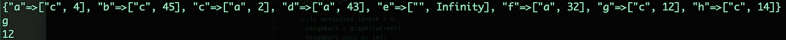
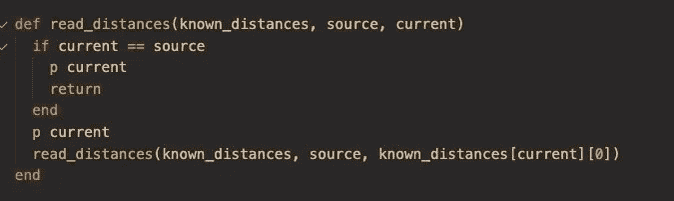

# Dijkstra 在 5 分钟内

> 原文：<https://blog.devgenius.io/dijkstras-in-5-minutes-4509dc981a8c?source=collection_archive---------4----------------------->

我想知道 Dijkstra 的不仅是记忆，而且我想能够在 5 分钟内编码。

原来这并不困难，也不复杂，一旦你得到了一般的想法，但更重要的是，尽管有一个疯狂的西方在线教程解释 Dijkstra 的花哨图形，我未能找到任何资源，实际上解释了如何将一般概念转化为代码。大多数 youtube 视频只是给你看一张图片，然后就不看了。

而且我看的很多教程都没能解释清楚这个算法的一些核心概念。

所以今天我在这里。我钻了几天，现在我可以在 5 分钟内编码 Dijkstra 的。如果在面试中出现这种情况，我会毫不犹豫地打破它，但更重要的是，我会向你展示如何用实际代码编写它。

# **代码**

假设我们有一个像这样的图。在这个特殊的图中，所有的边都是双向的，但这无关紧要。我可以通过从每个节点的列表中删除列出的边来表示单向边。没关系，算法还是会解决的。

## 这是 Ruby 中的算法

# 说明

首先，Dijkstra 从某个起始节点开始，寻找到图中所有其他节点的最短路径。

说 Dijkstra 的是一种在加权图中寻找最快路径的算法并不太准确，因为 Dijkstra 的实际上是在寻找到加权图中所有节点的最快路径。

我们需要编码的东西并不多。我们只需要一个已知距离的散列表、当前距离的整数和未访问节点的列表。

制作未访问节点的列表非常简单，可以用我们的 known_distances 散列表同时完成。

已知距离散列表对于图中的每个节点都有一个键，它将保留从源节点到自己的最短路径上先前访问过的节点。

这是算法运行后我的已知距离。

您可以看到，节点“b”在 45 度处引用了“c ”,从源到“b”的最短路径是通过“c”。我们不需要保存算法到达目标节点的节点列表，因为这隐含在这个哈希表中。

例如，您将看到节点“d”和“c”具有从“a”到“a”的最短路径

如果为所有节点维护这个表，那么我们到任何节点的最短路径可以通过一次一个先前的节点来递归地读取这个哈希表。

很简单。

# 但是我们如何生成 known_distances 散列表呢？

这个模块是我们算法的核心。在第一步中，我们制作了一个 known_distance 散列表，其中每个已知距离都是无穷大。

现在，我们需要从源节点开始，找出到每个邻居的距离。我们的源节点是“a”，它的邻居是“d”“c”“f”和“g”。

从那里，如果它们的距离小于已知距离(引用 known_distance 散列，将我们的当前距离添加到我们的图中的边长度，并将其保存在我们的 known _ distance 散列表中。

一旦为当前节点完成了这些，我们就在未访问列表中选择下一个最短距离，从未访问列表中删除我们刚刚访问过的节点，用新的当前节点更新我们的距离，并用新的当前节点再次循环。我们一直这样做，直到我们访问了列表中的所有节点。

## 让我们再复习一遍。

我们的第一个节点是“a”，它的邻居是“d”“c”“f”和“g”。我们只是循环遍历图中“a”的邻居列表，并将它们的距离添加到我们的已知距离中。第一次迭代后，我们的已知距离看起来像这样。

如我们所见，“c”“d”“f”和“g”的已知距离已经更新。我们的下一个电流将是“c ”,因为它是最低的，我们移动的距离将是到“c”的距离，也就是 2。

在我们对“c”重复了这个过程之后，我们将使用“c”的所有邻居来更新 known _ distances，并且它们最近的节点很容易设置，因为它将始终是当前节点。

如此等等，直到检查完所有节点。您可能已经注意到，节点“a”是通过距离为 4 的“c”到达的。这是因为它说，为了每个" a "，你必须旅行到" c "，然后回到" a "，但这是无关紧要的，因为这对我们来说无关紧要。

下图显示了我的 known_distance 在循环中的每一步是如何更新的。

非常好。我们如何读取到达任何给定节点的路径呢？

我们可以简单地选择一个目标。比如说“e ”,递归地记录访问它自己的节点路径，直到我们递归回到源节点。在这种情况下，源是“a”

现在我们有了。我可以将任何节点放入这个递归方法，它会记录从源到它的最短路径，如下所示:

下次见。