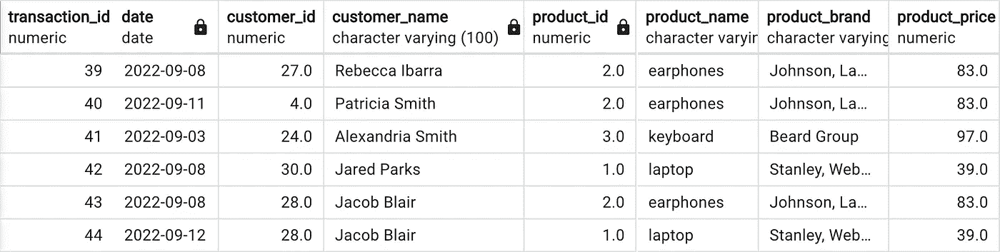
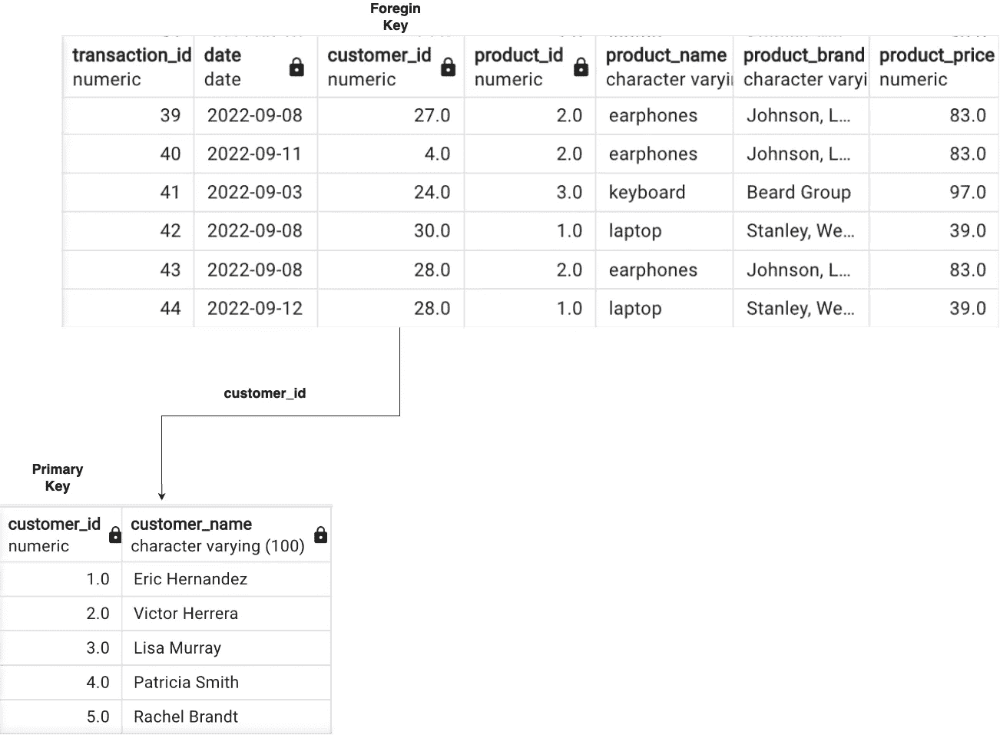
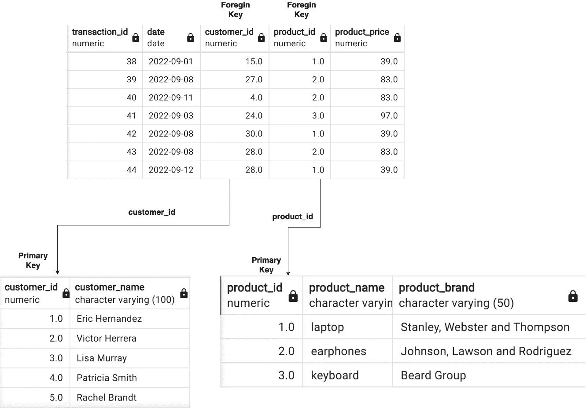

# 数据仓库中的维度建模

> 原文：<https://blog.devgenius.io/dimensional-modeling-in-data-warehouse-10f7c776d29a?source=collection_archive---------6----------------------->

照片 1.1

# 数据仓库定义

**数据仓库**有多种定义，目前最重要的两种定义是:

*   数据仓库的定义由 [Ralph Kimball](https://en.wikipedia.org/wiki/Ralph_Kimball)

> 数据仓库是专门为查询和分析而构建的事务数据的副本。

*   [比尔·恩门](https://en.wikipedia.org/wiki/Bill_Inmon)对数据仓库的定义

> 数据仓库是一个存储库(数据和元数据),它包含来自决策支持应用程序的不同来源的集成、清理和协调的数据，重点是在线分析处理。通常，数据是多维的、历史的、非易失的。

哪个更好？直到今天，我们也不知道哪种方法更好，似乎两者都是同样好的。如果你对比较这两种方法感兴趣，我鼓励你阅读这篇文章

# 维度建模

维度建模是数据仓库中组织数据的方法。

尺寸建模中最重要的步骤是识别**事实**和**尺寸。**

**事实**是公司的关键衡量指标，通常可以汇总*(总收入、产品销售量、日期、产品 id、客户 id)*

**维度**对事实进行分类，支持对数据进行分组或过滤*(产品名称、产品品牌、客户名称、客户国家)*

让我们看看下面的**销售表**示例:

表 1.1

## 问题

您如何将此表分为事实和维度？

## 解决办法

事实:

*   交易标识
*   日期
*   客户标识
*   产品标识
*   产品 _ 价格

尺寸:

*   客户名称
*   产品名称
*   产品 _ 品牌

但是我们为什么要这么做呢？答案很简单——**避免数据冗余。**

让我举例说明一下，我们还有一小部分**销售表**。

表 1.2

让我们关注列**customer _ name**—客户杰克博·布莱尔有两笔交易—他购买了笔记本电脑和耳机。在**销售表**中存储客户姓名，任何时候客户进行交易都是非常低效的，不是吗？最好创建名为 **customerDim** 的**维度**，并将所有分类客户数据保存在这里。完成后，列 **customer_name** 可以很容易地从销售表中删除。

这就是它现在的样子:

太好了！但是我们可以做得更好。现在让我们关注列 **product_name-** 中的重复值。我们可以看到耳机倾向于出现 3 次，笔记本电脑出现 2 次。

同样，将它存储在销售表中是非常低效的，那么我们该怎么办呢？

在我们做任何事情之前，看看列**产品品牌，**，它也包含重复。

由于**产品名称**和**产品品牌**属于描述**产品**的相同分类特征，我们将它们分组到下一个维度的一个表中！姑且称之为 p**product dim 吧。**现在**产品名称**和**产品品牌**列可以很容易地从销售表中删除。

快速浏览我们的桌子:

上面实现的模式称为**星型模式** ( *一个或多个事实表引用任意数量的维度表*)，是**雪花模式**的特例。

# 摘要

正如你所看到的，维度建模是本能的，当然我上面提出的问题很简单，但在我看来，它完美地反映了本质。

# 哪里走得更远？

以下是一些绝对值得一看的资料来源:

Ralph Kimball 的《数据仓库工具包:维度建模完全指南》

[数据仓库——尼古拉·舒勒的终极指南](https://www.udemy.com/course/data-warehouse-the-ultimate-guide/)伟大历程