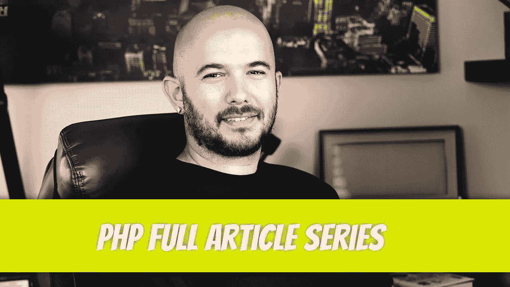

# PHP —完整的文章系列

> 原文：<https://blog.devgenius.io/dinophp-full-article-series-19387c2dc4f?source=collection_archive---------11----------------------->

当我通读基于教程的文章时，总会有这样一种想法:对于新开发人员来说，这还不够简单。有一些是为高级开发人员过渡到新语言而准备的，但是看起来大多数教程都是为他们准备的。即使它们看起来很简单，对新开发人员来说也太快了。有几个明显的例外，但大多数遵循这一趋势。

另一个想法是，这个人想要展示他们的知识。这没什么不对。不幸的是，新的开发者又一次遭殃了。

我想打破这种方式，创造一个复杂性逐渐增加的系列。它还没有完全完成，也许永远也不会完成。每当我创建一篇关于 PHP 的文章时，它都将基于以前的文章，除非新的转换是绝对必要的。

不爱看书？每篇文章底部都有附带的视频。

不确定是否应该花时间通读这个系列？让我给你推荐一篇文章，从下面的文章中挑选: [PHP — P42:回调函数](/php-7-x-p42-callback-functions-6552477f2a87)。这应该让你知道你能期待什么。

为什么选择 PHP？这是 Laravel 的基础，一旦 PHP 系列足够完整，我将重点介绍它。

这是我目前掌握的情况。我希望你的编程之旅取得成功。

[PHP — P1:基本语法](/php-7-x-p1-basic-syntax-2e8ca5265e9c)

[PHP — P2:评论](/php-7-x-p2-comments-8e69c0b567e4)

[PHP — P3:变量介绍](/php-7-x-p3-variables-intro-a83ac8eb9efb)

[PHP — P4:基本布尔函数](/php-7-x-p4-basic-booleans-40cf0c0140e8)

[PHP — P5: Truthy Bools](/php-7-x-p5-truthy-bools-9e8917a26943)

[PHP — P6:整数](/php-7-x-p6-integers-d003609694b1)

[PHP — P7:浮点型/双精度型](/php-7-x-p7-floats-doubles-cc29425f313e)

[PHP — P8:字符串](/php-7-x-p8-strings-6903ca92727b)

[PHP — P9:简单数组](/php-7-x-p9-simple-arrays-4ef56bed0d8a)

[PHP — P10:关联数组](/php-7-x-p10-associative-arrays-e19f11edc3ff)

[PHP — P11:多维数组](/php-7-x-p11-multidimensional-arrays-e755da44eb68)

[PHP — P12:变量](/php-7-x-p12-variables-5eef8f90ee4b)

[PHP — P13:可变变量](/php-7-x-p13-variable-variables-472cff7875e8)

[PHP — P14:常量](/php-7-x-p14-constants-54f58d89c753)

[PHP — P15:赋值运算符](/php-7-x-p15-assignment-operator-15c5d252a2ee)

[PHP — P16:算术运算符](/php-7-x-p16-arithmetic-operators-a00aaa0d4c0b)

[PHP — P17:比较运算符](/php-7-x-p17-comparison-operators-760156416f4e)

[PHP — P18:递增和递减运算符](/php-7-x-p18-increment-and-decrement-operators-98422028d1a5)

[PHP — P19:逻辑运算符](/php-7-x-p19-logical-operators-27441c69e060)

[PHP — P20:字符串运算符](/php-7-x-p20-string-operator-6fc4bd0ea483)

[PHP — P21:数组运算符](/php-7-x-p21-array-operators-fb47f81858a0)

PHP — P22:速记符

[PHP — P23:运算符优先级](/php-7-x-p23-operator-precedence-c7584f9dd79f)

[PHP — P24: If 语句](/php-7-x-p24-if-statement-65ca5599f200)

[PHP — P25: else 语句](/php-7-x-p25-else-statement-71882c6f0687)

[PHP — P26: elseif 语句](/php-7-x-p26-elseif-statement-adfa41f399)

[PHP — P27:三元运算符](/php-7-x-p27-ternary-operator-a625bb7fa311)

[PHP — P28: Switch 语句](/php-7-x-p28-switch-statement-29cfa65ce901)

[PHP — P29: While 循环](/php-7-x-p29-while-loops-2f178ae3d747)

[PHP — P30: Do While 循环](/php-7-x-p30-do-while-loop-e70777a17ee3)

[PHP — P31: For 循环](/php-7-x-p31-for-loop-68724b49b861)

[PHP — P32: Foreach 循环](/php-7-x-p32-foreach-loop-f38b88249e76)

[PHP — P33: Break 语句](/php-7-x-p33-break-statement-13ad4eeca654)

[PHP — P34: Continue 语句](/php-7-x-p34-continue-statement-272966aaedfa)

[PHP — P35:用户自定义函数](/php-7-x-p35-user-defined-functions-c6e23a7309c5)

[PHP — P36:函数参数](/php-7-x-p36-function-arguments-f0b4c131ad1b)

[PHP — P37:函数返回值](/php-7-x-p37-functions-returning-values-ed1928c4ee73)

[PHP — P38:变量函数](/php-7-x-p38-variable-functions-bd8f0ab72dfb)

[PHP — P39:匿名函数](/php-7-x-p39-anonymous-functions-75f6f99fa571)

[PHP — P40:使用关键字](/php-7-x-p40-use-keyword-37d8e7df9138)

[PHP — P41:箭头函数](/php-7-x-p41-arrow-functions-68a68b2debc6)

[PHP — P42:回调函数](/php-7-x-p42-callback-functions-6552477f2a87)

PHP — P43:对象和类介绍

[PHP — P44:类属性](/php-p44-class-properties-277c7c17b74b)

[PHP — P45:类常量](/php-p45-class-constants-4a93c49b917f)

[PHP — P46:方法](/php-p46-methods-513072ed48cf)

[PHP — P47: $this 关键字](/php-p47-this-keyword-f7397e560949)

[PHP — P48:类型声明](/php-p48-type-declarations-47114a7a0e0b)

[PHP — P49:构造函数](/php-p49-constructors-5956272de3bc)

[PHP — P50:析构函数](/php-p50-destructors-da52a94cbb0)

[PHP — P51:可见性修饰符](/php-p51-visibility-modifiers-b277591e7c0b)

[PHP—P52:getter 和 setter](/php-p52-getters-and-setters-55ed07ecc0bc)

[PHP — P53:类继承](/php-p53-class-inheritance-e743de094a06)

[PHP — P54:继承链](/php-p54-inheritance-chain-3cb62edcb373)

[PHP — P55:文件分离](/php-p55-file-separation-c3e848295e8d)

[PHP — P56:方法覆盖](/php-p56-method-overriding-6ae3784b42c9)

[PHP — P57:范围解析操作符](/php-p57-scope-resolution-operator-19c50ca607d4)

[PHP — P58:静态关键字](/php-p58-static-keyword-da0b92d45b3c)

[PHP — P59: Self 关键字](/php-p59-self-keyword-ae01f24e73b1)

[PHP — P60:抽象类](/php-p60-abstract-classes-e7912ee3be7c)

[PHP — P61:接口](/php-p61-interface-dcf5b00b803c)

[PHP — P62:特性](/php-p62-traits-6b55c6f73659)

[PHP — P63:对象作为参数。依赖注入和多态介绍](/php-p63-objects-as-arguments-dependency-injection-and-polymorphism-intro-2155d0391d04)

PHP — P64:匿名类

[PHP — P65:最终关键字](/php-p65-final-keyword-420a51344e)

[PHP — P66:对象比较](/php-p66-object-comparison-a2e84a8e3e13)

[PHP — P67:父构造函数](/php-p67-parent-constructor-ec8e41b9a6a9)

[PHP — P68:名称空间](/php-p68-namespaces-1dd68050d73d)

[PHP — P69:定义名称空间](/php-p69-defining-namespaces-5a8e0a4bfdc0)

迪诺·卡伊奇目前是 [LSBio(生命周期生物科学公司)](https://www.lsbio.com/)、[绝对抗体](https://absoluteantibody.com/)、 [Kerafast](https://www.kerafast.com/) 、[珠穆朗玛生物](https://everestbiotech.com/)、[北欧 MUbio](https://www.nordicmubio.com/) 和 [Exalpha](https://www.exalpha.com/) 的 IT 主管。他还担任我的自动系统的首席执行官。他有十多年的软件工程经验。他拥有计算机科学学士学位，辅修生物学。他的背景包括创建企业级电子商务应用程序、执行基于研究的软件开发，以及通过写作促进知识的传播。

你可以在 [LinkedIn](https://www.linkedin.com/in/dinocajic/) 上联系他，在 [Instagram](https://instagram.com/think.dino) 上关注他，[订阅他的博客](https://www.dinocajic.com/)，或者[订阅他的媒体出版物](https://dinocajic.medium.com/subscribe)。

阅读 Dino Cajic(以及 Medium 上成千上万的其他作家)的每一个故事。你的会员费直接支持迪诺·卡吉克和你阅读的其他作家。你也可以在媒体上看到所有的故事。