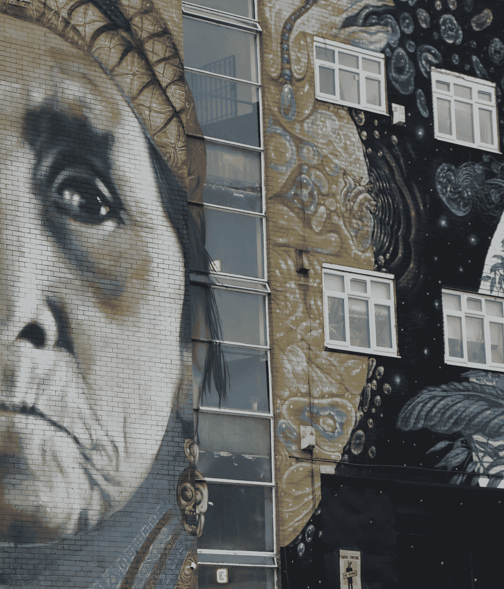

# 房间里的恐龙——数字弃儿的故事

> 原文：<https://blog.devgenius.io/dinosaurs-in-the-room-a-story-of-digital-outcasts-77ac04a56ca5?source=collection_archive---------16----------------------->

> 人类只做了三件大事；分裂原子，在月球上行走，连接每个人

今天的孩子简直不能相信曾经没有互联网。没有直播。没有脸书。甚至我想起来都觉得毛骨悚然。

互联网可以说是我们做过的最重要的事情。有了它，**我们挑战了人类社会的本质**，它几千年来从未受到挑战。如果网络空间有纪念牌匾，第一个应该是“在 1991 年 8 月 6 日这一天，世界被永远改变了”。

从未听说过互联网的人要么是:

a.通过时间扭曲从意外坠落中恢复

b.生活在亚马逊雨林

但这些人正是本文所要讨论的——数字化的余波(不是时间旅行者)，那些无论是选择还是偶然被留下的人。

亚马逊雨林是世界上最大的雨林，也是地球上生物多样性最丰富的地区。它是超过 16，000 个物种的家园，不出所料，包括**人类**。

简单地说，有一群人(整个社区)不使用互联网。他们没有受过教育，他们是孤立的(也就是说，他们没有离开亚马逊)，更重要的是，**实际上没有接入网络**。

大多数美国人和欧洲人都习惯了超快的网速和无限制的使用，但 2019 年只有 21%的非洲人在一定程度上使用了互联网。这仍然高于亚马逊部落中 3%的人拥有电脑。

诚然，像脸书和谷歌这样的大公司已经开始努力实现更广泛的互联网接入，但这些还没有覆盖到偏远地区的绝大多数人。

每个人都知道当你离线时会发生什么。错过的约会。低效的工作。生产率下降了。更不用说令人麻木的无聊，可能还有抑郁。

> 离线真糟糕。

令人高兴的是，一些进步的亚马逊人(没有双关语)正在发展他们的技术技能。他们正在证明，拯救家园的战斗不是靠弓箭和长矛赢得的，而是靠执行良好的社交媒体活动(可能还有编码)。

但是他们需要你的全力支持。你可以向像 a4ai 这样的组织捐款。见鬼，甚至在社交媒体上传播消息也有帮助。让每个人都上网，一步一步来。