# 在 Windows 10 上禁用 Windows Defender、Windows Defender 防火墙、Windows Update

> 原文：<https://blog.devgenius.io/disable-windows-defender-windows-defender-firewall-windows-update-on-windows-10-571cb75eb374?source=collection_archive---------5----------------------->

Windows defender 是我们安装 Windows 10 操作系统时就已经存在的默认杀毒软件。以应对恶意软件、病毒、蠕虫等。虽然 Windows Defender 相当不错，也相当可靠，但是也有我们想暂时甚至永久关闭 Windows Defender 的情况。以下是禁用 windows defender 的方法。

# 禁用 Windows Defender

*   打开 Windows 安全菜单，要打开它，请在搜索栏中键入

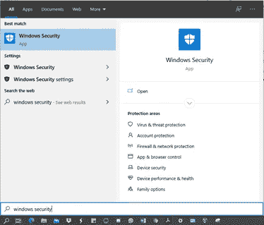

*   出现后，在 Windows 安全部分选择**病毒&威胁防护**
*   之后会出现如下图所示的画面，然后选择**病毒&威胁防护**设置

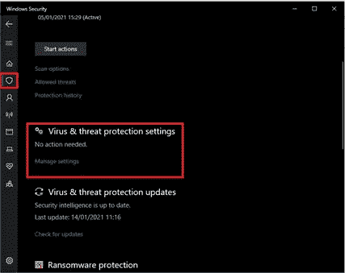

*   然后关闭实时防护，如图所示

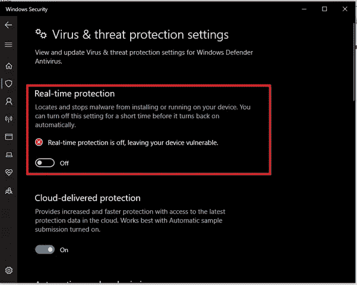

*   则 Windows Defender 不再处于活动状态。

要再次激活它，你只需要做与上述相同的步骤，但不要忘记在第 4 节将**实时保护**从关闭改为开启。

# 禁用 Windows Defender 防火墙

了解 Windows 防火墙本身是 Windows 提供的应用程序或软件，用于为计算机系统本身提供保护。保护是以检测网络的形式，不管网络是否安全。如果网络被认为是安全的，Windows 防火墙将自动允许它。另一方面，如果网络被认为是不安全的，它将被防火墙阻止。因为所有通信网络都必须穿过防火墙，所以防火墙的功能如下:

1.  防火墙只允许授权流量或管理员授权的流量。
2.  防火墙作为控制器，监督网络中的数据流。
3.  防火墙调节、过滤和控制允许访问受保护专用网络的数据流量

也许在某些情况下，我们希望出于某些目的关闭防火墙。以下是如何禁用 Windows Defender 防火墙。

*   打开**控制面板**

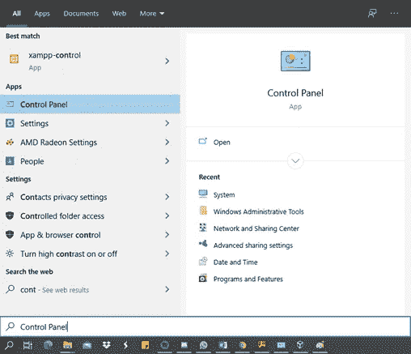

*   进入控制面板后再点击**系统和安全**

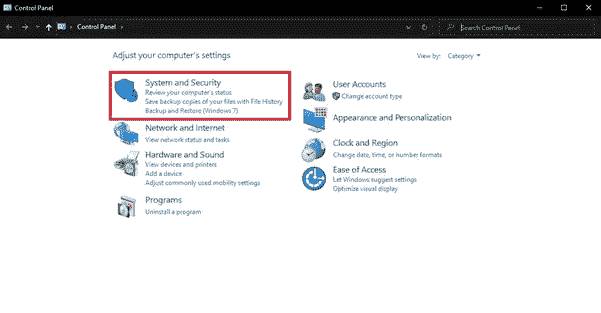

*   选择 **Windows Defender 防火墙**

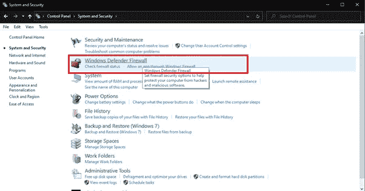

*   在左侧栏中选择**打开或关闭 Windows Defender 防火墙**

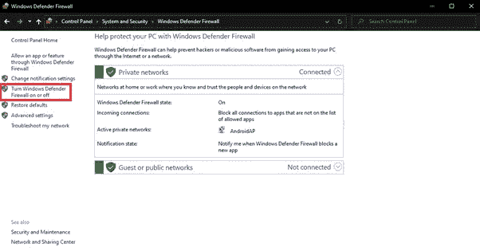

*   在定制中，在**专网设置**和**公网设置**中选择关闭

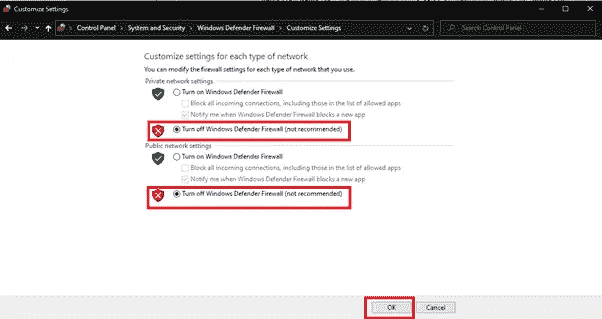

*   然后选择确定保存更改

# 禁用 Windows Update

Windows update 是一项由 Microsoft 提供的服务，用于提供 Windows 操作系统及其组件的最新功能和更新。这项服务在修复现有缺陷、提高性能甚至添加新功能方面做得非常好。但是，由于新的应用程序或功能与现有硬件不兼容，Windows Update 导致操作系统崩溃的情况并不少见。当然这些事情必须被阻止，为了阻止这一点，我们关闭了 windows update。有许多方法可以关闭 Windows Update 服务。其中一个使用控制面板中的禁用功能。这种方法非常简单，因为没有太多的命令要做。以下是禁用 Windows Update 的方法。

*   打开**控制面板**

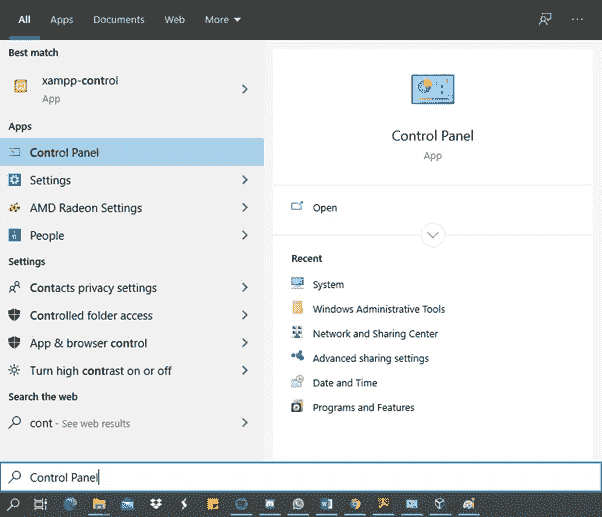

*   然后选择**系统和安全**

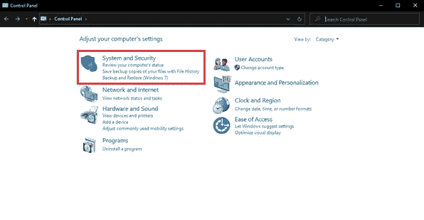

*   进入系统和安全菜单后，找到并选择**管理工具**

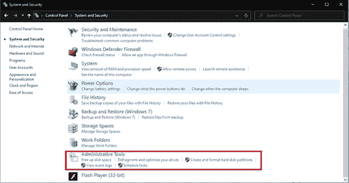

*   打开管理工具菜单后，然后

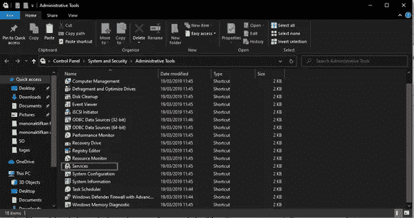

*   找到名为 **Windows Update** 的菜单，然后双击它进入 **Windows Update 属性**

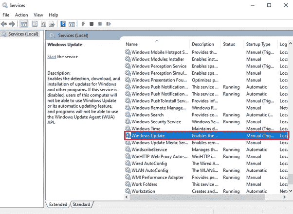

*   如果已经打开，则只需将**启动类型**选项改为**禁用**并点击**服务状态**选项上的停止按钮

本文已在印尼文[这里](https://agungprabowo8800.medium.com/menonaktifkan-windows-defender-windows-defender-firewall-windows-update-pada-windows-10-a614e501f583)发表

谢谢你。