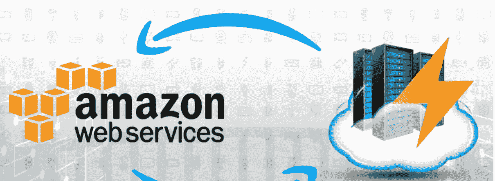
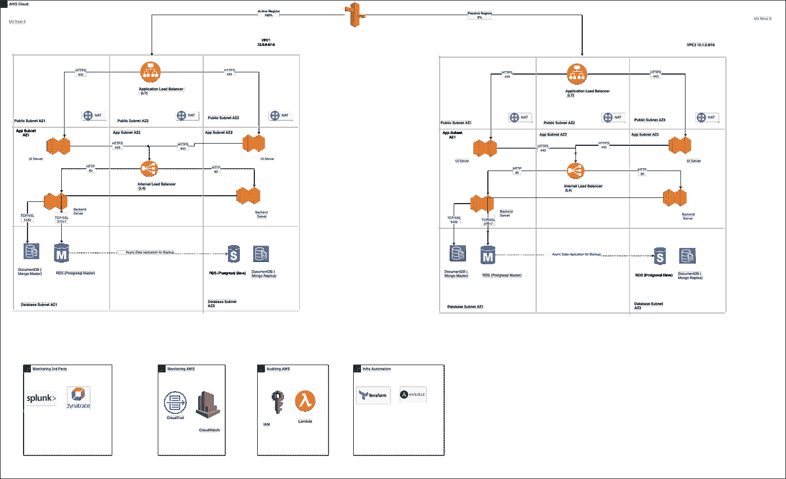

# AWS 云上的灾难恢复—构造块

> 原文：<https://blog.devgenius.io/disaster-recovery-on-aws-cloud-building-blocks-e013bffd6244?source=collection_archive---------8----------------------->

这篇博客是我们从零开始讨论**云**概念的系列文章的一部分，面向的是入门知识有限的读者。本文属于*中级*系列，因为它涉及在 AWS 云上构建**高可用性和灾难恢复**构建块。

云系列中的一些早期博客如下。

[**GCP 大查询第一 Python 连接器**](/gcp-big-query-writing-my-first-python-connector-1140b022b88a)[**Azure 存储认证**](/navigating-azure-storage-authentication-options-using-a-java-client-d8ab31e12308)[**Azure Cosmos RBAC 认证**](/azure-cosmos-db-rbac-authentication-using-a-java-client-720b20c637fe)

# 高可用性和灾难恢复。

构建具有正确正常运行时间 SLA 的分布式系统的关键原则之一是拥有一个健壮的高可用性和灾难恢复计划。

**高可用性**通过在称为 [**可用性区域的冗余区域内部署块中托管基础架构组件的多个副本来消除单点故障。**](https://docs.aws.amazon.com/AWSEC2/latest/UserGuide/using-regions-availability-zones.html)

灾难恢复通过在两个区域复制整个部署拓扑来消除完全区域性故障的停机时间，以确保满足正确的 SLA**RPO(恢复点目标)**和 **RTO(恢复时间目标)**。基于上述部署，拓扑可分为以下几类

*   **主动部署—** 零停机时间但有数据丢失风险的系统。 ***Ex 电子商务门户网站。***
*   **主动被动部署—** 系统不会丢失数据，但在发生区域性灾难时会影响可用性。 ***Ex 银行系统。***

# 三层应用程序

出于本博客的目的，我们将总体技术讨论限制在三层主动-被动系统

*   **前端层—** 具有 UI 资产( ***静态和非静态*** )，该层服务于客户交互所需的业务流程页面
*   **后端层—** 无状态微服务受到关注点分离的阻碍 *(* ***)读取与写入功能*** *)* ，这一层充当业务流背后核心逻辑的主干。
*   **数据库层—** 该层充当所有静态数据(关系型与非关系型)的主干，由后端层通过 ***模型和视图进行访问。***

# 多区域部署拓扑

**详细查看—**[https://github . com/Amit 894/diagrams/blob/main/AWS % 20 deployment % 20 topology/3% 20 tier . png](https://github.com/amit894/diagrams/blob/main/AWS%20Deployment%20Topology/3%20Tier.png)

# AWS 服务

*   [**应用负载均衡器**](https://docs.aws.amazon.com/elasticloadbalancing/latest/application/introduction.html)**—**L7 负载均衡器，可用于配置 HTTP 规则，如 ***url 重定向、请求头修改等***
*   [**经典负载均衡器**](https://docs.aws.amazon.com/elasticloadbalancing/latest/classic/introduction.html)**—**L4 负载均衡器，工作在 TCP 层，用于设置端口转发和其他基本网络规则。
*   [**EC2 实例**](https://aws.amazon.com/ec2/) **—** 计算实例，用于在 UI 和后端微服务层部署。
*   [**亚马逊文档 DB (Mongo)**](https://docs.aws.amazon.com/documentdb/latest/developerguide/what-is.html) **—** 一个 NoSQL 数据库，用于以键值对的方式存储非关系数据。
*   [**【亚马逊 RDS(postgres)**](https://aws.amazon.com/rds/postgresql/)**—**一个 SQL 数据库，用于存储关系数据，可以通过视图和表进行查询
*   [**AWS cloud watch**](https://aws.amazon.com/cloudwatch/)**—**一种事件驱动的 AWS 服务，用于监控在整个 AWS 帐户中运行的所有 AWS 组件的健康状况。
*   [**AWS cloud Trail**](https://docs.aws.amazon.com/awscloudtrail/latest/userguide/cloudtrail-user-guide.html)**—**AWS 帐户中所有审计和运营事件的跟踪，用于构建生产可见性所需的警报。
*   [**AWS VPC**](https://docs.aws.amazon.com/vpc/latest/userguide/what-is-amazon-vpc.html)**—**公有云中的私有地址空间，使用可配置的 [**IP 空间托管所有 AWS 服务。**](https://en.wikipedia.org/wiki/IP_address)

# VPC 设置

3 个可用性区域中的 9 个子网

## 公共子网

*   `Components`:应用负载均衡器和 NAT 网关
*   `Routing`:VPC 内部通过路由表和互联网网关进行公共流量传输

## 应用子网

*   `Components`:经典负载平衡器和虚拟机。
*   `Routing`:VPC 内部直通路由表。

## 数据库子网

*   `Components`:自动气象站文件数据库和自动气象站 RDS。
*   `Routing`:VPC 内部直通路由表。

# 网络设置

## 应用程序负载平衡器(L7)

*   `Security Group`:允许来自互联网的流量通过端口 443。
*   `Communication Protocol` : HTTPS
*   `SSL`:强制

## 前端虚拟机

*   `Security Groups:`允许来自**端口 443 上的应用负载平衡器的流量。**
*   `Communication Protocol` : HTTPS
*   `SSL`:强制

## 内部负载平衡器(L4)

*   `Security Groups:`允许来自前端虚拟机的流量通过**端口 443。**
*   `Communication Protocol` : HTTPS
*   `SSL`:强制

## 后端虚拟机

*   `Security Groups:`允许来自**端口 80 上的内部负载平衡器的流量。**
*   `Communication Protocol` : HTTPS
*   `SSL`:强制

## 亚马逊文档数据库(MangoDB)

*   `Security Groups:`允许来自后端虚拟机的流量通过**端口 27017。**
*   `Communication Protocol` : TCP
*   `SSL`:首选

## 亚马逊 RDS(邮政)

*   `Security Groups:`允许来自后端虚拟机的流量通过**端口 5432。**
*   `Communication Protocol` : TCP
*   `SSL`:首选

# 结论

给定的文档仅概述了在 AWS 云中的两个区域实现全功能主动-被动部署。为了进一步理解其中的复杂性，我们将进一步深入探讨未来的博客主题。

*如需反馈，请留言至****Amit[dot]894[at]Gmail[dot]com****或联系*[*https://about.me/amit_raj*](https://about.me/amit_raj)*的任何链接。*