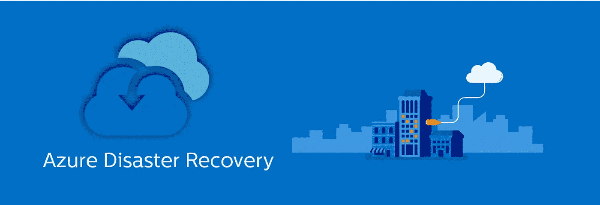
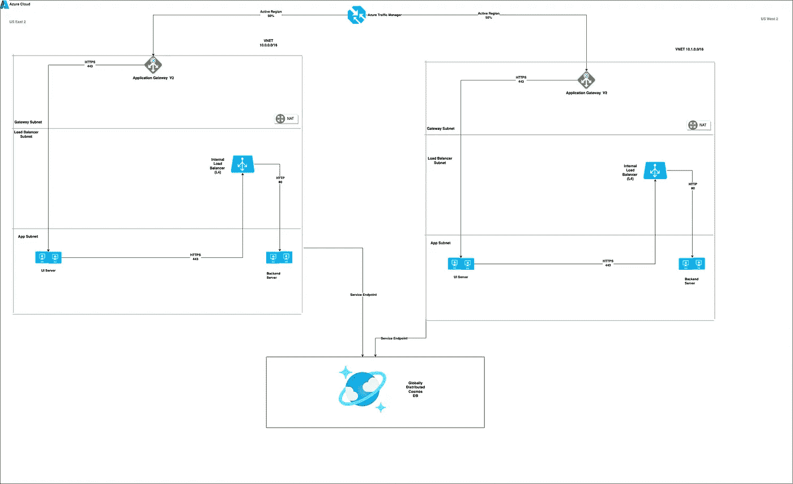

# Azure 云上的灾难恢复—构造块

> 原文：<https://blog.devgenius.io/disaster-recovery-on-azure-cloud-building-blocks-6ff826adbc8b?source=collection_archive---------12----------------------->

这篇博客是我们从零开始讨论**云**概念的系列文章的一部分，面向的是入门知识有限的读者。本文属于*中级*系列，因为它涉及在 Azure Cloud 上构建**高可用性和灾难恢复**构建块。

云系列中的一些早期博客如下。

[**AWS 云上的灾难恢复**](/disaster-recovery-on-aws-cloud-building-blocks-e013bffd6244)[**Azure 存储认证**](/navigating-azure-storage-authentication-options-using-a-java-client-d8ab31e12308)[**Azure 宇宙 RBAC 认证**](/azure-cosmos-db-rbac-authentication-using-a-java-client-720b20c637fe)

# 高可用性和灾难恢复

构建具有正确正常运行时间 SLA 的分布式系统的关键原则之一是拥有一个健壮的高可用性和灾难恢复计划。

**高可用性**通过在称为 [**可用性区域的冗余区域内部署块中托管基础架构组件的多个副本来消除单点故障。**](https://docs.microsoft.com/en-us/azure/availability-zones/az-overview)

灾难恢复通过在两个区域复制整个部署拓扑来消除完全区域性故障的停机时间，以确保满足正确的 SLA**RPO(恢复点目标)**和 **RTO(恢复时间目标)**。基于上述部署，拓扑可分为以下几类

*   **主动部署—** 零停机时间但有数据丢失风险的系统。 ***Ex 电子商务门户网站。***
*   **主动被动部署—** 系统不会丢失数据，但在发生区域性灾难时会影响可用性。 ***Ex 银行系统。***

# **与 AWS 的区别**

与 **AWS** 不同，只有少数地区和服务支持这里 **所列的 [**可用区。**此外，在通过 UI 或自动化创建这些 Azure 服务时，服务的可用性区域的选择是由 Azure 内部驱动的，而不是用户。](https://docs.microsoft.com/en-us/azure/availability-zones/az-region)**

所有基于区域冗余的 Azure 服务分为以下几类-

*   **分区服务—** 针对严格的延迟和性能要求部署到单个分区的服务。 ***前 Azure 应用网关 V2，Azure 虚拟机***
*   **区域冗余—** 跨区域复制服务，以提高容错能力。***Ex- Azure SQL、Azure KeyVault、Azure EventHub 等***
*   **始终可用—** 在全球范围内可用的服务，能够应对区域范围和地区范围的中断 ***例如。Azure 流量管理器、Azure 活动目录等***

此外，Azure 应用程序的数据库层位于虚拟网络之外，并作为防火墙规则的一部分通过 [**服务端点**](https://docs.microsoft.com/en-us/azure/cosmos-db/how-to-configure-vnet-service-endpoint) 进行保护。

# 三层应用程序

出于本博客的目的，我们将总体技术讨论限制在三层主动-主动系统

*   **前端层—** 带有 UI 资产( ***静态和非静态*** )，该层服务于客户交互所需的业务流程页面
*   **后端层—** 无状态微服务受到关注点分离 *(* ***读与写功能*** *)* ，这一层充当业务流背后核心逻辑的主干。
*   **数据库层—** 这一层充当所有静态数据(关系型与非关系型)的主干，由后端层通过 ***模型和视图进行访问。***

# 多区域部署拓扑

**Azure 上简单的 3 层部署拓扑**

**详细查看—**[https://github . com/Amit 894/diagrams/blob/main/AWS % 20 deployment % 20 topology/3% 20 tier . png](https://github.com/amit894/diagrams/blob/main/AWS%20Deployment%20Topology/3%20Tier.png)

# Azure 服务

*   [**应用网关**](https://docs.microsoft.com/en-us/azure/application-gateway/overview)**—**L7 负载均衡器，可用于配置 HTTP 规则，如 ***url 重定向、请求头修改等***
*   [**Azure 负载均衡器**](https://docs.microsoft.com/en-us/azure/load-balancer/load-balancer-overview)**—**L4 负载均衡器，工作在 TCP 层，用于设置端口转发和其他基本网络规则。
*   [**Azure 虚拟机**](https://azure.microsoft.com/en-us/services/virtual-machines/linux/) **—** 计算实例，用于在 UI 和后端微服务层部署。
*   [**Azure Cosmos DB**](https://docs.microsoft.com/en-us/azure/cosmos-db/introduction)**—**一个 NoSQL 数据库，用于以键值对的形式存储非关系数据。这可以配置为具有 [***会话一致性的始终可用的服务。***](https://docs.microsoft.com/en-us/azure/cosmos-db/consistency-levels)
*   [**Azure 流量管理器**](https://docs.microsoft.com/en-us/azure/traffic-manager/traffic-manager-overview) **—** 一个全球可用的 DNS 负载平衡器，用于在区域之间分配流量
*   [**Azure VNET**](https://docs.microsoft.com/en-us/azure/virtual-network/virtual-networks-overview)**—**公有云中的私有地址空间，使用可配置的 [**IP 空间托管所有 AWS 服务。**](https://en.wikipedia.org/wiki/IP_address)

# VNET 设置

给定区域的 3 个本地子网。

# 网关子网

*   `Components`:应用负载均衡器和 NAT 网关
*   `Routing`:VNET 内部，通过路由表和 Azure 应用网关防火墙限制的公共 IP。

# 负载平衡器子网

*   `Components` : Azure 内部负载平衡器
*   `Routing`:VNET 内部直通路由表。

# 应用子网

*   `Components` : Azure 虚拟机
*   `Routing`:VNET 内部直通路由表。

# 网络设置

# 应用程序网关 V2 (L7)

*   `Security Group`:允许来自互联网的流量通过端口 443。
*   `Communication Protocol` : HTTPS
*   `SSL`:强制

# 前端虚拟机

*   `Security Groups:`允许来自应用网关 V2 的流量通过**端口 443。**
*   `Communication Protocol` : HTTPS
*   `SSL`:强制

# 内部负载平衡器(L4)

*   `Security Groups:`允许来自前端虚拟机的流量通过**端口 443。**
*   `Communication Protocol` : HTTPS
*   `SSL`:强制

# 后端虚拟机

*   `Security Groups:`允许来自**端口 80 上的内部负载平衡器的流量。**
*   `Communication Protocol` : HTTPS
*   `SSL`:强制

# 蔚蓝宇宙数据库(MangoDB)

*   `Security Groups:`允许来自后端虚拟机的流量通过**端口** 10250 **。**
*   `Communication Protocol` : TCP
*   `SSL`:首选

# 结论

给定的文档仅涵盖了在 Azure Cloud 中的两个区域上实现全功能主动-主动部署的高级概述。为了进一步理解其中的复杂性，我们将进一步深入探讨未来的博客主题。

如需反馈，请留言至***Amit[dot]894[at]Gmail[dot]com****或联系*[*https://about.me/amit_raj*](https://about.me/amit_raj)*的任何链接。*