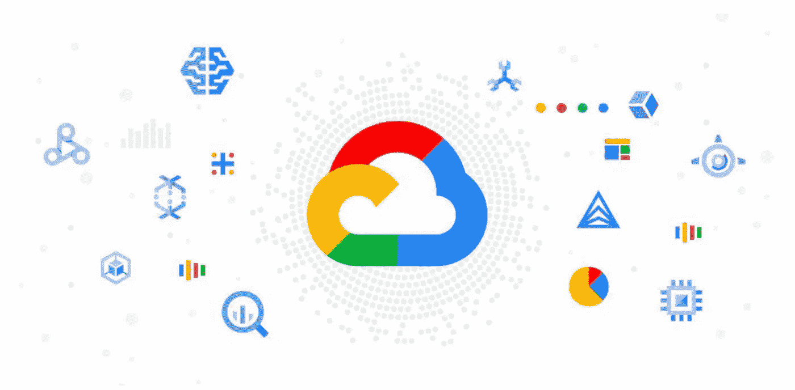
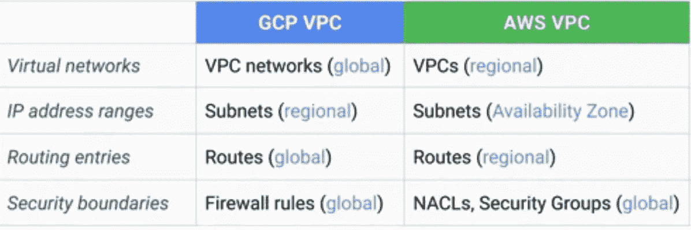
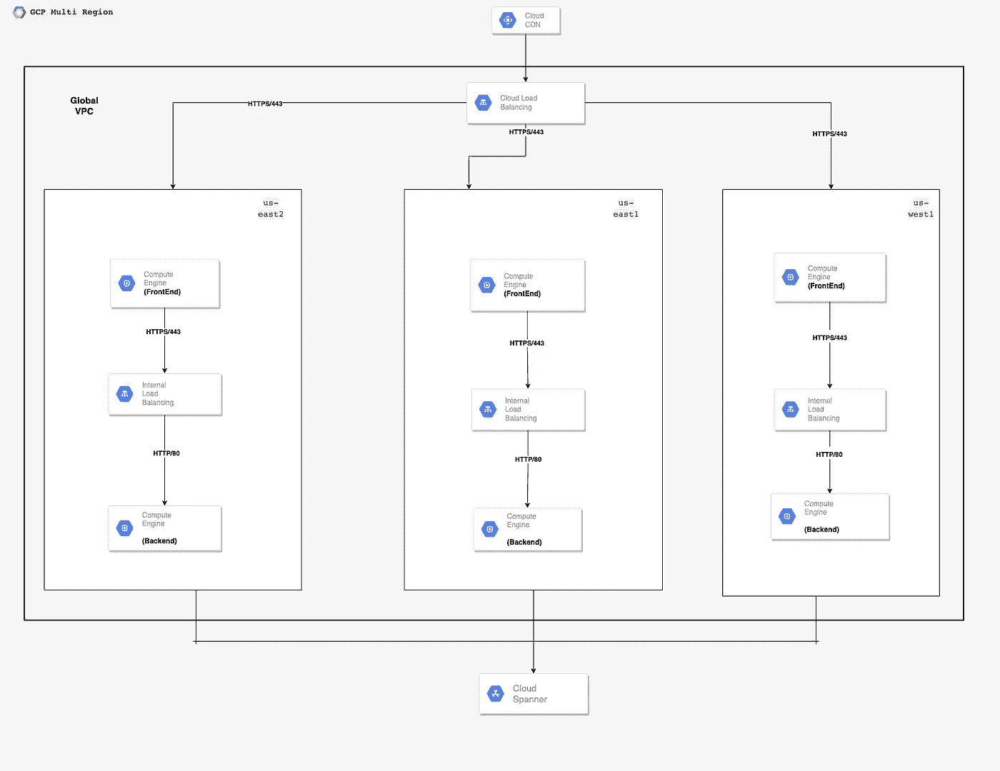

# 基于 Google 云的灾难恢复——构建模块

> 原文：<https://blog.devgenius.io/disaster-recovery-on-google-cloud-building-blocks-b2a232a9ec?source=collection_archive---------11----------------------->

这篇博客是我们从零开始讨论**云**概念的系列文章的一部分，面向的是入门知识有限的读者。这篇文章属于*中级*系列，因为它涉及在 Google Cloud 上构建**高可用性和灾难恢复**构件。

云系列中的一些早期博客如下。

[**AWS 云上的灾难恢复**](/disaster-recovery-on-aws-cloud-building-blocks-e013bffd6244)[**Azure 云上的灾难恢复**](/disaster-recovery-on-azure-cloud-building-blocks-6ff826adbc8b)

# 高可用性和灾难恢复

构建具有正确正常运行时间 SLA 的分布式系统的关键原则之一是拥有一个健壮的高可用性和灾难恢复计划。

灾难恢复通过跨两个区域复制整个部署拓扑来消除整个区域故障的停机时间，以确保满足正确的 SLA**RPO(恢复点目标)**和 **RTO(恢复时间目标)**。基于上述部署，拓扑可分为以下几类

*   **主动部署—** 零停机时间但有数据丢失风险的系统。 ***Ex 电子商务门户网站。***
*   **主动被动部署—** 系统不会丢失数据，但在发生区域性灾难时会影响可用性。 ***Ex 银行系统。***

# 与 AWS/Azure 的区别

与 AWS 或 Azure 不同，GCP 的 VPC 是全球性的，跨越多个地区。这样做的好处是，网络路由可以跨区域共享，从而为客户实现自动化灾难恢复计划提供了更大的灵活性。下表显示了 **GCP 的 VPC 与 AWS 的一些主要区别。**

# 三层应用程序

出于本博客的目的，我们将总体技术讨论限制在三层主动-主动系统

*   **前端层—** 带有 UI 资产( ***静态和非静态*** )，该层服务于客户交互所需的业务流程页面
*   **后端层—** 无状态微服务受到关注点分离 *(* ***读与写功能*** *)* ，这一层充当业务流背后核心逻辑的主干。
*   **数据库层—** 该层充当所有静态数据(关系型与非关系型)的主干，由后端层通过 ***模型和视图进行访问。***

**详细查看—**[https://github . com/Amit 894/diagrams/blob/main/AWS % 20 deployment % 20 topology/3% 20 tier . png](https://github.com/amit894/diagrams/blob/main/GCP%20Deployment%20Topology/3%20Tier.png)

# GCP 服务

*   [**云 CDN**](https://www.google.com/search?q=cloud+cdn&oq=cloud+cdn&aqs=chrome..69i57j0i512l3j0i20i263i512l2j0i512l4.2292j0j4&sourceid=chrome&ie=UTF-8) **—** 全球可用的服务，使用位于客户区域的代理服务器提供低延迟内容。
*   [**云负载均衡**](https://cloud.google.com/load-balancing/?utm_source=google&utm_medium=cpc&utm_campaign=japac-IN-all-en-dr-bkws-all-pkws-trial-e-dr-1009882&utm_content=text-ad-none-none-DEV_c-CRE_468709900977-ADGP_Hybrid%20%7C%20BKWS%20-%20EXA%20%7C%20Txt%20~%20Networking%20~%20Cloud%20Load%20Balancing_cloud%20load%20balancing-documentation%20-%20Products-KWID_43700049545546284-aud-1185880979976%3Akwd-836649316213&userloc_9062091-network_g&utm_term=KW_google%20cloud%20load%20balancing%20information&gclsrc=aw.ds&gclid=Cj0KCQiA95aRBhCsARIsAC2xvfy5_ie2RRdWAUBoEJvfEtOEn2bEZ8TVuTxK_ll2_oPHPcGU9jWY3WMaAgBuEALw_wcB)**——**L7 负载均衡器，工作在应用层，用于将 CDN 流量转发给给定区域的计算机。
*   [**计算引擎**](https://cloud.google.com/compute) **—** 计算实例，用于在 UI 和后端微服务层部署。
*   [**内部负载均衡**](https://cloud.google.com/load-balancing/docs/l7-internal)**—**L4 负载均衡器，工作在 TCP 层，用于转发前端和后端服务器之间的流量。
*   [**扳手**](https://cloud.google.com/spanner/) **—** 一个 NoSQL 数据库，用于以键值对的形式存储非关系数据。这是 Google Cloud 自带的，在全球各地区都可以使用
*   **谷歌 VPC—** 公共云中的私有地址空间，使用可配置的 [**IP 空间托管多个地区的所有谷歌服务。**](https://en.wikipedia.org/wiki/IP_address)

# 网络设置

# 云负载平衡 V2 (L7)

*   `Security Group`:允许来自互联网的流量通过端口 443。
*   `Communication Protocol` : HTTPS
*   `SSL`:强制性

# 前端计算引擎

*   `Security Groups:`允许来自应用网关 V2 的流量通过**端口 443。**
*   `Communication Protocol` : HTTPS
*   `SSL`:强制

# 内部负载平衡(L4)

*   `Security Groups:`允许来自前端计算引擎的流量通过**端口 443。**
*   `Communication Protocol` : HTTPS
*   `SSL`:强制

# 后端计算引擎

*   `Security Groups:`允许来自**端口 80 上的内部负载平衡器的流量。**
*   `Communication Protocol` : HTTPS
*   `SSL`:强制

# 谷歌扳手

*   `Security Groups:`允许来自后端计算引擎的流量通过**端口** 5432 **。**
*   `Communication Protocol` : TCP
*   `SSL`:首选

# 结论

给定文档仅概括介绍了在 GCP 云中的两个区域实现全功能主动-被动部署的情况。为了进一步理解其中的复杂性，我们将进一步深入探讨未来的博客主题。

*如需反馈，请留言至****Amit[dot]894[at]Gmail[dot]com****或联系*[*https://about.me/amit_raj*](https://about.me/amit_raj)*的任何链接。*