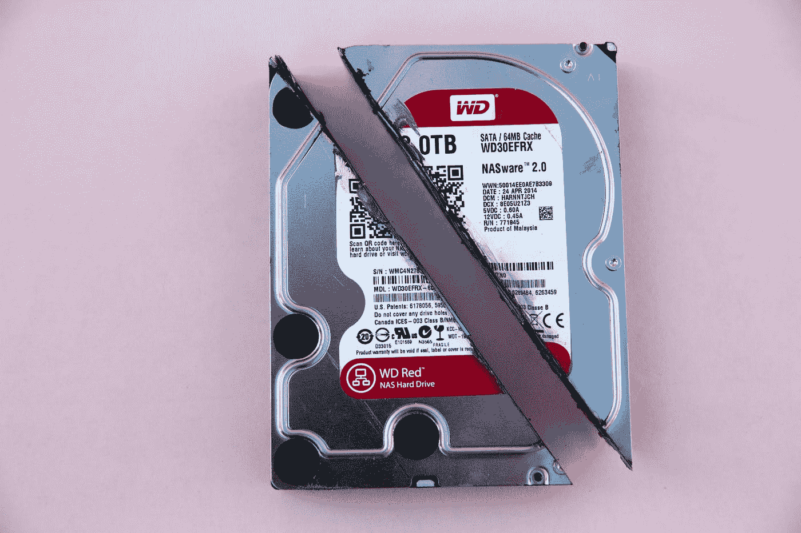
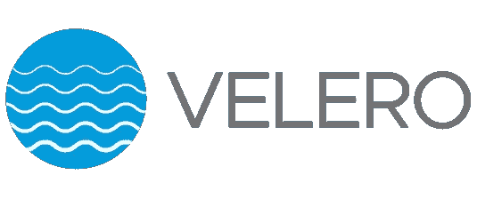
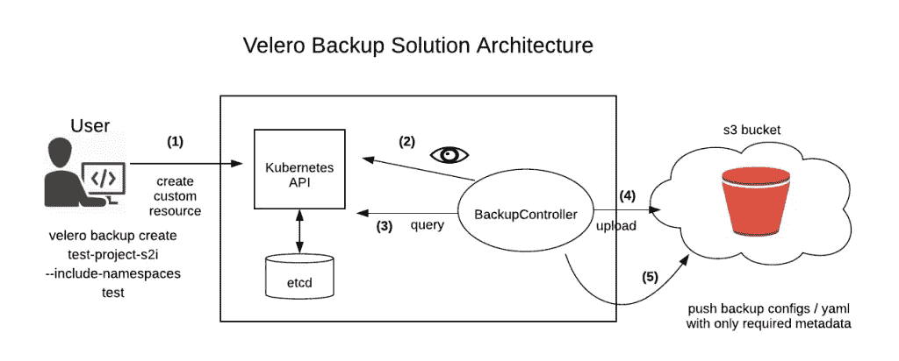

# Kubernetes 上的灾难恢复

> 原文：<https://blog.devgenius.io/disaster-recovery-on-kubernetes-98c5c78382bb?source=collection_archive---------1----------------------->

使用 [VMWare 的 Velero](https://velero.io/) 进行备份和恢复、执行灾难恢复以及迁移 Kubernetes 资源。



由[马库斯·斯皮斯克](https://unsplash.com/@markusspiske?utm_source=medium&utm_medium=referral)在 [Unsplash](https://unsplash.com?utm_source=medium&utm_medium=referral) 上拍摄的照片

尽管 Kubernetes(尤其是托管的 Kubernetes 服务，如 GKE、EKS 和 AKS)提供了开箱即用的可靠性和弹性，具有自我修复和水平扩展能力，但生产系统仍然需要灾难恢复解决方案来防止人为错误(如意外删除命名空间或机密)和 Kubernetes 之外的基础架构故障(如持久卷)。虽然越来越多的公司采用多区域解决方案，但如果您需要的只是一个简单的备份和恢复选项，那么这将是一个复杂且可能昂贵的选择。在本帖中，我们将看看如何使用 Velero 来备份和恢复 Kubernetes 资源，并展示其作为灾难恢复或迁移工具的用途。

# 还需要备份吗？

在高可用性(HA)模式下运行服务时，经常忽略的一个要点是，HA(以及复制)与备份不同。HA 可以防止区域故障，但不能防止数据损坏或意外删除。很容易混淆上下文或名称空间，并意外删除或更新错误的 Kubernetes 资源。这可能是自定义资源定义(CRD)、机密或命名空间。一些人可能会认为，使用 Terraform 和外部解决方案等 IaaS 工具来管理这些 Kubernetes 资源(例如，用于机密的 Vault，用于头盔图表的 ChartMuseum)，备份变得没有必要。但是，如果您在集群中运行 StatefulSet(例如，用于日志记录的 ELK 堆栈或用于安装 RDS 或 Cloud SQL 上不支持的插件的自托管 Postgres)，则需要备份来从持久性卷故障中恢复。

# 韦莱罗



Velero(以前称为 Ark)是来自 Heptio(已被 VMWare 收购)的开源工具，用于备份和恢复 Kubernetes 集群资源和持久卷。Velero 在 Kubernetes 集群内运行，并与各种存储提供商(如 AWS S3、GCP 存储、Minio)以及 [restic](https://velero.io/docs/v1.5/restic/) 集成，以按需或按计划拍摄快照。

## 装置

Velero 可通过[舵](https://vmware-tanzu.github.io/helm-charts/)或 [CLI](https://velero.io/docs/v1.5/basic-install/) 工具安装。总的来说，看起来 CLI 获得了最新的更新，而 Helm chart 稍微落后于兼容的 Docker 映像。然而，在每个版本中，Velero 团队都做了很好的工作来更新文档，以修补 CRDs 和新的 Velero 容器映像，因此将舵图升级到最新版本并不是一个大问题。

## 配置

一旦你安装了服务器，你就可以通过 CLI 或者修改舵图的`values.yaml`来配置 Velero。关键的配置步骤是为存储提供者安装[插件，定义存储位置以及卷快照位置:](https://velero.io/plugins/)

```
configuration:
  provider: aws
  backupStorageLocation:
    name: aws
    bucket: <aws-bucket-name>
    prefix: velero
    config:
      kmsKeyId: <my-kms-key>
      region: <aws-region>
  volumeSnapshotLocation:
    name: aws
    config:
      region: ${region}
  logLevel: debug
```

*(注:* [*有一个问题*](https://github.com/vmware-tanzu/helm-charts/issues/102) *带有最新舵图的 CRDs 导致备份存储和卷快照位置未将配置值设置为默认值。如果您决定命名存储和快照位置，请在以下 Velero 命令中添加*`*--storage-location <name> --volume-snapshot-location name*`*)*

## 创建备份

要创建备份，只需将 backup 命令应用于命名空间或通过标签选择:

```
$ velero backup create nginx-backup --include-namespaces nginx-example$ velero backup create postgres-backup --selector release=postgres
```

发出 backup 命令时，Velero 会执行以下步骤:

1.  调用 Kubernetes API 来创建`Backup` CRD
2.  Velero `BackupController`验证请求
3.  请求通过验证后，它会查询 Kubernetes 资源并拍摄磁盘快照进行备份，然后创建一个 tarball
4.  最后，它开始将备份对象上传到已配置的存储服务



图片来源: [OpenShift](https://www.openshift.com/blog/backup-openshift-resources-the-native-way)

## 恢复数据

要列出可用的备份，首先运行:

```
$ velero backup get
```

现在，您可以通过发出以下命令从备份中恢复:

```
$ velero restore create RESTORE_NAME \
  --from-backup BACKUP_NAME
```

如果您不想覆盖现有资源，Velero 还支持将对象恢复到不同的名称空间中(将`--namespace-mappings old-ns-1:new-ns-1`追加到上面的命令)。如果您遇到中断，并希望稍后在立即恢复服务的同时诊断问题，这将非常有用。

Velero 可以在恢复过程中更改永久卷的存储类别。如果您过度配置永久卷，这可能是将工作负载从 HDD 迁移到 SSD 存储或更小磁盘的好方法(有关配置，请参见[文档](https://velero.io/docs/v1.5/restore-reference))。

最后，您还可以有选择地还原备份的子组件。通过运行以下命令检查备用 tarball:

```
$ velero backup download <backup-name> 
```

从 tarball 中，您可以为特定的资源选择一个清单，并单独发出`kubectl apply -f`。如果您拍摄了整个名称空间的快照，而不是按标签过滤，这将非常有用。

## 定时备份

除了按需创建备份，您还可以为关键组件配置计划备份:

通过 CLI:

```
$ velero schedule create mysql --schedule="0 2* * *" --include-namespaces mysql
```

通过舵值:

```
schedules:
  mysql:
    schedule: 0 2 * * *
    template:
      labelSelector:
        matchLabels:
          app: mysql
      snapshotVolumes: true
      ttl: 720h
```

请注意`ttl`配置，它指定了定时备份到期的时间。如果您使用云存储提供商，您可以利用生命周期策略或通过 Velero 控制它，如上所示，以降低存储成本。

## 其他用途

除了简单地进行备份，Velero 还可以通过结合时间表和只读备份存储位置来用作灾难恢复解决方案。配置 Velero 以创建每日计划:

```
$ velero schedule create <SCHEDULE NAME> --schedule "0 7 * * *"
```

如果由于人为错误或基础架构中断而需要重新创建资源，请将备份位置更改为只读，以防止创建新的备份对象:

```
$ kubectl patch backupstoragelocation <STORAGE LOCATION NAME> \
    --namespace velero \
    --type merge \
    --patch '{"spec":{"accessMode":"ReadOnly"}}'
```

从另一个位置的备份恢复:

```
$ velero restore create --from-backup <SCHEDULE NAME>-<TIMESTAMP>
```

最后，将备份恢复为可写状态:

```
$ kubectl patch backupstoragelocation <STORAGE LOCATION NAME> \
   --namespace velero \
   --type merge \
   --patch '{"spec":{"accessMode":"ReadWrite"}}'
```

这个过程将集群迁移到不同的区域(如果提供商支持的话)，或者在 Kubernetes 升级之前创建最后一个工作版本。最后，即使 Velero 本身不支持持久性卷跨云的迁移，您也可以配置 restic 在文件系统级别进行备份，并为混合云备份解决方案迁移数据。

# 其他解决方案

虽然 Velero 非常易于使用和配置，但它可能不适合您的特定使用情形(例如跨云备份)。如上所述，Velero 与 restic 或 OpenEBS 等其他解决方案集成，但如果您正在寻找替代方案，以下列表提供了开源和企业选项:

*   [kube-backup](https://github.com/pieterlange/kube-backup)
*   [内聚性](https://www.cohesity.com/solution/virtual/kubernetes/)
*   [卡斯滕 10](https://www.kasten.io/try-kasten-k10)
*   [Portworx PX-Backup](https://portworx.com/products/px-backup/)
*   [牧场主长角牛](https://rancher.com/products/longhorn/)