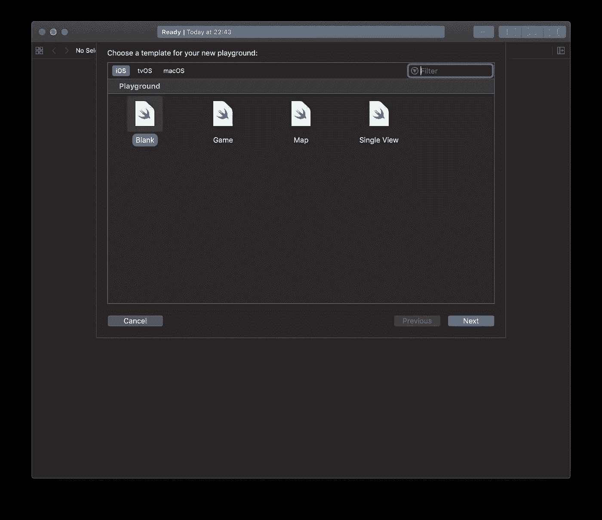
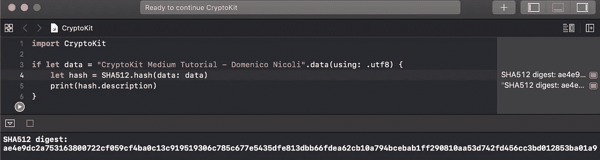

# 发现新的 Apple CryptoKit 框架

> 原文：<https://blog.devgenius.io/discover-the-new-apple-cryptokit-framework-cf4e0dd44e8d?source=collection_archive---------0----------------------->

## 借助这一新框架，安全高效地执行加密操作

由[马库斯·斯皮斯克](https://unsplash.com/@markusspiske?utm_source=medium&utm_medium=referral)在 [Unsplash](https://unsplash.com?utm_source=medium&utm_medium=referral) 拍摄的照片

在今年的 WWDC19 上，苹果推出了一个名为 CryptoKit 的新框架，可以帮助开发人员创建哈希，用签名验证数据，以及加密数据。CryptoKit 易于使用，不需要底层 API 的知识，这是迄今为止唯一可以进行这种操作的方法。

今天我将使用 CryptoKit 解释并展示加密操作领域的一些代码块。

我们可以从一个简单的空白操场项目开始。请确保在您的文件顶部添加 CryptoKit。

# 生成哈希

一般来说，散列函数从特定的输入数据生成唯一的键，只要输入数据相同，该键就保持不变。例如，这可用于检查服务器上托管的文件是否与您桌面上的文件相同。否则，如果哈希不同，您桌面上的文件可能是一个带有恶意软件的修改过的文件。

目前，CryptoKit 支持以下哈希类型:SHA256、SHA384 和 SHA512。

下面是我们如何从一串数据中生成散列的例子:

如果您尝试在您的机器上启动之前的脚本，您将会看到与下面的屏幕截图相同的结果:

# 创建/验证签名

[数字签名](https://en.wikipedia.org/wiki/Digital_signature)用于验证消息或数据的真实性。这种数学方案使用[非对称加密](https://en.wikipedia.org/wiki/Asymmetric_key_algorithm)，并在大多数加密协议中使用。它每天都被我们用于 HTTPS、金融交易、电子邮件、合同和许多其他目的。

CryptoKit 支持用于创建和验证加密签名的四种不同类型:Curve25519、P521、P384 和 P256。

首先，我们生成一个公钥和私钥:

然后我们用我们的私钥签署一些数据:

现在，每个拥有公钥的人都可以通过以下方式检查签名是真实的还是伪造的:

# 数据加密

如今加密数据非常重要。它允许您提高应用程序的安全性，并使其对最终用户更具吸引力，当我们谈论隐私时，他们真的很感兴趣。CryptoKit 支持`AES-GCM`和`ChaChaPoly`算法。请考虑，在移动环境中，`ChaChaPoly`是首选，因为它更快。

我们可以用几行代码加密和解密数据:

**总之，这里有一个** [**样品游乐场**](https://developer.apple.com/documentation/cryptokit/performing_common_cryptographic_operations) **苹果公司创建的，向开发者展示可以用 CryptoKit 完成的操作。**

**如有任何问题或建议，请在下方留言评论！**