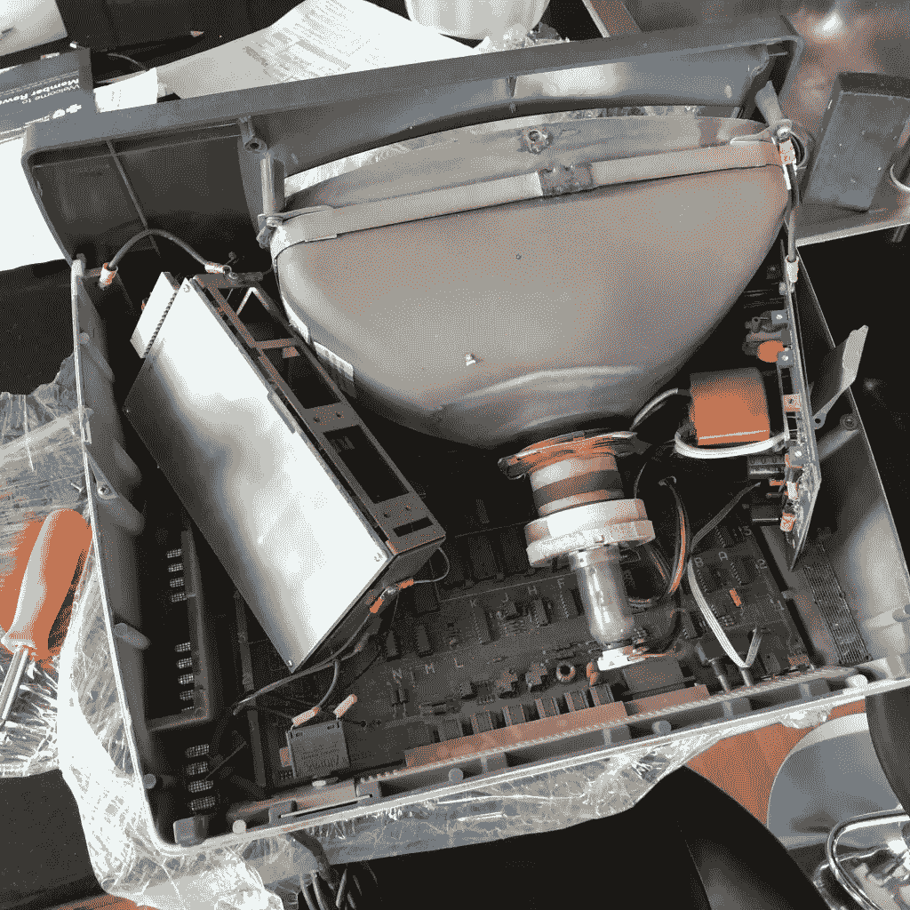
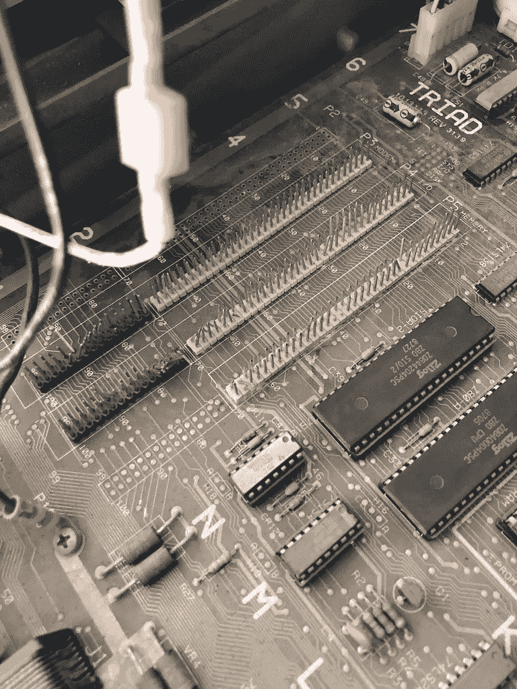
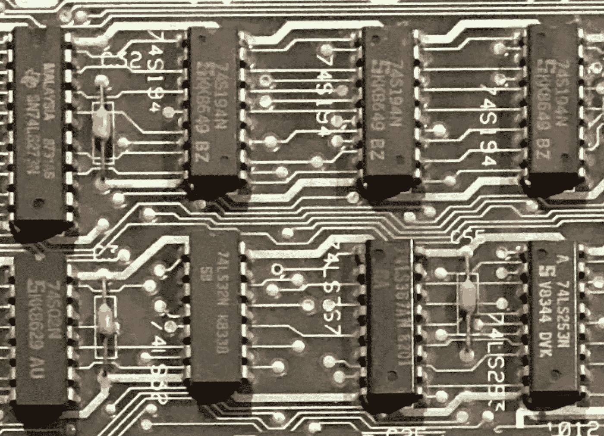
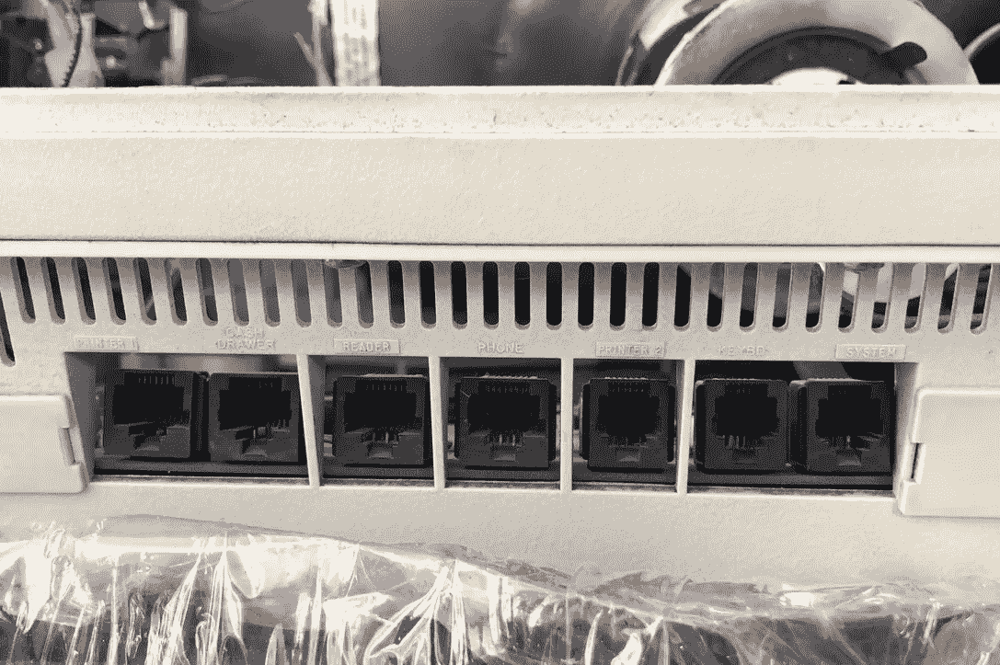

# 发现三和弦 T2556

> 原文：<https://blog.devgenius.io/discovering-the-triad-t2556-19aa184c1bc3?source=collection_archive---------5----------------------->

## T2556 三联体系列之一

这是一个关于我与 Triad T2556 冒险的故事，这是一个来自 20 世纪 80 年代的超级不起眼的老式技术。

你可能知道也可能不知道，我收集老式电脑，主要是 20 世纪 80 年代的，但是任何我买得起的有风格和个性的电脑都是我的候选。所以。雅达利(Atari)或康茂德(Commodore)的电脑是有价值的，但 80x86 的电脑就不是了。还有， [BBC 微](https://en.wikipedia.org/wiki/BBC_Micro)永远牛逼。

这个系列将与我通常写的东西非常不同，但是——一如既往——我很高兴收到反馈和问题。此外，如果你熟悉这台机器或可以提供更多的见解，那么我很乐意听到你的意见。

差不多就在两年前，我在易趣上偶然发现了一些不寻常的东西。*在这里,*的意思是，它具有我一直在寻找的那种优雅和独特的感觉。

EBay 上同一卖家后来发的帖子

我在谷歌上搜索了一下，虽然有一些提示，比如这个几乎一点也不过时的[视频](https://www.youtube.com/watch?v=QfuL_TegweY)关于该系统的一个更高版本，但我完全没有找到关于它的任何细节。

我只知道这是一个提供给汽车零件商店的销售点系统。我想我可以找到利弗莫尔三合会系统公司的地址，但是……内向。此外，那会破坏挑战。

这个东西花费了 70 美元外加运费，所以还会有什么问题呢？最坏的情况是，我可以把它拆下来，在里面放一个树莓派什么的。

经过深思熟虑和自我折磨后，亚历克斯，你真的需要吗？我付钱买了那东西。

将近两个星期后，机器来了。

然而，令人心碎的是，它包装不当，运输中的粗暴对待也造成了损失。将显像管固定在机箱前端顶部的支柱断裂，固定电源和视频驱动电路的固定器断裂。显然，用保鲜膜包裹外面并不足以阻止所有内部的反弹。

尽管卖家友好地退还了我一定比例的费用，但这种损坏会让我付出额外的努力，而这是我原本不打算修理的。除此之外，整个事情看起来比我预期的稍微好一点。

我小心翼翼地移除这些不良物品，并开始检查电路板，发现了另一个问题:金属电源机箱的撞击损坏了一堆连接器。我担心，虽然我可能能够把针弯回原位，但有风险，他们已经遭受了足够的疲劳，他们可能会以一种不可预知的方式折断。它们需要被替换。

实际上，制造商在这里使用公接头而不是母接头看起来很奇怪。

但是让我们后退一步，看看我发现了什么。这东西有未来吗？光看 PCB 我能学到什么？

除了有多脏，总之…

…所以在仔细拍下所有连接器和可拆卸硬件的照片后，发现有很多东西值得一看！

该机器配有一个 [Z80](https://ultimatepopculture.fandom.com/wiki/Zilog_Z80) 处理器，并使用相应的 Zilog 串行 I/O 处理器(1)。所以这是非常标准的东西。虽然我真的很喜欢它是 6502 处理器，因为那是我以前编写的程序，学习新东西总是好的。Z80 有一个旧的通用操作系统 CP/M，微软有一个 BASIC 版本。也许我最终能让这些运行起来？

那是一个 8K 的 RAM 芯片(2)，它们在当时相当昂贵，所以这可能是一台昂贵的计算机。由于前面的那组蓝色跳线，它看起来像是高度可扩展的 RAM 和 ROM (3)的可配置组合。它带有 8K 的程序 EPROM (4)来启动。我想知道那上面有什么？以前，EPROMs 顶部有一个小小的透视窗。当暴露在紫外光下时，数据将被擦除，这样芯片就可以被重新编程。由于覆盖窗户的原始标签已经脱落，我的第一项工作是在上面贴上一些蓝色的油漆工胶带，以保护里面的东西。

你可以看到一些蓝色的 DIP 开关(5 ),用于配置，虽然我可能需要拆卸 EPROM 之前，我可以弄清楚他们做什么。

不过，紧接在它上面的是 40 引脚封装的 6845(6)。这些是当时非常常见的 CRT(视频)控制器，所以希望不会太难理解。紧挨着它，还有更多的 ROM 和 RAM (7)，我猜这些和一堆更小的逻辑芯片一起运行显示器。

在左上角，有一块非常脏的塑料(8)。也许这是一个压电蜂鸣器？可能质量不会很好，但可能电脑有声音。

在那下面，我们回到悲伤脸连接器(9)。但是它们太多了，还有太多的别针！为什么有人会为销售点系统添加如此多的扩展功能？这使它看起来更像一台通用计算机。为什么最左边的扩展是没有安装连接器的焊盘(顺便说一下，我几周前才发现这个问题)？

大概小变形金刚(10)是用来驱动串口通讯的，但是那两个长长的双列直插封装的东西标着`TRANS`和`DIFF` (12)到底是什么？，像这样的大系统怎么会只有一个 LED (11)？我想我必须找到一种补救 LED 计数的方法。led 越多=越好。

LOC/LINE 是什么意思(13)？红色瞬时电位计旁边的两个蓝色电位计(复位？)开关状况不佳，需要更换。

哦，然后还有 74LS471 (14)。这是一个 256 字节的可编程存储器(这意味着它可以被写入一次，然后如果你想进行更改，你必须扔掉它并重新开始)。也许它是某种引导监控 ROM？

几年前我学到的一个有用的技巧是，你通常可以通过查看各种设备上的日期戳来判断机器的年龄。这里你可以看到一辆 74LS253，它是在 1983 年第 44 周制造的( *V8344* )。我从因果检验中看到的最大数字是 1987 年的，所以很可能这就是这台机器制造的时间。

除了 DB-25 和电路板边缘的一些奇怪的连接器之外，背面还有一堆 RJ 连接器。这台机器显然能够做很多 T4。

但现在我必须清理 PCB，然后更换那些损坏的连接器……我不想冒险打开这个东西，直到我确信所有的短路都已经修复。

但是这个故事将在下一次讲述。

[更多来自亚历克斯·金](https://medium.com/@alexwking/past-present-and-future-stories-81e5ad777a49?source=friends_link&sk=725d7d2d291fd460f40bad83d14d7366)上媒。