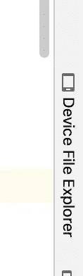

# 磁盘日志:按天分隔文件，Android

> 原文：<https://blog.devgenius.io/disk-logs-separate-files-by-days-android-ebcc5406438a?source=collection_archive---------6----------------------->

本指南将介绍一种将信息记录到磁盘文件中的方法，每个文件代表 24 小时。以及如何分享它们。下面的指南依赖于我以前的文章 [*磁盘日志:简单的 Android 日志*](https://medium.com/@itay.c14/disk-logs-simple-android-logger-778566726a76) ，所以欢迎你深入到那里的解释或只是使用磁盘日志背后的代码。


[金伯利农民](https://unsplash.com/@kimberlyfarmer?utm_source=medium&utm_medium=referral)在 [Unsplash](https://unsplash.com?utm_source=medium&utm_medium=referral) 上拍摄的照片

假设您已经将 [DiskLoggerImpl](https://gist.github.com/cohenItay/05d3f8b41c8ecd25bbecf8e4b1b30e73) 添加到您的项目中，下一步是创建它的一个实例。因此，首先我们必须为 [LogsFileProvider](https://gist.github.com/cohenItay/49e37598f31ca6b53dbfb06fb753f064) 创建一个实现，我们称之为“LogsFileProviderDaily”:(一个意外的原始命名；] )

看起来，被返回的文件位于 Android [内部存储器](https://developer.android.com/training/data-storage/app-specific)中，这有助于我们防止其他应用程序访问我们的日志文件。
此外，由于文件的命名约定，会出现日期的分隔:`fileName = fileNameFormat.format(Calendar.getInstance().time)`(今天的日期)。总而言之，LogFileProviderDaily 实现将被注入到 DiskLogger 构造函数中，神奇的事情发生了。
提示:为了安全起见，我们还建议您在每天结束时使用 [Android 的 Jetpack EncryptedFile](https://developer.android.com/guide/topics/security/cryptography) 对文件进行加密。

现在，我们怎么才能拿到那些文件？我们将看到如何直接从 Android Studio 以及通过应用程序中集成的共享按钮来实现。

**Android studio approach-**
从左到右，先打开 device explorer 选项卡，然后在它的文件系统中导航，如图所示(隐藏到一加的商业广告已经不那么隐藏了)，右击日志文件，将日志保存到你的电脑中



**共享日志抛出了 app 方法-** 为了能够从内部存储器共享一个文件，我们首先必须声明并使用一个 [FileProvider](https://developer.android.com/training/secure-file-sharing/setup-sharing) ，它使我们能够为读取该文件的其他应用程序创建一个临时权限。很简单，在清单中声明它:

```
<provider
 android:name=”androidx.core.content.FileProvider”
 android:authorities=”${applicationId}.contentprovider”
 android:exported=”false”
 android:grantUriPermissions=”true”>
 <meta-data
 android:name=”android.support.FILE_PROVIDER_PATHS”
 android:resource=”@xml/file_provider_path” />
</provider>
```

然后执行`@xml/file_provider_path`:

```
<paths>
    <files-path
        name="pango_logs"
        path="app_logs/"/>
    *<!-- WARNING: please make sure that if this value is being changed, also change the string resource logsDirectoryName in strings.xml-->
    <!-- Please note to add '/' at the end of Folder which you wish to permit access to all of its content-->* </paths>
```

我们诚挚地邀请您在 [FileProvider](https://developer.android.com/reference/androidx/core/content/FileProvider) 阅读更多关于`<paths>`标签的可能性。
完成所有设置后，我们可以根据适当的意图共享日志文件:

任务完成！

如果你觉得我的文章对你有任何帮助，请分享它，并为它鼓掌。但是如果你认为我可能会用更有价值的内容给你惊喜，你可以 [**订阅**](https://medium.com/subscribe/@itay.c14) 或者**关注**我来获得新内容的通知。

> 有一个伟大的一天，更大的知识和可怕的技能！

[伊塔·科恩|领英](https://www.linkedin.com/in/itay-cohen-b717b1107/)