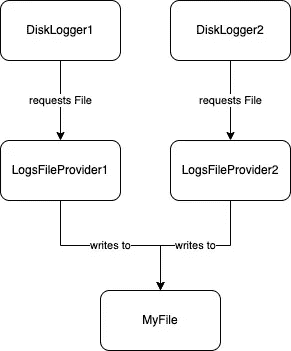

# 磁盘日志:简单的 Android 记录器

> 原文：<https://blog.devgenius.io/disk-logs-simple-android-logger-778566726a76?source=collection_archive---------7----------------------->


瓦迪姆·博古洛夫在 [Unsplash](https://unsplash.com?utm_source=medium&utm_medium=referral) 上的照片

> “我只想用一种**简单的方式**将日志写入一个**本地文件。”**匿名同事

还有瓦拉！，旨在帮助我们识别 ***哪里出了问题，*** 一个基于 Kotlin 的记录器:

```
interface DiskLogger {

    */**
     * Log the [logContent] to a file on disk, any log written will
     * be prefixed with a timestamp
     */* fun log(logContent: String)

    */**
     * Clean any logs files which are kept on the disk.
     * @param from - the specified time which from this day and onto
     * the past they will be deleted,
     * must be at least from yesterday
     * @throws IllegalStateException if the [from] days is less then
     * 1 day
     */* fun cleanLogs(from: Date)
}
```

够简单吗，匿名同事？啊？！:)

## 履行

为了理解即将到来的实现，你必须熟悉 [Kotlin-Coroutines](https://kotlinlang.org/docs/coroutines-overview.html) ， [Kotlin 的通道](https://kotlinlang.org/docs/channels.html)， [BufferedWriter](https://developer.android.com/reference/java/io/BufferedWriter) ，[文件](https://developer.android.com/reference/java/io/File)。否则你会浪费你的时间…

首先，实现依赖关系:

```
class DiskLoggerImpl(
    private val appContext: Context,
    private val logsFileProvider: LogsFileProvider
) : DiskLogger
```

看起来，您必须提供一个 LogsFileProvider，它将告诉我们日志保存在哪个目录中，以及您保存日志的文件。([把这个当做实现的例子来读)](https://medium.com/@itay.c14/disk-logs-separate-files-by-days-android-ebcc5406438a)

接下来，让我们思考一下全面实施:

该实现基于两个主要思想:

1.  Kotlin-Channel，它充当阻塞队列。从而使我们能够在通道入口将日志从多个线程发送到通道中，同时其输出在特定的协同作用域上工作，这将导致同步的顺序工作。
2.  BufferredWriter 有自己的性能优势，它的底层 [FileOutputStream](https://developer.android.com/reference/java/io/FileOutputStream) 在 2 分钟不活动后被关闭。

另外，请注意，写/删除操作是按顺序进行的，因此它们不会以并行方式执行。

到目前为止还好吗？看起来我们已经完成了，但是…您能在下一张图中找出问题所在吗？



如果您的直觉告诉您两个实例的作者正在写入同一个文件，那么请更加相信您的直觉！为了解决这个问题，你有责任确保一个写者和一个文件之间有一对一的关系。我给大家分享一个使用 Dagger/Hilt DI(=依赖注入)库的解决方案。但是要确保你可以不用 DI 库自己写一个解决方案。

```
@Module
interface ApplicationBindsModule { ... @Binds 
    @LogsFileDaily
    fun bindLogFileProviderDaily(
        impl: LogsFileProviderDaily
    ) : LogsFileProvider}
```

@LogsFileDaily 是一个 Dagger 限定符。在这里，我已经将我的 LogsFileProviderDaily 绑定到了 DiskLogger 接口并附加了限定符。这个记录器将为每一天提供新的文件(你可以[阅读更多关于它的实现](https://medium.com/@itay.c14/disk-logs-separate-files-by-days-android-ebcc5406438a))。
这种依赖性是在:

```
@Module
class ApplicationProvideModule { ... @Provides
    @DiskLoggerDaily
    @Singleton *// Allow only this instance write to the file.* fun provideDiskLoggerDaily(
        appContext: Context,
        @LogsFileDaily logsFileProvider: LogsFileProvider
    ) : DiskLogger = DiskLoggerImpl(appContext, logsFileProvider)}
```

同样,@DiskLoggerDaily 是一个限定词。
现在，任何依赖于我的@DiskLoggerDaily 的类，都将获得相同的 DiskLogger 实例(@Singleton)，因此，只有一个 writer 将写入一个文件。

```
class MyViewModel1 @Inject constructor(
    @DiskLoggerDaily private val dailyDiskLogger: DiskLogger,
    ...
) : ViewModel {...}class MyViewModel2 @Inject constructor(
    @DiskLoggerDaily private val dailyDiskLogger: DiskLogger,
    ...
) : ViewModel {...}
```

在注入时，两个视图模型将接收相同的实例。

如果您想了解如何按天将日志保存到单独的文件中，请继续阅读:

[](https://medium.com/@itay.c14/disk-logs-separate-files-by-days-android-ebcc5406438a) [## 磁盘日志:按天分隔文件，Android

### 本指南将介绍一种将信息记录到磁盘文件中的方法，每个文件代表 24 小时。此外，如何…

medium.com](https://medium.com/@itay.c14/disk-logs-separate-files-by-days-android-ebcc5406438a) 

如果你觉得我的文章有任何帮助，请分享并给它一个**掌声**。但是如果你认为我可能会用更有价值的内容给你惊喜，你可以 [**订阅**](https://medium.com/subscribe/@itay.c14) 或者**关注**我来获得新内容的通知。

> 有一个伟大的一天，更大的知识和可怕的技能！

[伊塔·科恩|领英](https://www.linkedin.com/in/itay-cohen-b717b1107/)