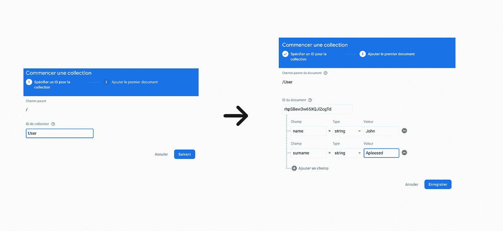
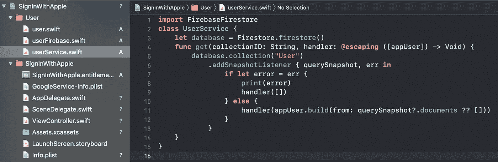
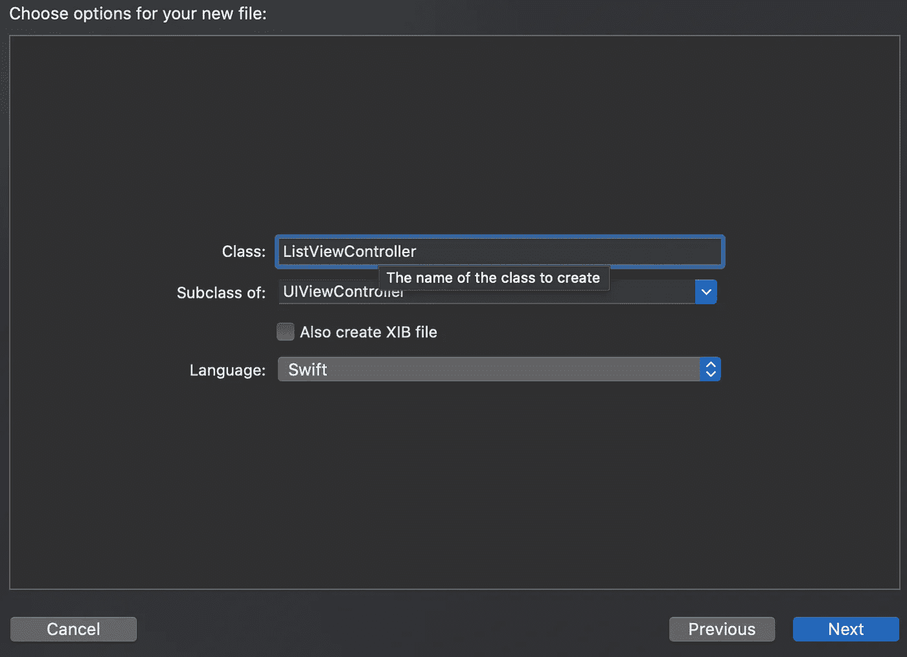
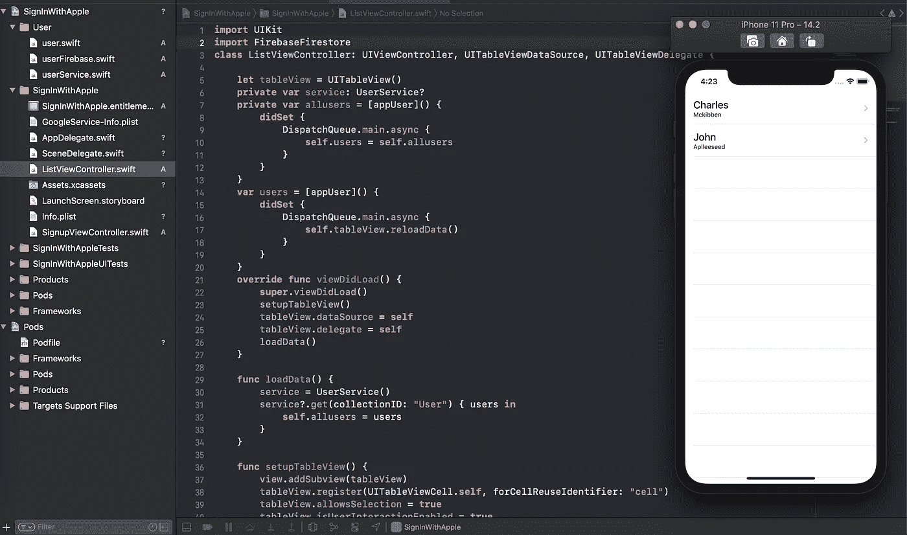

# 在 UITableView 中显示 Firebase Firestore 数据

> 原文：<https://blog.devgenius.io/display-firebase-firestore-data-inside-uitableview-e838f4213689?source=collection_archive---------0----------------------->

## 了解如何以编程方式创建 UITableView 来显示 Firestore 集合中的数据

难度:初级|简单| **普通** |挑战

环境:Xcode 12 和 Swift 5.3(以编程方式)

要求:

*   让 [Firebase SDK](https://firebase.google.com/docs/ios/setup) 与您的项目和 Firebase/Firestore pod 一起安装。
*   [*ui tableview*](https://developer.apple.com/documentation/uikit/uitableview)&[*MVC*](https://developer.apple.com/library/archive/documentation/General/Conceptual/DevPedia-CocoaCore/MVC.html)模式的知识

## 快速设置

> 如果您的项目中没有集成 Firebase SDK，请先查看我的教程:

 [## 将 Firebase 与 iOS 项目集成| Xcode 12

### 了解如何将 Firebase SDK 与现有的 iOS 项目集成。

medium.com](https://medium.com/ios-design-code/integrate-firebase-with-an-ios-project-xcode-12-28512f202bb0) 

**转到您的 Firebase 控制台>云 Firestore >创建一个新数据库**

Firebase 控制台的屏幕截图

现在，创建一个名为" ***User*** "的集合，并从这个集合中创建一堆带有两个字段的文档:" ***name*** "和" ***surname*** "，然后给它们取您想要的名字和姓氏。

> 确保在任何地方都使用相同的措辞，否则不会起作用。

Firebase 控制台的屏幕截图

## 让我们创建我们的模型

在 Xcode 中新建一个组，命名为“ ***用户*** ”，它将保存 3 个 Swift 文档。

接下来，启动一个新的 Swift 文件，将其命名为“ ***用户*** ”，并将下面的代码粘贴到该文件中:

现在，启动另一个 Swift 文件，将其命名为“ ***userFirebase*** ”。复制/粘贴下面的代码，这个代码对于从 Firestore 数据库中查询带有我们给他们的条目的文档很有用:姓名。

最后，创建最后一个 Swift 文件，将其命名为“ ***userService*** ”，并粘贴下面的代码:这段代码允许我们对 Firestore 数据库集合进行快照。

既然我们已经准备好了模型，那么从 Firestore 加载数据并在我们的用户界面中显示它就变得很容易了。您的项目现在应该如下所示:

Xcode 截图

## 让我们创建表格视图！

继续为您的项目创建一个新文件，将其命名为“ *ListViewController* ”，并选择 *UIViewController* 作为子类。

现在，将下面的代码复制/粘贴到您刚刚创建的 *ListViewController* 中。这是一个简单的*表格视图*，通过编程创建，适合整个屏幕，但没有数据呈现！

## 让我们展示来自 Firebase Firestore 的数据

在你的 *UIViewController:* 顶部导入 Firestore 框架

通过 *viewDidLoad* 方法声明这 3 个变量:

现在，让我们从 Firestore 加载数据。复制/粘贴下面的函数，并在 *viewDidLoad* 函数中调用 *loadData()* 函数:

好吧！我们已经成功地从集合“*用户*”中加载了文档。我们已经到了最后一步:在我们的*表格视图*中显示它。用这个函数替换*表格视图(cellForRowAt)* 函数:

然后用下面的函数替换 *numberOfRowsInSection* 函数，这样*表格视图*返回我们当前拥有的文档数量:

## 将您的 ListViewController 作为项目的 *rootViewController* 并运行它！🏃‍♂️

瞧啊！我们来自 Firebase 的文档现在可以正确显示在我们的*表格视图*中。好消息是，Firestore 是一个基于云的数据库，我们在代码中重新加载了 *tableView* ，每次您添加一个文档，它都会在几秒钟内显示在我们的用户界面上！

> 感谢阅读！如果你有任何问题，请给我留言，如果你觉得有用，请与可能也会觉得有趣的人分享！