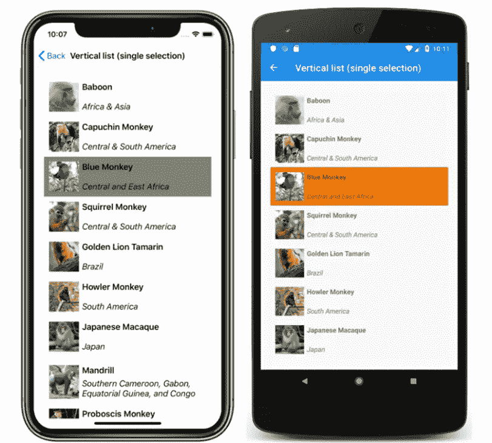
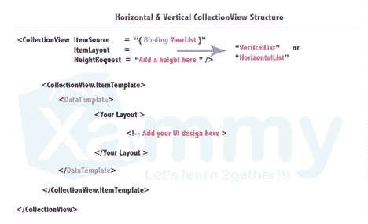

# 以 Xamarin 形式显示数据集合——实用指南

> 原文：<https://blog.devgenius.io/displaying-collections-of-data-in-xamarin-forms-a-practical-guide-31fab01f57e4?source=collection_archive---------0----------------------->

任何应用程序中最常见的任务之一就是显示数据列表。Xamarin Forms 文档提供了几种方法:ListView、CollectionView 和鲜为人知的可绑定布局。

作为一名新的 Xamarin 开发人员，创建一页又一页的数据显示时，我发现很难知道在什么时候使用哪个视图。最初，我发现自己制作了很多列表视图，并努力实现我想要的，所以我转向集合视图，结果遇到了同样的问题。过了几个月，我才意识到第三种选择——可绑定布局——的存在。尽管 ListView 和 CollectionView 提供了更多的“开箱即用”功能，但它们也带有某些难以禁用的功能和其他隐藏的副作用。

我在这篇文章中的目的是帮助区分何时使用这些不同的视图，指出一些警告和有用的提示，并强调可绑定布局是一个鲜为人知的选项。

# ListView 和 CollectionView 的区别

ListView 和 CollectionView 是用于在 Xamarin 中快速显示数据列表的内置视图。他们都以相似的方式工作。通过将数据集合绑定到一个 **ItemSource** 属性，您可以在一个可定制的 **ItemTemplate 中显示集合中的每个项目。**

一个关键的特性是两个视图都有内置的属性，可以很容易地启用或禁用选择。

在本例中，蓝猴子是选定的项目。您可以轻松地跟踪、修改和触发 OnSelection 命令，以便在选中时导航到详细视图。

CollectionView 和 ListView 的代码非常相似，如下所示:

那么这两种观点有什么不同呢？

*   **collection view 是 ListView 的继承者，本质上是一个性能更好、更灵活的版本。**
*   **CollectionView 增加了显示水平列表、网格列表和多选的功能。** ListView 只支持垂直列表和单项选择。它还带有默认的行间分隔线(可以禁用)。
*   **与 ListView 相比，CollectionView 具有不同的简化 API。ListView 包含了“ViewCells”的概念，基本上就是预设的布局选项。**
*   **CollectionView 增加了一个非常有用的 EmptyView 属性**，它允许你定义一个 UI 视图或者简单的字符串，当集合为空时显示。

根据我的经验，我发现在 ListView 中可以做的任何事情，在 CollectionView 中都可以做，但反之则不成立。

# 为什么您可能希望完全避免 CollectionView 和 ListView

*   **强制滚动行为**。这两种视图都带有内置的、不可定制的强制滚动功能。这意味着如果页面的内容超出了设备的大小，**视图将变成可滚动的**。通常，这是可取的。但是考虑一下，如果您有一个 10 只猴子的列表，和一个 10 只大象的单独列表，并且您想在同一页面上显示这两个列表。每个列表的滚动变得独立于更高级别的页面。**在一个页面上显示多个数据列表会产生一个可滚动页面，其中嵌套了两个(或更多)独立的可滚动数据表。**这在移动设备上非常笨拙。一个包含所有数据的可滚动区更为理想。
*   覆盖 UI 属性可能很难或者很混乱。如果我们看猴子的例子，默认选择的项目颜色在 iOS 中是灰色，在 Android 中是橙色。[改变这个颜色的代码是 15 行 xaml，而不是一个简单的属性](https://docs.microsoft.com/en-us/xamarin/xamarin-forms/user-interface/collectionview/selection#change-selected-item-color)。如果您想使用选区，但同时删除颜色，您必须将选区颜色设置为透明。但是，它仍然会显示灰色选择动画 OnTap，根据您的用户界面，这可能看起来很奇怪。我用这个例子来说明禁用和定制这些视图的内置行为和动画是一件令人头疼的事情。
*   众所周知，CollectionView 和 ListView 在增加用户界面的复杂性时是不可预测的。如果你不相信我，请花一点时间仔细阅读 CollectionView [这里](https://github.com/xamarin/Xamarin.Forms/issues?q=is%3Aissue+is%3Aopen+collectionview+%2B+%5BBug%5D)的 359 个未决问题。ListView 有 266 期未决问题。对于你可能遇到的任何问题，通常都有相当简单的解决方法，但是买家要小心。

正确使用 CollectionView 或 ListView 的一个有用的技巧是将页面上的任何附加内容放在 [**页眉和页脚中。**](https://docs.microsoft.com/en-us/xamarin/xamarin-forms/user-interface/collectionview/layout#headers-and-footers) 这将允许附加页面内容随数据一起滚动。

# 具有可绑定布局的 DIY 数据列表

如何才能避免与这些内置行为角力？Xamarin Forms 文档说“当要显示的数据不需要滚动或选择时，可以使用可绑定布局。”事实上，将这两个特性添加到任何一个[可绑定布局中是非常容易的。](https://docs.microsoft.com/en-us/xamarin/xamarin-forms/user-interface/layouts/bindable-layouts#populate-a-bindable-layout-with-data) **使用可绑定的布局，任何 StackLayout 或 Grid 都变成一种灵活的、可定制的方式** **来显示数据。**可绑定布局使用与 CollectionView 和 ListView 非常相似的语法，定义了 **ItemSource** 和 **ItemTemplate。**

`<StackLayout BindableLayout.ItemsSource="{Binding Items}" />`

从那里，您可以添加任何您喜欢的定制，而不需要 CollectionView 或 ListView 的不必要的默认设置。对于滚动，您只需将可绑定布局或整个页面嵌套在一个 [ScrollView](https://docs.microsoft.com/en-us/xamarin/xamarin-forms/user-interface/layouts/scrollview) 中。对于选择和命令，您可以添加一个[点击手势识别器](https://docs.microsoft.com/en-us/xamarin/xamarin-forms/app-fundamentals/gestures/tap)。我发现，一般来说，弄清楚如何向可绑定布局添加内容要比从 CollectionView 中删除内容容易得多。

请记住，在幕后，集合视图和列表视图都只是花哨的可绑定布局。您可以在这些视图中做的任何事情，也可以在可绑定的布局中完成。

# 摘要

*   CollectionView 本质上是 ListView 的一个更加灵活的改进版本。两者都提供了显示数据集合的快捷方式。如果您对 UI 需求不太具体，这是显示数据最快捷、最简单的方式。
*   CollectionView 和 ListView 都包含某些难以修改或禁用的特性，并且随着 UI 变得越来越复杂，它们都越来越容易出现错误和意外行为。
*   如果您发现自己太纠结于 CollectionView 和 ListView 的默认行为，那么创建自定义的可绑定布局会非常容易，而且往往更可取。

**引文:**

雷耶斯，利奥马里斯。"使用收藏视图的布局让您的生活更简单." *AskXammy* 。水平&垂直集合视图结构。askxammy . com/make-your-life-simple-with-the-collection views-layouts-% F0 % 9F % 98% 8E/。2021 年 7 月接入。

布瑞奇，大卫。“Xamarin。窗体集合视图选择—x marin。 *Xamarin |微软文档*。iOS 和 Android 上带有单项选择的 CollectionView 垂直列表的屏幕截图。docs . Microsoft . com/en-us/xa marin/xa marin-forms/user-interface/collection view/selection。2021 年 7 月接入。

## ——内特·福尔科夫， [AWH](http://awh.net) 的软件开发人员。我们正在帮助企业通过技术推动增长。