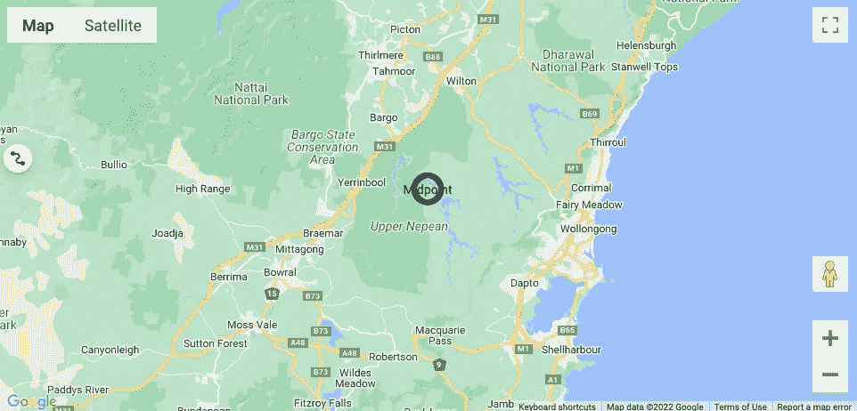
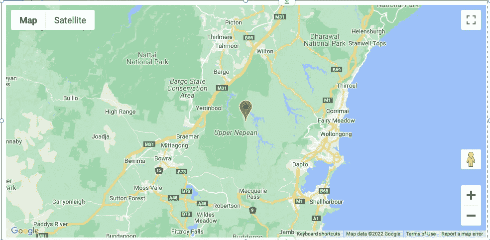
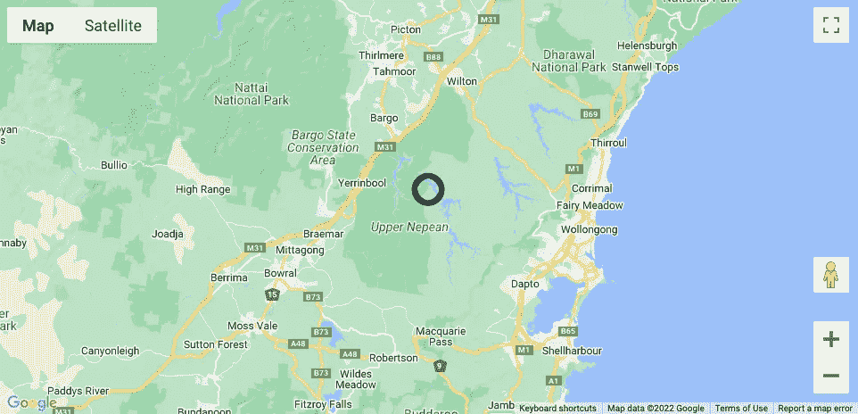

# 使用 Wix Velo 在 Google 地图上显示地图和标记—多个标记

> 原文：<https://blog.devgenius.io/displaying-map-marker-multiple-markers-on-google-maps-with-wix-velo-7a9f2209fc7a?source=collection_archive---------6----------------------->

## Wix Velo 历险记

欢迎回到我的用 Wix Velo 在 Google 地图上显示多个位置的系列文章。我很兴奋也很感激你选择看我学到的东西，我希望这篇教程对你有所帮助。

# 我们这个系列的目标

我们这个系列的目标是建立一个网站，将多个动态地图数据点的显示完全集成到一个谷歌地图显示中。我们希望能够更新一个位置，并让它几乎立即显示在我们的网站上。如果你想了解为什么这很重要，这里是我的介绍。

**工作示例:**我们将使用的示例显示在[这里](https://www.creativeappnologies.com/multi-location-maps)。

**Github / Code Repo:** 对于觉得有用的人来说，这里的[是公开的 Github Repo](https://github.com/jimtin/dynamic-multi-location-maps-wix-velo)。

在这一过程中，我将分享一些关于安全性考虑的技巧，以及一些有帮助的观察，希望能为您节省大量的故障排除时间。每集的完整列表可以在每集的底部找到。

一如既往，希望这些内容有所帮助。当你花时间为一集鼓掌、订阅我的故事或使用[我的推荐链接](https://appnologyjames.medium.com/membership)注册 Medium 时，这对我意味着绝对的世界。它让我知道我的故事正在帮助你❤️.

尽情享受，随时在 twitter 上给我发 [DM，在](https://twitter.com/blockchainvalu1)[LinkedIn](https://www.linkedin.com/in/jameshinton84/)/[Github](https://github.com/jimtin)上发表想法和评论😃

# 在这一集中

这是非常令人兴奋的一集，因为我们终于可以开始用我们的(到目前为止)空 HTML 元素做一些有趣的事情了。希望在这一集结束的时候，你能看到这一切😃

以下是我们将要讨论的内容:

1.  设置一个谷歌地图 API 键(你需要一个)
2.  显示通用谷歌地图(无标记)
3.  添加标记
4.  使用自定义图像和自定义标题自定义标记

这是我的地图在这一集结束时的样子:

# 设置您的 Google API 密钥

为了在你的谷歌地图上显示多个标记，你需要使用一个[谷歌地图 API 键](https://developers.google.com/maps/documentation/javascript/get-api-key)。与大多数谷歌云产品一样，这真的很容易设置，他们有关于如何获得它的可靠教程。对我们的目的来说更好的是，他们每月提供大量的免费使用。

现在就去做，然后把它保存在安全的地方。

## Google API 密钥安全性

和所有事情一样，我们需要注意自己的安全。对于这一集，我们需要确保我们的 API 密钥是安全的。这一点尤为重要，因为 iframe 的使用意味着我们的 Google API 密钥将被暴露。

我不会亲自给你演示如何做，我会给你链接到[Wix’Velo 文档](https://www.wix.com/velo/forum/tips-tutorials-examples/secure-a-google-maps-api-key-in-an-htmlcomponent)和谷歌[最佳实践](https://developers.google.com/maps/api-security-best-practices#restrict_apikey)。我恳求你至少**限制你的密钥，只使用你的网站推荐人。**

请注意，您应该为您的已发布网站和草稿网站这样做——因此总共有两个推荐网站😃。如果您不这样做，您的地图将无法在这些位置之一工作。

# 显示我们的地图

我们的下一步是让我们的通用谷歌地图显示。我们不寻找任何花哨的东西，只是一个很好的，美丽的地图显示在我们的 iframe。

我们将在谷歌地图教程的基础上做一些补充。

## HTML 代码

1.  导航到[谷歌地图简单地图教程](https://developers.google.com/maps/documentation/javascript/overview#maps_map_simple-html)的 HTML 组件
2.  将代码从这里复制到你的剪贴板
3.  导航回您的 iframe
4.  点击“输入代码”
5.  将复制的代码粘贴到窗口中
6.  导航到行`src="https://maps.googleapis.com/maps/api/js?key=SOME_KEY&callback=initMap&v=weekly"`
7.  用您自己的 Google Maps API 密钥替换密钥
8.  (可选)根据您使用的浏览器窗口和操作系统，Wix 编辑器上的弹出窗口可能无法显示您想要查看的所有代码。一个解决办法是简单地向下导航到底部，并添加 4 个或更多的回报。
9.  (可选)删除脚本的注释部分。至少在我的编辑器中，它占据了大量的空间，而且格式也不正确，所以我干脆把它删除了。
10.  (可选)将页面标题更改为对您更有意义的标题。
11.  按下“更新”按钮

现在，你的框架应该变成一个空盒子。这并不十分有用，但确实显示了一些进步。

## Javascript 代码

下一步是通过 javascript 初始化 HTML 框架中的地图。

1.  导航回到[谷歌地图简单地图教程](https://developers.google.com/maps/documentation/javascript/overview#maps_map_simple-javascript)
2.  选择“JavaScript”部分
3.  将代码复制到那里。
4.  导航到 Wix 编辑器
5.  导航到第一个`</script>`标签
6.  在这个标签下，创建一组新的``标签。我通常这样做，这样我就可以跟踪我创建/修改的代码，与我从其他来源使用的代码进行比较。
7.  在这组新的脚本标记中，粘贴刚刚复制的代码
8.  选择“更新”

此时，可能会发生两种情况之一。要么你将继续显示一个空框，要么更令人沮丧的是，你将在屏幕上有一个谷歌地图闪烁大约 0.5 秒，然后变成空白。

## 固定

解决这个问题出奇的简单。它位于`
`线。我们需要向嵌入的元素声明我们希望如何显示地图。为了避免混淆，我们总是将它设置为 100%的高度和 100%的宽度。这是因为我们使用“父”站点中的框架来声明地图的大小和宽度，并假设该框架总是完全填充的。我知道这令人困惑，但你走了😃。

为此，请将该行替换为:`

`

再次选择“更新”,瞧！我们有一个谷歌地图显示😄

# 添加标记

我们的下一步是在地图上添加一个标记。这将最初采取通用标记的形式，在我们稍后定制它之前。

## 准备变量

对于这一步，我们添加了两个变量叫做`midpoint`和`midpointLocation`。这些变量为地图设置我们的**中点**位置，并将兼作我们的中点标记位置。

请执行以下操作:

1.  导航到地图的“编辑代码”部分
2.  导航到代码的`let map;`行
3.  在这一部分，插入下面一行:`let midpoint = {lat: WHATEVER_LATITUDE_YOU_LIKE, lng: WHATEVER_LONGITUDE_YOU_LIKE, Title = "Midpoint"}`
4.  接下来，添加我们的中点位置变量:`let midpointLocation = { lat: midpoint.lat, lng: midpoint.lng };`
5.  现在用`center: midpointLocation`替换线`center: {lat: -34.397, lng: 150.644 }`
6.  按“更新”。你的地图不会有任何改变。

我们将在这里暂停一下，回顾一下到目前为止的代码。这是:

## 放置中点标记

正如承诺的，我们的地图需要一个标记。使用谷歌地图教程从这里的[开始](https://developers.google.com/maps/documentation/javascript/markers)，代码真的很简单。我们将通过使用前面创建的两个变量使它变得更简单。方法如下:

1.  在 Wix 编辑器上，按下 HTML 组件上的“编辑代码”
2.  在功能`function initMap()`部分，滚动至功能底部。
3.  在底部，添加以下代码:

快速“更新”和万岁！您应该在您的中点(这是您当前的默认位置)有一个标记。这是我在这个阶段的样子。

# 定制我们的标记

这一集的最后一步是定制我们的标记。这对你和你的客户有很多实际的好处，而且还有点意思。

## 添加图标

我使用了我的[公司](https://www.creativeappnologies.com)图标的定制版本。这个图标存储在我的 Wix 站点上，这使得在图像中引用它变得非常简单。

你可以使用任何你可以引用的图片，甚至是. svg。但是要确保它是合法的😉

流程是这样的:

1.  导航到 Wix 网站上的“媒体”部分
2.  转到您的“站点文件”部分
3.  选择您想要使用的图像
4.  右击图片，然后选择“复制网址”
5.  将此链接粘贴到某处
6.  转到 Wix 编辑器，在 HTML 组件上选择“编辑代码”
7.  在`let midpoint`行下面，声明一个新变量`let markerImage = PASTE_YOUR_URL_LINK_HERE`
8.  向下导航到`new google.maps.Marker`部分，并在函数中添加以下内容:`icon: markerImage`
9.  更新你的编辑器，你应该在你的默认位置有一个漂亮的图标

下面是我的标记代码的样子:

这是马克笔。就在悉尼郊外几小时车程的一条美丽的步行道中间。

## 添加标题和标签

谷歌经常显示带有字母字符的标记。这是一个简单的方法，可以有效地从第一个“A”到它结束的任何地方排列标记。

然而，我们可以做得更多。我们可以用类似于标记标题的名称来命名它:中点。我相信你能想到其他有趣的标签。

为此，导航回`google.maps.Marker`并添加以下行:

1.  `label: midpoint.Title`
2.  `title: midpoint.Title`

再次更新您的代码，看看结果！

下面是标记代码的一个简短片段:

这是我的地图的样子:

# 到目前为止 HTML 框架的全部代码

我们在这一集里讲了很多代码，所以这是这一集的 HTML 框架的完整代码:

# 结束第三集

第三集到此为止！我非常兴奋，我们现在有一个可爱的谷歌地图显示在我们的网页上，带有定制的图标。这是一个不可思议的成就。

我为你坚持到现在感到骄傲。干得好！

在下一集，我们将开始展示我们动态变化的位置。我们现在真的快要结束了，所以坚持下去！

## 剧集列表:

这一系列剧集的完整列表链接如下，帮助你快速浏览❤

1.  [建立我们的网站](https://appnologyjames.medium.com/setting-up-our-website-multiple-markers-on-google-maps-with-wix-velo-d110a3542994)
2.  [查询位置集合并计算中点](https://appnologyjames.medium.com/querying-location-collection-and-calculating-midpoint-multiple-markers-on-google-maps-with-wix-d93e3389a12a)
3.  [显示地图&标记](https://appnologyjames.medium.com/displaying-map-marker-multiple-markers-on-google-maps-with-wix-velo-7a9f2209fc7a)
4.  [HTML 元素&发送数据](https://appnologyjames.medium.com/html-elements-and-sending-data-multiple-markers-on-google-maps-with-wix-velo-2f4e8a6f3336)
5.  [自动更新和调整地图大小](https://appnologyjames.medium.com/auto-updating-and-resizing-map-multiple-markers-on-google-maps-with-wix-velo-874b68c77483)