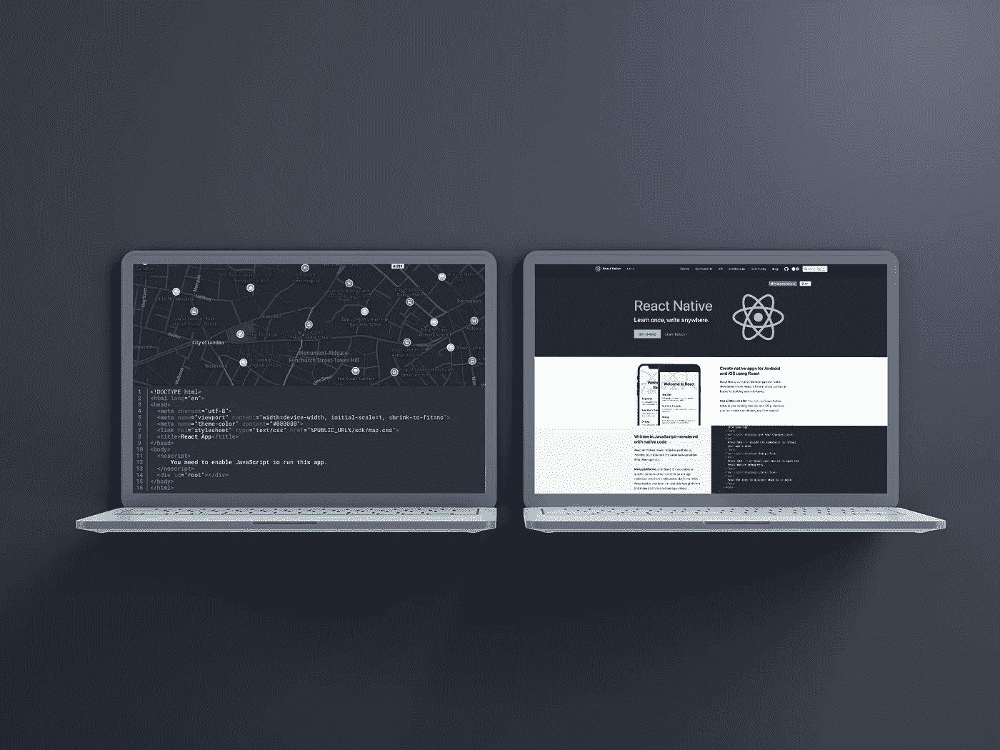
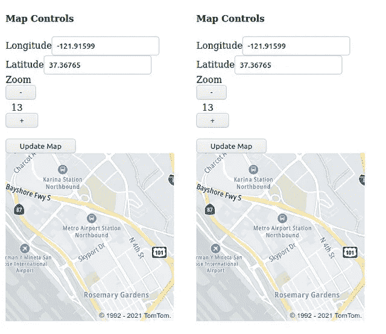
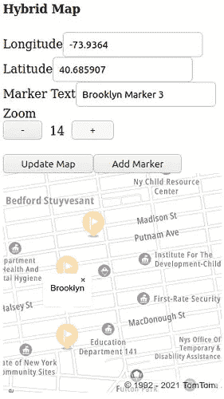
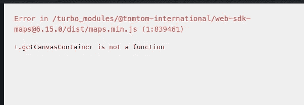
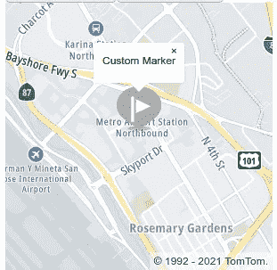
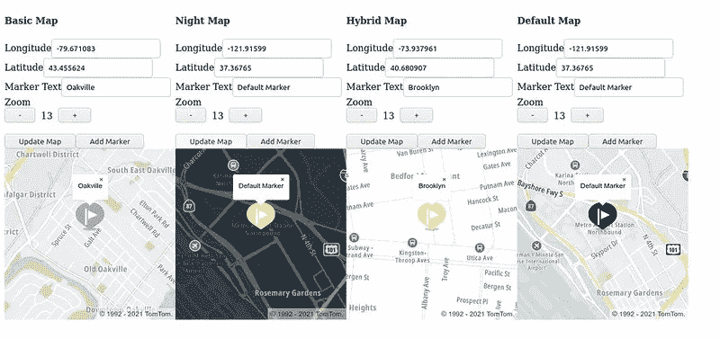

# 使用 React 和 TomTom Maps SDK for Web 显示多个地图

> 原文：<https://blog.devgenius.io/displaying-multiple-maps-with-react-and-tomtom-maps-sdk-for-web-1016e99e3432?source=collection_archive---------9----------------------->

## 了解如何添加和显示多个地图位置以跟踪驾驶员、规划各种路线等。



在很多情况下，web 应用程序的用户可能需要查看地图上的多个位置。TomTom Maps SDK for Web 通过使用 React 简化了这个过程。在 TomTom Maps SDK for Web 旁边使用一个函数组件使得在屏幕上显示多个地图变得流畅而直接。

React 使我们能够创建一个应用程序，在一个组件中包含所有相关的功能，并且能够多次复制它。它是可用的最流行的客户端框架之一，因为它使开发人员可以轻松地创建组件并重用它们作为更大更复杂的应用程序的构建块。

在本教程中，我们将回顾如何使用 TomTom Maps SDK for Web 显示多个地图。我们将从为地图创建一个 React 功能组件开始。然后，我们将使用组件在应用程序上显示多个地图。我们还将通过向每个组件添加标记来探索在单页应用程序(SPA)中与多个地图的交互。最后，我们将公开参数来更改地图样式。

我们开始吧！

# 先决条件

本文使用 TomTom Maps SDK for Web 版本 6 和 React 17 或以上。你需要一个来自 [TomTom 开发者门户的免费 API 密匙来跟随](https://developer.tomtom.com/)。一个免费增值账户每天提供成千上万的请求，适合商业用途——只需随增长付费。

您还需要使用以下命令创建 react 应用程序:

```
npx create-react-app my-app
```

此外，使用 my-app 文件夹中的命令安装 Maps SDK for Web:

```
npm i @tomtom-international/web-sdk-maps –save
```

最后，您应该熟悉 JavaScript，并按照本教程进行操作。我们将向您展示如何使用 TomTom 的解决方案。

# 创建地图功能组件

创建地图功能组件有四个基本步骤。第一步是为组件创建一个 map.js 文件。

接下来，导入 SDK 和默认的 CSS 表单。请注意，您可能需要制作一份副本，并根据自己的喜好进行定制。

```
import "@tomtom-international/web-sdk-maps/dist/maps.css";
import * as tt from "@tomtom-international/web-sdk-maps";
```

然后，使用以下内容创建一个新的功能组件:

```
export function Map(props) {
    return <></>
}
```

在功能组件内部，使用 useEffect 钩子来初始化映射:

```
let map = tt.map({
    /* 
    This key will API key only works on this Stackblitz. To use this code in your own project,
    sign up for an API key on the TomTom Developer Portal.
    */
   key: {your API Key},
    container: mapElement.current,
    language: language,
    style: { map: style },
    center: [mapLongitude, mapLatitude],
    zoom: mapZoom,
    });
    setMap(map);
    setInitialized(true);
    return () => map.remove();
}, []);
```

最后，使用以下代码呈现地图:

```
return <div ref={mapElement} className="mapDiv" />
```

如果你有兴趣看一个如何使用钩子创建一个以给定点(地图经度和地图纬度)为中心的地图组件的详细例子，请查看[这篇](https://developer.tomtom.com/blog/build-different/adding-tomtom-maps-modern-react-app)博客文章。

# 使用地图组件

使用地图组件很容易。转到 App.js 并在返回中添加地图组件:

```
function App() {
    return (
        <div className="App">
            <Map />
            <Map />
        </div>
    );
}
```

使用组件允许我们随意添加地图的许多实例。例如，这将在应用程序上放置两个相同的地图。

```
function App() {
    return (
        <div className="App">
            <Map />
            <Map />
        </div>
    );
}
```

根据需要使用尽可能多的组件。若要更改容器的大小，请使用。mapContainer 和。CSS 文件中的 mapDiv 选择器:

```
.mapContainer {
    margin-top: 25px;
}
.mapDiv{
    height: 300px;
    width: 300px;
}
```

您的应用程序应该类似于包含两张地图的屏幕截图:



这一步的代码在 StackBlitz 上[可用。](https://stackblitz.com/edit/react-9twdpn?file=src/map.js)

# 创建和添加标记

标记是我们在地图上看到的指示特定位置的大头针。我们可以使用 Maps SDK for Web 的 Marker API 向地图[添加标记。](https://developer.tomtom.com/maps-sdk-web-js/documentation#Maps.Marker)

```
var marker = new tt.Marker()
             .setLngLat([longitude, latitude])
             .addTo(map);
```

我们可以创建一个**添加标记**按钮，该按钮获取纬度和经度坐标，并使用给定的坐标制作一个标记来演示该功能。

首先定义坐标的状态:

```
const [mapLongitude, setMapLongitude] = useState(-121.91599);
const [mapLatitude, setMapLatitude] = useState(37.36765);
```

然后，创建映射到这些值的输入:

```
<Input
    type="text"
    name="longitude"
    value={mapLongitude}
    onChange={(e) => setMapLongitude(e.target.value)}
/><Input
    type="text"
    name="latitude"
    value={mapLatitude}
    onChange={(e) => setMapLatitude(e.target.value)}
/><Button color="primary" onClick={addMarker}>
    Add Marker
</Button>
```

接下来，创建 addMarker 函数:

```
const addMarker = () => {
const targetCoordinates = [mapLongitude, mapLatitude];
const marker = new tt.Marker().setLngLat(targetCoordinates).addTo(map);
};
```

现在，我们可以添加一个当用户单击标记时显示的弹出框:

```
var popupOffsets = {
    top: [0, 0],
    bottom: [0, -50],
    left: [25, -35],
    right: [-25, -35]
}var popup = new tt.Popup({ offset: popupOffsets })
    .setHTML("Custom Marker");
    marker.setPopup(popup);
```

使用 marker.togglePopup 控制弹出窗口的可见性。

现在我们有了在同一张地图上添加多个标记所需的所有功能，如下图所示。



# 加载时加载标记

创建地图启动时的标记，让用户可以看到地图中心点周围的区域。

我们可以使用 useEffect 钩子来实现这一点。当组件中的给定参数改变时，useEffect 钩子执行它的代码。

我们已经看到了如何使用它来启动 TomTom 地图。useEffect 挂钩有一个参数列表[]，这意味着它在应用程序第一次创建组件时执行一次。

标记需要等待地图完成初始化。第一个尝试是在 setMap 调用之后调用 addMarker。



地图尚未完成初始化，导致出现错误。但是，我们可以引入另一种状态来表示地图加载完毕。然后，我们使用另一个 useEffect 钩子对初始化状态做出反应。

```
useEffect(() => {
    if (initialized) {
        addMarker();
    }
}, [initialized]);
```

如果需要，我们可以[定制标记](https://developer.tomtom.com/maps-sdk-web-js/documentation#Maps.Marker)。例如，我们可以通过在新的 tt 中指定这些属性来更改标记的颜色、宽度和高度。Marker()调用。

```
new tt.Marker({
    color: ‘#ABABAB’,
    width: ‘50px’,
    height: ‘50px’,
}
```



# 自定义地图组件

既然我们已经研究了如何设计一个标记的样式，我们可以看到制作地图组件的好处。我们可以传入参数，以不同的方式设置每个地图实例的样式。

创建地图组件包括四个步骤:

1.将一个 props 变量传递到我们的组件中，这样声明就变成了导出函数映射(props)。

2.在组件内部创建一个变量/状态，对应我们定义的属性，比如 const color = props.markerColor？？# CCCCCC '；。

3.使用变量来自定义地图。例如，我们可以改变新 tt。Marker()调用成为 const marker =新 tt。标记({color: color})来更改标记的颜色。

4.组件实例化时传入属性，例如<map markercolor="”#ABABAB”">。</map>

与标记类似，TomTom 地图也是可定制的。

如前所述，创建地图时可用的选项之一是经度和纬度组合的坐标。要将其作为参数传入，我们需要做的就是更改状态初始化，如下所示:

```
const [mapLongitude, setMapLongitude] = useState(-121.91599);
const [mapLatitude, setMapLatitude] = useState(37.36765);
```

到使用传入属性的:

```
const [mapLongitude, setMapLongitude] = useState(props.longitude ?? -121.91599);
const [mapLatitude, setMapLatitude] = useState(props.latitude ?? 37.36765);
```

现在，我们可以在屏幕上显示地图时设置纬度和经度:

```
useEffect(() => {
    let map = tt.map({
/* 
This API key only works on this StackBlitz. To use this code in your own project,
sign up for an API key on the TomTom Developer Portal.
*/
    key: {your API Key},
    container: mapElement.current,
    language: language,
    style: { map: style },
    center: [mapLongitude, mapLatitude],
    zoom: mapZoom,
    });
    setMap(map);
    setInitialized(true);
    return () => map.remove();
}, []);
```

样式既可以是传入的属性，也可以是组件内切换的状态，参见完整实现[这里](https://stackblitz.com/edit/react-bqcv4c?file=src/map.js)。

```
<Button color="primary" onClick={() => {
    const toggleStyle = style === 'basic_main' ? 'basic_night' : 'basic_main';
    setStyle(toggleStyle);
    map.setStyle({map: toggleStyle})
}}>Toggle Style</Button>
```

# 把它放在一起

使用 TomTom，您可以快速轻松地构建地图应用程序。在本教程中，我们讨论了使用 TomTom Maps SDK for Web 制作 React 组件，使开发人员能够调整他们想要在组件周围显示的参数。该组件还允许我们在屏幕上同时显示多个地图及其相应的参数。

类似地，我们可以引入更多的属性来改变这个组件的行为。title 和 markerText [在这里](https://stackblitz.com/edit/react-xz7gek?file=src/map.js)的使用是调整组件以适应我们需求的很好的例子。



# 后续步骤

地图显示提供了更多选项。例如，我们可以在地图上显示交通信息、事件和兴趣点(poi)。我们还可以将许多事件处理程序附加到地图上，包括 zoom 和 Click&Touch。查看[地图](https://developer.tomtom.com/maps-sdk-web-js/documentation#Maps.Map)和[标记](https://developer.tomtom.com/maps-sdk-web-js/documentation#Maps.Marker)文档，了解 TomTom Web SDK 的全部细节。

TomTom 入门很简单！[注册](https://developer.tomtom.com/)获得免费 API 密匙，立即开始创建。

*本文原载于*[developer.tomtom.com/blog](https://developer.tomtom.com/blog)*。*