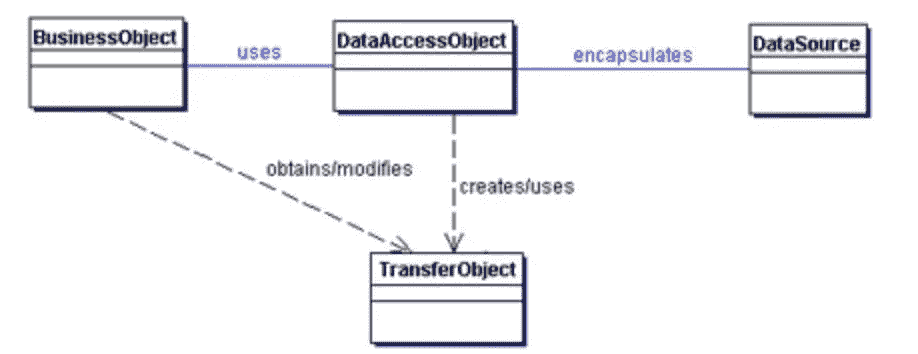
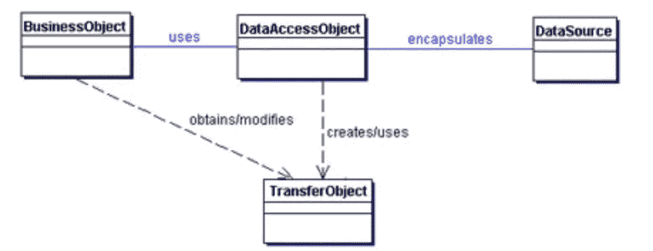
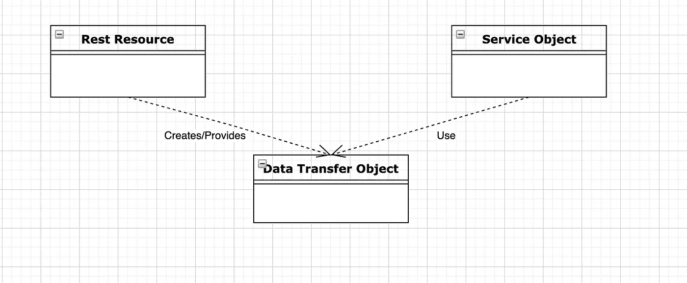
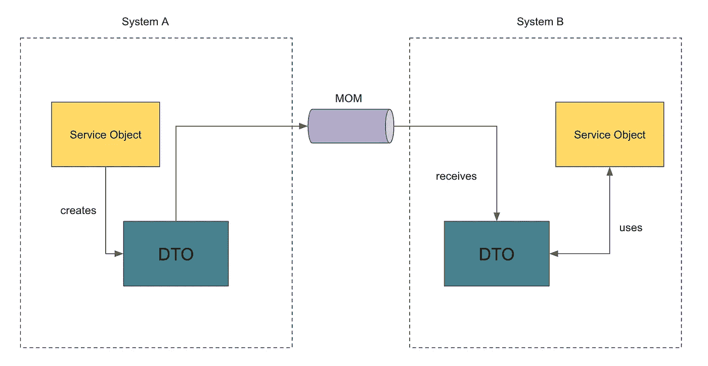

# 剖析 DTO 模式

> 原文：<https://blog.devgenius.io/dissecting-the-dto-pattern-ac3e54d0e4c8?source=collection_archive---------0----------------------->

DTO 模式是数据传输对象模式。这是一个非常古老的模式，我相信它起源于 J2EE(现在的 Java EE)。

我不认为人们像他们那样完全理解这种模式。我也不知道。我这样说的原因是因为我看到其他人在许多不同的地方使用它，我也是！

所以我在想，使用这种模式的正确方法或地方是什么？到底有没有正确的方法？

对我来说，我喜欢从字面上理解这个模式的含义。

它被称为 DTO——是数据传输对象的首字母缩写。所以我把它理解为一个可以用来传输数据的物体。即其中包含可以在各处传递的数据的对象。

听起来很简单，对吗？

嗯……我不认为它像看起来那么简单。

从历史上看，J2EE 指定它的方式是使用这个“DTO”来捕获使用 DAO(数据访问对象—是的，另一种模式)从数据库表中检索的数据。DAO 将通过 JDBC 调用数据库，并将它获得的数据存储在一个对象(DTO)中，然后将该对象发送回所谓的“业务层”/“服务层”——不管它是什么术语——以供使用。

使用这种方法的人通常认为这是唯一应该使用 DTO 的地方。

然而，除此之外，我还见过许多其他用例。

DTO 的另一个常见用途是将其用作 Rest 资源模型对象或“请求”对象。在一个典型的 Java Spring Boot web 应用程序中，您定义了“Rest 控制器”,也定义了代表您所请求的请求的“Rest 模型对象”。

Rest 资源将 DTO 传递给下面的服务层中的服务对象，以便以它希望的任何方式使用 DTO(通常，从它那里提取数据来进行所需的某些计算)。

就我个人而言，我不喜欢在 Rest 资源对象中使用“DTO”——或者更具体地说，在 Rest 资源对象中使用“DTO”的命名。从心理上来说，我喜欢对我们在某些层面上交互的对象有一个清晰的定义。因此，在这种情况下，我宁愿将 REST 资源使用的这些对象命名为“资源对象”，或者更明确地根据它们在 Rest 交互中的使用位置命名为“请求对象”或“响应对象”。我见过很多项目使用这些命名约定。也许他们毕竟是 dto，这纯粹是一个命名的问题。

一切都不是问题。问题就这样开始出现了，有些开发人员争论说 d to 只属于 DAO(特别是那些来自非常强大的传统 J2EE 背景的开发人员),而其他开发人员每次需要开发新的 API 端点方法时，他们都会大喊“哦，我们需要一个 DTO 来建模‘请求/响应’等等”

在涉及到 MOM(面向消息的中间件)的地方，比如 RabbitMQ、Kafka、ActiveMQ 或任何其他消息系统，人们也利用 dto 在不同的应用程序/系统之间共享。

在这种模式下，dto 将被打包到一个称为“共享库”的独立项目中。每个应用程序项目都会将共享库作为依赖项导入到它们的项目中。

现在，这是有道理的，也是符合逻辑的。

然而，稍微偏离一下，dto 在理想情况下应该是不可变的。特别是如果你从字面上理解 DTO 的意思，那么你不会希望你的传输对象在传输过程中被篡改。在 JavaBeans 风格的对象建模中，你有 getter/setter，我们知道我们可以用 setter 做什么！

但这导致了另一个问题。实现不变性的一个方法是去掉 setters 以避免私有内部数据字段被设置。然而，当您使用 Jackson 进行 JSON 对象编组/解编组时(因为您希望您的用户请求使用 JSON，并且您以 JSON 格式提供您的数据),您不能真正摆脱您的 setters。Jackson 研究 JavaBeans 约定。

现在回到我在的地方…

你看到我的难题了吗？

我认为最初这种模式的发明者对它应该用在哪里有自己的想法，但是随着软件开发的发展，它已经有了多种有效的用法。

我的总体观点是，只要它用于将数据从一个地方传输到另一个地方，那么不管它在哪里使用，它都是完全可以接受的用例。