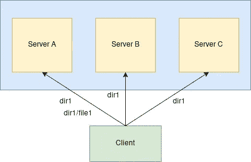

# 在 glusterfs 中分配体积

> 原文：<https://blog.devgenius.io/distribute-volume-in-glusterfs-de167af1d518?source=collection_archive---------5----------------------->

这个故事是关于 glusterfs 中一个简单的分发卷。如何创建它以及它与复制卷有何不同。这是上一个关于在 glusterfs 中复制卷的故事的延续。



在 glusterfs 中分配体积

现在，使用复制卷将保证数据可靠性的基本水平。但这不是用户唯一关心的问题，对吗？

对…如果我使用文件系统，我会期望可靠性，但同时，我不会仅仅在所有 N 个磁盘中创建 N 个数据副本。我也期待一些分配。所以这是一个分配和复制的平衡行为。(现在，我们还有地理复制和其他场景，但在本案例中，我们将假设我们只知道复制和分发卷。)

首先，我们需要展示一个基本的分布式设置。一台服务器足以展示该功能，但我们还是用一台服务器吧

我的设置有三个 Fedora 32 虚拟机，每个都有 2 个 CPU、2 GB RAM、20 GB 主磁盘和另外 10 GB，我已经在 xfs 中格式化并挂载了这些虚拟机(用于构建块)。

现在，正如最初的图片所示，我们有三个节点(或服务器)，当我说分发时，数据将在这些节点(服务器)之间分发。我们不会深入研究数据如何在节点之间分布的逻辑(咳咳 DHT)，这需要它自己的故事。

回到步骤…我有三台虚拟机服务器 a、服务器 b 和服务器 c

使用以下命令在所有虚拟机中启动 glusterfs 服务

```
[root@servera ~]# systemctl start glusterd
```

如果还没有开始的话。

一旦启动(您可以检查状态，并确保守护进程不会由于某些错误而终止。必须检查是否所有的初始配置都已正确完成。)，我们只需要创建一个可信的存储池(我们的集群)。

```
[root@servera ~]# gluster peer probe serverb
peer probe: success
```

对第三台服务器重复相同的步骤。请记住，从已经是集群一部分的任何节点进行探测(这意味着在我的例子中，由于 servera 和 serverb 在集群中，我应该从这两个节点探测 serverc，而不是从 serverc 探测这些对等节点)。

完成后，只需检查对等状态以确保一切正常。

```
[root@servera ~]# gluster peer status
Number of Peers: 2Hostname: serverb
Uuid: 6ae1884c-b2ee-4cae-b930-7a7124567cc0
State: Peer in Cluster (Connected)Hostname: serverc
Uuid: 8133a337-c622-4fad-b704-447a33ddc909
State: Peer in Cluster (Connected)
```

太好了！

继续下一步，即卷创建。

```
[root@servera ~]# gluster vol create vol-1 \
> servera:/data/glusterfs/vol-1/brick \
> serverb:/data/glusterfs/vol-1/brick \
> serverc:/data/glusterfs/vol-1/brick
volume create: vol-1: success: please start the volume to access 
data
```

现在，要检查创建的卷的信息，

```
[root@servera ~]# gluster vol info vol-1

Volume Name: vol-1
Type: Distribute
Volume ID: fc00a6b7-970c-49b5-a4dd-45c2022edbc5
Status: Created
Snapshot Count: 0
Number of Bricks: 3
Transport-type: tcp
Bricks:
Brick1: severra:/data/glusterfs/vol-1/brick
Brick2: serverb:/data/glusterfs/vol-1/brick
Brick3: serverc:/data/glusterfs/vol-1/brick
Options Reconfigured:
storage.fips-mode-rchecksum: on
transport.address-family: inet
nfs.disable: on
```

我们现在可以继续启动音量，

```
[root@servera ~]# gluster volume start vol-1
volume start: vol-1: success
```

启动后，我们可以看到状态，

```
[root@servera ~]# gluster vol status vol-1
Status of volume: vol-1
Gluster process                             TCP Port  RDMA Port  Online  Pid
------------------------------------------------------------------------------
Brick severra:/data/glusterfs/vol-1/brick                    49152     0          Y       1881182
Brick severrb:/data/glusterfs/vol-1/brick                    49152     0          Y       337724
Brick severrc:/data/glusterfs/vol-1/brick                    49152     0          Y       248403

Task Status of Volume vol-1
------------------------------------------------------------------------------
There are no active volume tasks
```

既然我们的卷已经启动，我们可以挂载它并开始探索它。让我们在安装了 glusterfs-client 包后挂载它。

```
[root@serverd ~]# mount -t glusterfs servera:vol-1 /mnt/vol-1
```

现在，一旦挂载完毕，让我们在挂载点内创建三个目录。

```
[root@serverd vol-1]# mkdir dir{1..3}
[root@serverd vol-1]# tree
.
├── dir1
├── dir2
└── dir33 directories, 0 files
```

让我们来看看引擎盖下是什么，(技术上讲，砖里发生了什么。)

假设我们转到 servera 并导航到 brick 目录，

```
[root@servera ~]# cd /data/glusterfs/vol-1/brick
[root@servera brick]# tree
.
├── dir1
├── dir2
└── dir33 directories, 0 files
```

嗯…另外两个服务器的情况如何？

```
[root@serverb ~]# cd /data/glusterfs/vol-1/brick
[root@serverb brick]# tree
.
├── dir1
├── dir2
└── dir33 directories, 0 files
```

而在 serverc？

```
[root@serverc ~]# cd /data/glusterfs/vol-1/brick
[root@serverc brick]# tree
.
├── dir1
├── dir2
└── dir33 directories, 0 files
```

等等，我们不是在用分布式卷吗？

在得出结论之前，让我们先做一件小事。让我们在每个目录中创建 10 个文件，

```
[root@serverd vol-1]# touch dir{1..3}/file{1..10}
[root@serverd vol-1]# tree
.
├── dir1
│   ├── file1
│   ├── file10
│   ├── file2
│   ├── file3
│   ├── file4
│   ├── file5
│   ├── file6
│   ├── file7
│   ├── file8
│   └── file9
├── dir2
│   ├── file1
│   ├── file10
│   ├── file2
│   ├── file3
│   ├── file4
│   ├── file5
│   ├── file6
│   ├── file7
│   ├── file8
│   └── file9
└── dir3
    ├── file1
    ├── file10
    ├── file2
    ├── file3
    ├── file4
    ├── file5
    ├── file6
    ├── file7
    ├── file8
    └── file93 directories, 30 files
```

现在，让我们看看每台服务器都有哪些模块…

servera，

```
[root@servera brick]# tree
.
├── dir1
│   ├── file10
│   ├── file3
│   ├── file4
│   ├── file7
│   └── file9
├── dir2
│   ├── file5
│   ├── file6
│   └── file8
└── dir3
    ├── file5
    ├── file6
    └── file83 directories, 11 files
```

服务器 b，

```
[root@serverb brick]# tree
.
├── dir1
│   ├── file1
│   └── file2
├── dir2
│   ├── file10
│   ├── file3
│   ├── file4
│   ├── file7
│   └── file9
└── dir3
    ├── file10
    ├── file3
    ├── file4
    ├── file7
    └── file93 directories, 12 files
```

最后，服务器 c

```
[root@serverc brick]# tree
.
├── dir1
│   ├── file5
│   ├── file6
│   └── file8
├── dir2
│   ├── file1
│   └── file2
└── dir3
    ├── file1
    └── file23 directories, 7 files
```

当您合计文件总数时，目录 dir1、dir2 和 dir3。结果是 10 个(在每个目录中)。现在，用户仍然可以手动检查是否有任何文件重复，但是，正如其名称所示，这是一个分布式卷。

因此，在分布卷的情况下，分布的是挂载点内目录中的底层文件。目录不是。这些文件是。

现在，一种试验方法是在挂载点内创建 100K 个目录，然后检查它是在所有节点中创建的还是分布式的。

这是一个简单分布式卷。现在，可能随着上述实验，人们也可以看到如何组合分布式和复制卷。