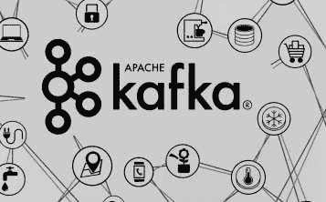
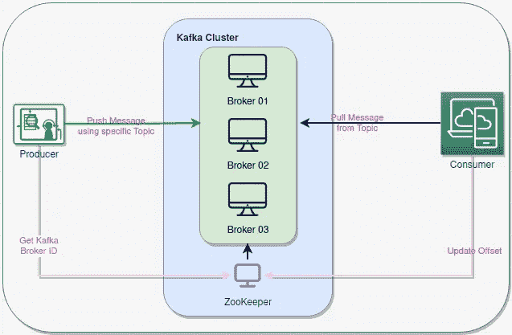
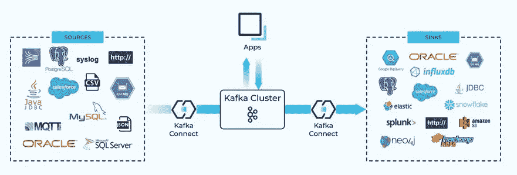

# 使用 Apache Kafka 的分布式数据流

> 原文：<https://blog.devgenius.io/distributed-data-streaming-with-apache-kafka-af47c74f97b1?source=collection_archive---------8----------------------->

afka 是为分布式高吞吐量系统而设计的。作为更传统的消息代理的替代品，Kafka 表现得很好。与其他消息传递系统相比，Kafka 具有更好的吞吐量、内置分区、复制和固有的容错能力，这使得它非常适合大规模消息处理应用程序。

来源:https://blog.knoldus.com/introduction-to-apache-kafka/

Kafka 为其用户提供了三个主要功能:

*   发布(写)和订阅(读)记录流，包括从其他系统连续导入/导出您的数据。
*   按照记录生成的顺序有效地存储记录流
*   实时处理记录流

Kafka 是分布式[数据流](https://www.redhat.com/en/topics/integration/what-is-streaming-data)平台，主要用于构建实时数据流管道和适应数据流的应用程序。它结合了消息传递、存储和流处理，允许存储和分析历史和实时数据。简而言之，它移动大量的数据——不仅仅是从 A 点到 B 点，而是从 A 点到 Z 点以及你需要的任何地方，所有这些都是同时进行的。

# 卡夫卡建筑组件

卡夫卡组件包括:经纪人、动物园管理员、生产者和消费者。

卡夫卡建筑组件

**Kafka Broker:** 从物理基础设施的角度来看， [Apache Kafka](https://www.confluent.io/what-is-apache-kafka/) 由一个称为代理的机器网络组成，每个代理运行 Kafka Broker 进程。每个代理托管一些分区集，并处理传入的请求，以便向这些分区写入新事件或从中读取事件。

**Zookeeper:** 主要用于跟踪 Kafka 集群中节点的状态，维护 Kafka 主题和消息列表。

**生产者:**生产者是向不同分区内的主题发布或写入数据的人。

**消费者:**消费者是通过主题从 Kafka 集群中消费或读取数据的人。

# 它是如何工作的？

Kafka 是一个分布式系统，由**服务器**和**客户端**组成，它们通过高性能 [TCP 网络协议](https://kafka.apache.org/protocol.html)进行通信。它可以部署在本地和云环境中的裸机硬件、虚拟机和容器上。

Kafka 作为一个由一个或多个服务器组成的集群 **运行，这些服务器可以跨越多个数据中心或云区域。**

来源—[https://developer . confluent . io/learn-Kafka/Kafka-connect/intro/](https://developer.confluent.io/learn-kafka/kafka-connect/intro/)

其中一些服务器构成了存储层，称为**代理**。它基本上存储了主题。有了卡夫卡，信息被发布到*主题*上。这些**主题就像永无止境的日志文件**。制作人把他们的信息放在一个主题上。消费者可以随时访问，接收来自主题的消息，甚至可以倒带和重播旧消息。

**只有当您希望删除消息时，消息才会从主题中删除**。**你甚至可以运行一个 Kafka broker 来保存每一条消息**(设置*日志保留*为“永远”)，Kafka 永远不会删除任何东西。

Kafka 最好的一点是它**可以在集群**中的经纪人之间复制消息。因此，即使代理崩溃，消费者也可以继续接收消息。

其他服务器运行 [**Kafka Connect**](https://kafka.apache.org/documentation/#connect) 持续导入和导出数据作为事件流，以将 Kafka 与您现有的系统集成。 **Kafka Connect 让 Kafka 与您架构中的其他系统**的连接变得更加容易，而不必自己编写所有的粘合代码。

如果你**不必使用 Kafka Connect** 将 Kafka 与你的其他 app 和数据库整合。您可以**使用 P **生成器和消费者 API** 编写自己的代码**，或者使用 Streams API。

# **使用卡夫卡的好处**

*   卡夫卡是高度可扩展的。
*   I 非常耐用。
*   卡夫卡是高度可靠的。
*   卡夫卡提供高性能。

# 阿帕奇卡夫卡怎么用？

你可以运行自己的 Kafka 经纪人集群，或者从一些云提供商那里购买由 T42 管理的 Kafka 服务。然后，消费者可以连接到您的代理集群，发布和消费事件。

来自不同云提供商的托管 Kafka 服务…

> **Azure 产品—**
> 
> - Kafka on HDInsight(开源核心 Kafka)
> - EventHubs(微软自己的“Kafka look-like”)
> -Confluent Cloud(厂商支持的 Kafka 发行版)
> - Kafka in Azure Kubernetes 服务
> 
> **AWS 产品—**
> 
> -亚马逊为 Apache Kafka (MSK)管理流媒体。

# 可能的使用案例

我们可以首选 Apache Kafka 的几个流行用例是消息传递、网站活动跟踪、度量、日志聚合、流处理、
事件源、提交日志等。

*   实时处理支付和金融交易，例如在证券交易所、银行和保险行业。
*   实时跟踪和监控汽车、卡车、车队和货物，例如在物流和汽车行业。
*   持续捕获和分析来自物联网设备或其他设备(如工厂和风力发电场)的传感器数据。
*   收集客户互动和订单并立即做出反应，例如在零售业、酒店和旅游业以及移动应用程序中。
*   监测住院病人并预测病情变化，以确保在紧急情况下得到及时治疗。
*   连接、存储和提供由公司不同部门产生的数据。
*   作为数据平台、事件驱动架构和微服务的基础。

来源:

 [## 阿帕奇卡夫卡

### 下面是对 Apache Kafka 的一些流行用例的描述。有关这些领域的概述…

kafka.apache.org](https://kafka.apache.org/documentation/#ecosystem)  [## 卡夫卡，卡夫卡流和卡夫卡连接:有什么区别？

### Apache Kafka 是在应用程序之间传输数据流的一种很棒的方式。它经常被用来连接一个…

www.tutorialworks.com](https://www.tutorialworks.com/kafka-vs-streams-vs-connect/)  [## 阿帕奇卡夫卡术语介绍

### Apache Kafka 是一个分布式提交日志，用于生产者和消费者之间快速、容错的通信，使用…

blog.knoldus.com](https://blog.knoldus.com/introduction-to-apache-kafka-terminology/)