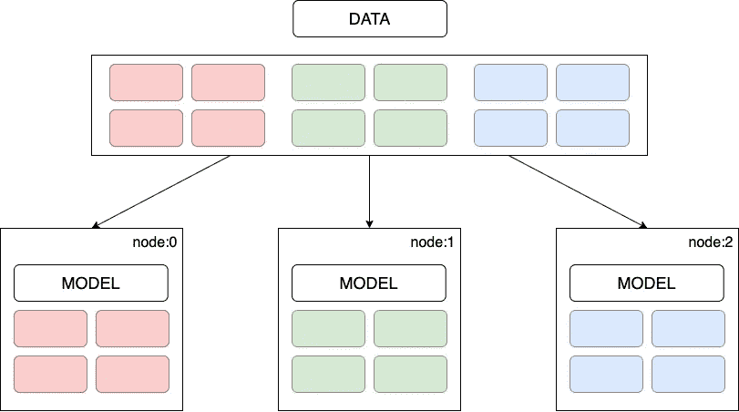
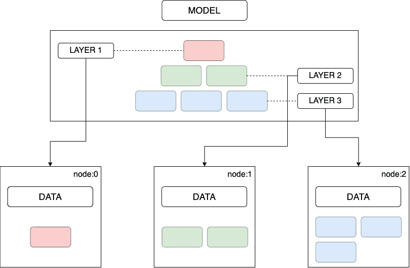
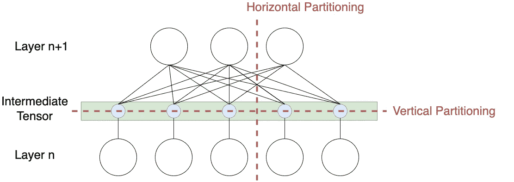
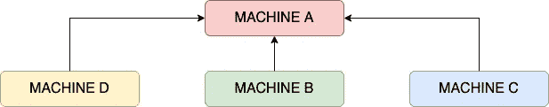
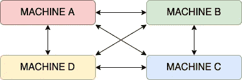
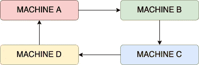
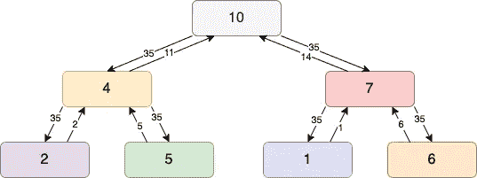
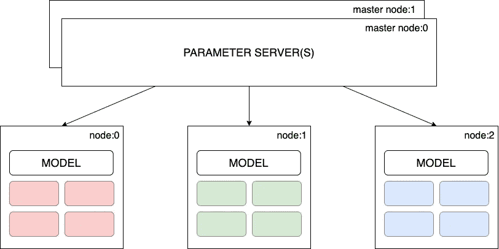
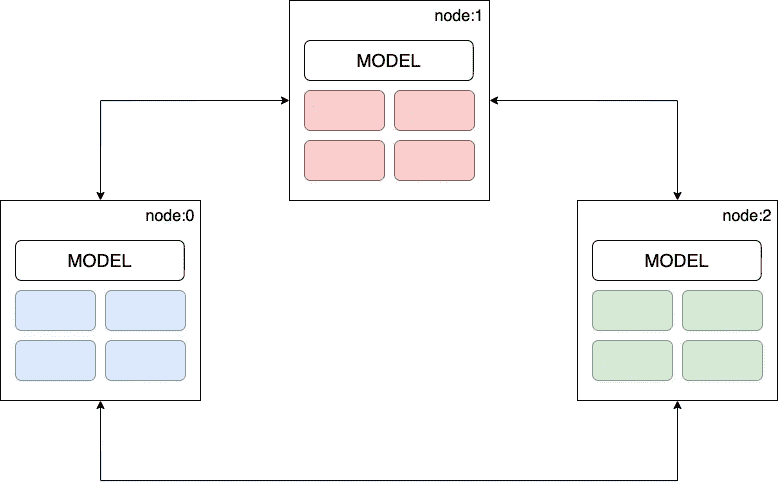

# 分布式模型训练

> 原文：<https://blog.devgenius.io/distributed-model-training-db295ea890ca?source=collection_archive---------7----------------------->


红猪。

# 分布式培训

深度学习是机器学习的一个子集，是人工智能通过经验执行任务的一个分支。深度学习算法非常适合，在大型数据集上表现最佳，更不用说对高计算能力的需求了。使用按使用付费的无服务器服务模式，如谷歌协作实验室，在云上训练大型神经网络比以往任何时候都更容易。虽然在一台多核 GPU 机器上训练大型模型是可能的，但这可能需要几天甚至几周的时间。因此，这导致了减少训练时间的根本问题。

通常，任何扩展问题都可以通过向上扩展或向外扩展来解决，即水平和垂直扩展。根据不同的使用案例，垂直扩展在某一点上有最大限度的限制，并且从长远来看，在价格和技术储备方面往往会更加昂贵。

**一行程序:**分布式训练将训练工作量分布在多个计算处理器上。在工作节点集群并行工作以加速训练过程的情况下，并行性通过数据并行性或模型并行性来实现。

# 分布式培训的类型

# 数据并行性

顾名思义，数据集是水平/垂直分片并并行处理的。群集中的每个工作节点根据不同批次的训练数据训练模型的副本，传递计算结果以保持模型参数和梯度在所有节点上同步。计算结果可以同步共享，即在每次批处理计算结束时共享，也可以异步共享。



图 1:数据并行训练。

**一行代码:**整个模型被部署到集群的多个节点上，每个节点代表分片数据集和模型的水平/垂直分割。

# 模型并行性

相反，在模型并行性中，在模型大小对于单个工作者来说太大的情况下，模型本身被分成部分/层；因此，跨不同的工作者节点同时训练一组层。整个数据集被复制/可用于所有工作节点，并且它们仅与其他工作节点共享全局模型参数-通常就在向前或向后传播之前。此外，这些层可以垂直或水平划分。



图 2:模型并行训练。

**一行:**模型的一层或一组层被部署到集群的多个节点上，整个数据集被复制到每个节点上。



图 3:水平或垂直的模型划分。

这两者中，数据并行比较常用，也比较容易实现。以批量数据(非顺序)训练模型并对模型的整体性能做出贡献的能力是解决方案的关键。换句话说，为工作者节点中的每一小批数据计算模型参数和梯度，并在结束时→将更新的权重发送回发起节点→将来自每个工作者节点的权重的加权平均值/均值应用于模型参数→将更新的模型参数发送回所有工作者节点，用于下一次迭代；这导致了关于模型参数如何以及何时被存储和更新的问题。

# 分布式训练循环

执行分布式训练循环的两种方式如下:

# 同步训练

再次以数据并行性为例，我们将数据划分为分区/批次，供每个工作节点处理。每个 worker 节点都有一个完整的模型副本和一批数据。

*   向前传递对所有工作器同时开始，每个工作器节点计算梯度(输出)。
*   工人们一直等到所有其他工人都完成了训练循环。然后，一旦所有的工人都计算了梯度，他们就开始互相交流以聚集梯度。
*   在所有梯度被组合之后，更新的梯度的副本被发送给所有工人。
*   然后，每个工人继续向后传递，并更新权重的本地副本。
*   直到所有工人都更新了他们的重量，下一次向前传递才开始；因此得名“同步”。

注意:所有的工人产生不同的梯度，因为他们在不同的数据子集上被训练，并且最终，所有的工人有相同的重量。

# 归约算法

通常，单个节点用于完成聚合。例如，在图 3 所示的情况下，机器 A 的带宽随着机器/参数数量的增加而增加。



图 4:单节点聚合器。

作为同步训练中提到的 reduce 算法的后续，all-reduce 算法背后的思想是分担存储和维护全局参数的负载，以克服使用参数服务器方法的限制。有几种 all-reduce 算法规定了如何计算和共享参数:



图 5: All Reduce:将聚合任务分配给所有节点，而不是单个节点。

像 AllReduce 一样，每个节点对参数的子集执行聚合任务:机器 A —参数 1，机器 B —参数 2，等等。每个工作节点将自己的版本发送给下一个节点，而不是将其版本的参数发送给所有其他节点。



图 6:环所有减少。

类似地，在 tree-all-reduce 中，参数通过树结构共享。无论拓扑结构如何，all-reduce 算法都可以减少同步开销，并且更易于水平扩展。



图 7:树全部减少。

每个工作者节点保存数据的子集并计算梯度；这些值沿树向上传递并聚合，直到在根节点中计算出全局聚合值。然后，全局值被传递给所有其他节点。

# 异步训练

同步方法的明显问题是缺乏有效的资源利用，因为一个工人必须等待集群中的所有其他工人在管道中向前移动。此外，当工作人员的计算时间明显不同时，问题会放大，这可能是因为数据集或计算能力的变化，因此整个过程的速度只与群集中最慢的工作人员一样快。因此，在异步培训中，工人独立工作，工人不需要等待集群中的任何其他工人。实现这一点的一种方法是使用参数服务器。

# 沟通方式

两种通信方法，集中和分散模式，适用于数据并行和模型并行训练。这里的关键是工作节点之间的通信，参数如何初始化，以及权重/偏差如何更新。

# 集中训练

在分布式培训中，工人集群只执行一项任务:培训。然而，在集中式通信模式中，我们为每个工作者分配不同的角色，其中一些工作者充当参数服务器，其余的充当培训工作者。

参数服务器负责保存模型的参数，并负责更新模型的全局状态。同时，训练工人运行实际的训练循环，并从分配给他们的数据批次中产生梯度。



图 8:集中培训。

因此，集中式数据并行训练的整个过程如下:

*   跨培训工作者节点复制模型；每个工作者节点使用数据的子集。
*   每个培训工作者从参数服务器获取参数。
*   每个训练工作者节点执行训练循环，并将梯度发送回所有参数服务器。
*   参数服务器更新模型参数，并确保所有工人模型同步。

一些已知的缺点是:

*   在给定的时间点，可能只有一个工人使用模型的更新版本，而其他人使用旧版本。
*   仅使用一个工作器作为参数服务器可能会成为瓶颈，并导致单点故障。

# 分散培训

另一方面，在去中心化的通信模式中，每个工作者节点与每个其他节点通信以更新模型参数。这种方法的优点是对等更新更快，并且没有单点故障。



图 9:去中心化的培训。

# 结论

深度学习模型变得日益雄心勃勃，其支持基础设施难以跟上。采用分布式模型训练技术来解决在巨大数据集上训练复杂机器学习模型的问题只是时间问题。此外，这些优势取代了开发时间/带宽，具有更好的容错性和可靠性，更高的效率，可横向扩展以处理大规模，并且从长远来看具有成本效益。

# 参考

```
[1] “Distributed Training: Guide for Data Scientists,” neptune.ai, Jan. 19, 2022\. https://neptune.ai/blog/distributed-training (accessed Jun. 23, 2022).[2] “Distributed Training,” www.run.ai. https://www.run.ai/guides/gpu-deep-learning/distributed-training (accessed Jun. 24, 2022).[3] “Distributed Training for Machine Learning – Amazon Web Services,” Amazon Web Services, Inc. https://aws.amazon.com/sagemaker/distributed-training/ (accessed Jun. 26, 2022).[4] “Distributed model training II: Parameter Server and AllReduce – Ju Yang.” http://www.juyang.co/distributed-model-training-ii-parameter-server-and-allreduce/ (accessed Jun. 26, 2022).
```