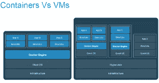
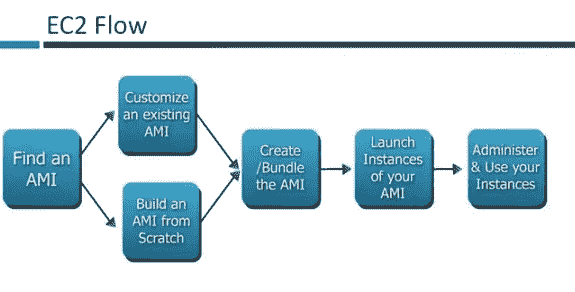
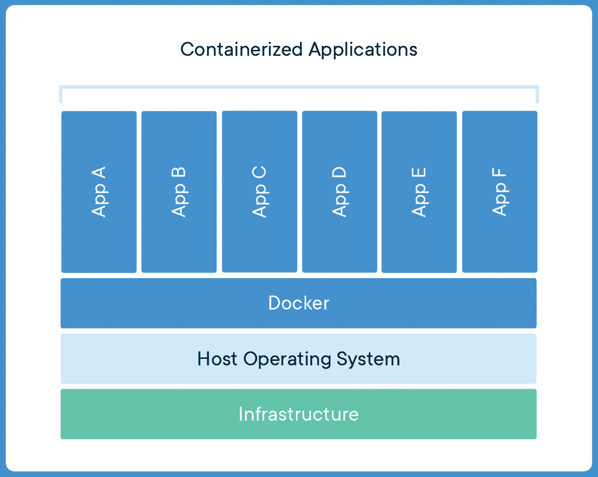
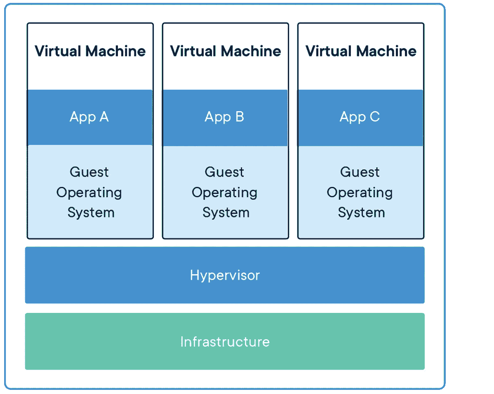
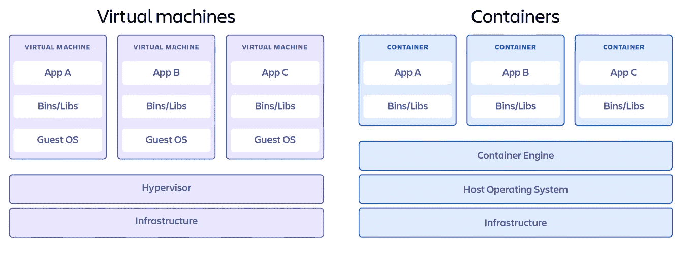

# 分布式系统面试准备 1:容器 VS 虚拟机，哪一个是未来？

> 原文：<https://blog.devgenius.io/distributed-system-interview-prep-1-containers-vs-virtual-machines-which-one-is-the-future-7665f1c88269?source=collection_archive---------11----------------------->

我是 MANNG 的高级软件工程师。关注我更多有趣的采访博客。

容器与虚拟机

在本文中，我将讨论云技术中经常使用的两种常见的容器化方法，容器和虚拟机。如果你想知道为什么你的远程服务器或程序可以运行在云服务上，比如 AWS、GCP 或 AZURE，这篇文章将会谈到这一点。此外，本文将解释云服务如何管理您的任务。此外，如果您有兴趣了解更多关于 K8s 或更低级的容器技术，请随时在下面发表评论并讨论它们，以便我可以写更多关于它们的内容。如果您正在准备分布式系统或系统设计面试，这是您可能感兴趣的概念类型。

# 你的任务如何在云上运行？

假设您请求一台 EC2 机器，并指定您的 Linux 或其他 OS(操作系统)版本。几分钟后，你会得到如何 *ssh* 进入机器的说明。

EC2 流量

然后，您可以编写一些没有错误的完美代码，并在远程机器上运行它们。这是一个常见的情况，你可能开始使用云，但不知道这个神奇的东西是如何工作的。并且您可能认为您的机器可能真的在云中，并且想知道以下问题:

*   我的机器在哪里？
*   这台机器怎么能运行我的工作呢？
*   我应该在机器上存储我的信用卡密码吗？
*   机器有多稳定？

以下是上述机器请求中发生的几个步骤。(我会简化整个过程，忽略安全性)

*   步骤 1:在控制台中，向 AWS EC2 服务发送请求。EC2 后端服务可能会收集你所有的信息和资源请求，并将它们发送给它们的调度服务，如 K8 Prime 或集群主机。
*   第二步:然后，其中一个主人收到你的请求。然后，主服务器查找它管理的所有机器资源，并根据您的请求匹配一台机器。这台机器可能是相当空的，就像一个装修过的房子，这意味着他们的云服务已经清理了这台机器，像内存和以前的配置。
*   第三步:机器可以使用了吗？还没有，您的机器需要使用您请求的客户操作系统重新启动。一些服务或守护进程应该从某个地方(可能是您的云包管理器)安装您请求的来宾操作系统版本二进制文件。然后，机器将启动一个虚拟机，并在虚拟机中引导您的客户操作系统，或者使用您的操作系统重启整个机器。
*   第四步:向控制台报告，告诉你已经准备好使用。然后，你可以在机器上编写你的“hello world”程序。

如果你是一个有经验的工程师，你可以告诉他这是一个正常的集群管理过程，比如 K8s (Kubernetes)。但是，我们不打算将重点放在集群管理上。我们还将研究步骤 3 中使用虚拟机或容器的有趣技术步骤(如果您有兴趣了解更多关于集群管理的信息，请在下面评论)。

# 什么是容器？

Docker 示例

介绍够了，让我们开始讨论什么是容器。容器是软件包，包含了在任何环境下运行的所有必要元素。容器是应用程序代码和依赖项的轻量级包，例如运行软件服务所需的特定版本的编程语言运行库和库。

Docker 就是一个很好的例子。Docker 容器映像是一个轻量级的、独立的、可执行的软件包，包括运行应用程序所需的一切:代码、运行时、系统工具、系统库和设置。

*   标准: Docker 创立了集装箱的行业标准，这样它们就可以被携带到任何地方
*   **轻量级:**容器共享机器的操作系统内核，因此每个应用程序不需要操作系统，从而提高服务器效率，降低服务器和许可成本
*   **安全:**应用在容器中更安全，Docker 提供业界最强的默认隔离能力

容器不仅仅是一个包含完成任务所需的所有资源的概念性盒子。它必须是高效、安全和高度成功的保证。然而，这些东西不是免费的。在云环境中，他们可能会让自己的 docker 版本发挥其硬件和云架构的最佳性能。但是他们必须解决集装箱的上述主要问题。他们必须安全地将资源分成几部分，并为每项任务隔离环境。嗯，这听起来像一个简单的设置，但它可能会在许多方面出错。如果你对这个话题感兴趣，请在下面评论，我会写更多关于如何编写容器、瓶颈是什么以及如何解决它们的博客。

容器能提供的最好的东西之一是比虚拟机轻得多。资源总是有限且昂贵的。想象一下，你花钱让一台机器在使用容器的云服务上运行 30 个任务，但是在有虚拟机的机器上只能运行 20 个任务或者 25 个任务。资源的开销最终会反映在你每月的账单上。如果您的服务需要数百或数千台机器，可以节省大量资金。这就是为什么 AWS 和 GCP 一直在疯狂招聘软件工程师，以建立最优质的云服务，并相互竞争以获得低价格的客户。降低客户价格意味着降低资源浪费的成本，比如集装箱。

# 什么是 VM(虚拟机)？

虚拟机

虚拟机(VM)是在物理硬件系统(位于外部或内部)上创建的虚拟环境，其功能相当于虚拟计算机系统，拥有自己的 CPU、内存、网络接口和存储。称为虚拟机管理程序的软件将机器的资源从硬件中分离出来，并适当地调配它们，以便虚拟机可以使用它们。考虑虚拟机的最佳方式是在机器中运行机器。

配备了基于内核的虚拟机(KVM)等管理程序的物理机称为主机、主机、主机操作系统，或简称为*主机*。许多使用其资源的虚拟机是客户机器、客户计算机、客户操作系统，或者简称为*客户*。虚拟机管理程序将计算资源(如 CPU、内存和存储)视为一个资源池，可以轻松地在现有来宾之间或新虚拟机之间重新定位。

虚拟机允许多个不同的操作系统在一台计算机上同时运行——就像 MacOS 笔记本电脑上的 Linux 发行版一样。每个操作系统的运行方式与操作系统或应用程序在主机硬件上的运行方式相同，因此在虚拟机内模拟的终端用户体验与在物理机上运行的实时操作系统体验几乎相同。

虚拟化是创建基于软件或“虚拟”版本的计算机的过程，该计算机具有从物理主机(如您的个人计算机)和/或远程服务器(如云提供商数据中心的服务器)“借用”的专用 CPU、内存和存储。虚拟机是一种计算机文件，通常称为映像，其行为类似于实际的计算机。它可以在一个窗口中作为一个独立的计算环境运行，通常运行不同的操作系统，甚至可以作为用户的整个计算机体验，这在许多人的工作计算机上很常见。虚拟机与系统的其余部分分开，这意味着虚拟机内部的软件不会干扰主机的主要操作系统。

# 容器 VS 虚拟机？

虚拟机与容器

容器是轻量级软件包，包含执行所包含的软件应用程序所需的所有依赖关系。这些依赖项包括系统库、外部第三方代码包和其他操作系统级应用程序。容器中包含的依赖关系存在于高于操作系统的堆栈级别中。

## 赞成的意见

*   迭代速度
    因为容器是轻量级的，只包含高级软件，所以修改和迭代非常快。
*   健壮的生态系统
    大多数容器运行时系统都提供一个托管的预制容器公共存储库。这些容器存储库包含许多流行的软件应用程序，如数据库或消息传递系统，可以立即下载并执行，为开发团队节省了时间

## 骗局

*   共享主机漏洞利用
    容器在操作系统层下共享相同的底层硬件系统，一个容器中的漏洞利用可能会突破容器并影响共享硬件。大多数流行的容器运行时都有预构建容器的公共存储库。使用这些公共图像中的一个存在安全风险，因为它们可能包含漏洞或容易被恶意行为者劫持。

## 流行的容器提供商

*   Docker
    Docker 是最流行、使用最广泛的容器运行时。Docker Hub 是一个流行的容器化软件应用程序的大型公共存储库。Docker Hub 上的容器可以立即下载并部署到本地 Docker 运行时。
*   RKT
    发音为“火箭”，RKT 是一个安全第一的集装箱系统。RKT 容器不允许不安全的容器功能，除非用户显式启用不安全的功能。RKT 容器旨在解决其他容器运行时系统遭受的潜在交叉污染利用安全问题。
*   Linux 容器(LXC)
    Linux 容器项目是一个开源的 Linux 容器运行时系统。LXC 用于将操作级和系统级进程相互隔离。Docker 实际上在幕后使用了 LXC。Linux 容器旨在提供一个供应商中立的开源容器运行时。
*   CRI-O
    CRI-O 是 Kubernetes 容器运行时接口(CRI)的一个实现，允许使用开放容器倡议(OCI)兼容的运行时。它是使用 Docker 作为 Kubernetes 运行时的轻量级替代方案。

虚拟机是沉重的软件包，提供对低级硬件设备(如 CPU、磁盘和网络设备)的完整模拟。虚拟机还可以包括在仿真硬件上运行的补充软件栈。这些硬件和软件包结合起来产生一个计算系统的全功能快照。

# 赞成的意见

*   完全隔离安全性
    虚拟机作为完全独立的系统独立运行。这意味着虚拟机不会受到共享主机上其他虚拟机的任何攻击或干扰。单个虚拟机仍可能被利用劫持，但被利用的虚拟机将被隔离，无法感染任何其他相邻的虚拟机。
*   交互式开发
    容器通常是运行容器所需的预期依赖和配置的静态定义。虚拟机更具动态性，可以交互开发。一旦为虚拟机指定了基本硬件定义，就可以将虚拟机视为一台裸机。可以手动将软件安装到虚拟机上，并且可以对虚拟机拍摄快照以捕获当前配置状态。虚拟机快照可用于将虚拟机恢复到该时间点，或使用该配置启动更多虚拟机。

# 骗局

*   迭代速度
    虚拟机的构建和重新生成非常耗时，因为它们包含一个完整的堆栈系统。对虚拟机快照的任何修改都可能需要很长时间来重新生成和验证它们的行为是否符合预期。
*   存储大小成本
    虚拟机会占用大量存储空间。它们的大小可以迅速增长到几千兆字节。这可能会导致虚拟机主机上的磁盘空间不足问题。

## 流行的虚拟机提供商

*   Virtualbox
    Virtualbox 是甲骨文公司旗下的免费开源 x86 架构仿真系统。Virtualbox 是最受欢迎和最成熟的虚拟机平台之一，拥有一个辅助工具生态系统来帮助开发和分发虚拟机映像。
*   VMware
    VMware 是一家上市公司，其业务基于首批 x86 硬件虚拟化技术之一。VMware 附带了一个虚拟机管理程序，这是一个将部署和管理多个虚拟机的实用程序。VMware 有一个强大的用户界面来管理虚拟机。VMware 是提供支持的优秀企业虚拟机选项。
*   QEMU
    QEUM 是最健壮的硬件模拟虚拟机选项。它支持任何通用硬件架构。QEMU 是一个只有命令行的实用程序，不提供用于配置或执行的图形用户界面。这种权衡使得 QEMU 成为最快的虚拟机选项之一。

# 哪个才是未来？

如果您的项目有特定的硬件需求，或者您正在一个硬件平台上开发，并且需要针对另一个平台，比如 Windows vs MacOS，那么您将需要使用虚拟机。大多数其他“纯软件”需求可以通过使用容器来满足。

这种配置的一个实际用途是用于片上系统部署的实验。流行的片上系统计算设备，如 Raspberry Pi 或 BeagleBone 开发板，可以模拟为虚拟机，在实际硬件上进行测试之前，在其上运行容器进行实验。

但是大多数情况下，您的需求可能会由两者之一来满足。根据您的虚拟化需求决定使用容器还是虚拟机的关键是了解您的资源需求以及您愿意做出的权衡。

近年来，由于价格和市场潜力，容器比虚拟机增长得更快。他们都将在各自的子领域有所发展。但是容器将有更大的潜力。

订阅更多有趣的分布式系统话题。敬请关注。