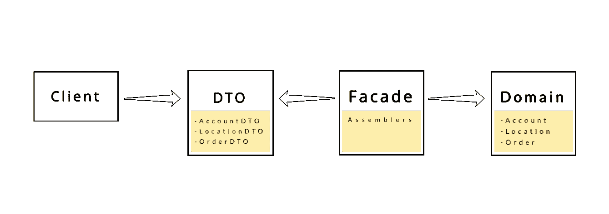

# 分布模式，DTO 和远程门面

> 原文：<https://blog.devgenius.io/distribution-patterns-dto-and-remote-facade-b277b48b16f5?source=collection_archive---------8----------------------->

在这个故事中，我将介绍分布模式、数据传输对象和远程外观的概念。


# 数据传输对象

我很确定你已经听说过 DTO(也称为值对象)，并且在你的软件开发生涯中至少创建了一个 DTO 类。

当您使用远程接口(例如，web 服务)时，对它的每次调用都是昂贵的。因此，您需要减少调用次数，这意味着您应该使用 d to 来聚合数据，以便在每次调用中传输更多的数据。

数据传输对象不应该包含任何业务逻辑，它需要是可序列化的，以便通过连接。通常，汇编器也称为映射器，用于域对象和 DTO 对象之间的数据传输。

让我们来看看 DTO 类的例子。

```
public class Article {
    private long id;
    private long authorId;
    private String text;
    private Timestamp publishTimestamp; // getters and setters
}

public class Author {
    private long id;
    private String name;
    private String profileUrl;
    private String profileImageUrl; // getters and setters
}

public class ArticleDTO {
    private long id;
    private String text;
    private AuthorDTO author;
    private Timestamp publishTimestamp;

    // getters and setters
}

public class AuthorDTO {
    private String name;
    private String profileUrl;
    private String profileImageUrl; // getters and setters
}
```

# 远程外观

远程外观旨在最小化应用程序中远程调用的数量。这个模式包含一个或几个**细粒度**对象的**粗粒度**接口。远程 facade 模式不包含业务逻辑，它只在底层细粒度方法中翻译粗粒度方法。远程 Facade 模式与数据传输对象模式相结合是常见的情况。

让我们看一个非常简单的例子..

```
public class StorageManager {
    public boolean isItemAvailable(int itemId) {
        // implementation...
    }
}

public class Packager {
    public void packItem(int itemId) {
        // implementation...
    }
}

public class RemoteStore {
    private final StorageManager storageManager;
    private final Packager packager;

    public RemoteStore(StorageManager storageManager, 
                       Packager packager) {
        this.storageManager = storageManager;
        this.packager = packager;
    }

    public void buyItem(int itemId) {
        if (storageManager.isItemAvailable(itemId)) {
            packager.packItem(itemId);
        }
        // implementation ...
    }
}
```

让我们看看数据传输对象和远程外观模式结合时的图形。

