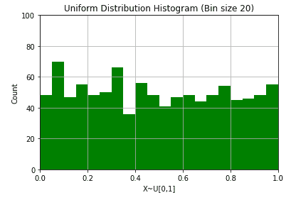

# 发行版，很多发行版

> 原文：<https://blog.devgenius.io/distributions-a-lot-of-distributions-82263ed7291e?source=collection_archive---------6----------------------->

分配分配分配分配分配分配


比尔·麦凯在 [Unsplash](https://unsplash.com?utm_source=medium&utm_medium=referral) 上的照片

根据维基百科的一篇文章:

> *在*[](https://en.wikipedia.org/wiki/Statistics)**中，有一个* ***抽样分布*** *或* ***有限样本分布*** *是以* [*概率分布*](https://en.wikipedia.org/wiki/Probability_distribution) *为基础的一个给定的*[](https://en.wikipedia.org/wiki/Random_sample)**如果为了计算每个样本的一个统计值(例如，* [*样本均值*](https://en.wikipedia.org/wiki/Sample_mean) *或样本* [*方差*](https://en.wikipedia.org/wiki/Variance) *)而分别使用任意大数量的样本，每个样本涉及多个观察值(数据点)，那么抽样分布就是统计值的概率分布。在许多情况下，只观察到一个样本，但理论上可以找到采样分布。抽样分布在统计学中很重要，因为它们为* [*统计推断*](https://en.wikipedia.org/wiki/Statistical_inference) *提供了一个主要的简化途径。更具体地说，它们允许分析考虑基于统计的概率分布，而不是基于所有单个样本值的* [*联合概率分布*](https://en.wikipedia.org/wiki/Joint_probability_distribution) *。***

**分布只意味着数据的扩散，样本分布意味着作为总体数据一部分的样本数据的扩散。**

**该分布也可以称为概率分布。**

**让我们使用 seaborn 库中的‘Iris dataset’创建一个发行版。**

```
**import pandas as pd
import seaborn as sns
data = sns.load_dataset('iris')
data.head()**
```

****

**现在，让我们尝试在 distplot 中绘制 sepal_length 图(本质上是一个带有拟合线的直方图)。**

```
**sns.distplot(data['sepal_length'])**
```

****

**分发示例，按作者分类的图像**

**这是什么？看完那个情节后你想到了什么？**

**你想到的最重要的事情是，“4 到 5 之间的萼片长度在数据中比 5 的萼片长度更少出现！”**

**是的，如果你认为，“现在怎么办？我将如何处理这些信息？”**

**使用各种数据点和功能的直觉不是一天两天就能得到的，为了分析数据并正确地执行 EDA 和 FE，人们必须每天练习，如果你想了解 EDA 和 FE，我已经写了关于它的博客，我会在这里链接。**

**现在，上述分布用于特定功能的频率，在统计中有各种类型的分布可用，用于许多东西，让我们了解一下它们。**

# **分布类型**

1.  **伯努利分布**
2.  **二项分布**
3.  **高斯分布**
4.  **泊松分布**
5.  **指数分布**
6.  **多项分布**
7.  **贝塔分布**
8.  **贝塔二项分布**
9.  **t 分布/学生 t 分布**
10.  **均匀分布**

# **伯努利分布**

**伯努利分布就是事件发生的概率分布。为了表述“事件的概率”，我们写 p(事件)**

*   **如果您希望它发生，p(event) = 1**
*   **如果不想让它发生，p(event) = 0**

**现在，为了表述伯努利方程，我们写道，**

****

**伯努利分布的公式**

**其中 x 属于[0，1]**

**所以，如果我们想通过保持 x 的值来解决这个问题:**

**x = 0，**

********

**并且对于 x = 1，**

********

**所以，是的，这是同一件事，但只有一个方程。**

**让我们看一个使用 python 的图表示例**

```
**from scipy.stats import binom
import numpy as np
import pandas as pd
y = binom.rvs(1000, 0.3, size=5000)
x = np.arange(y.min(),y.max())
count_x = pd.DataFrame(x)
x1 = np.arange(y.min(), y.max())
x2 = pd.DataFrame(x1)
y2 = []
data_1 = pd.DataFrame(y, columns  = ['Data'])
for i in range(len(x1)):
        y2.append(data_1[data_1['Data'] == x1[i]].count()[0])
freq = pd.DataFrame(y2, columns=['Frequency'])
data = pd.concat([x2, freq], axis=1)
data.columns = ['Score', 'Frequency']
data.plot.line()**
```

****

**伯努利区，由 autor 提供图像**

# **二项分布**

**参数为 n 和 p 的二项分布是一系列 n 个独立实验中成功的分布，每个二元问题。**

**二项式分布的公式:**

****

**二项式距离公式**

**对于 k = 0，1，2，3，4，…，n**

************

```
**from scipy.stats import binom
import matplotlib.pyplot as plt
n = 15
p = 0.4
r_values = list(range(n + 1))
dist = [binom.pmf(r, n, p) for r in r_values ]
plt.bar(r_values, dist)
plt.show()**
```

****

**比诺米安区，作者图片**

# **高斯分布**

**也称为钟形曲线和正态分布，它是最常见的分布，因为它沿着总值的平均值对称，并且沿着标准偏差分布，直到最后一个值。**

****

**高斯分布的公式**

**西格玛=标准偏差**

**mu =平均值**

**正态/高斯分布的一些重要属性:**

*   **均值=众数=中位数**
*   **正态分布遵循经验法则，对于所有的正态分布，68.2%的观测值会出现在均值的正负一个标准差之内；95.4%的观察值将落在+/-两个标准偏差内；和 99.7%在+/-3 个标准偏差内。这一事实有时被称为“经验法则”，一种描述正态分布中大多数数据出现位置的启发式规则。**

**让我们看看它的图表:**

```
**from scipy.stats import norm
import numpy as np
import statistics as stats
x_axis = np.arange(-20, 20, 0.01)
mean = stats.mean(x_axis)
sd = stats.stdev(x_axis)

plt.plot(x_axis, norm.pdf(x_axis, mean, sd))
plt.show()**
```

****

**高斯分布，按作者分类的图像**

# **泊松分布**

**泊松分布表示给定数量的事件在固定的时间或空间间隔内发生的概率，如果这些事件以已知的恒定平均速率发生，并且与自上次事件以来的时间无关。**

**为此，我们假设:**

*   **事件是独立发生的**
*   **某一事件在给定时间内发生的概率不随时间的长短而变化**
*   **简而言之:事件是独立和随机发生的。**

**然后:“X，事件的数量是固定的时间单位，具有泊松分布”**

****

**泊松分布公式**

**平均值(μ=λ)，x =成功次数**

```
**from scipy.stats import poisson
import matplotlib.pyplot as plt
x = poisson.rvs(mu=3, size=10000000)
plt.hist(x, density=True, edgecolor='black')**
```

****

**泊松区，作者图片**

# **指数分布**

**它只不过是模拟事件之间时间的统计分布。**

**比如:**

*   **你还要等多久才能收到另一条短信？**
*   **你还需要多久才能和你喜欢的人调情？**

**等等。**

****

**指数距离公式**

**λ被称为速率参数，与事情发生的速度成正比。**

```
**from scipy.stats import expon
import matplotlib.pyplot as plt
x = expon.rvs(scale=300, size=10000)
plt.hist(x, density=True, edgecolor='black')**
```

****

**这里，scale 属性是 lambda，即作者的图像**

# **多项分布**

**它用来衡量有两个以上变量的实验结果。**

**假设:**

*   **有 n 个独立的试验。**
*   **每个试验都有 x 个互斥的结果。**
*   **在任何一次试验中，这些$x$的结果以概率 p1，p2，p3，…，pn 出现。**

****

**多项式距离公式**

**让 Xi 代表结果 I 的出现次数，那么，**

****

```
**from numpy import random
import seaborn as sns
import matplotlib.pyplot as plt
sample = random.multinomial(n=6, pvals=[1/6, 1/6, 1/6, 1/6, 1/6, 1/6])
sns.distplot(sample, hist= True)
plt.show()**
```

****

**多项式区，按作者分类的图像**

# **贝塔分布**

*   **使用最广泛的分布族**
*   **用来找出概率的概率！**
*   **beta 分布是最灵活的分布族。**

**其 PDF(概率密度函数)为:**

****

**0**

```
**import numpy as np
import matplotlib.pyplot as plt
from scipy.stats import beta
a, b = 80, 10
x = np.linspace(beta.ppf(0.01, a, b),beta.ppf(0.99, a, b), 100)
plt.figure(figsize=(7,7))
plt.xlim(0.7, 1)
plt.plot(x, beta.pdf(x, a, b), 'r-')
plt.title('Beta Distribution', fontsize='15')
plt.xlabel('Values of Random Variable X (0, 1)', fontsize='15')
plt.ylabel('Probability', fontsize='15')
plt.show()**
```

****

**beta dist, image by author**

# **Beta-Binomial Distribution**

**Data distribution is said to be beta-binomial if the**

*   **The probability of success, p, is greater than zero.**
*   **And, the shape of the beat binomial parameter, α > 0，以及β > 0**

**贝塔分布的概率密度函数；**

********

**贝塔二项式距离公式**

*   **p =二项式概率，**
*   **xi =成功的总数(通过或失败，正面或反面等)。)进行第 I 次试验**
*   **pi =单次试验的成功概率，**
*   **n =试验次数**

```
**from scipy.stats import betabinom
import matplotlib.pyplot as plt
fig, ax = plt.subplots(1, 1)
n, a, b = 5, 2.3, 0.63
mean, var, skew, kurt = betabinom.stats(n, a, b, moments='mvsk')
x = np.arange(betabinom.ppf(0.01, n, a, b),
              betabinom.ppf(0.99, n, a, b))
ax.plot(x, betabinom.pmf(x, n, a, b), 'bo', ms=8, label='betabinom pmf')
ax.vlines(x, 0, betabinom.pmf(x, n, a, b), colors='b', lw=5, alpha=0.5)
rv = betabinom(n, a, b)
ax.vlines(x, 0, rv.pmf(x), colors='k', linestyles='-', lw=1,
        label='frozen pmf')
ax.legend(loc='best', frameon=False)
plt.show()**
```

****

**beta-二项式距离，按作者分类的图像**

# **t 分布**

*   **t 检验是威廉·希利·戈塞在 1908 年发明的**
*   **解决了“小样本统计”的问题**
*   **基础分布是“正常的”**
*   **人口标准差未知**
*   **样本量太小，中心极限定理不适用**

****

**t 分布公式**

**t 是 t 值， *x* 1 和 *x* 2 是被比较的两组的平均值， *s* 2 是两组的合并标准差， *n* 1 和 *n* 2 是每组的观察次数。**

```
**from scipy.stats import t
import matplotlib.pyplot as plt
x = t.rvs(df=12, size=10000)
plt.hist(x, density=True, edgecolor='black', bins=20)**
```

****

**丁字距离**

# **均匀分布**

**均匀分布可以是离散的，也可以是连续的，其中每个事件发生的可能性是相等的。它在某个定义域内具有恒定的概率。**

****

**作者图片**

****

**均匀分布的公式**

```
**import numpy as np
import matplotlib.pyplot as plt
data = np.random.uniform(0,1,1000)
count, bins, ignored = plt.hist(data, 20, facecolor='green') 
plt.xlabel('X~U[0,1]')
plt.ylabel('Count')
plt.title("Uniform Distribution Histogram (Bin size 20)")
plt.axis([0, 1, 0, 100])
plt.grid(True)
plt.show(block = False)**
```

****

**统一分布，按作者分类的图像**

**联系人:[https://linktr.ee/a.kayyy](https://linktr.ee/a.kayyy)**