# DistSQL 应用程序:构建动态分布式数据库

> 原文：<https://blog.devgenius.io/distsql-applications-building-a-dynamic-distributed-database-969690ec4c3a?source=collection_archive---------4----------------------->

## 背景


扬·安东宁·科拉尔在 [Unsplash](https://unsplash.com?utm_source=medium&utm_medium=referral) 上拍摄的照片

自从 [ShardingSphere 5.0.0](https://shardingsphere.apache.org/document/5.0.0/en/overview/) 发布以来， [DistSQL](https://shardingsphere.apache.org/document/5.1.0/en/concepts/distsql/) 一直在为 ShardingSphere 生态系统提供强大的动态管理功能。

得益于 DistSQL，用户能够完成以下任务:

*   在线创建逻辑数据库。
*   动态配置规则(即分片、数据加密、读/写拆分、数据库发现、影子数据库和全局规则)。
*   实时调整存储资源。
*   即时切换交易类型。
*   随时打开和关闭 SQL 日志。
*   预览 SQL 路由结果。

与此同时，在日益多样化的场景背景下，越来越多的 DistSQL 特性被创造出来，各种有价值的语法也越来越受用户欢迎。

## 概观

本帖以数据分片为例，说明 DistSQL 的应用场景和相关分片方法。

一系列 DistSQL 语句通过实际案例串联起来，给你一套完整实用的 DistSQL 分片管理方案，通过动态管理创建和维护分布式数据库。本例中将使用以下 DistSQL:

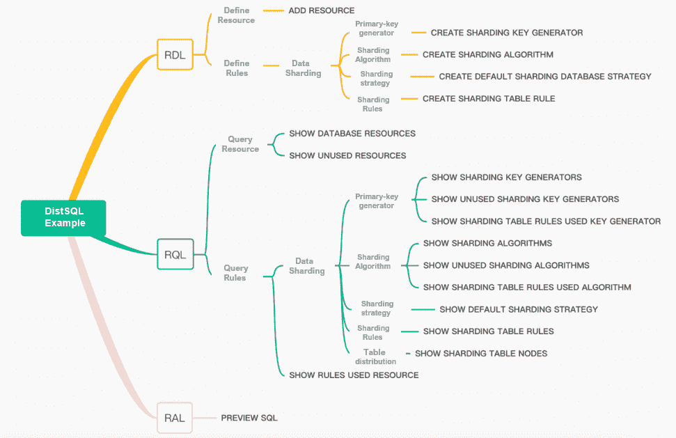

## 实际案例

## 必需的场景

*   创建两个分片表:`t_order`和`t_order_item.`
*   对于这两个表，数据库碎片是用`user_id`字段执行的，表碎片是用`order_id`字段执行的。
*   碎片的数量是 2 个数据库* 3 个表。

如下图所示:

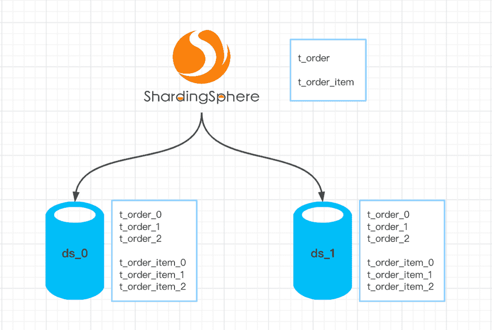

## 设置环境

1.  为访问准备一个 MySQL 数据库实例。创建两个新的数据库:`demo_ds_0`和`demo_ds_1`。

> **这里我们以 MySQL 为例，但也可以使用 PostgreSQL 或 openGauss 数据库。**

2.部署[Apache sharding sphere-Proxy 5 . 1 . 2](https://shardingsphere.apache.org/document/5.1.2/en/overview/)和 [Apache ZooKeeper](https://zookeeper.apache.org/) 。ZooKeeper 充当治理中心，存储 ShardingSphere 元数据信息。

3.在`Proxy conf`目录中配置`server.yaml`,如下所示:

```
mode:
  type: Cluster
  repository:
    type: ZooKeeper
    props:
      namespace: governance_ds
      server-lists: localhost:2181  # ZooKeeper address
      retryIntervalMilliseconds: 500
      timeToLiveSeconds: 60
      maxRetries: 3
      operationTimeoutMilliseconds: 500
  overwrite: falserules:
  - !AUTHORITY
    users:
      - root@%:root
```

4.启动 ShardingSphere-Proxy 并使用客户端将其连接到代理，例如:

```
mysql -h 127.0.0.1 -P 3307 -u root -p
```

## 创建分布式数据库

```
CREATE DATABASE sharding_db;USE sharding_db;
```

## 添加存储资源

1.添加准备好的 [MySQL](https://www.mysql.com/) 数据库对应的存储资源。

```
ADD RESOURCE ds_0 (
    HOST=127.0.0.1,
    PORT=3306,
    DB=demo_ds_0,
    USER=root,
    PASSWORD=123456
), ds_1(
    HOST=127.0.0.1,
    PORT=3306,
    DB=demo_ds_1,
    USER=root,
    PASSWORD=123456
);
```

2.查看存储资源

```
mysql> SHOW DATABASE RESOURCES\G;
*************************** 1\. row ***************************
                           name: ds_1
                           type: MySQL
                           host: 127.0.0.1
                           port: 3306
                             db: demo_ds_1
                            -- Omit partial attributes
*************************** 2\. row ***************************
                           name: ds_0
                           type: MySQL
                           host: 127.0.0.1
                           port: 3306
                             db: demo_ds_0
                            -- Omit partial attributes
```

> **在查询语句中加入\G 旨在使输出格式更具可读性，并非必须。**

## 创建分片规则

ShardingSphere 的分片规则支持常规分片和自动分片。这两种分片方法具有相同的效果。不同的是，自动分片的配置更加简洁，而规则分片更加灵活和独立。

> ***关于自动分片的更多细节，请参考以下链接:***

[dist SQL 简介——一个开源且更强大的 SQL](https://medium.com/nerd-for-tech/intro-to-distsql-an-open-source-more-powerful-sql-bada4099211?source=your_stories_page-------------------------------------)

[AutoTable:您的管家式分片配置工具](https://medium.com/geekculture/autotable-your-butler-like-sharding-configuration-tool-9a45dbb7e285)

接下来，我们将采用常规分片，并使用`INLINE`表达式算法来实现需求中描述的分片场景。

**主键生成器**

主键生成器可以为分布式场景中的数据表生成安全且唯一的主键。详见 [*分发主键*](https://shardingsphere.apache.org/document/current/en/features/sharding/concept/key-generator/) *。*

1.创建主键生成器。

```
CREATE SHARDING KEY GENERATOR snowflake_key_generator (
TYPE(NAME=SNOWFLAKE)
);
```

2.查询主键生成器

```
mysql> SHOW SHARDING KEY GENERATORS;
+-------------------------+-----------+-------+
| name                    | type      | props |
+-------------------------+-----------+-------+
| snowflake_key_generator | snowflake | {}    |
+-------------------------+-----------+-------+
1 row in set (0.01 sec)
```

**分片算法**

1.创建一个数据库分片算法，由`t_order`和`t_order_item`共同使用。

```
-- Modulo 2 based on user_id in database sharding
CREATE SHARDING ALGORITHM database_inline (
TYPE(NAME=INLINE,PROPERTIES("algorithm-expression"="ds_${user_id % 2}"))
);
```

2.为`t_order`和`t_order_item`创建不同的表格碎片算法。

```
-- Modulo 3 based on order_id in table sharding
CREATE SHARDING ALGORITHM t_order_inline (
TYPE(NAME=INLINE,PROPERTIES("algorithm-expression"="t_order_${order_id % 3}"))
);
CREATE SHARDING ALGORITHM t_order_item_inline (
TYPE(NAME=INLINE,PROPERTIES("algorithm-expression"="t_order_item_${order_id % 3}"))
);
```

3.查询分片算法

```
mysql> SHOW SHARDING ALGORITHMS;
+---------------------+--------+---------------------------------------------------+
| name                | type   | props                                             |
+---------------------+--------+---------------------------------------------------+
| database_inline     | inline | algorithm-expression=ds_${user_id % 2}            |
| t_order_inline      | inline | algorithm-expression=t_order_${order_id % 3}      |
| t_order_item_inline | inline | algorithm-expression=t_order_item_${order_id % 3} |
+---------------------+--------+---------------------------------------------------+
3 rows in set (0.00 sec)
```

**默认分片策略**

分片策略由分片密钥和分片算法组成。其概念请参考[分片策略](https://shardingsphere.apache.org/document/current/en/features/sharding/concept/sharding/)。

分片策略由`databaseStrategy`和`tableStrategy`组成。

由于`t_order`和`t_order_item`具有相同的数据库分片字段和分片算法，我们创建了一个默认策略，该策略将被所有未配置分片策略的分片表使用:

1.  创建默认的数据库分片策略

```
CREATE DEFAULT SHARDING DATABASE STRATEGY (
TYPE=STANDARD,SHARDING_COLUMN=user_id,SHARDING_ALGORITHM=database_inline
);
```

2.查询默认策略

```
mysql> SHOW DEFAULT SHARDING STRATEGY\G;
*************************** 1\. row ***************************
                    name: TABLE
                    type: NONE
         sharding_column:
 sharding_algorithm_name:
 sharding_algorithm_type:
sharding_algorithm_props:
*************************** 2\. row ***************************
                    name: DATABASE
                    type: STANDARD
         sharding_column: user_id
 sharding_algorithm_name: database_inline
 sharding_algorithm_type: inline
sharding_algorithm_props: {algorithm-expression=ds_${user_id % 2}}
2 rows in set (0.00 sec)
```

> **没有配置默认的表格分片策略，所以** `**TABLE**` **的默认策略是** `**NONE**` **。**

**分片规则**

主键生成器和分片算法都准备好了。现在创建分片规则。

1.`t_order`

```
CREATE SHARDING TABLE RULE t_order (
DATANODES("ds_${0..1}.t_order_${0..2}"),
TABLE_STRATEGY(TYPE=STANDARD,SHARDING_COLUMN=order_id,SHARDING_ALGORITHM=t_order_inline),
KEY_GENERATE_STRATEGY(COLUMN=order_id,KEY_GENERATOR=snowflake_key_generator)
);
```

> `**DATANODES**` **指定分片表的数据节点。**
> 
> `**TABLE_STRATEGY**` **指定了表格策略，其中** `**SHARDING_ALGORITHM**` **使用创建的分片算法**`**t_order_inline**`**；**
> 
> `**KEY_GENERATE_STRATEGY**` **指定了表的主键生成策略。如果不需要生成主键，请跳过此配置。**

2.`t_order_item`

```
CREATE SHARDING TABLE RULE t_order_item (
DATANODES("ds_${0..1}.t_order_item_${0..2}"),
TABLE_STRATEGY(TYPE=STANDARD,SHARDING_COLUMN=order_id,SHARDING_ALGORITHM=t_order_item_inline),
KEY_GENERATE_STRATEGY(COLUMN=order_item_id,KEY_GENERATOR=snowflake_key_generator)
);
```

3.查询分片规则

```
mysql> SHOW SHARDING TABLE RULES\G;
*************************** 1\. row ***************************
                            table: t_order
                actual_data_nodes: ds_${0..1}.t_order_${0..2}
              actual_data_sources:
           database_strategy_type: STANDARD
         database_sharding_column: user_id
 database_sharding_algorithm_type: inline
database_sharding_algorithm_props: algorithm-expression=ds_${user_id % 2}
              table_strategy_type: STANDARD
            table_sharding_column: order_id
    table_sharding_algorithm_type: inline
   table_sharding_algorithm_props: algorithm-expression=t_order_${order_id % 3}
              key_generate_column: order_id
               key_generator_type: snowflake
              key_generator_props:
*************************** 2\. row ***************************
                            table: t_order_item
                actual_data_nodes: ds_${0..1}.t_order_item_${0..2}
              actual_data_sources:
           database_strategy_type: STANDARD
         database_sharding_column: user_id
 database_sharding_algorithm_type: inline
database_sharding_algorithm_props: algorithm-expression=ds_${user_id % 2}
              table_strategy_type: STANDARD
            table_sharding_column: order_id
    table_sharding_algorithm_type: inline
   table_sharding_algorithm_props: algorithm-expression=t_order_item_${order_id % 3}
              key_generate_column: order_item_id
               key_generator_type: snowflake
              key_generator_props:
2 rows in set (0.00 sec)
```

💡至此，`t_order`和`t_order_item`的分片规则已经配置完毕。

有点复杂？那么，您也可以跳过创建主键生成器、分片算法和默认策略的步骤，一步完成分片规则。让我们看看如何使它变得更容易。

## 句法

现在，如果我们必须添加一个分片表`t_order_detail`，我们可以创建如下的分片规则:

```
CREATE SHARDING TABLE RULE t_order_detail (
DATANODES("ds_${0..1}.t_order_detail_${0..1}"),
DATABASE_STRATEGY(TYPE=STANDARD,SHARDING_COLUMN=user_id,SHARDING_ALGORITHM(TYPE(NAME=INLINE,PROPERTIES("algorithm-expression"="ds_${user_id % 2}")))),
TABLE_STRATEGY(TYPE=STANDARD,SHARDING_COLUMN=order_id,SHARDING_ALGORITHM(TYPE(NAME=INLINE,PROPERTIES("algorithm-expression"="t_order_detail_${order_id % 3}")))),
KEY_GENERATE_STRATEGY(COLUMN=detail_id,TYPE(NAME=snowflake))
);
```

**注意:**上面的语句指定了数据库分片策略、表策略、主键生成策略，但是没有使用现有的算法。

因此，DistSQL 引擎自动使用输入表达式为`t_order_detail`的分片规则创建算法。现在，主键生成器、分片算法和分片规则如下:

1.主键生成器

```
mysql> SHOW SHARDING KEY GENERATORS;
+--------------------------+-----------+-------+
| name                     | type      | props |
+--------------------------+-----------+-------+
| snowflake_key_generator  | snowflake | {}    |
| t_order_detail_snowflake | snowflake | {}    |
+--------------------------+-----------+-------+
2 rows in set (0.00 sec)
```

2.分片算法

```
mysql> SHOW SHARDING ALGORITHMS;
+--------------------------------+--------+-----------------------------------------------------+
| name                           | type   | props                                               |
+--------------------------------+--------+-----------------------------------------------------+
| database_inline                | inline | algorithm-expression=ds_${user_id % 2}              |
| t_order_inline                 | inline | algorithm-expression=t_order_${order_id % 3}        |
| t_order_item_inline            | inline | algorithm-expression=t_order_item_${order_id % 3}   |
| t_order_detail_database_inline | inline | algorithm-expression=ds_${user_id % 2}              |
| t_order_detail_table_inline    | inline | algorithm-expression=t_order_detail_${order_id % 3} |
+--------------------------------+--------+-----------------------------------------------------+
5 rows in set (0.00 sec)
```

3.分割规则

```
mysql> SHOW SHARDING TABLE RULES\G;
*************************** 1\. row ***************************
                            table: t_order
                actual_data_nodes: ds_${0..1}.t_order_${0..2}
              actual_data_sources:
           database_strategy_type: STANDARD
         database_sharding_column: user_id
 database_sharding_algorithm_type: inline
database_sharding_algorithm_props: algorithm-expression=ds_${user_id % 2}
              table_strategy_type: STANDARD
            table_sharding_column: order_id
    table_sharding_algorithm_type: inline
   table_sharding_algorithm_props: algorithm-expression=t_order_${order_id % 3}
              key_generate_column: order_id
               key_generator_type: snowflake
              key_generator_props:
*************************** 2\. row ***************************
                            table: t_order_item
                actual_data_nodes: ds_${0..1}.t_order_item_${0..2}
              actual_data_sources:
           database_strategy_type: STANDARD
         database_sharding_column: user_id
 database_sharding_algorithm_type: inline
database_sharding_algorithm_props: algorithm-expression=ds_${user_id % 2}
              table_strategy_type: STANDARD
            table_sharding_column: order_id
    table_sharding_algorithm_type: inline
   table_sharding_algorithm_props: algorithm-expression=t_order_item_${order_id % 3}
              key_generate_column: order_item_id
               key_generator_type: snowflake
              key_generator_props:
*************************** 3\. row ***************************
                            table: t_order_detail
                actual_data_nodes: ds_${0..1}.t_order_detail_${0..1}
              actual_data_sources:
           database_strategy_type: STANDARD
         database_sharding_column: user_id
 database_sharding_algorithm_type: inline
database_sharding_algorithm_props: algorithm-expression=ds_${user_id % 2}
              table_strategy_type: STANDARD
            table_sharding_column: order_id
    table_sharding_algorithm_type: inline
   table_sharding_algorithm_props: algorithm-expression=t_order_detail_${order_id % 3}
              key_generate_column: detail_id
               key_generator_type: snowflake
              key_generator_props:
3 rows in set (0.01 sec)
```

**注:`CREATE SHARDING TABLE RULE`语句中的**、`DATABASE_STRATEGY`、`TABLE_STRATEGY`、`KEY_GENERATE_STRATEGY`都可以复用已有的算法。

或者，可以通过语法快速定义它们。不同之处在于创建了额外的算法对象。用户可以根据场景灵活使用。

创建配置验证规则后，可以通过以下方式进行验证:

**检查节点分布**

DistSQL 提供了`SHOW SHARDING TABLE NODES`来检查节点分布，用户可以快速了解分片表的分布。

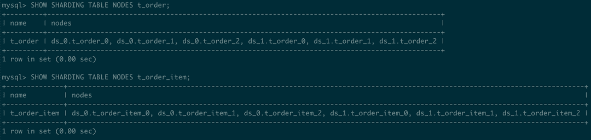

我们可以看到 shard 表的节点分布与需求中描述的一致。

**SQL 预览**

预览 SQL 也是验证配置的一种简单方法。它的语法是`PREVIEW SQL`:

1.对所有路由不使用分片键的查询

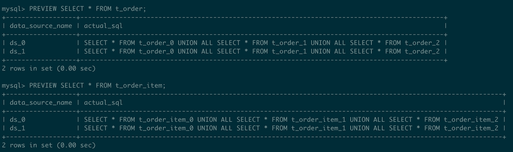

2.指定`user_id`使用单一数据库路径进行查询

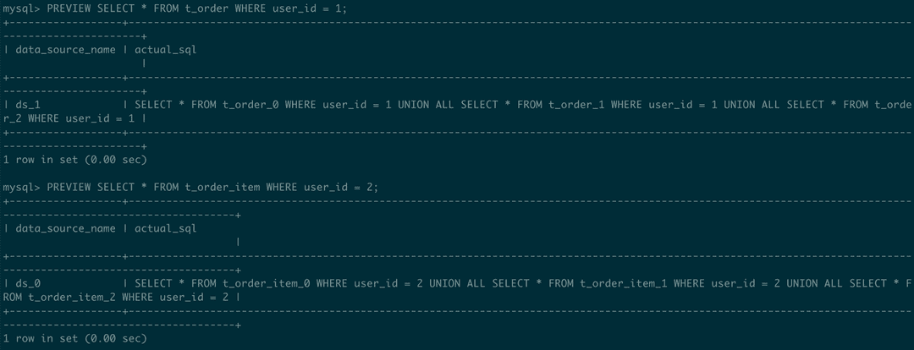

3.用单个工作台路线指定`user_id`和`order_id`

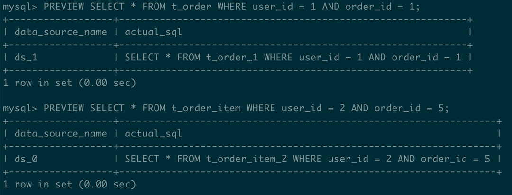

> 单表路由扫描最少的碎片表，提供最高的效率。

## DistSQL 辅助查询

在系统维护过程中，可能需要释放不再使用的算法或存储资源，或者需要释放的资源可能已经被引用，无法删除。下面的 DistSQL 可以解决这些问题。

**查询未使用的资源**

1.语法:`SHOW UNUSED RESOURCES`

2.样本:

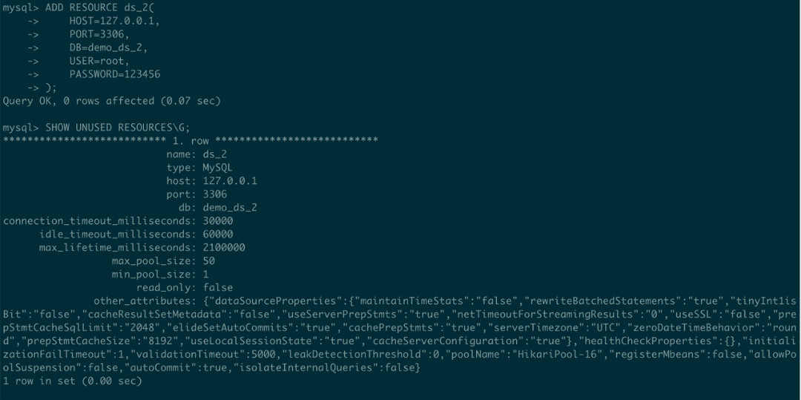

**查询未使用的主键生成器**

1.语法:`SHOW UNUSED SHARDING KEY GENERATORS`

2.样本:

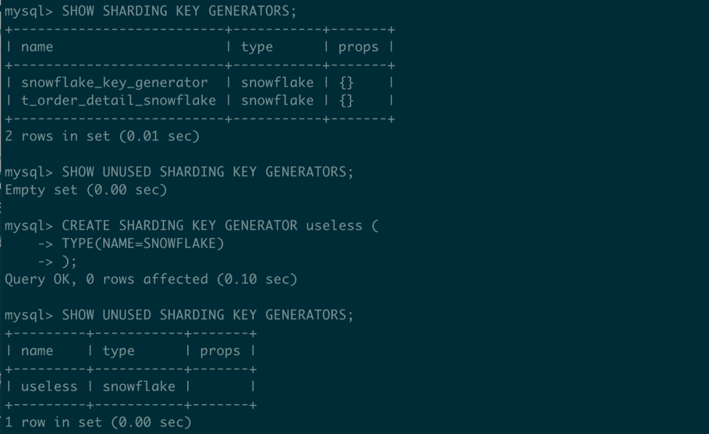

**查询未使用的分片算法**

1.语法:`SHOW UNUSED SHARDING ALGORITHMS`

2.样本:

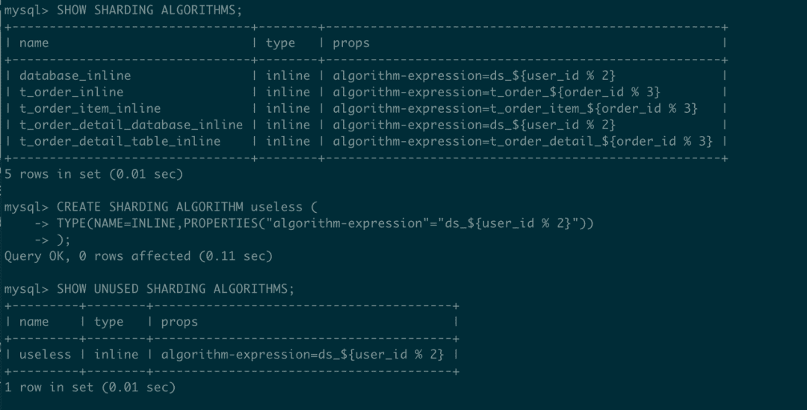

**查询使用目标存储资源的规则**

1.语法:`SHOW RULES USED RESOURCE`

2.样本:

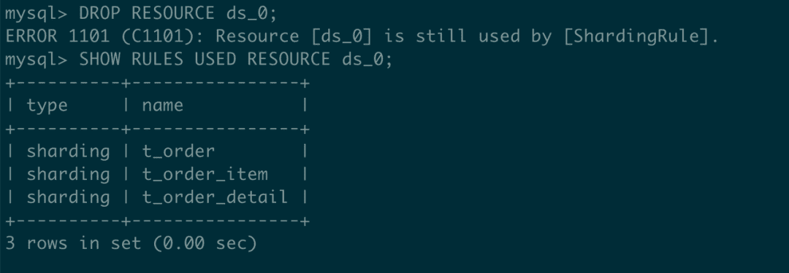

> **可以查询所有使用该资源的规则，不限于** `**Sharding Rule**` **。**

**使用目标主键生成器的查询分片规则**

1.语法:`SHOW SHARDING TABLE RULES USED KEY GENERATOR`

2.样本:

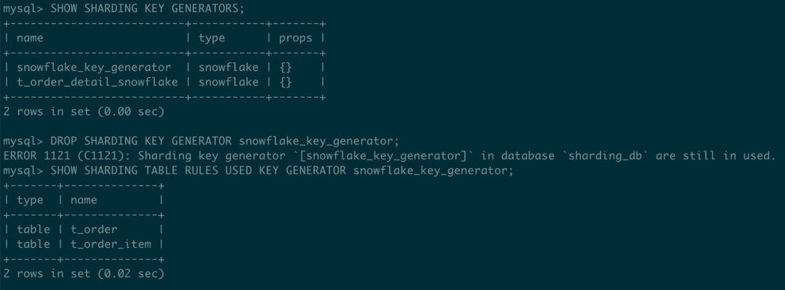

**使用目标算法的查询分片规则**

1.语法:`SHOW SHARDING TABLE RULES USED ALGORITHM`

2.样本:

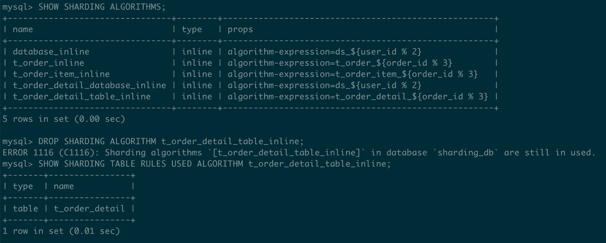

## 结论

本文以数据分片场景为例，介绍 [DistSQL](https://shardingsphere.apache.org/document/5.1.0/en/concepts/distsql/) 的应用和方法。

DistSQL 提供灵活的语法来帮助简化操作。除了`INLINE`算法，DistSQL 还支持标准分片、复合分片、提示分片和定制分片算法。更多的例子将在未来的日子里介绍。

如果你对[Apache sharing sphere](https://shardingsphere.apache.org/)有任何问题或建议，请随时在 GitHub 问题列表上发表。

# 项目链接:

[ShardingSphere Github](https://github.com/apache/shardingsphere/issues?page=1&q=is%3Aopen+is%3Aissue+label%3A%22project%3A+OpenForce+2022%22)

[ShardingSphere Twitter](https://twitter.com/ShardingSphere)

[切割球松弛度](https://join.slack.com/t/apacheshardingsphere/shared_invite/zt-sbdde7ie-SjDqo9~I4rYcR18bq0SYTg)

[投稿指南](https://shardingsphere.apache.org/community/cn/contribute/)

GitHub 问题

[投稿指南](https://shardingsphere.apache.org/community/en/contribute/)

# **参考文献**

1.[概念-DistSQL](https://shardingsphere.apache.org/document/current/en/concepts/distsql/)

2.[概念-分布式主键](https://shardingsphere.apache.org/document/current/en/features/sharding/concept/key-generator/)

3.[概念分割策略](https://shardingsphere.apache.org/document/current/en/features/sharding/concept/sharding/)

4.[概念内嵌表达式](https://shardingsphere.apache.org/document/current/en/features/sharding/concept/inline-expression/)

5.[内置分片算法](https://shardingsphere.apache.org/document/current/en/user-manual/shardingsphere-jdbc/builtin-algorithm/sharding/)

6.[用户手册:DistSQL](https://shardingsphere.apache.org/document/current/en/user-manual/shardingsphere-proxy/distsql/syntax/)

## 作者

## **江**

[*SphereEx*](https://www.sphere-ex.com/en/) *中间件 R & D 工程师&Apache sharding sphere Committer。*

龙涛关注 DistSQL 的 R&D 和相关特性。