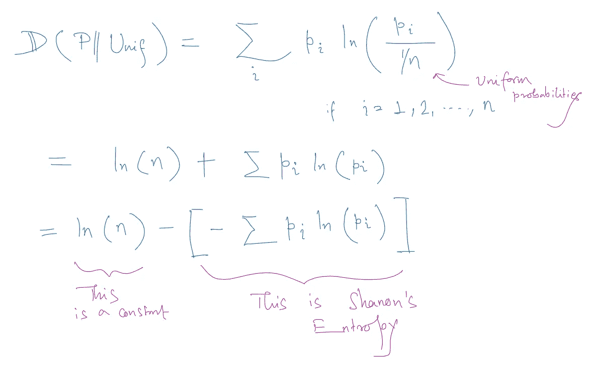
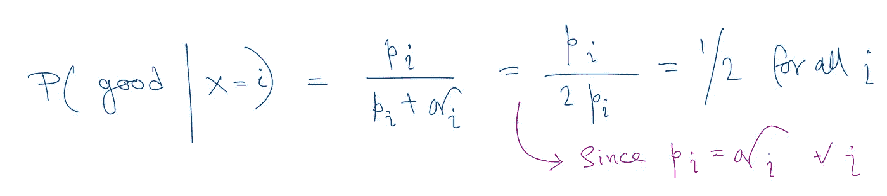

# ‘发散’—度量收敛的地方！

> 原文：<https://blog.devgenius.io/divergence-where-measures-converge-5efc26f0ed58?source=collection_archive---------11----------------------->

好吧，我可能在标题上有点夸张，但“分歧”应该得到更多的信任，尤其是在数据科学时代，我们很多人都在以不同的名义使用它。我们日常分析工作中使用的相当多的非常流行的度量标准只不过是所谓的*kull back-lei bler 散度的延伸。*今天，我们将更深入地探讨这些指标——信息价值、熵、群体稳定性指数(PSI)和证据权重(WoE)。我们将研究所有这些是如何通过一个共同的散度概念联系起来的。

# **直觉**

假设有两个长度相同的概率向量，它们是从同一支持面上的两个离散分布生成的。

p 和 Q——两个离散分布

让我们试着想一想，我们如何定义一个度量，以某种方式展示 P 和 Q 之间的整体“距离”或“差异”或“发散”感:

或许我们可以用上面的方法来测量距离:)

所有这些都可能反映了两个分布之间的某种距离感。你能认出第五个吗？这是 *Kolmogorov-Smirnov* 统计。对第三个的一点修改将导致*卡方*测试统计。上述第二个测量值称为*总变化距离。*有一类距离叫做[*f-散度*](https://en.wikipedia.org/wiki/F-divergence) 涵盖了其中的大部分。既然我已经用很多距离烦你了，让我们看看我们感兴趣的一个。

# **KL 发散**

它被简单地定义为:

KL 散度的定义

请快速注意，这个度量是不对称的，即 *D(P | Q)* 不同于 *D(Q|P)* 。那么这个公式捕捉到了什么呢？我们首先测量差异(因此发散！)的概率值之间的差值，然后取关于 P 的期望值(平均值)。因此，对于任何 *i，*如果 *p_i* 大而 q_i 小，则存在大的散度。如果 p_i 小，q_i 大，那么散度也大，但没有第一个重要。定义中的不对称性使得能够对第一种情况赋予较大的权重，而对第二种情况赋予较小的权重。

注意，每当 p < q but at overall level, it can be proved that KLD measure is non-negative ([见](https://en.wikipedia.org/wiki/Gibbs%27_inequality)时，公式中的 log(p/q)可以取负值。

# 香农熵

变量的熵测量其可能结果固有的“混乱”或“不确定性”的平均水平。

有最大“混乱”的一个分布是什么？让我们掷硬币决定。如果这是一枚公平的硬币，那么下一个结果是正面还是反面同样可能使它变得最“不确定”。另一方面，如果硬币偏向正面，那么“惊喜”就会减少，因为结果往往只偏向正面。因此，最混乱的将是所有结果都有同等可能性的分布，即均匀分布。所以要捕捉一个给定分布的熵，从均匀分布中找出它的散度是合乎逻辑的。

所以熵是与均匀性的“背离”

简单地说，熵的定义是:

熵的定义

这就是为什么它只是一个“分歧”。为了刷新你的高中微积分，你能验证当所有的 P(xi)相等时，上面的 H(x)是最大的吗？

# 人口稳定指数

前面我们讲过 KL 散度公式的不对称性。让它对称并不难:

所以，PSI 只不过是 KL 散度的对称形式。但重要的是要清楚地理解在 PSI 的上下文中 P 和 Q 可能是什么。p 和 Q 在两个不同的时间点可能是相同的群体，我们正在检查分布是否随时间而改变。p 和 Q 可以是在两种不同人口统计学上测量的相同变量。例如，不同的州大米消费量是否不同。

# 信息价值(四)和权重

到现在为止，您一定已经猜到了 IV。IV 是一种通常用于二元分类问题的度量，在二元分类问题中，我们有*好的*和*坏的。*二元分类设置中变量 X 的信息值定义为:

四定义

看与 PSI 公式的相似性。也是 KL 散度的对称版本。但这里的重要问题(以及它与 PSI 的不同之处)是——它测量的两种概率分布是什么？

它是测量穿过 X 的*好* **的概率分布和穿过 X**的*坏* **的概率分布之间的差异**

IV 计算框

根据之前 KLD 的对称公式，P 是 *good 的分布。问*是*坏*(反之亦然；).如果 *pi* 和 *qi* 对于 X 的所有箱都是相同的，这意味着 X 与分类*好-坏*无关，因此在这种情况下 IV 变成 0。直觉上，如果所有的 *pi* 和 *qi* 都相同，那么-

如果 pi 和 qi 都是相同的，那么它总是 50-50 的预测，一样好(或不好！)作为随机分类器。

现在，在我结束之前，不要忘记注意到，悲哀只不过是 KLD 公式中的对数分量。但是悲哀本身应该是一个独立的故事。

我现在必须停下来。离圣诞节只有 4 天了，让你做计算已经够糟了:)祝你节日快乐。新年见。在那之前…