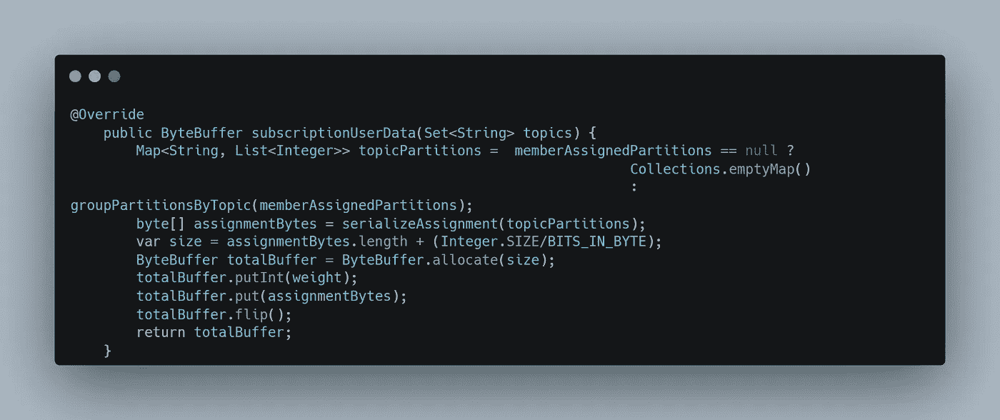
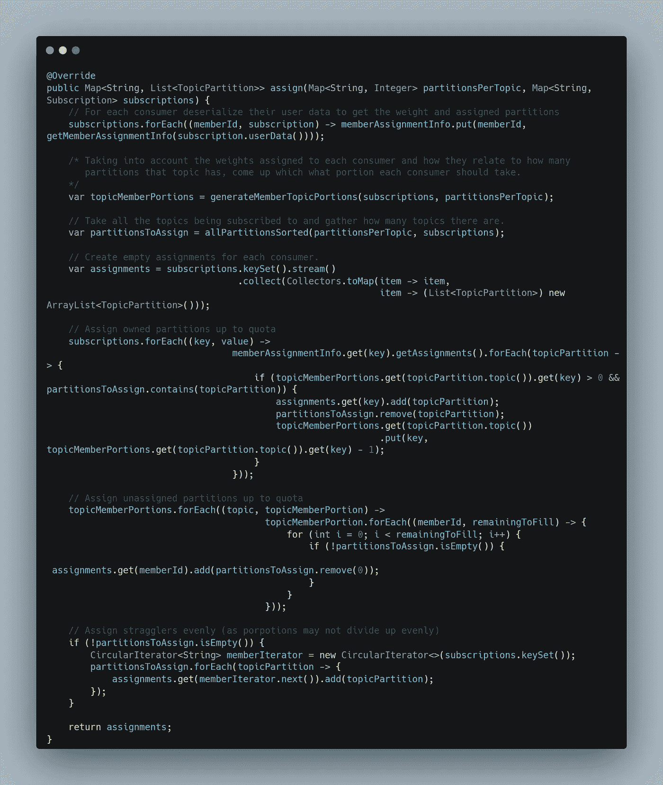

# 通过构建自定义分区分配器深入 Kafka 分区

> 原文：<https://blog.devgenius.io/diving-into-kafka-partitioning-by-building-a-custom-partition-assignor-656eb99bf885?source=collection_archive---------3----------------------->

威尔·弗朗西斯在 [Unsplash](https://unsplash.com?utm_source=medium&utm_medium=referral) 上的照片

构建一个分布式系统并不容易。分布式系统开发人员必须时刻考虑许多问题。开发人员必须跟踪的问题越多，就越有可能漏掉一些东西。通常，这些需要解决和维护的问题并不是正在解决的问题的核心，通常被贴上“无差别的沉重负担”的标签这就是为什么开发人员经常寻找工具和框架来卸载其中一些任务，以便他们可以专注于他们试图解决的核心、独特的业务问题。对于使用 Kafka 的开发人员来说，其中一个问题是调度应用程序的不同实例来负责特定 Kafka 主题的不同分区。幸运的是，Kafka 的消费者对开发者透明地处理了这个问题。让我们把窗帘拉开一点，看看它是如何工作的，然后动手构建我们自己的分区方案。

让我们先提醒自己一点关于卡夫卡的内在。卡夫卡中的数据是分主题的。主题是数据的逻辑分组。主题被进一步细分为一个或多个分区。分区是 Kafka 主题的可伸缩性单位。虽然一个使用者可以处理一个主题中的所有分区，但是多个使用者不能同时操作一个特定的分区。这意味着，如果我有一个包含 20 个分区和 20 个以上消费者的主题，就吞吐量而言，对我没有好处。最后，多个消费者可以通过成为同一个消费者组的一部分来表明他们想要一起工作来处理一个主题。一个主题的所有分区都将被划分在一个消费者群体的范围内。

为了理解分区平衡是如何完成的，了解一点 Kafka 中的组管理以及代理负责什么和客户端负责什么是有用的。当消费者上线时，它通知代理它想要订阅什么主题以及它是什么消费者群体的一部分。每个使用者组将被分配一个代理实例作为其组协调者。群组协调员负责跟踪订阅主题的分区以及群组成员。对这些项目的任何改变都需要改变分区的分布。团队协调者的工具箱里没有很多工具来影响变化，它只有一个，再平衡。

再平衡在概念上很简单。组协调者要求所有消费者重新加入组，此时工作的分配(要处理的分区)可以改变(可能使它在消费者之间更加平均)。可以有许多策略来重新平衡一组主题和分区，因此，有趣的是，重新平衡的工作被委托给客户端，而不是代理。

这就提出了一个问题，如果客户端不知道并且可能无法与其他消费者通信，它如何处理重新平衡？“促进这一个”客户被选为重新平衡的*组长*。此时，两阶段再平衡开始。作为对消息的响应，代理将请求所有消费者重新加入该组。然后，每个消费者将发送一个适当命名的消息，称为`JoinGroup`消息，其中包括想要订阅的主题。收到每位消费者的信息后，我们准备继续。

> 这里需要注意的是，消费者在处理从之前的`poll`呼叫中收到的记录时，不能发送这个`JoinGroup`消息。这意味着如果一个特定的消费者花费很长时间来处理它的记录，所有其他消费者必须等待它完成并发送它的`JoinGroup`消息。在此等待期间，这些用户都不能继续处理分配给他们的分区。

一旦组协调器收到了所有的`JoinGroup`消息，它会将它们合并成一个`JoinGroup`响应，并将其发送给组长(消费者流程之一)。

组长接受这一响应，并确定哪些消费者将被分配哪些主题的哪些分区，并在一个`SyncGroup`请求中将细节发送给组协调员。所有其他消费者也发送一个`SyncGroup`请求。然后，组协调器用分配给消费者的分区来响应每个消费者的`SyncGroup`请求。这就完成了重新平衡的第二阶段，此时所有用户都可以开始处理他们的分区。使用这种重新平衡协议，从消费者发送其`JoinGroup`请求到收到其`SyncGroup`响应，没有对分区的处理。这可能需要很长时间，并且会对处理的吞吐量产生负面影响。一个群体中的消费者越多，这个问题只会变得越严重。

上面描述的是所谓的*急切再平衡协议。*这是所有 Kafka 用户使用的原始默认协议，并且仍然是非流应用程序的默认协议。已经开发的另一个协议被称为*增量合作再平衡协议*。我们不会在这里讨论所有的细节，但是从高层次上来说，该协议的不同之处在于，它提供了一个额外的重新平衡步骤，有利于允许消费者在整个过程中至少处理他们的一些分区。实现这一点的方法是让第一次重新平衡只关注撤销分区。一旦所有需要撤销的分区都被撤销，则存在额外的重新平衡步骤，其中现在撤销的分区被重新分配。通过将这两个步骤分开，可以在整个过程中连续处理所有保留的分区，并且只有被撤销的分区才被有效地临时暂停。通过这个相对简单的算法，我们可以有这个巨大的改进。

# 构建自定义分配器

因此，让我们把新发现的关于分区分配的知识放在一起，构建我们自己的分区分配器。Kafka 的客户端库包括一个接口`ConsumerPartitionAssignor`，任何人都可以实现它来创建自己的分配过程。然后，用户可以通过传入消费者配置值来配置他们的消费者使用这个定制分区分配器:`properties.put(ConsumerConfig.PARTITION_ASSIGNMENT_STRATEGY_CONFIG, <Class name of assignor>.class.getName());`这当然也可以指向捆绑策略之一(`RoundRobinAssignor`、`StickyAssignor`、`RangAssignor`、`CooperativeStickyAssignor`)。该接口需要提供两种方法。返回实际分配的`assign`方法和返回分配者名字的`name`方法。对于我们的例子，我们将使用一个抽象类来实现这个接口，并提供一些帮助方法，因此我们需要的`assign`方法的签名将略有不同，但思想是相同的。

## 我们的转让人会做什么

让我们来看看我们的客户分配者将会做什么，以及我们希望它有什么属性。我不想要一些超级琐碎的东西，但也希望它能在博客帖子中得到解释。考虑到这一点，我决定创建一个具有粘性的分配器，并根据给每个消费者的“权重”来分配分区。对于分配者来说，“粘性”意味着分配给特定消费者的分区将优先保留在该消费者上。如果你试图制定一个合作性的再平衡策略，这是一个要求(为了简单起见，我们的例子将会很急切)。我们对加权赋值的第二个要求与常规平衡器的做法有些不同，它试图进行不相等的赋值，但原则上，权重是合理的。也许您正在使用具有不同功能的不同大小的机器，因此您希望在功能更强的机器上放置比功能较弱的机器更多的分区。这有点做作，但我仍然认为这个概念在现实世界中是有用的。所以让我们开始实施。

## 实施细节

在我的例子中，我们不会检查每一行代码(但是如果你愿意，下面会有一个到存储库的链接),但是我们会碰到一些有趣的地方。我们需要解决的第一个问题是将每个消费者的信息提供给组长。该信息将包括该消费者的体重以及其当前分配的分区(如果有的话)。

> 有趣的是，传递给分配者的一个对象上的一个方法是`ownedPartitions`,这似乎对我们的实现非常有用，但不幸的是，它似乎没有任何来自我的测试的数据，我无法找到它被使用的地方。我肯定我配置错了一些东西，但我不确定是什么。如果你知道，请评论，我很想了解。(更新:[一位读者](https://medium.com/@tkornai/hey-kyle-2284b54d3a85)指出，这是因为这个分配器是一个`Eager`分配器，并且使用了 eager 协议，这意味着每个消费者组在调用`JoinGroup,`之前将丢弃其当前分配的分区。相反，如果它是一个`Cooperative`分配器，`ownedPartitions`值将是预期的。)

为了实现这一点，我们需要在`ConsumerPartitionAssignor`接口上使用一些可重写的方法。第一种是`onAssignment`方法。当分区发生变化时，将对每个消费者调用这个函数。我们将简单地把我们的作业保存起来，以备后用。

onAssignment 函数

然后我们也将覆盖`subscriptionUserData`方法。这个方法被调用，返回的数据连同订阅信息一起在`JoinGroup`请求中传递。这可以返回任何数据，因为返回类型是一个`ByteBuffer`。为了节省网络上的空间，我决定创建自己的序列化代码来获取分配给节点的`weight`以及我们在上面从`onAssignment`方法中存储的分配分区。为了简洁起见，这里不包含这段代码，但是从阅读`subscriptionUserData`函数就可以看出这个高层次的概念。

subscriptionUserData 函数

假设可能没有任何存储分区，我们首先检查，如果没有，简单地创建一个空映射。如果分配了分区，我们会根据主题对它们进行分组。然后，我们的序列化方法接受每个订阅。为主题名的大小写一个`int`，使用 UTF-8 编码写主题名，为主题中分配的分区数写一个`int`，为每个分区写一个`int`，然后返回已经建立的字节数组。然后，我们将权重的`int`放在字节缓冲区中，后面跟着来自上面讨论的分区串行化器的字节，并返回它。这是一个相当手工的序列化设置，但它确实是一个非常有效的设置。然后，我们可以在分配分区时访问这些信息。

现在我们已经做好了准备工作，我们可以开始实际的`assign`函数实现了。向`assign`函数传递两个参数。第一个是主题名称到该主题中分区数量的映射。第二个是消费者 id 到`Subscription`对象的映射。一个`Subscription`对象包含消费者想要订阅的主题、用户数据和其他一些东西。

分配功能

关于这个函数已经做了很多，在支持函数中甚至更多，但是希望看到上面的代码能让你了解它是如何工作的。合同很简单。方法中有一个订阅集合，您必须返回一个将消费者 id 映射到主题分区列表的集合。你如何到达那里可以按照你喜欢的方式发生。

如上所述，在上面的实现描述中忽略了许多细节。如果您想了解更多信息，可以深入以下资源库中的所有代码。

 [## GitHub-kylec 32/Kafka-重新分区-poc

### 此时您不能执行该操作。您已使用另一个标签页或窗口登录。您已在另一个选项卡中注销，或者…

github.com](https://github.com/kylec32/kafka-repartitioning-poc) 

对我们的新分配器进行快速测试，我们确实看到它工作正常。当重量相等时，我们得到大致相等的分布。当使用权重为 900、90 和 10 的三个消费者运行一个 100 分区的主题时，我们得到了权重为 90、9 和 1 的主题分布，这与我们分配的权重完全匹配。

# 包扎

我认为卡夫卡开发者设计的方式非常好。这种重新平衡设置可能会出现问题，但他们正在不断改进，这很好。我也很欣赏设计自己的分配器的能力。我还没有找到在生产应用程序中合法这么做的理由，但是知道这种能力是很棒的。Kafka Streams 开发人员利用了这一点，并构建了一个专门用于运行流应用程序的应用程序，因此这里有一些例子。正如我的大多数深度探索帖子一样，你不需要知道这些信息就可以利用所有这些，但我认为当事情出错时理解这一点以及当你错误地使用系统时理解这一点是非常有益的。