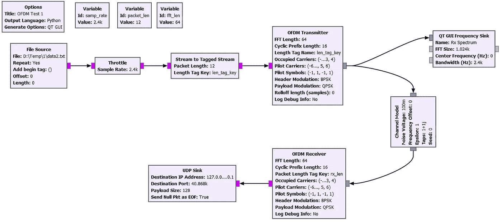
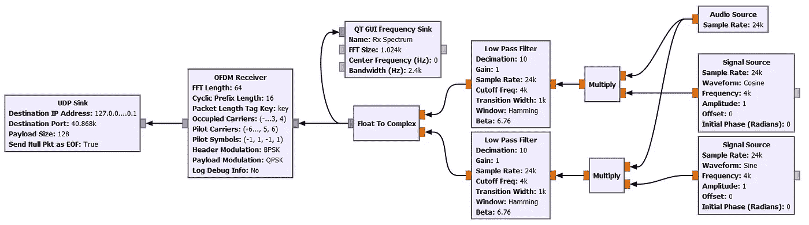

# DIY 空中传输:使用 GNU 无线电和麦克风传输和接收数据

> 原文：<https://blog.devgenius.io/diy-air-transfer-transmit-and-receive-data-using-gnu-radio-and-a-microphone-f0adc8f1f563?source=collection_archive---------2----------------------->


阿列克谢·鲁班在 [Unsplash](https://unsplash.com?utm_source=medium&utm_medium=referral) 上的照片

今天，没有人对通过 WiFi 或蓝牙传输数据感到惊讶。但是有没有可能直接通过航空发送数据*？我将展示如何发送和接收数据，为此我们将使用 OFDM 和 [GNU Radio](https://wiki.gnuradio.org/index.php/Guided_Tutorial_GRC) 创建一个简单的调制解调器实现。*

我们将通过空中传送数据——一个扬声器和一个麦克风就足以接收和传送数据。如果有人不熟悉 GNU Radio，那么之前阅读或观看一些教程是有意义的，比如[这个](https://hackaday.com/2015/11/11/getting-started-with-gnu-radio/)或[那个](https://www.youtube.com/watch?v=ufxBX_uNCa0)。GNU Radio 是跨平台的，可以在 Windows、Linux 和 OSX 上工作。

因此，我们的任务是使最简单的调制解调器能够将数据从 A 点传输到 b 点。调制数字信号有多种方法，我们将使用 [OFDM](https://en.wikipedia.org/wiki/Orthogonal_frequency-division_multiplexing) —一种在现代通信系统中广泛使用的方法。在 OFDM 中，使用快速傅立叶变换(FFT)将数字信号转换成几个并行的子载波，这提供了信道的高速和高效使用。OFDM 被大量使用，从数字电视和无线电到 LTE。就参数而言，我们的音频通道窄得多，也更严格，因此速度会更低，但基本上本质上没有变化。严格地说，OFDM 并不是为通过空中传输数据而设计的，尽管对于小距离，传统的麦克风和扬声器就足够了。

# GNU 无线电中的 OFDM

最小连接图显示在图像上:



一个纯文本文件被用作数据源(它可以包含类似“Hello World”的字符串)，然后数据被分成块，并被馈送到 **OFDM 发射机**。OFDM 是一种相当复杂的调制类型，在 OFDM 编码器的设置中我们需要指定很多不明显的参数。


更详细的数值分析可以在[这里](https://wiki.gnuradio.org/index.php/Basic_OFDM_Tutorial)找到。当然， **OFDM 接收机**模块的参数必须与传输参数相匹配。

**信道模型**模块用于模拟通信信道， **QT GUI 频率接收器**模块用于可视化频谱。同样值得注意的是低采样频率(s/r=2400)，这样做是为了使信号占用适合音频通道的一小部分频谱。

遗憾的是，我没有在 GNU Radio 中找到显示接收数据的内置单元，所以我必须使用 UDP。 **UDP 接收器**模块用于输出数据。一个小的 Python 程序用于接收它:

```
import socketUDP_IP = "127.0.0.1"
UDP_PORT = 40868sock = socket.socket(socket.AF_INET, socket.SOCK_DGRAM) *# UDP*
sock.setsockopt(socket.SOL_SOCKET, socket.SO_REUSEADDR, 1)
sock.bind((UDP_IP, UDP_PORT))
sock.settimeout(0.5)while True:
    try:
        data, addr = sock.recvfrom(128) 
        print("Msg:", data, 'Hex:', ' '.join('{:02x}'.format(x) for x in data))
    except socket.timeout:
        pass
```

这使得我们可以在控制台中显示接收到的数据，这非常方便。也许有更简单的方法输出到 GNU Radio，如果有人知道，请写在评论里。

如果一切都做得正确，我们可以运行 GNU Radio 和 Python 脚本进行接收，结果应该如下所示:


看来这个题目可以做了？不，所有有趣的才刚刚开始。

# 开始直播

在上面的例子中，一切都很简单。但是有一个“但是”——GNU Radio 的工作原理是所谓的“复数信号”，实际上是一对相位相差 90 度的浮点数。这便于计算机处理，但我们不能只接收和广播一个复数。

有两个选择。 **SDR 发射机**的拥有者(HackRF，LimeSDR，USRP 等。)可能不会进一步阅读，只是简单拿一个现成的 GNU Radio 的 block，里面的一切都是“开箱即用”的。但是，由于我们要使用声卡传输信号，我们必须自己进行转换，为此，我们将使用许多 DSP 相关文章中描述的方法:


这里 **OFDM** 是我们的发射机， **Fc** 是载波频率，我们将它设置为 4KHz，以便信号适合扬声器和麦克风的最大灵敏度。传输图的框图也因此变得复杂:


为了便于测试，我使用了 **WAV 文件接收器**，这样保存的文件可以单独录制和播放。我们还可以打开文件并查看其频谱，我们可以确保中心频率确实等于 4KHz:


# 接受

最后，也是最后一步:我们将创建一个接收信号的连接图。在这里，其实一切都是一样的，只是顺序相反。


我们将原始信号乘以相移参考信号，然后在 LPF 的帮助下，我们切断高频成分。输出是可用于进一步处理的复信号。

GNU 电台的接收图如下:



这里我们可以看到用于从声卡接收数据的**音频源**模块， **QT GUI 频率接收器**模块用于显示接收到的信号。

为了测试，我在智能手机上录制了一个 WAV 文件，当我把它带到电脑的麦克风前时，解码后的文本出现在屏幕上:


# 结论

正如我们所看到的，使用 GNU Radio 接收和发送信号是非常有趣和直观的。OFDM 有相当多的参数，希望的人可以独立试验 FFT 块的大小、载波数、传输频率等。

感谢阅读，祝各位实验成功。