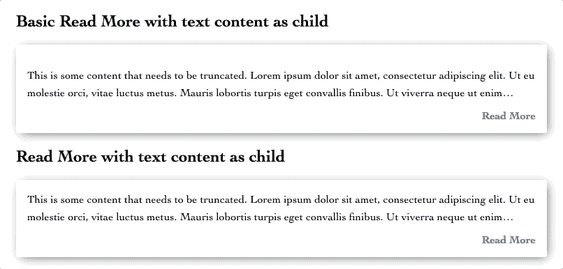

# DIY:多读书

> 原文：<https://blog.devgenius.io/diy-read-more-f3e2e916472?source=collection_archive---------2----------------------->

## 用 React，情感和-webkit-line-clamp

我经常发现，如果没有某种形式的实际应用，软件开发的理论方面对我来说将会迷失。在我职业生涯的早期，我会通过尝试自己建造东西的形式来寻求对事物如何运作的更好理解。这种“自己动手”的态度帮助我培养了充分利用现有库编写代码的能力。我坚信，我们不仅应该努力`know the documentation`和`use the tools`，还应该能够构建我们希望在项目中使用的东西。

考虑到这一点，我想我应该开始一个 DIY 系列，采用一些我们在野外很容易找到的功能，并提供一个易于实现的版本。

本文将重点关注阅读更多组件。

# 什么是阅读更多组件？

Read More 组件用于对用户隐藏文本以节省屏幕空间。其核心是，它要么控制组件的高度以显示文本的`n`行，要么截断显示的字符数，后跟一个指示符，指示还有更多文本要读。这个指示器可以简单到文本末尾的省略号(`…`)和一个写着`Read More.`的链接/按钮

# 创建您自己的 Read More 组件

我们今天创建的 Read More 组件将使用 React 组件、Emotion styled 组件和 CSS `-webkit-line-clamp`属性。我们的 React 组件将处理更新状态值，如组件是否打开、`Read More`按钮文本的值，并传递要在我们的样式化组件中与 CSS 一起使用的行数。CSS 属性将允许我们把组件的文本限制在给定的行数。

## 反应

阅读更多反应组件

**道具**

`ReadMoreBasic`组件接受 2 个道具:

*   `lines` —组件为`closed`时显示的行数
*   `children` —组件将呈现的内容。

**状态**

在`lines 13-15`中，我们用`useState` React 钩子设置我们的状态值。

*   `isOpen`是一个布尔值，将控制组件是打开还是关闭。
*   每当`isOpen`值改变时，`readMoreText`将用于更新`ReadMoreButton`样式组件的文本。
*   `className`将被传递到`Body`样式的组件中。这将允许我们根据组件的打开/关闭状态来切换 css。

功能

在`line 17`上，我们有一个`handleClick`函数，它非常简单明了——它处理点击！基本上，它所做的就是切换`isOpen`状态值，并使用基于此的逻辑来导出其他状态值。我们将这个函数传递给`ReadMoreButton`样式的组件，作为它的`onClick`事件处理程序。

## 半铸钢ˌ钢性铸铁(Cast Semi-Steel)

处理酷阅读更多样式的样式组件

虽然我们使用了一些其他样式的组件，但是我们只关心`Body`组件，因为它承担了所有繁重的工作(至少在视觉上是这样的！).

在`lines 2-3`中，我们使用`display: -webkit-box;`和`-web-kit-orient: vertical;`来启用`-webkit-line-clamp`的使用。

在`lines 4-5`中，我们设置组件关闭时的高度，作为`16px * # of lines * line-height`的计算，确保`Body`组件刚好足够大，可以容纳我们通过的任何文本行。

在`line 6`上，我们使用`overflow: hidden;`来确保任何超出`Body`组件高度的文本内容对用户隐藏。

`.open`类将高度设置为 auto，显示我们所有的文本。

`.closed`类设置了与`-webkit-line-clamp`一起使用的行数，并设置了`text-overflow: ellipsis` CSS 属性，以便在被箝位的文本内容的末尾给我们一个漂亮的尾随省略号(`…`)。

## 用法和结果

在你设置好你的组件后，你应该能够像这样使用它…

阅读更多组件用法

…并得到这样的结果:

阅读更多示例

正如您所看到的，我们的组件中有一些文本，关闭时被夹到 2 行，后面有一个省略号，打开时可以看到完整的文本。`Read More`按钮的文本也被切换，以向用户显示组件所处的状态。

很酷，对吧？！？！

# 挑战…

组件本身很酷，但还可以更酷。我们可以在打开和关闭时转换组件的高度…但是要做到这一点，我们需要知道组件在打开状态下的高度，对吗？那么当窗口大小改变时呢？？那我们就得重新测量成分了！那么其他传入更多 HTML 的方式呢，比如标题标签、列表等等，它们有不同的字体高度和边距。？？？？那么可访问性呢天哪！

嗯，再加一点点努力(也可能很多——我不知道你在职业生涯的哪个阶段！)我们可以解决所有这些问题！

为什么？因为我们是超级棒的开发人员，喜欢解决问题！

我不会详细讲述我是如何解决其中一些问题的，但是我会把代码沙箱留在这里，供您随意使用。

好了，这就是我们要说的。希望我已经帮助你获得了一些知识，你也明白了自己动手做东西的重要性。我个人认为，对于处于各个阶段的开发人员来说，这是一个很好的练习，有助于培养您实现外部库使用的能力，而不仅仅是了解文档告诉您的内容。

感谢你的阅读，我希望你在下一个项目中好运连连！