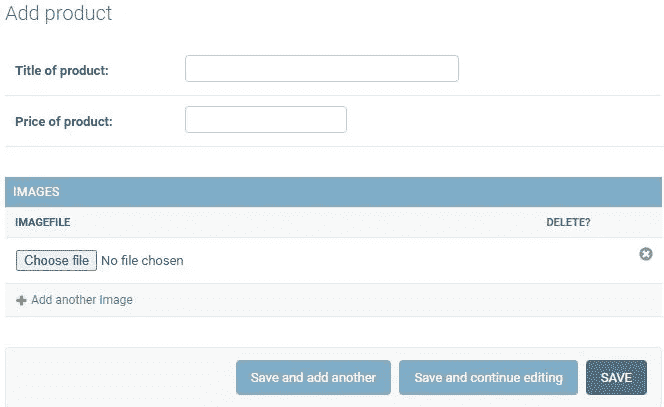
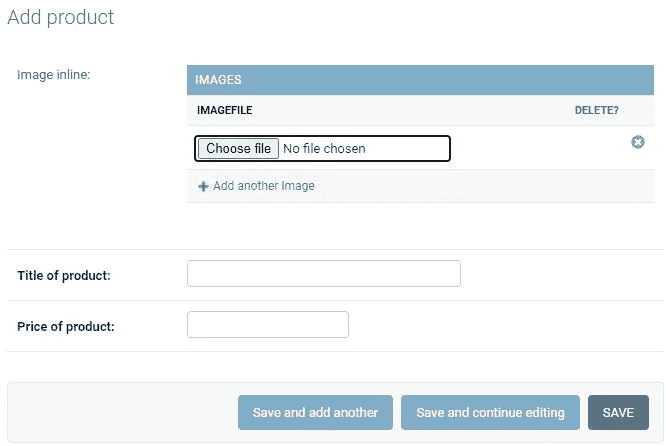
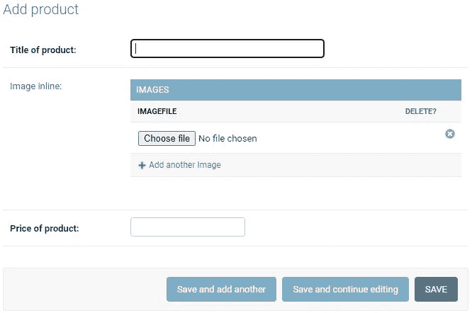

# Django admin 动态内联定位

> 原文：<https://blog.devgenius.io/django-admin-dynamic-inline-positioning-7208596479ce?source=collection_archive---------4----------------------->

智能快速的解决方案

最近，我收到了一个客户关于我们 Django 项目的有趣请求。
他问是否可以在 Django 管理面板的其他字段上方显示一个内嵌组件。

一开始我想，这应该没有任何问题。
尽管除了在项目中安装另一个电池之外没有简单的解决方案。我的直觉告诉我，有另一种方法可以解决这个问题。

我找到的第一个[解](https://linevi.ch/en/django-inline-in-fieldset.html)是 2017 年的。对于这么简单的任务来说，它的代码太多了。

我们的首席执行程序员马克西姆·达尼洛夫找到了一个非常简单的解决方案。大约一个月前，他用俄语在网上发表了他的作品。

我想与说英语的 Django 社区分享这些想法，以帮助其他人简化他们的代码。对于这样一个乍看起来“简单”的问题，它可能会派上用场。

长话短说，让我们深入代码:

假设您正在构建一个电子商务项目。您有一个与`ImageModel`有 O2M 关系的`ProductModel`。

models.py

对于给定的模型，您还需要`ModelAdmins`。

管理. py

现在让我们创建一个简单的内联来放入我们的`ProductModelAdmin`。

管理. py

到目前为止，我们有两个简单的模型和基本的带 T5 的 T4。

带内嵌的普通管理表单

我们应该如何在`ProductModelAdmin`的两个字段之上或之间挤压内联？

我想，你对`ModelAdminForm`中[增加字段](https://docs.djangoproject.com/en/4.0/ref/contrib/admin/#django.contrib.admin.ModelAdmin.readonly_fields)的概念很熟悉。您可以在`ModelAdmin`中创建一个方法，将表单中方法的响应显示为只读字段。
记住，`ModelAdmin`的渲染顺序会先创建`InlineModels`，然后渲染`AdminForm`，再渲染`InlineForms`。

我们可以用它来重新排列内联和字段的顺序。

管理. py

我们使用`render_change_form`来获得对象`request`和`response`。
我们使用`image_inline`方法中的那些对象从`inline_admin_formsets`列表中取出一个还未处理的`inline_formset`，并渲染`InlineFormset`。

在`change_form`渲染之后，剩余的`inline_admin_formsets`将被渲染，如果`ModelAdmin`还有一些的话。

现在我们可以用方法`image_inline`来确定我们的`InlineFormset`的位置。代码片段在上面时，内联元素将被放置在所有其他字段之上。

顶部嵌入

当我们以这种方式重新排列字段时，行内显示在字段之间:

管理. py

当然，Django admin 在方法名称的内联前面添加了一个标签，但是这可以通过简单的 CSS 在`ProductModelAdmin`的`Media`属性中删除。

模型字段之间的内联

> 这个解决方案有一个致命的错误！每个 Django ModelAdmin 都是 singelton，这就是为什么我们不能在 `**render_change_form**` **中使用 ModelAdmin.self 作为容器！**

可以用 Mixin 改变 ModelAdmins singleton 的行为，保持与 Djangos GCBV 的概念一致。在我的下一篇文章中，我们将进一步研究它。

这仅仅意味着，我们不能使用`ModelAdmin`的实例作为容器来保存我们的`request`和`response`。
解决方案是将这些对象保存在`AdminForm`实例中。

如果您没有解决 ModelAdmin singleton 问题，这个代码片段是有效的。

参数`obj`并不总是在`render_change_form`中给出(即添加新对象)。这就是为什么我们必须从`ModelForm`中获取它，它被包裹在`AdminForm`中。

现在我们可以将请求和响应设置为`ModelForm`实例的属性，并在`image_inline`中使用它们。

## 综上所述:你不必为了解决一个简单的问题而在你的项目中安装另一个电池。有时候你需要深入挖掘你所使用的框架，找到一个简单、快捷的解决方案。

我要感谢 wPsoft 的实习生 Martin Achenrainer 对本文的贡献和翻译。