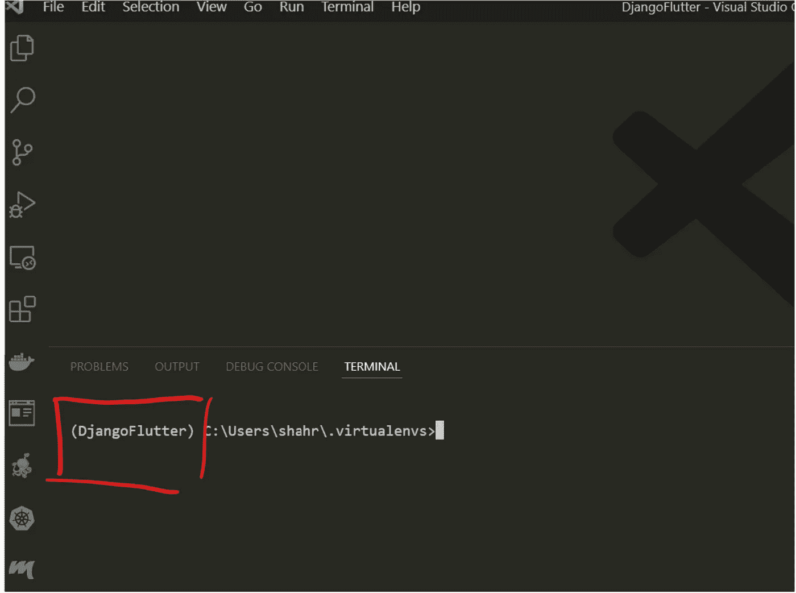
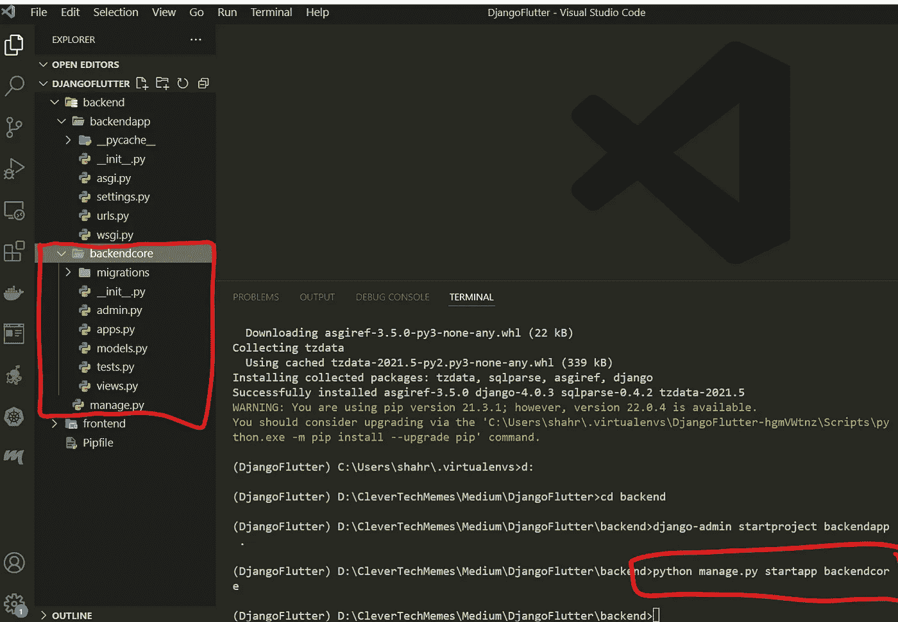

# Django 和 Flutter——样板应用程序的分步指南

> 原文：<https://blog.devgenius.io/django-and-flutter-a-step-by-step-tutorial-for-a-boilerplate-application-f564335f2e8b?source=collection_archive---------0----------------------->

# 介绍

Django 和 *Flutter* 是企业家和程序员开发应用程序的两个基本后端和前端工具。 *Django* 以其基于 *Python* 编程语言的灵活快速的开发能力而闻名， *Flutter* 是基于 *Dart* 语言的平台无关前端技术。在本教程中，将一步一步地展示如何创建一个 *Django* 和 *Flutter* 应用程序，以及需要对这两个应用程序进行哪些更改以使它们能够相互通信。

> 我每周都会在这个频道发表技术文章，所以请关注我，订阅我的频道。请查看我列表中与 [Spark](https://medium.com/@clever.tech.memes/list/internalspark-62fda9e00b36?source=my_lists---------1-------62fda9e00b36---------------------) 和 [Scala](https://medium.com/@clever.tech.memes/list/internalscala-40c96bf7addd?source=my_lists---------11-------40c96bf7addd---------------------) ， [Streamlit](https://medium.com/@clever.tech.memes/list/internalstreamlit-8638d94cd666?source=my_lists---------8-------8638d94cd666---------------------) ， [React](https://medium.com/@clever.tech.memes/list/internalreact-79590e57fc46?source=my_lists---------9-------79590e57fc46---------------------) ， [Django](https://medium.com/@clever.tech.memes/list/internaldjango-8eb3f062efcd?source=my_lists---------12-------8eb3f062efcd---------------------) ， [AWS](https://medium.com/@clever.tech.memes/list/internalamazonwebservices-805665b5bf42?source=my_lists---------13-------805665b5bf42---------------------) ，[机器学习](https://medium.com/@clever.tech.memes/list/internalmachinelearning-ccbf43744e48?source=my_lists---------1-------ccbf43744e48---------------------)，[启动](https://medium.com/@clever.tech.memes/list/internalstartup-e8a221bc47e1?source=my_lists---------14-------e8a221bc47e1---------------------)， [Cheatsheets](https://medium.com/@clever.tech.memes/list/internalcheatsheets-7f7527bf9356?source=my_lists---------11-------7f7527bf9356---------------------) 和[其他开发主题](https://medium.com/@clever.tech.memes/list/miscellaneousdevelopmenttopics-d5ffe886b93e?source=my_lists---------1-------d5ffe886b93e---------------------)。
> 
> *请使用此链接加入 https://medium.com/@clever.tech.memes/membership*。谢谢你的大力支持。

**准备环境和要求**

对于本教程，你需要根据你的操作系统安装 Flutter 。此外，您需要[为您的机器安装 VSCODE IDE](https://code.visualstudio.com/download) 。安装完成后，你需要打开 *VSCODE* ，创建一个文件夹保存你的 *Django* 和 *Flutter* 代码，如下空文件夹名为 *DjangoFlutter* (你可以选择自己的名字):

清空文件夹来保存 Django 和 Flutter 代码

之后，你打开 *VSCODE* ，你可以通过点击文件打开 *DjangoFlutter* 文件夹，打开文件夹如下:

现在，您可以在 VSCODE explorer 上看到 DjangoFlutter 文件夹，如下所示:

查看 Djangoflutter 文件夹

打开一个新的终端，如下所示:

在 VSCODE 中打开终端

现在，您可以使用 *mkdir 命令:*创建一个名为*后端*的文件夹

创建后端文件夹

然后，使用如下 *mkdir frontend* 命令创建一个名为 *frontend* 的文件夹:

创建前端文件夹

建议在虚拟环境中工作，因此让我们为库的安装创建一个虚拟环境，因此我们使用***“pipenv shell”*** 如下:

创建虚拟环境

如果您没有安装 *Python* 、 *pip 或 pipenv* ，您需要安装它们。关于 *pip 的安装，可以看看这篇文章[*安装 pip*](https://www.activestate.com/resources/quick-reads/how-to-install-pip-on-windows/)*。*特别是安装 *pip 时可以参考以下章节:**

**

*安装 Pip*

*现在，用户可以转到包含所有虚拟环境的路径，并查看创建的虚拟环境:*

**

*看到创建的虚拟环境*

*您可以看到您的所有虚拟环境，现在您可以使用 ***激活您的虚拟环境。*** 如下图所示。请注意，里面有一个 ***脚本文件夹*** 以及一个 ***激活*** 文件，所以需要运行以下命令(在 MAC 等其他操作系统上可能略有不同)；但是，当您在 ***powershell*** 上时，您可能仍然会遇到以下错误，您需要切换到 ***命令提示符(cmd)*** :*

**

*现在，应该可以看到虚拟环境已激活:*

**

*激活虚拟环境*

*我们可以使用***“pip install django”****安装 ***django*** ，如下:**

****

**pip 安装 django**

**点击扩展并安装有用的扩展，包括**"牛逼的颤动片段"，"飞镖"，"颤动"，"漂亮"，" Python "，" Django"****

****

**扩展ˌ扩张**

# **创建和运行 Django 后端**

**让我们切换到后端文件夹，使用***“django-admin start project backendapp”创建一个名为 ***backendapp*** 的 *django* 项目*:****

**

*django-admin start project backendapp。*

**Django* 的美妙之处在于可以创建不同用途的应用程序，例如用户管理。让我们用****python manage . py startapp backendcore***创建一个名为***backendcore****的 app***

******

***创建应用程序***

***现在，我们需要将创建的应用程序添加到 Django 中已安装应用程序的列表中。所以，我们可以参考*backendcore 里面的 ***apps.py*** 文件，使用***backendcoreconfig***函数****

****

**现在需要将这一行添加到 ***settings.py*** 文件中，这是整个应用程序的中心设置:**

****

**需要使用**" python manage . py migrate ":**来迁移变更**

****

**迁移变更**

**是时候看看我们可以通过编写**" python manage . py runserver ":**来运行 Django 服务器了**

****

**如果用户进入浏览器并写入 127.0.0.1:8000，他/她可以看到 *Django* 已经启动并正在运行，您可以通过浏览器访问它:**

****

**姜戈已经开始运作了**

# **改进 Django 设置**

**是时候改进 Django 的设置了，记住以下三点很重要:**

1.  **时区:你需要调整到你的时区。**
2.  ****Secret_key** :您不应该向公众透露，否则会危及您应用的安全。**
3.  ****调试模式**:当转移到生产时你需要改变它，但是对于开发来说处于*调试模式*是可以的。**

****

**永远不要泄露秘钥**

****

**适应时区**

**让我们探讨一下如何考虑上述问题。考虑**是最佳实践。env** 文件，并将环境变量如 **secret_key** 保存在该文件中，避免将其推送到公共存储库。因此，让我们创建**。env** 文件，将 **secret_key** 从 **settings.py** 中复制粘贴到**中。env** 文件:**

****

**的创造。环境文件**

**现在，我们需要将这些变量导入到 ***设置. py*** 中，但是为此，我们需要使用***" pip install django-environ ":***安装***django environ*****

****

**pip 安装 djangoenviron**

**为了从 ***中导入变量，需要添加这几行红色代码。env*** 文件，并将环境变量保存在一个集中且安全的地方:**

****

**导入环境变量**

**你可以在上面的图片中看到，我们仍然可以正常运行服务器。**

# **在 Django 中编写简单的视图和路由**

**现在让我们在 *Django* 中编写一个 hello world view:为此，需要在*中打开 ***views.py*** 并编写以下函数***

****

**编写简单的视图**

**需要将传入的请求路由到已定义的视图，因此我们可以编辑 ***backendapp*** 文件夹中的 ***urls.py*** 并添加以下内容:**

****

**这意味着带有***【app/】***的路径将被路由到 ***后端核心***；但是，这里还不存在一个 ***urls.py*** 文件，那么，让我们在 ***backendcore:*** 里面创建一个 ***urls.py*****

****

**在 backendcore 中创建 urls.py**

**你应该仍然能够启动服务器，现在是时候添加 *Flutter* 前端了**

# **创建颤动前端**

**你需要首先安装 Dart 和 Flutter——我假设已经完成了。我们可以使用***“CTRL+SHIFT+P”***，选择 ***“创建颤振应用”*** ，在 *VSCODE* 中创建一个颤振项目，然后选择创建颤振应用的文件夹**

****

**颤振:新项目**

****

**颤振——应用程序的创建**

****

**选择文件夹**

****

**颤振应用程序的名称**

**现在，颤振项目被创建**

****

**我们可以选择设备，并开始运行我们的第一个 *Flutter* 应用程序:**

****

**选择设备**

****

**选择 Chrome Web**

****

**不调试运行**

**现在，应该可以看到颤振演示网页:**

****

**颤振演示页面**

**现在，让我们删除*文件夹中 ***main.dart*** 文件的内容，并写入以下内容:***

****

**主镖的内容**

****

**主镖的内容**

**在本教程中，目标是准备样板程序和使 Django 和 Flutter 工作的方法，所以我假设读者熟悉 Flutter 语法。但是，上面的代码添加了一个栏、一条欢迎消息和一个按钮。同样， ***按钮按下*** 功能在按钮一按下就向 *Django* 后端发送 *GET* 请求。因此，这里没有太多的编码，只是为了交流和演示的目的而带来了必要的东西。**

# **后端和前端之间的通信**

**对于 Django 后端和 Flutter 前端之间的通信，需要给 *Flutter* 添加 *http* 依赖，所以我们可以写:**

****

**扑扑 pub 添加 http**

**现在可以通过将 import***' package:http/http . dart '写成 http*** 来导入 *http* 库，并使用*中的 ***http.get()*** 发送请求，如下所示 ***:******

****

**单击按钮时发送请求**

**一旦我们通过编写***" python manage . py runserver "***运行 Django 服务器，并单击浏览器中的按钮，我们可以看到我们在 *Django 中接收请求，即生成了* 200，这意味着请求被成功接收。**

****

**我们仍然可以通过在 *Django* 中写一个类似“request received”的打印语句来确认，并判断该请求是否可以打印，它的工作方式如下:**

****

**添加印刷品**

**但是，如果我们右键单击前端页面并检查元素，我们可以看到我们收到了 *CORS 原点错误*，因为 *Django* 不知道 *Flutter* 作为可靠的前端进行通信。**

****

# **解析 Django 跨站点源并使用 REST**

**为了解决这个问题，让我们通过编写***【pip install django-Rest-Framework】***来安装 D *jango Rest 框架*，并将 Rest 框架添加到已安装的应用程序中:**

****

**将' **rest_framework** 添加到设置中**

**并将以下内容添加到 ***settings.py*** 文件中，如下所示:**

****

**让我们安装 ***simple-jwt*** 和 ***django cors 头*** 。我们需要 ***simple-jwt*** ，来激活 Django 中的令牌认证，并且我们需要 ***cors-origin*** ，因为我们需要与像 Flutter 这样的外部前端进行通信，所以让我们通过编写以下代码来安装这些库:**

*   *****pip 安装 django-cors-headers*****
*   *****pip 安装 djangorestframework-simplejwt*****

**在***REST _ Framework***中，需要添加 ***simplejwt 如下:*****

****

**同样，我们需要添加 ***简单 _JWT*** 配置如下所示:**

****

**我们需要将 ***corsheaders*** 添加到已安装的应用程序中:**

****

**不过，我们需要在 ***settings.py*** 的 ***中间件*** 中添加如下内容:**

****

**Flutter 需要被允许与 Django 通信，因此我们需要将 localhost 添加到允许的主机列表中，并在 ***settings.py*** 中将*CORS _ 起源 _ 白名单* 发送请求到后端:**

****

**让我们使用来自***rest _ framework***的 ***响应*** 对 ***views.py*** 文件稍作修改，并向客户端发回一条适当的消息，如下所示:**

****

**请注意，我们需要添加像 ***@permission_classes 和@api_view 这样的装饰器。你可以把它们想象成包装函数，允许函数在处理请求的同时接收 GET 请求。*****

**现在，如果我们单击浏览器中的按钮，我们可以看到 ***Django 和 Flutter*** 之间的成功通信:**

****

# **总结:**

**Django 和 *Flutter* 是两种重要的后端和前端技术，帮助开发者和企业家创建有用的应用。Django 之所以受欢迎，是因为它的快速开发周期和 Python 编程语言的根基，现在很多从业者都可以使用它。Flutter 因其平台独立性而在市场上获得了发展势头，这意味着只需编写一次代码，就可以在任何地方运行。在本教程中，一步一步地展示了如何创建可以相互通信的样板 *Django* 和 *Flutter* 应用程序。**

> **我每周都会在这个频道发表技术文章，所以请关注我，订阅我的频道。请查看我列表中与 [Spark](https://medium.com/@clever.tech.memes/list/internalspark-62fda9e00b36?source=my_lists---------1-------62fda9e00b36---------------------) 和 [Scala](https://medium.com/@clever.tech.memes/list/internalscala-40c96bf7addd?source=my_lists---------11-------40c96bf7addd---------------------) ， [Streamlit](https://medium.com/@clever.tech.memes/list/internalstreamlit-8638d94cd666?source=my_lists---------8-------8638d94cd666---------------------) ， [React](https://medium.com/@clever.tech.memes/list/internalreact-79590e57fc46?source=my_lists---------9-------79590e57fc46---------------------) ， [Django](https://medium.com/@clever.tech.memes/list/internaldjango-8eb3f062efcd?source=my_lists---------12-------8eb3f062efcd---------------------) ， [AWS](https://medium.com/@clever.tech.memes/list/internalamazonwebservices-805665b5bf42?source=my_lists---------13-------805665b5bf42---------------------) ，[机器学习](https://medium.com/@clever.tech.memes/list/internalmachinelearning-ccbf43744e48?source=my_lists---------1-------ccbf43744e48---------------------)，[启动](https://medium.com/@clever.tech.memes/list/internalstartup-e8a221bc47e1?source=my_lists---------14-------e8a221bc47e1---------------------)， [Cheatsheets](https://medium.com/@clever.tech.memes/list/internalcheatsheets-7f7527bf9356?source=my_lists---------11-------7f7527bf9356---------------------) 和[其他开发主题](https://medium.com/@clever.tech.memes/list/miscellaneousdevelopmenttopics-d5ffe886b93e?source=my_lists---------1-------d5ffe886b93e---------------------)。**
> 
> ***请使用此链接加入 https://medium.com/@clever.tech.memes/membership*。谢谢你的大力支持。**