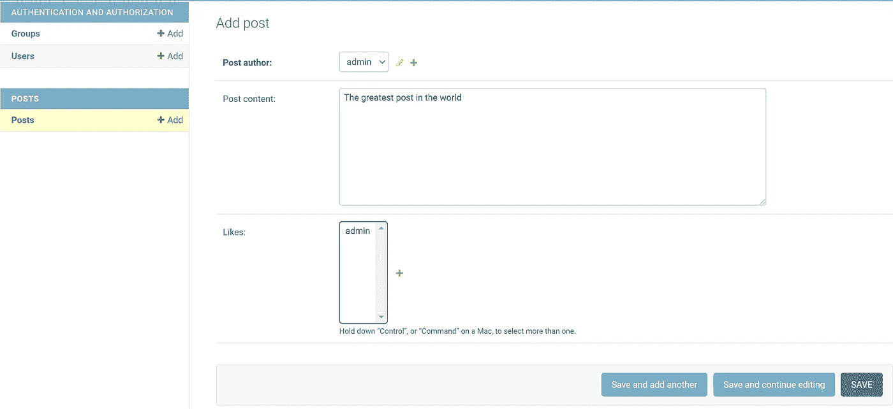
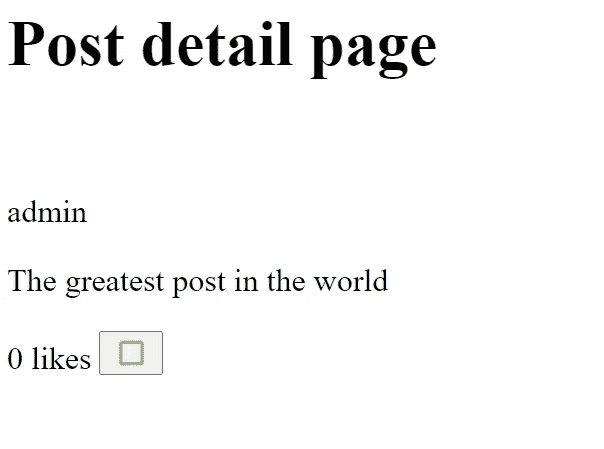
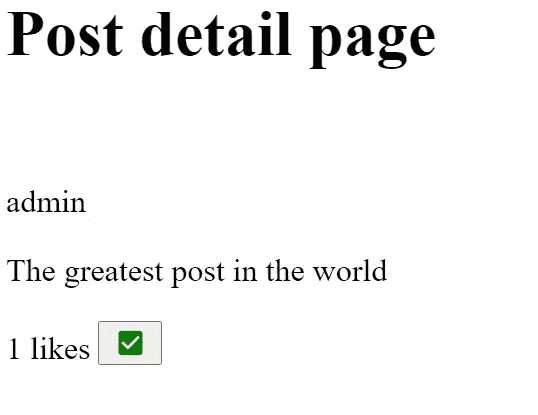

# Django 和 HTMX 第 1 部分(页面无刷新按钮)

> 原文：<https://blog.devgenius.io/django-and-htmx-part-1-ff629ae048f1?source=collection_archive---------2----------------------->

在第一篇教程中，我将介绍如何使用 HTMX 在网页上实现一个简单的 *like* 按钮，以避免在 Django 网站上编写 JavaScript。

希望直接跳到*指南*？[点击这里](https://medium.com/p/ff629ae048f1#cb7d)


詹姆斯·哈里森在 [Unsplash](https://unsplash.com?utm_source=medium&utm_medium=referral) 上的照片

好的。首先，我想说我不是全栈开发人员，我的时间有限。在过去的几年里，我喜欢学习 Django，并希望开发更具互动性的网站。
Django 是一个使用 Python 创建 web 应用程序的优秀框架。语法简单明了，只要稍加练习就能轻松创建 web 应用程序，因为 Django 内置了如此多的特性。

唯一的问题是，为了创建一个具有交互特性的站点，而不涉及页面重载，简单到像一个 like 按钮意味着你需要将 Django 和 JavaScript 结合起来。

Django 本质上是一个*后端*框架，它可以在从数据库中提取数据的同时根据设计呈现网页。

在诸如喜欢按钮的简单特征的情况下，用户点击按钮需要网页向存储页面数据的服务器发送请求，以增加点击时喜欢的数量。然而，不幸的是，结果将意味着整个页面都需要重新加载，而不仅仅是页面中需要更新的部分。

使用 JavaScript 可以通过多种方式实现这一点，而且都需要很长的学习时间。我个人没有时间去学习每一种网络技术，因为我的日常工作不允许我这样做。此外，我不使用某项技能的时间越长，当我需要再次使用该技能时，就越有可能需要重新学习该技能。

我确信在未来，Django 将会包含一些特性，使得调用后端更加容易。在那之前，我先给你介绍一下 HTMX。

HTMX 允许我们包含交互特性，同时只扩展我们无论如何都会创建的 HTML 模板的基本语法。

下面我将介绍创建一个简单页面和帖子的 like 按钮的基础知识。

## 创建虚拟环境

让我们从创建一个简单的 Django 项目和应用程序开始。

如果你喜欢在不输入所有代码的情况下重新创建它，请在这里查看 GitHub repo:[https://github.com/bitFez/htmx_guide_1_like_button](https://github.com/bitFez/htmx_guide_1_like_button)

我只是列出了 Windows PC 的步骤。首先，在命令提示符下，在您希望安装 Django 项目的文件夹中键入以下内容:

```
virtualenv venv
```

接下来，我们将运行虚拟环境

```
venv/scripts/activate
```

假设您的计算机上安装了 python >= 3.6，请键入:

```
pip install Django==3.2.5
```

安装完成后，让我们开始一个 Django 项目。下面一行中的`.`确保项目安装在当前目录中，而不是当前目录中的另一个目录。

```
django-admin startproject core .
```

因此，我们已经创建了一个名为核心的 Django 项目，我们现在想创建一个名为帖子的应用程序。

```
python manage.py startapp posts
```

该目录应该如下所示:

```
- core 
- posts
- venv
manage.py
```

现在，在核心目录中，打开`settings.py`，在`installed_apps`数组下添加 posts 应用程序。

```
INSTALLED_APPS = [
  ...
  # my apps
  'posts',
]
```

在核心应用程序目录中打开`urls.py`文件，并在`urlpatterns` 数组中添加以下内容。

```
from django.urls import path, ***include*** # add include hereurlpatterns = [
  path('admin/', admin.site.urls),
  path('', include('posts.urls')), # <-- Add this line
]
```

在帖子应用程序中，将以下内容添加到`models.py`文件中

```
from django.db import models # Create your models here.                             
from django.db import models                             
from django.contrib.auth.models import User class Post(models.Model):
    # loads the USER linked to the profile from django AUTH
    post_author = models.ForeignKey(User, on_delete=models.CASCADE)
    post_content = models.TextField(null=True, blank=True)
    likes = models.ManyToManyField(User, blank=True, related_name="collected_votes")
```

同样在 posts 目录中，将以下内容添加到`admin.py`文件中。

```
from django.contrib import admin
from .models import Post
# Register your models here.

class PostAdmin(admin.ModelAdmin):
    model = Post
    fields = ['post_author', 'post_content', 'likes']

admin.site.register(Post, PostAdmin)
```

现在我们需要在 posts 目录中创建 2 个 HTML 文件。一个是查看帖子的模板。另一个是部分区域，我们将使用它在每次按下按钮时动态更新赞。

在一个文件夹结构中创建两个文件，如下例所示。

```
posts
│   
└───templates
│   │   post_detail.html
│   │
│   └───partials
│       │   likes_area.html
```

`post_detail.html`文件的内容

```
<html>
    <head>
        <link rel="stylesheet" href="https://fonts.googleapis.com/icon?family=Material+Icons">
    </head>
    <body>
        <h1>Post detail page</h1>
        <br>
        <p>{{post.post_author}}</p>

        <p>{{post.post_content}}</p>
        <div>
            
        </div>
    </body>
    <script src="https://unpkg.com/htmx.org@1.6.0"></script>
    <script>
        document.body.addEventListener('htmx:configRequest', (e) => {
          e.detail.headers['X-CSRFToken'] = '{{ csrf_token }}';
          })
      </script>
</html>
```

正如您在上面看到的，有一个带有 Django 标签``的 div。这将加载页面的部分区域，允许我们向页面添加一个按钮和类似的计数器。部分章节如下。

`likes_area.html`文件的内容

```
<div class="list-group list-group-horizontal btn-group" id="likesarea" role="group">
    <p>{{ post.likes.count }} likes

        <button hx-post="" id="like-button" 
          hx-target="#likesarea" hx-swap="outerHTML">
          
            <i class="material-icons" style="font-size:16px;color:green;">check_box</i>
          
          <i class="material-icons" style="font-size:16px;color:yellowgreen;">check_box_outline_blank</i>
          
        </button>

    </p> 

</div>
```

上面你可以看到没有一个完整的 HTML 文件，只有一个`div`将被加载到主页面。这就是奇迹发生的地方。div 有一个设置为`“likesarea”`的 id，这是每次按下 like 按钮时将加载的内容。

现在 like 按钮本身有了简单的 HTMX 标签`***hx-post***`，它将调用 HTMX 库来调用*视图函数*、`like_post`。当我们添加视图时，您会看到，它会根据用户是否已经喜欢它来添加或删除对该帖子的喜欢。

在同一个 button 标记中，还有另一个 HTMX 标记，它指定页面上哪个 div 需要刷新。在这种情况下，它指的是类似于的*区域。*

让我们通过在 posts app 目录中创建一个`urls.py`文件并添加以下行来添加我们将需要的路径:

```
from django.urls import path
from .import views 

app_name = 'posts'

urlpatterns = [
    path('post/<int:id>', views.view_post, name='view_post'),
    path('like/<int:id>', views.like_post, name='like_post'),
]
```

最后，我们只剩下最后一个文件了。我们需要将以下内容添加到帖子应用程序的`views.py`文件中。

```
from django.contrib.auth.decorators import login_required
from django.contrib.auth.models import User
from django.shortcuts import render

from .models import Post

def view_post(request, id):
    post = Post.objects.get(id=id)

    context = {'post':post}
    return render(request, 'posts/post_detail.html', context)

def like_post(request, id):
    if request.method == "POST":
        instance = Post.objects.get(id=id)
        if not instance.likes.filter(id=request.user.id).exists():
            instance.likes.add(request.user)
            instance.save() 
            return render( request, 'posts/partials/likes_area.html', context={'post':instance})
        else:
            instance.likes.remove(request.user)
            instance.save() 
            return render( request, 'posts/partials/likes_area.html', context={'post':instance})
```

让我们创建一个超级用户，然后迁移我们的数据库更改。

在命令提示符下键入以下内容

```
> python manage.py makemigrations
> python manage.py migrate
> python manage.py createsuperuser
```

一旦你创建了一个管理员用户，运行服务器让网站运行起来。

```
python manage.py runserver
```

在这个例子中没有主页，所以直接进入`[http://127.0.0.1:8000/admin](http://127.0.0.1:8000/admin)`的管理页面并登录。现在创建一个很棒的帖子，如下例所示。



现在，假设你创建的文章是 1 号文章，去`[127.0.0.1:8000/post/1](http://127.0.0.1:8000/post/1)`

页面应该是这样的。



单击该按钮时，它应该看起来像这样:



没有页面重新加载…麦克风下降！🎤