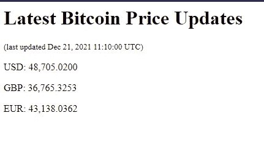

# Django 和 HTMX 第 2 部分(定期刷新)

> 原文：<https://blog.devgenius.io/django-and-htmx-part-2-periodic-refreshing-768cc059a06d?source=collection_archive---------3----------------------->


照片由[尼克冲](https://unsplash.com/@nick604?utm_source=medium&utm_medium=referral)在 [Unsplash](https://unsplash.com?utm_source=medium&utm_medium=referral) 上拍摄

所以在我的上一篇文章中，我演示了如何使用 HTMX 创建一个简单的*按钮，比如*按钮，而不需要刷新页面，从而避免使用任何 JavaScript。在这篇文章中，我想展示如何定期从 API 加载数据。这在可能显示实时变化数据(如货币变化)的网站上非常有用。HTMX 再次轻松帮助构建 Django 互动网站，无需前端 JavaScript 知识。

通过快速搜索，我发现 Coindesk 有一个不需要注册码的 API。

我不会从头开始讲述如何构建 Django 应用程序。这已经在第 1 部分中完成了。相反，我只会提到…

*   我创建了一个名为 core 的 Django 项目
*   并创建了一个名为 post 的应用程序。(这款应用其实并不需要。我猜是习惯🤷🏽‍♂️ )

我实际上没有添加任何模型，因为我不需要任何模型来演示。

你可以从我的 [Github repo 这里](https://github.com/bitFez/htmx_guide_2-periodic_refreshing)找到并克隆这个项目。

首先，我简单地指向了来自*核心* urls.py 的*帖子应用*中的 urls.py。

```
# core urls.py
urlpatterns = [
    path('admin/', admin.site.urls),
    path('', include('post.urls')),
]
```

在*贴吧 app* urls.py 中，我只有一个网址路径。这只是指向主页。

```
# post urls.py
from . import viewsurlpatterns = [
    path('', views.index, name='home'),
]
```

现在在*贴吧 app* views.py 文件中，真的只有一个功能。requirements.txt 文件中的一个依赖项是我已经从 PyPi 库安装了 [Django-htmx 扩展，它允许从后端调用 htmx 扩展。您可以在第 17 行看到，检查函数调用是否是 htmx 请求。如果是这种情况，那么只有部分将被调用，以便简单地刷新 API 数据，而不需要重新加载整个页面。](https://pypi.org/project/django-htmx/)

```
from django.shortcuts import render
import requests # this is for making web requests for API
import json # For parsing API json datadef index(request):
  response = requests.get('[https://api.coindesk.com/v1/bpi/currentprice.json'](https://api.coindesk.com/v1/bpi/currentprice.json')) # This is the coindesk REST API call
  data = response.json()# The following lines extract data from the API response.
  time = data["time"]["updated"]
  usd = data["bpi"]["USD"]["rate"]
  gbp = data["bpi"]["GBP"]["rate"]
  eur = data["bpi"]["EUR"]["rate"]context = {'usd':usd, 'gbp':gbp, 'eur':eur, 'time':time}if request.htmx:
    return render(request, 'post/partials/bitcoin.html', context)
  else:
    return render(request, 'post/index.html', context)
```

下面是“index.html”文件。这里有三个要点。

*   首先，div 标签包含 3 个 htmx 标签。
    - `hx-get`调用索引视图函数，刷新页面。
    - `hx-trigger`告诉 htmx 每隔 10 秒触发调用 *-`hx-swap`innerHTML 告诉 HTMX 只交换当前`div`内的页面部分*
*   结束`body`标签下的`script`标签需要调用 htmx `hx`标签。没有这些页面刷新调用将不会进行。
*   最后，`` Django 标签加载部分节，这将保持每 10 秒重新加载一次`hx-trigger`

```
<html>
  <body> <h1>Latest Bitcoin Price Updates</h1> <div id="btc" hx-get="" hx-trigger="every 10s" hx-swap="innerHTML">     
     
    </div>
  </body> <script src="https://unpkg.com/htmx.org@1.6.1"></script>
</html>
```

这里的最后一项是部分 HTML 部分，它将每 10 秒重新加载一次。

```
<div>
  <small>(last updated {{time}})</small>
  <p>USD: {{usd}}</p>
  <p>GBP: {{gbp}}</p>
  <p>EUR: {{eur}}</p>
</div>
```



这是网页的截图。它还直接从 API 更新上次更新时间

## 就是这样！

如果你觉得这个有用，请给它一些👏&考虑给我提供一些咖啡[https://ko-fi.com/bitfez](https://ko-fi.com/bitfez)。这让我有动力去写更多简单的帖子。