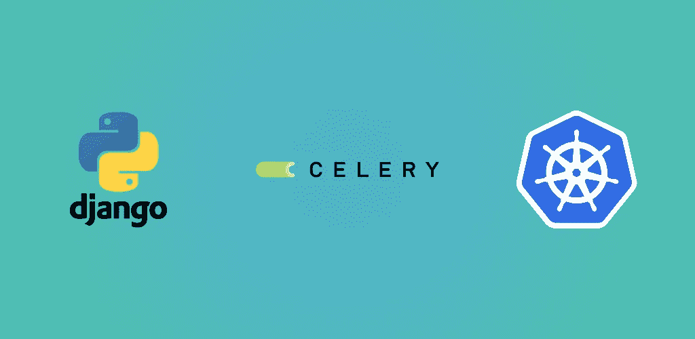

# django+Kubernetes 的芹菜，用于安排任务

> 原文：<https://blog.devgenius.io/django-celery-in-kubernetes-for-scheduling-tasks-12718ef38bce?source=collection_archive---------4----------------------->



Django 是一个流行的 Python web 框架，我们大多数人都非常熟悉，Celery 是一个开源的分布式任务排队系统。结合这两者，我们可以为各种问题开发各种类型的解决方案，如预定通知、电子邮件发送、后台进程等。

Kubernetes 是一个开源的容器编排系统，它自动执行部署过程、伸缩和管理。最初，它是由谷歌设计的，但现在它由云本地计算基金会维护。Kubernetes 所做的是创建一个或多个 pod，每个 pod 包含一个或多个过程容器，这意味着 pod 是整个系统的最小单元。如果您已经了解 Kubernetes，您就会知道 Kubernetes 有一些工作负载资源，它们是:

1.  克朗·乔布斯
2.  守护进程集
3.  部署
4.  乔布斯
5.  副本集
6.  复制控制器(它将被副本集取代)
7.  有状态集合

我假设你已经知道 Django 和 Kubernetes，所以我继续前进。

# **将 Django 项目归档**

对 Django 项目进行 Dockerize 既简单又直接。首先，我们必须在 Django 项目的根目录下创建一个 Dockerfile。我选择了 Alpine 作为基础图像(python:3.8.10-alpine)来最小化图像大小。

**Dockerfile**

这里的一切都很平常，除了 Bash 脚本文件( **services.sh** )！所有的 shell 命令都放在这个 Bash 脚本文件中，以便在我们运行 docker 映像时执行它们。这些是我现在为我的应用程序运行的命令:

**services.sh**

在这里，我运行芹菜殴打第一，然后芹菜工人，然后 Gunicorn。

芹菜节拍是运行调度任务，这意味着如果你想在特定时间执行任务，那么你将不得不使用芹菜节拍。

Celery Worker 将执行任务，对于生产服务器，我使用 Gunicorn，但出于测试目的，这可以替换为 Django 的默认 *runserver* 命令。

现在从 Django 项目根构建映像:

```
docker build -t djangoproject:v1 .
```

这将需要一些时间来构建，并在构建映像后运行它来测试是否一切正常

```
docker run -it --rm -p 8080:8080 djangoproject:v1
```

现在将这个映像放入容器注册中心，并将它部署到 Kubernetes 集群中。正如我所说，我假设您了解 Kubernetes，我跳过了与 Kubernetes 相关的大部分流程，但我仍然在这里展示了 YAML 的部署:

部署 YAML

这将在这里创建 3 个部署单元。

# 库伯内特斯的芹菜问题

我们知道 Kubernetes 自动秤应用程序通过按照说明创建多个 pod，其中我们提到了我们的容器化图像。在上一节中，我们写了一个 Bash 脚本文件( **services.sh** )，其中我们首先运行 Celery Beat，然后是 Celery Worker，然后是 Gunicorn。因此，如果 Kubernetes 在多个单元中部署这个容器，那么这些容器也将在多个单元中运行。

***但是这些吊舱的芹菜会从多个吊舱并行执行单个预定任务。***

因此，如果您计划向系统的所有用户发送通知，那么如果您的集群在 N 个 pods 中运行容器，每个用户将会收到 N 次通知！这就是这里的问题所在，我们必须从 **services.sh** 文件中删除所有 Celery(Celery Workers & Celery Beats)命令，并以不同的方式执行，以便它只在一个 pod 中运行。所以最终的 Bash 脚本文件将如下所示

**services.sh**

# 在 Kubernetes 集群的一个豆荚中运行芹菜

我们知道 Kubernetes 很少有定义的工作负载资源，这在本文的顶部提到过。 ***部署*** 就是其中之一，它用于自动创建、更新和管理 ***ReplicaSets*** 和 ***Pods*** 来运行我们的应用程序。

我在上面写了关于我的应用程序的 ***部署*** YAML。我可以将 shell 命令写入 YAML 或 docker file*中，而不是将它们写入单独的 Bash 脚本文件中。这完全取决于您和您想要将命令放在哪里以及如何放置的用例。*

*由于我们需要在一个 Pod 中运行 Celery，我们将在这里选择一个不同的工作负载资源，以便它与 ***部署*** 保持分离，并且它不会与许多 Pod 一起自动扩展，为此我选择了 ***复制* *控制器*** 。*

*这是我的芹菜 ***复制控制器*** YAML*

*芹菜控制器. yaml*

*相应地设置您的配置，但是**“副本”参数的值不应大于 1***

*您可以在 YAML 文件中看到**‘command’**参数，在将此 YAML 应用到您的集群中后，此命令将在此特定 pod 中执行。*

*也可以用 Kubernetes***cron job***和***replication set***代替***replication controllers***但是我个人更喜欢***replication controllers***。在某些意义上我可能错了，请纠正我*