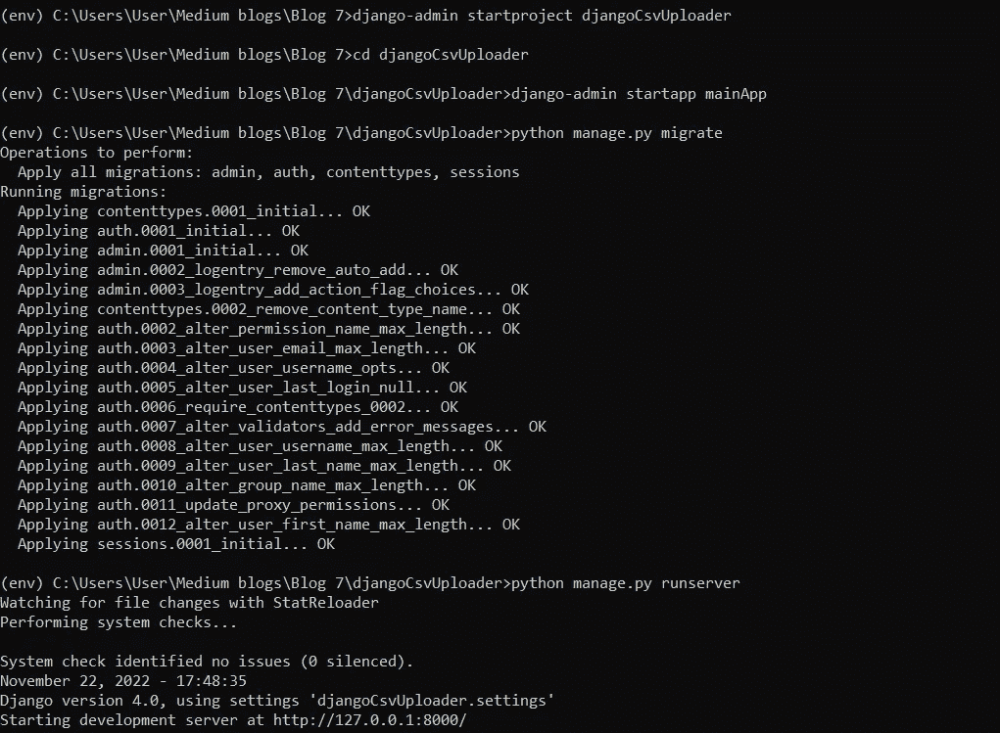
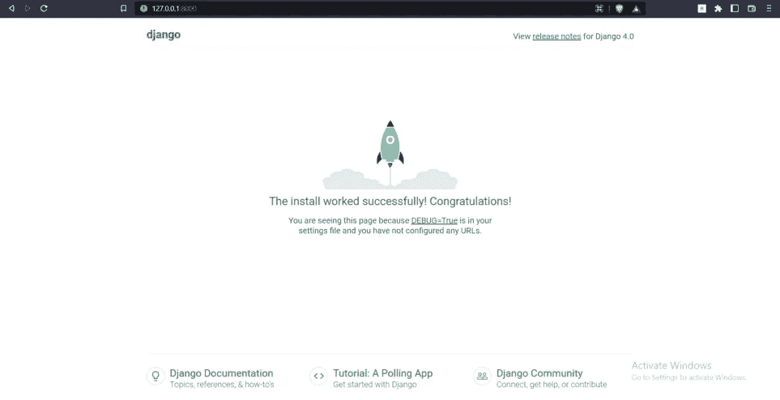
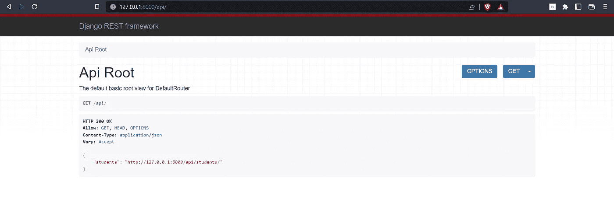
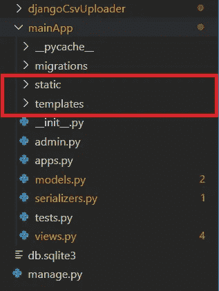
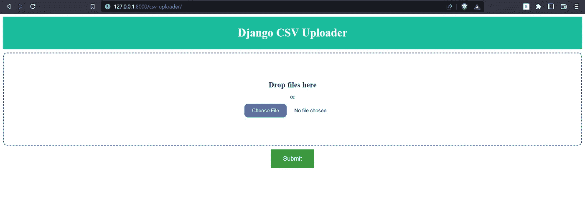
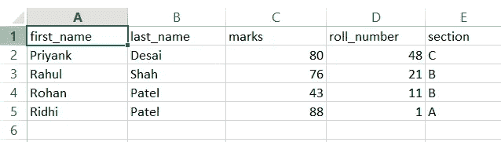
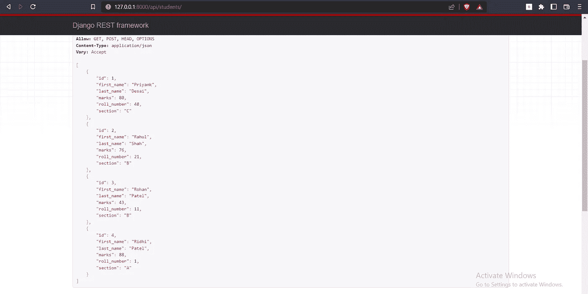

# Django CSV 上传程序

> 原文：<https://blog.devgenius.io/django-csv-uploader-d28537874f4e?source=collection_archive---------7----------------------->

在这里，您将看到如何将数据从. CSV 文件导入到 Django 模型中。


在这里，我们将创建一个视图。csv 文件并上传到我们的模型。我们还将创建一个 HTML 模板并上传。csv 文件。

# 源代码

如果你只是想要源代码，可以在这里得到*(*[](https://github.com/Priyank010/Django-Csv-Uploader)**)*。*

# *Django 项目。*

*开始一个新的 Django 项目。首先创建 python 环境。*

```
*pip install virtualenv
virtualenv MyFirstApp
MyFirstApp\scripts\activate*
```

*安装 Django、Django REST 框架和 Django 核心头文件。*

```
*pip install django djangorestframework django-cors-headers pandas*
```

*现在创建一个新的 Django 项目。*

```
*django-admin startproject djangoCsvUploader*
```

*要检查一切是否正常，运行 **migrate** 命令。*

```
*python manage.py migrate*
```

**

***迁移**后，运行服务器，在浏览器中打开[**http://127 . 0 . 0 . 1:8000/**](http://127.0.0.1:8000/)**链接进行检查。***

```
***python manage.py runserver***
```

******

***如果你在打开链接后看到这个页面，那就意味着一切正常。***

***现在让我们在项目中启动一个新的应用程序***

```
***cd djangoRedis
django-admin startapp mainApp***
```

***完成后，让我们将应用程序名称添加到 **INSTALLED_APPS 内的 setting.py 文件中。*****

***之后，让我们为应用程序创建一个模型。***

***这个模型需要序列化程序，为此我们必须在 app 文件夹中创建一个 serializers.py 文件。***

***我们将为我们的学生模型创建视图集，这将帮助我们执行 **CRUD** *(创建、读取、更新和删除)*操作。打开 **views.py** ，添加以下代码。***

***最后，我们将创建**URL**来从浏览器访问我们的模型。打开 urls.py 并添加以下代码。***

***现在让我们将这个模型添加到数据库中并访问它们。为此，我们首先必须创建一些迁移，并将它们迁移到我们的数据库中，然后再次运行项目。***

```
***python manage.py makemigrations
python manage.py migrate
python manage.py runserver***
```

***现在打开[**http://127 . 0 . 0 . 1:8000/API**/](http://127.0.0.1:8000/api/)看看你的模型。***

******

***您可以点击其名称旁边的链接来执行 **CRUD** *(创建、读取、更新和删除)*操作。向数据库添加一些数据以查看结果。***

# ***创建 CSV 上传程序***

***一旦你的模型被创建，你现在可以开始创建 CSV 上传。***

## ***HTML 模板***

***首先，创建两个新的文件夹模板来存储 HTML 文件和静态来保存 CSS 文件。***

******

***创建一个名为 csv_uploader.html 的新文件，并添加以下数据。***

***现在打开静态文件夹，创建一个名为 app.css 的新文件，并向其中添加以下代码。***

***完成后，打开 views.py 并创建一个新的 TemplateView 类。这将打开 HTML 文件并在 POST 时处理 CSV 数据。这是您最终的 view.py 外观。***

***要打开 HTML 文件，我们必须将其添加到这个 TemplateView 类中。我们还必须创建一个 POST 函数来接收 CSV 文件，并读取和解码它。一旦完成，我们将通过 CSV 运行一个 for 循环并创建新的对象。***

***最后，我们必须将这个视图添加到 **URLs.py** 文件中。这就是最终的 URLs.py 文件。***

***现在打开[**http://127 . 0 . 0 . 1:8000/CSV-uploader/**](http://127.0.0.1:8000/csv-uploader/)查看模板。***

******

***现在让我们创建一个 csv 文件并上传它。***

******

***这就是文件的外观。除此之外的任何格式都将引发错误。***

***打开学生 API[**http://127 . 0 . 0 . 1:8000/API/students/**](http://127.0.0.1:8000/api/students/)查看结果。***

******

# ***结论***

***如果您想要为您的项目创建一个 CSV 上传，那么请确保在您的 CSV 中使用与您的模型中相同的字段名称。你可以从这里得到源代码*(*[*https://github.com/Priyank010/Django-Csv-Uploader*](https://github.com/Priyank010/Django-Csv-Uploader)*)****