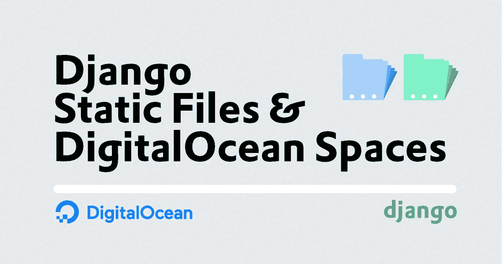
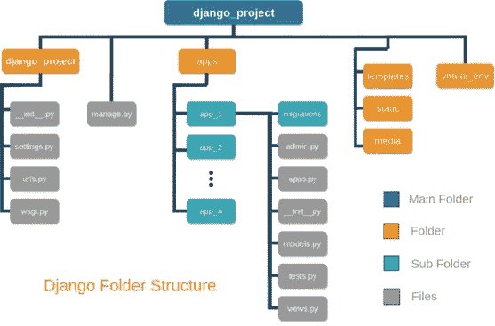

# Django +数字海洋空间

> 原文：<https://blog.devgenius.io/django-digitalocean-spaces-a12b4a053628?source=collection_archive---------4----------------------->

对于在本地托管的较小项目，将所有需要的文件保存在单个中央服务器或本地机器上是非常好的，但是当水平扩展项目时，将所有静态和媒体文件保存在每台单独的机器上变得不可行。我在尝试使用 Kubernetes 扩展我的 Django 项目的[时遇到了这个问题。该应用程序的功能之一是允许用户上传其他用户可以实时访问的图像。在 Kubernetes pods 之间复制这些新文件是不可行的，所以我决定使用一个独立于任何单独的服务器实例的单独的文件存储解决方案。接下来是 S3 兼容的对象存储，即数字海洋空间。](https://medium.alexanderdefuria.com/swiss-aa71b777fc2a)

Django 应用程序通常提供两种不同类型的文件，静态文件和媒体文件。静态文件是应用程序本身的一部分，包括所有 CSS 和 JavaScript 文件，它们是源代码的一部分，是项目模板(HTML)所需要的。另一方面，媒体文件是由应用程序生成或由用户在运行时上传的文件。静态文件顾名思义是静态的，在运行时不会改变，而媒体文件是动态的，经常会随着用户的交互而改变。这些不同的行为导致了 Django 处理它们的不同方式。

Django 目录结构示例

通常情况下，默认的 Django `settings.py`会很容易地处理静态文件，就像这样。

Django 基本设置. py

这只是使用 Django 附带的默认静态文件处理程序告诉应用程序在哪里可以找到文件，引用在上面的示例目录结构中看到的本地静态文件夹。

为了让应用程序使用 DigitalOcean Spaces，django-storages 和 boto3 用于与 Spaces API 进行交互。将这些包添加到项目中的 requirements.txt 文件中，或者如果您是异教徒，只需手动安装即可。

确保将 django-storages 添加到已安装应用程序列表中。

安装了这些之后，我们现在可以更改默认的静态文件设置。要访问空间 API，boto3 需要以下`settings.py`变量形式的连接信息。

通过运行`python3 manage.py collectstatic`确保在新配置的空间中收集所有静态文件。应用程序现在应该准备好了，提供参考数字海洋空间的静态文件。使用不同的 S3 兼容存储提供商(如谷歌或 AWS)进行操作的说明应该与此几乎相同，只是一定要参考 [django-storage docs](https://django-storages.readthedocs.io/en/latest/backends/amazon-S3.html) 以确保所有设置都相同。

等等，媒体文件呢？

包含媒体文件的过程也相对简单，类似于静态文件，只需要几个额外的步骤。由于这些文件是动态的，应用程序需要一种方法来处理这些文件，使用一个自定义存储类，将它们放在空间中一个单独的媒体文件夹中。

向包含该自定义存储类的目录`django_project/django_project`添加一个文件。

现在我们只需要在`settings.py`后面加上以下内容

有了它，您现在应该拥有由 DigitalOcean Spaces 托管的所有媒体文件，或者您选择的其他媒体文件。从这里可以创建应用程序的 Docker 映像，并使用 Kubernetes 进行水平扩展，而不必处理文件并发问题。这也应该会提高应用程序的性能，而不是像现在一样，处理每一个请求中的几十个静态和媒体文件的请求，因为应用程序只需要处理基本 HTML 的发送。静态和媒体文件加载现在被卸载到客户端，客户端将从空间请求它们。这也可以配置为使用 Spaces 运行，或者通过将新的和旧的设置包装在一个条件中，根据环境返回到本地静态文件。

感谢阅读，希望你发现它很有用，如果你遇到任何问题，请与我联系。