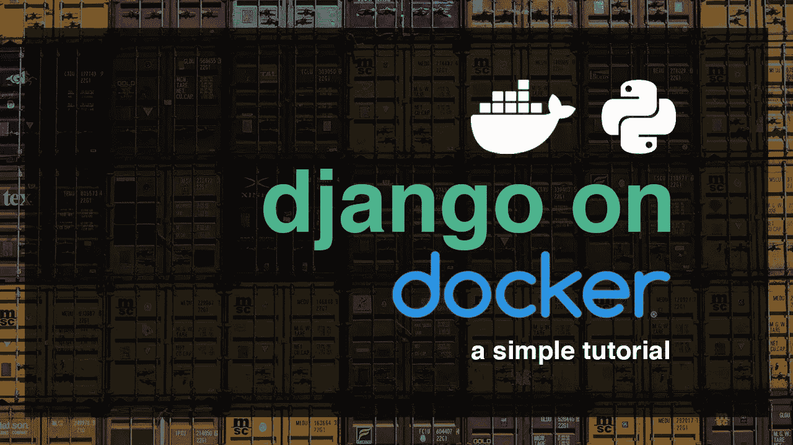
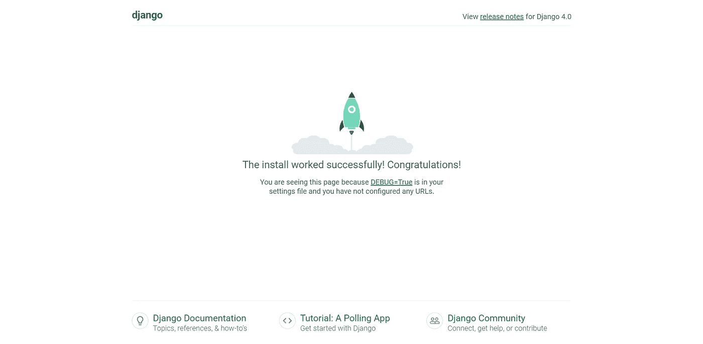

# Django，Docker 设置教程

> 原文：<https://blog.devgenius.io/django-docker-setup-tutorial-4c3e5f8d6def?source=collection_archive---------2----------------------->



在本教程中，我们将使用 **Docker** compose 文件创建一个新的 **Django** 项目。Django 为本地开发提供了内置的 SQLite 支持，这将用于本教程。

# 使用的工具:-

*   饭桶狂欢
*   虚拟代码
*   Windows

你可以在这里下载**[**vs code**](https://code.visualstudio.com/Download)**[**Git Bash**](https://git-scm.com/download/win)和[**Docker for Window**](https://docs.docker.com/desktop/install/windows-install/)**s***。*****

# *****安装 Docker*****

*****第一步是为您的本地机器安装桌面 Docker 应用程序:*****

*   *****[Mac Docker](https://docs.docker.com/docker-for-mac/install/)*****
*   *****[Windows Docker](https://docs.docker.com/docker-for-windows/install/)*****
*   *****[面向 Linux 的 Docker](https://docs.docker.com/install/)*****

*****Docker 的初始下载可能需要一些时间来下载。这是一个大文件。在这一点上，请随意伸展你的腿！*****

*****一旦 Docker 完成安装，我们可以确认正确的版本正在运行。在您的终端中运行命令`docker --version`。*****

*****[Docker Compose](https://docs.docker.com/compose/) 是一个附加工具，自动包含在 Docker 的 Mac 和 Windows 下载中。但是，如果您在 Linux 上，您将需要手动添加它。在 Docker 安装完成后，您可以通过运行命令`sudo pip install docker-compose`来做到这一点。*****

*****希望此时 Docker 已经安装完毕。要确认安装成功，请在命令行中键入`docker run hello-world`。您应该会看到这样的响应:*****

*****Docker 现已正确安装在您的计算机上。然后我们可以继续配置一个本地 Django 设置，然后切换到 Docker。*****

# *****姜戈成立了*****

*****这个项目的代码可以存在于你计算机的任何地方，但是`Desktop`是一个用于教学目的的简单位置。在命令行导航到桌面，创建一个名为`django-docker`的新目录。*****

```
*****#** Windows
$ cd onedrive\desktop
$ mkdir django**-**docker

**#** macOS
$ cd **~/**desktop**/**code
$ mkdir django**-**docker***
```

*****我们将遵循创建一个新的 Django 项目的标准步骤:创建一个专用的虚拟环境，激活它，并安装 Django。*****

```
*****#** Windows
$ python **-**m venv .venv
$ **Set-**ExecutionPolicy **-**ExecutionPolicy RemoteSigned **-Scope** CurrentUser
$ .venv\Scripts\Activate.ps1
(.venv) $ python **-**m pip install django

**#** macOS
$ python3 **-**m venv .venv
$ **source** .venv**/**bin**/**activate
(.venv) $ python3 **-**m pip install django***
```

*****接下来，我们可以创建一个名为`django_project`、`migrate`的新项目，我们的数据库初始化它，并使用`runserver`启动本地服务器。通常我不建议在新项目上运行`migrate`，直到配置好自定义用户模型之后的*，但是在本教程中，我们将忽略这个建议。******

```
***(.venv) $ django-admin startproject django_project .
(.venv) $ python manage.py migrate
(.venv) $ python manage.py runserver***
```

*****通过在网络浏览器中导航到`http://127.0.0.1:8000/`来确认一切正常。您可能需要刷新页面，但应该看到熟悉的 Django 欢迎页面。*****

**********

*****切换到 Docker 之前的最后一步是用我们当前虚拟环境的内容创建一个`requirements.txt`文件。我们可以用一行命令来完成这个任务。*****

```
***(.venv) $ pip freeze > requirements.txt***
```

*****它应该包含`Django`以及安装 Django 时自动包含的包`asgiref`和`sqlparse`。*****

*****现在该换 Docker 了。通过键入`deactivate`和`Return`退出我们的虚拟环境，因为我们不再需要它。*****

```
***(.venv) $ deactivate
$***
```

# *****Docker 图像*****

*****Docker *图像*是一个只读模板，描述了如何创建 Docker *容器*。图像是指令，而容器是图像的实际运行实例。继续本章前面的公寓类比，图像是建造公寓的蓝图或一套计划；集装箱是实际的、完全建成的建筑。*****

*****图像通常基于另一个图像，并进行一些额外的定制。例如，根据所需的 Python 版本和风格，官方支持的 Python 图片有很长的列表。*****

# *****Dockerfile 文件*****

*****对于我们的 Django 项目，我们需要创建一个包含 Python 的定制映像，同时还要安装我们的代码并提供额外的配置细节。为了构建我们自己的映像，我们创建了一个名为 *Dockerfile* 的特殊文件，它定义了创建和运行定制映像的步骤。*****

*****使用您的文本编辑器在项目级目录中的`manage.py`文件旁边创建一个新的`Dockerfile`文件。在其中添加下面的代码，我们将在下面一行一行地介绍。*****

```
*****#** Pull base image
**FROM** python:3.10.2**-**slim**-**bullseye

**#** **Set** environment variables
ENV PIP_DISABLE_PIP_VERSION_CHECK 1
ENV PYTHONDONTWRITEBYTECODE 1
ENV PYTHONUNBUFFERED 1

**#** **Set** **work** directory
WORKDIR **/**code

**#** Install dependencies
**COPY** .**/**requirements.txt .
RUN pip install **-**r requirements.txt

**#** **Copy** project
**COPY** . .***
```

*****创建图像时，从上到下读取。第一个指令是一个`FROM`命令，它告诉 Docker 我们希望在我们的应用程序中使用什么样的基本图像。Docker 映像可以从其他映像继承，因此我们将使用官方 Python 映像，而不是创建我们自己的基础映像，该映像已经包含了我们的 Django 应用程序所需的所有工具和包。在这种情况下，我们使用 Python `3.10.2`和更小的`slim`变体，它不包含默认标签中包含的公共包。标签`bullseye`指的是最新稳定的 Debian 版本。当有 Debian 的新版本时，显式地设置它来最小化潜在的破坏是一个好主意。*****

*****然后我们使用`ENV`命令来设置三个环境变量:*****

*   *****`PIP_DISABLE_PIP_VERSION_CHECK`每次禁用对`pip`更新的自动检查*****
*   *****`PYTHONDONTWRITEBYTECODE`意味着 Python 不会尝试写`.pyc`文件*****
*   *****`PYTHONUNBUFFERED`确保我们的控制台输出不被 Docker 缓冲*****

*****命令`WORKDIR`用于在运行其余命令时设置默认工作目录。这告诉 Docker 使用这个路径作为所有后续命令的默认位置。因此，我们可以使用基于工作目录的相对路径，而不是每次都键入完整的文件路径。在我们的例子中，工作目录是`/code`，但是它通常可以更长，类似于`/app/src`、`/usr/src/app`或者类似的变化，这取决于项目的特定需求。*****

*****下一步是用我们已经创建的`pip`和`requirements.txt`文件安装我们的依赖项。`COPY`命令有两个参数:第一个参数告诉 Docker 要将什么文件复制到映像中，第二个参数告诉 Docker 要将文件复制到哪里。在这种情况下，我们将现有的`requirements.txt`文件从本地计算机复制到由`.`表示的当前工作目录中。*****

*****一旦`requirements.txt`文件在图像中，我们可以使用最后一个命令`RUN`来执行`pip install`。这与我们在本地机器上运行`pip install`完全一样，但是这次模块被安装到映像中。`-r`标志告诉`pip`打开一个文件——这里叫做`requirements.txt`——并安装它的内容。如果我们不包含`-r`标志，`pip`将会尝试安装`requirements.txt`失败，因为它本身并不是一个真正的 Python 包。*****

*****目前，我们有一个基于`Python 3.10.2`的`slim-bullseye`变体的新映像，并且已经安装了我们的依赖项。最后一步是将当前目录中的所有文件复制到映像的工作目录中。我们可以通过使用`COPY`命令来完成。记住它需要两个参数，所以我们将把本地文件系统上的当前目录(`.`)复制到映像的工作目录(`.`)中。*****

*****如果你现在很困惑，不要担心。Docker 很难理解，但好消息是，对现有项目进行“docker 化”的步骤非常相似。*****

# *****。dockerignore*****

*****一个`.dockerignore`文件是指定不应该包含在 Docker 映像中的某些文件和目录的最佳实践方式。这有助于减少整体图像大小，并通过将本应保密的内容排除在 Docker 之外来提高安全性。*****

*****此刻，我们可以安全地忽略本地虚拟环境(`.venv`)、未来的`.git`目录和未来的`.gitignore`文件。在您的文本编辑器中，在现有的`manage.py`文件旁边的基本目录中创建一个名为`.dockerignore`的新文件。*****

```
***.venv
.git
.gitignore***
```

*****我们现在已经有了创建自定义图像的完整说明，但实际上我们还没有构建它。不出所料，这样做的命令是`docker build`后跟句点`.`，表示`Dockerfile`位于当前目录中。这里会有很多输出。我只包括了前两行和最后一行。*****

```
***$ docker build .
**[**+**]** Building 9.1s (10**/**10) FINISHED
 **=>** **[**internal**]** **load** build definition **from** Dockerfile
...
**=>** **=>** writing **image** sha256:89ede1...***
```

# *****docker-compose.yml*****

*****我们完全构建的自定义映像现在可以作为容器运行。为了运行容器，我们需要一个名为`docker-compose.yml`的文件中的指令列表。用文本编辑器在项目级目录中的`Dockerfile`旁边创建一个`docker-compose.yml`文件。它将包含以下代码。*****

```
****version: "3.9"*
*services:*
 *web:*
 *build: .*
 *ports:*
 *- "8000:8000"*
 *command: python manage.py runserver 0.0.0.0:8000*
 *volumes:*
 *- .:/code****
```

*****在最上面一行，我们设置了 Docker Compose 的[最新版本](https://docs.docker.com/compose/compose-file/compose-versioning/)，当前版本为`3.9`。然后，我们指定希望哪些`services`(或容器)在我们的 Docker 主机中运行。有可能有多个`services`在运行，但是现在，我们只有一个`web`在运行。*****

*****在`web`中，我们设置`build`在当前目录中查找我们的`Dockerfile`。我们将使用 Django 默认端口`8000`并执行`command`来运行本地 web 服务器。最后，[卷](https://docs.docker.com/storage/volumes/)挂载会自动将 Docker 文件系统与我们本地计算机的文件系统同步。如果我们对 Docker 中的代码进行修改，它将自动与本地文件系统同步。*****

*****最后一步是使用命令`docker-compose up`运行 Docker 容器。该命令将在命令行上产生另一长串输出代码。*****

```
***$ docker**-**compose up***
```

*****要确认它确实有效，请在您的网络浏览器中返回`http://127.0.0.1:8000/`。刷新页面，“Hello，World”页面应该仍然会出现。*****

*****Django 现在完全运行在 Docker 容器中。我们不是在本地的虚拟环境中工作。我们没有执行`runserver`命令。我们所有的代码现在都存在了，我们的 Django 服务器运行在一个自包含的 Docker 容器中。成功！*****

*****在本书的过程中，我们将创建多个 Docker 图像和容器，通过练习，这个流程将变得更有意义。：*****

*   *****用自定义图像指令创建一个`Dockerfile`*****
*   *****添加一个`.dockerignore`文件*****
*   *****建立形象*****
*   *****创建一个`docker-compose.yml`文件*****
*   *****旋转容器*****

*****用`Control+c`停止当前正在运行的容器(同时按下“控制”和“c”按钮)，并输入`docker-compose down`。Docker 容器会占用大量内存，所以最好在您使用完它们后停止它们。容器注定是无状态的，这就是为什么我们使用`volumes`将我们的代码复制到本地可以保存的地方。*****

```
***$ docker-compose down***
```

*****要在分离模式下运行容器，我们使用`docker-compose up -d`。*****

```
***$ docker-compose up -d***
```

*****这就是我们将结束本教程的地方。我们将在下一部分继续添加新功能，请注意我的下一篇帖子。*****

*****如果你喜欢这篇文章，请随意鼓掌或鼓掌，如果你有任何问题或疑问，请在下面的评论中留下。*****