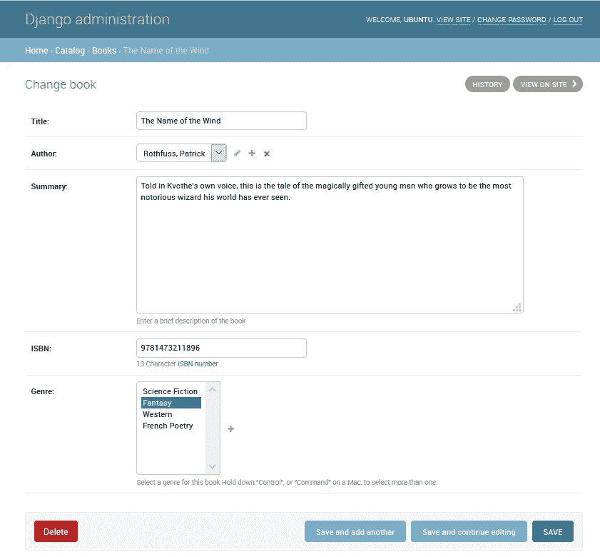
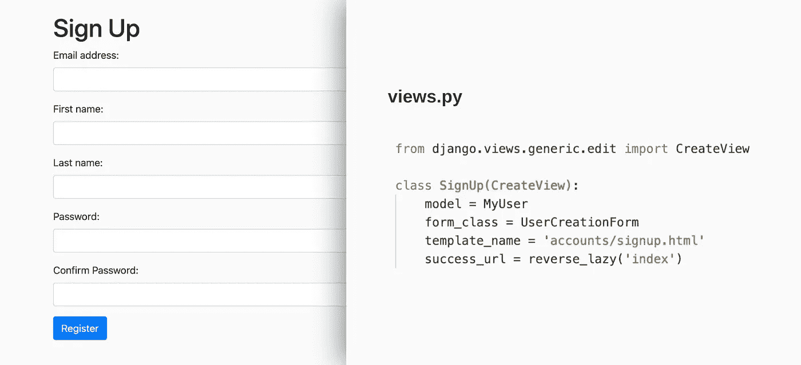
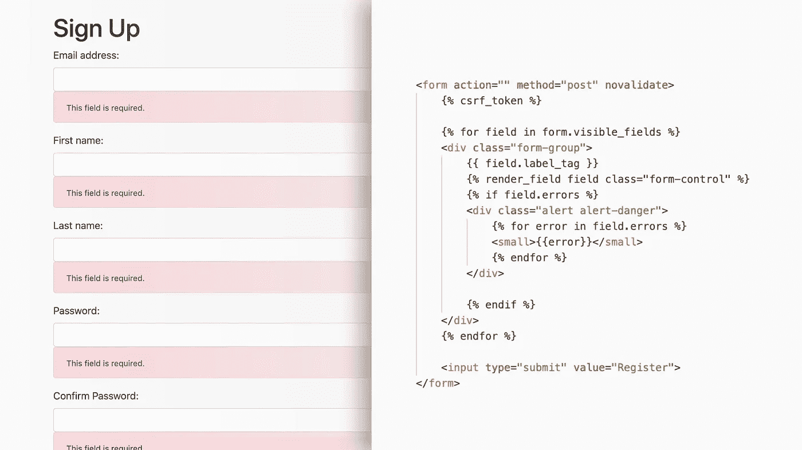

# Django 为 JavaScript 开发者解释道

> 原文：<https://blog.devgenius.io/django-explained-for-javascript-developers-c0efaac269ac?source=collection_archive---------1----------------------->


当你学习了一个后端框架，你就习惯了以某种方式做项目。我的第一个框架是 Express(MERN 堆栈中的 E)，一个非常简约的 JavaScript 框架。

我会把 Express 描述成一张空白的画布。样板代码将使您的开发服务器启动并运行，但仅此而已。然后，开发人员将安装大量被称为“中间件”的第三方软件包，让事情按照您喜欢的方式运行。Express 给了开发人员很多自由和灵活性，但是从头开始一个项目需要做很多工作。

Django 是一个使用 Python 而不是 JavaScript 的框架。它与 Express 的主要区别在于框架中内置了更多的特性，其中许多特性可以根据您自己的喜好进行定制。

从 Express 迁移到 Django 让我成为了一个更高效的开发人员。内置的许多特性使项目的启动和运行变得快速而简单，让我有更多的时间关注应用程序的实质。

今天，我和你们分享姜戈的 6 个优点和 3 个不太好的地方。

# 好的方面:

## 1.Django 管理面板

这是一种方便、直观的数据浏览和管理方式。对于节点开发人员来说，它类似于 Atlas for MongoDB，但是内置于您的应用程序中。

管理面板最好的部分是你的客户也可以使用它。作为开发人员，您可以设置用户组和权限来控制他们能做什么和不能做什么。你甚至可以用客户端的商标定制管理面板。



Django 管理面板提供了一种方便和可定制的方式来管理您的数据。图片来自:[https://developer . Mozilla . org/en-US/docs/Learn/Server-side/Django/Admin _ site](https://developer.mozilla.org/en-US/docs/Learn/Server-side/Django/Admin_site)

对我个人来说，管理在大型企业级项目中发挥了作用。当一个项目有超过 50 个模型时，管理面板给新开发人员提供了一个方便的方法来探索数据并找到他们的方向。

## 2.REPL 壳牌公司

REPL 代表读取评估打印循环。它基本上是一个 Python shell，有点像你的浏览器开发工具中的控制台。

Django 内置了一个 Python REPL 外壳。这允许您导入您的模型，并开始使用数据库查询。这对于不熟悉 Python 和 Django 的开发人员来说非常好，因为这是一个试验和获得即时反馈的地方。

## 3.数据库

当您开始一个 Django 项目时，它已经建立了一个 SQLite 数据库。

SQLite 可能不是生产级的数据库，但它非常适合小型或个人项目。已经设置了一个轻量级数据库将有助于您快速启动和运行。

如果您需要更强大的东西，设置一个不同的数据库，比如 PostgreSQL，并不比设置 Mongo DB for Express 更难。

## 4.基于类的视图

视图包含每个页面的逻辑。如果您习惯于模型-视图-控制器模式，那么可以将 Django 视图视为控制器。

在 Node 中，控制器被写成函数。他们接受请求并返回模板或 404 错误。

在 Django 中，开发者可以选择将他们的视图写成一个函数或者一个类。类可以从 Django 自己的基类继承。

有用于创建、更新和删除模型的类。还有用于常见身份验证任务的类，如登录、更改密码和注销。

这些内置类的伟大之处在于它们已经包含了常见任务的功能，因此只需要很少的额外代码。如果内置类不完全适合您的需要，那么您可以重写类中的任何方法。



注册的逻辑在继承了内置的 CreateView 类后只需要 4 行修改。表单验证和写入数据库已经内置。

他们需要一些时间来适应，特别是理解在引擎盖下发生了什么，但他们在加速开发方面非常出色。

## 5.强大的查询集

Django 内置了一个 Queryset API，使得查询数据库更加容易。如果您使用 PostgreSQL，这意味着您不必用 SQL 编写查询。

相反，JavaScript 开发人员将会非常熟悉点符号的语法。

```
posts = Post.objects.order_by(‘-date’).filter(is_published=True)
```

使用 Querysets 进行搜索也非常容易。例如:

```
posts = queryset_list.filter(body__icontains=keywords)
```

## 6.无痛形式

对于表单，Django 将表单对象传递给 HTML 模板。这意味着您不必为每个字段创建 *<输入>* 标签，也不必为错误消息创建占位符。在 React 中，您必须将用户输入绑定到一个状态，这对于 Django 来说是不必要的。

总的来说，Django 允许您用很少的 HTML 创建包含错误消息的表单。如果您在用户模型中添加或删除字段，您不必更改任何 HTML。



# 不太好的地方是:

## 1.虚拟环境

Node 具有明显优势的一个地方是节点包管理器(npm)。当你从 GitHub 克隆一个项目时，你可以运行“ *npm install* ”并立即开始。

Python 使用一种叫做*‘虚拟环境’*的东西以不同的方式处理依赖管理。虚拟环境是为了确保您拥有每个包的正确版本，并且它们不会在项目之间混淆。

Python 的包管理器叫做*‘pip’*。您可以使用它来创建一个虚拟环境，安装软件包，并生成一个需求文件。**功能都在，但设置一切的流程不像 npm 那样流畅。**

这不是一个交易破坏者。当第一次使用 Django 时，预计要花几个小时来熟悉虚拟环境。我用的是 Reindert-Jan Ekker 的这门课。它非常全面，长度不到 90 分钟。许多 Django 初学者教程也会包含一个关于虚拟环境的部分。

## 2.定义自定义用户模型的需求

Django 提供了许多可以根据您的需要进行扩展的类，其中许多都与用户管理有关。

缺点是，即使 Django 的文档也建议您使用定制的用户模型。Django 提供的基本用户模型非常简单，一旦项目部署后很难修改。创建自定义用户模型允许用户使用电子邮件地址而不是用户名登录，并允许您添加与身份验证无关的字段。

Django 的文档中有一个完整的例子。我能够复制和粘贴代码，修改几个字段，并很快启动和运行。这对我如何构建项目有很大的影响。我发现最好在创建任何可能引用它的模型之前创建您的用户模型。

## 3.姜戈主义

Django 的文档相对易读和全面，但仍然需要时间和经验来找到开发的哪些部分有捷径(即基于类的视图)。创建视图和 URL 通常依赖于导入大量 Django 包。

[‘Classy Class-Based Views’](https://ccbv.co.uk/)是一个很好的网站，可以找到在哪里可以使用内置类。 [Awesome Django](https://github.com/wsvincent/awesome-django) 有一个精心策划的资源列表。

像任何新的框架一样，这需要时间。这就是为什么我认为高质量的课程和教程是值得努力的。这些将提供代码片段的良好来源。

# 我现在坚持和姜戈在一起

Django 的主要优势是能够用更少的代码行完成更多的工作。我发现使用 Django 我的生产率提高了，特别是对于使用基于类的视图的基于 CRUD 的任务。

为了充分利用 Django 的表单，我保持了前端和后端的耦合。这意味着反应不是一个选项。然而，Vue 可以与 Django 的模板集成，以便在前端进行更多的控制。React 爱好者确实可以选择使用 Django 创建一个 API，而不是一个全栈应用程序。

我仍然建议开发者在学习 Django 作为他们的第一个全栈框架时要小心。由于 Django 为你做了很多事情，所以你可以在不了解一些核心原则的情况下构建应用程序。